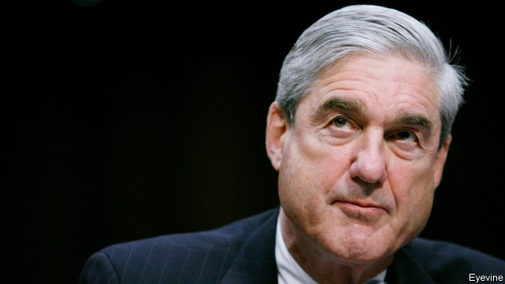

###### Donald Trump

# After Mueller, what next? 

##### Now that the special counsel’s report is public, here is what Congress should do with it 

 

> Apr 27th 2019 

AMERICAN VOTERS waited almost two years for the Mueller report. Most of its findings turned out to have already been published over the previous 13 months by investigative reporters and in indictments issued by Robert Mueller’s office. But that makes it no less extraordinary. While the special counsel found no evidence to sustain a conspiracy charge, he described a campaign eager to co-operate with a foreign adversary and a president who may have obstructed justice. This leaves America’s system of checks and balances in an uncomfortable position. 

What the report lacks in novelty it makes up for in thoroughness, adding detail and credibility to accounts about the behaviour of the Trump campaign and administration that might otherwise have been dismissed as thinly sourced or ideologically motivated (see article). It shows a campaign, a transition team and then a White House run by a person who will lie about the most serious issues and who tells his staff to break the law in order to obstruct justice—including by sacking Mr Mueller. President Donald Trump’s summary of the report (“NO COLLUSION - NO OBSTRUCTION!”) and his attorney-general’s attempt to spin it as a paean to presidential virtue are further examples of the administration’s contempt for facts. 

All elections are street fights, but Mr Mueller and his team showed that Mr Trump’s campaign staff in 2016 placed America at risk from a foreign adversary. The campaign knew about and encouraged Russian efforts to help his election; the Russian government concluded that a Trump victory would be in its interests and so worked towards that end. What saved the president was the absence of a formal agreement to co-ordinate their efforts. 

What, if anything, should Congress do with Mr Mueller’s findings? The special counsel explained he had not charged the president with obstruction of justice, in part because of a guideline drawn up by the Justice Department in 1973, amid Watergate, which says that the federal bureaucracy cannot indict its own boss. The authors of the constitution made it clear that Congress has the task of dealing with a rogue president. 

Should it therefore start impeachment hearings? The best argument for this is that failure to sanction Mr Trump would establish a precedent, signalling to some future president that the lying, the footsie with Russia and attempts at obstruction are just fine. Yet rushing into an impeachment would still be a mistake. 

Impeachment is a hybrid. It is part legal, because it involves a trial; but the framers intended it to be political, too, because the trial is conducted by elected representatives who, inevitably, think as politicians. Were Mr Trump to be impeached now by the Democrat-controlled House he would be acquitted in the Republican-controlled Senate. This would not be much of a rebuke. When someone is found not guilty in court, that is usually taken as an exoneration. If Democrats dismissed an acquittal as partisan nonsense, Republicans would likewise ridicule the decision to impeach. There is a risk that a failed effort to remove Mr Trump would boost him as he is seeking re-election, as it boosted Bill Clinton. Democratic leaders in the House calculate, probably correctly, that impeachment is not in their interest either. 

That leaves America’s constitution in a quandary. One of the guiding principles of the experiment undertaken in 1776 was that no man should be above the law. Having just got rid of one unaccountable tyrant, the founders were keen to prevent the emergence of a homegrown version. Set against this, they did not want the president tied down by petty legal squabbles. The founders therefore meant removing a president by impeachment to be hard, to become possible only once a significant number of the president’s own faction had deserted him. 

Yet the founders did not foresee the rise of a rigid two-party system that mirrors the rural-urban divide. That makes it very hard in practice for either faction in the Senate to assemble the two-thirds majority required to convict the president in an impeachment trial, unless the rank and file of their party move against the president, too. Lined up the right way, senators who represent 25m citizens could acquit a president, against the wishes of senators who represent 300m. Getting rid of a rule-breaking president was not supposed to be this difficult. 

The result is that one man is, in effect, above the law for all but the most serious and readily understandable crimes, such as murder, which would surely be too much even for the committed partisans of either side. Congress should legislate against such impunity at a later date. Most democracies have independent prosecutors able to indict the chief executive. 

Right now, Congress should also take up Mr Mueller’s invitation to do its part by using hearings to give his witnesses the chance to tell the American people what happened. The House should impeach only if the case builds over the coming months, leading Republican senators to change their position. An impeachment that fails along party lines is worse than useless. Better to trust the wisdom of voters in 2020. 

-- 

 单词注释:

1.Mueller[]:米勒（人名） 

2.APR[]:[计] 替换通路再试器 

3.voter['vәutә]:n. 选民, 投票人 [法] 选民, 选举人, 投票人 

4.investigative[in'vestigeitiv]:a. 审查的, 调查的, 好研究的 [法] 调查的, 审查的, 受调查研究的 

5.indictment[in'daitmәnt]:n. 起诉, 控告, 起诉状 [经] 起诉书 

6.Robert['rɔbәt]:[法] 警察 

7.les[lei]:abbr. 发射脱离系统（Launch Escape System） 

8.counsel['kaunsәl]:n. 商议, 忠告, 法律顾问 v. 商议, 劝告 

9.conspiracy[kәn'spirәsi]:n. 同谋, 阴谋, 阴谋集团 [法] 阴谋, 通谋, 共谋 

10.adversary['ædvәsәri]:n. 敌手, 对手 a. 敌手的, 敌对的 

11.obstruct[әb'strʌkt]:vt. 阻隔, 妨碍, 阻塞, 遮没 vi. 设障碍 

12.novelty['nɒvәlti]:n. 新奇, 新鲜, 新奇的事物 

13.thoroughness['θʌrәnis. 'θә:rәu-]:n. 十分, 完全；彻底 

14.credibility[.kredi'biliti]:n. 可信用, 确实性, 可靠 [法] 证据能力, 可信程度, 确实性 

15.thinly['θinli]:adv. 薄, 细, 瘦 

16.ideologically[]:adv. 思想上, 思想体系, 意识形态, 观念形态 

17.transition[træn'ziʃәn]:n. 转变, 转换, 变迁, 过渡时期, 临时转调 [化] 跃迁 

18.collusion[kә'lu:ʃәn]:n. 共谋, 勾结 [经] 勾结, 串通, 串同舞弊 

19.paean['pi:әn]:n. 凯歌, 欢乐歌, 赞美歌 

20.presidential[.prezi'denʃәl]:a. 总统制的, 总统的, 首长的, 统辖的 [法] 总统的, 议长的, 总经理的 

21.obstruction[әb'strʌʃәn]:n. 障碍, 妨碍, 闭塞物 [医] 梗阻, 不通 

22.guideline['gaidlain]:n. 指导路线, 方针, 指标 [经] 指导路线, 方针, 准则 

23.amid[ә'mid]:prep. 在其间, 在其中 [经] 在...中 

24.watergate['wɔ:tәɡeit. 'wɔ-]:n. 水门, 水闸；水门事件 

25.bureaucracy[bjuә'rɒkrәsi]:n. 官僚, 官吏 [法] 官僚主义, 官僚政治, 官僚机构 

26.cannot['kænɒt]:aux. 无法, 不能 

27.indict[in'dait]:vt. 起诉, 控告, 指控 [法] 控告, 揭发, 对...起诉 

28.rogue[rәug]:n. 恶棍, 流氓, 小淘气 vt. 欺骗 vi. 游手好闲 

29.impeachment[im'pi:tʃmәnt]:[法] 控告, 检举, 弹劾 

30.sanction['sæŋkʃәn]:n. 核准, 制裁, 处罚, 约束力 vt. 制定制裁规则, 认可, 核准, 同意 

31.precedent['presidәnt]:n. 先例, 前例 a. 在先的, 在前的 

32.footsie['futsi]:n. 脚, 调戏, 挑逗 

33.impeachment[im'pi:tʃmәnt]:[法] 控告, 检举, 弹劾 

34.hybrid['haibrid]:n. 混血儿, 杂种, 混合物 a. 混合的, 杂种的, 混合语的 [计] NetWare的主机实用程序, 双重用户建立程序 

35.framer['freimә]:n. 组成者, 构成者, 筹划者 [电] 调帧器 

36.inevitably[in'evitәbli]:adv. 不可避免地 

37.impeach[im'pi:tʃ]:vt. 控告, 怀疑, 检举, 弹劾 [法] 控告, 检举, 弹劾 

38.acquit[ә'kwit]:vt. 无罪释放, 表现, 使履行 [法] 开释, 释放, 免 

39.rebuke[ri'bju:k]:n. 指责, 谴责, 非难 vt. 斥责, 指责, 制止 

40.exoneration[ig.zɒnә'reiʃәn]:n. 免罪, 免除 [经] 免除, 解除, 免于 

41.democrat['demәkræt]:n. 民主人士, 民主主义者, 民主党党员 [经] 民主党 

42.acquittal[ә'kwitәl]:n. 履行, 无罪开释 [经] (债务的)清偿 

43.partisan['pɑ:tizn]:n. 党羽, 虔诚信徒, 同党, 游击队员 a. 党派的, 偏袒的, 效忠的, 献身的, 盲目推崇的 

44.ridicule['ridikju:l]:n. 嘲笑, 愚弄, 笑柄 vt. 嘲笑, 嘲弄, 愚弄 

45.clinton['klintәn]:n. 克林顿（男子名） 

46.correctly[kә'rektli]:adv. 对, 正确, 恰当, 符合一般性准则, 符合行为准则, 端正, 符合 

47.quandary['kwɒndәri]:n. 困惑, 迷惑, 为难 

48.unaccountable[.ʌnә'kauntәbl]:a. 无法解释的, 无责任的 [法] 难以申辩的, 不可解释的, 无关系的 

49.tyrant['taiәrәnt]:n. 暴君 [法] 专制君主, 暴君, 压制他人者 

50.founder['faundә]:n. 创立者, 建立者 vt. 使沉没, 使摔倒, 弄跛, 浸水, 破坏 vi. 沉没, 摔到, 变跛, 倒塌, 失败 

51.emergence[i'mә:dʒәns]:n. 出现, 浮现, 发生 

52.homegrown[hәum'grәun]:a. 自家种植的, 国产的 

53.petty['peti]:a. 琐碎的, 小规模的, 小气的, 委琐的 [经] 小额的, 微小的, 小规模的 

54.squabble['skwɒbl]:vi. 争吵, 口角 n. 争吵, 口角 

55.faction['fækʃәn]:n. 小派系, 内讧 [法] 宗派, 派别, 小集团 

56.convict[kәn'vikt]:n. 囚犯, 罪犯 vt. 宣告有罪, 使知罪 

57.senator['senәtә]:n. 参议员, (某些大学的)理事 [法] 参议员, 上议员 

58.understandable[.ʌndә'stændәbl]:a. 可以理解的 

59.legislate['ledʒisleit]:vi. 制定法律 vt. 用立法规定 

60.impunity[im'pju:niti]:n. 不受惩罚, 无事, 无患 [法] 不受刑罚, 免罚, 免罪 

61.prosecutor['prɒsikju:tә]:n. 实行者, 告发者, 公诉人 [法] 原告, 起诉人, 检举人 

