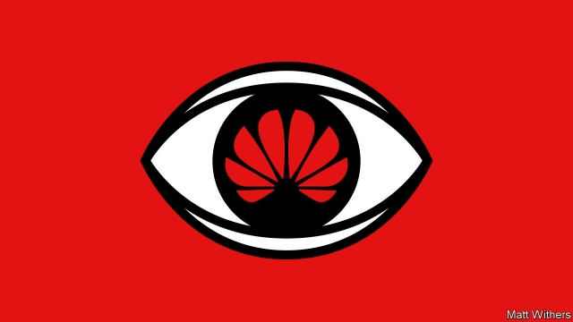

###### Technology and security

# Britain strikes an artful compromise on Huawei and 5G 

##### Its measured approach to dealing with the controversial Chinese firm is a model for other countries 

 

> Apr 27th 2019 

ON APRIL 24TH the news broke that Britain’s government had decided to permit parts of the country’s 5G mobile networks to be built by Huawei, a Chinese firm. Many Americans and other friends of Britain will be appalled by its decision and fear that the country is being naive and toadying up to China. Huawei has, after all, become one of the most controversial firms in the world and sits at the centre of a geopolitical storm. America worries that the telecoms equipment-maker is a Trojan horse for China’s spies and autocrats and poses a grave threat to Western interests. It has been urging its allies to ban it. 

Britain’s decision matters: it is a member of the “Five Eyes” intelligence-sharing alliance led by America, and was one of the first Western economies in which Huawei built a presence. Britain also has experience of electronic spying and knows Huawei well. Far from being a betrayal, Britain’s approach, of using the firm’s gear on the edges of 5G networks, under close supervision, offers a sensible framework for limited commercial engagement while protecting Britain’s security and that of its allies. 

Huawei has annual sales of $105bn from 170 countries. It is a leading supplier of equipment for new 5G networks that will connect a vast array of devices and become deeply embedded in the economy. Rumours have long circulated that Huawei is cosy with China’s army, and worries about the firm have intensified in the past two years (see article). In February Mike Pompeo, America’s secretary of state, threatened to limit co-operation with countries that used Huawei gear. America is also trying to extradite a Huawei executive (the daughter of its founder) from Canada for sanctions-busting. 

The easiest option for Britain would have been to ban Huawei from 5G networks, as Australia has. But that would be wrongheaded. One reason is technical. Refusing to use Huawei hardware does relatively little to eliminate the risk of cyber-attacks by hostile governments. State-backed hackers and saboteurs usually gain access to networks through flaws in software coding. This is why Russia can cause mayhem abroad, despite having no commercial role in Western telecoms networks. 

A ban would also have geopolitical costs. If an open system for global commerce is to be saved, a framework has to be built for countries to engage economically even if they are rivals. No evidence of spying via Huawei gear has been made public. Most emerging economies have no intention of prohibiting it. A ban by a few American allies risks splitting the world into two blocs. And a system without rules could be abused to hobble other Chinese firms engaged in legitimate activity (see article). 

For a calibrated policy to succeed, Britain and other countries will need to observe three principles. The first is continual monitoring for hidden back doors and bugs. Since 2010 Britain has had a system for vetting Huawei’s software and systems. This should continue and be extended to other 5G providers, with the aim of minimising the sloppy coding that creates vulnerabilities. 

The second principle is to limit the scope of Huawei’s activities. Britain will exclude its gear from the network “core”, where the most sensitive processing takes place, and from government networks. Military communications should also be kept isolated. And the use of other equipment vendors means that if a problem emerges, it is easy to switch firms. 

The final principle is that a U-turn is always possible. Britain should demand that Huawei continually raises standards in its software and improves its opaque governance—and should have no qualms about chucking it out if it does not. No one should be naive about Huawei. But neither should anyone be complacent about the dangers of a trading system racked by confrontation and ad hoc bans. The right path is to mitigate the risks Huawei presents and avoid an escalating trade war that makes economic engagement between the West and China impossible. 

-- 

 单词注释:

1.artful['ɑ:tful]:a. 巧妙的, 狡猾的 

2.huawei[]: 华为 

3.APR[]:[计] 替换通路再试器 

4.appall[ә'pɒ:l]:vt. 使丧胆, 使惊骇 

5.naive[nɑ:'i:v]:a. 天真的, 纯真的, 幼稚的 

6.toady['tәudi]:n. 谄媚者, 马屁精 v. 谄媚, 拍马屁 

7.geopolitical[,dʒi(:)әupә'litikәl]:[计] 地理的 

8.telecom['telәkɔm]:telecommunication 电信 

9.Trojan['trәudʒәn]:a. 特洛伊的, 特洛伊人的 n. 特洛伊人, 勤勉的人, 勇士 

10.autocrat['ɒ:tәkræt]:n. 独裁者 

11.ally['ælai. ә'lai]:n. 同盟者, 同盟国, 助手 vt. 使联盟, 使联合, 使有关系 vi. 结盟 

12.alliance[ә'laiәns]:n. 联盟, 联合 [法] 同盟, 联盟, 联姻 

13.betrayal[bi'treiәl]:n. 背叛, 辜负 [法] 背叛, 通敌, 背信 

14.supervision[.sju:pә'viʒәn]:n. 监督, 管理 [经] 监督, 管理 

15.engagement[in'geidʒdmәnt]:n. 诺言, 约会, 婚约, 交战 [医] 衔接 

16.supplier[sә'plaiә]:n. 供应者, 供给国, 供应商 [化] 承制厂; 供应厂商 

17.array[ә'rei]:n. 排列, 衣服, 大批, 军队 vt. 布署, 打扮, 排列 [计] 数组; 阵列 

18.embed[im'bed]:vt. 使插入, 使嵌入, 使深留脑中 [计] 嵌入 

19.intensify[in'tensifai]:vt. 加强 vi. 强化 

20.mike[maik]:vi. 偷懒, 游手好闲 n. 休息, 游手好闲, 扩音器, 话筒 

21.pompeo[]:n. (Pompeo)人名；(意)蓬佩奥 

22.extradite['ekstrәdait]:vt. 引渡, 获取(逃犯等)的引渡 [法] 引渡, 使被引渡 

23.founder['faundә]:n. 创立者, 建立者 vt. 使沉没, 使摔倒, 弄跛, 浸水, 破坏 vi. 沉没, 摔到, 变跛, 倒塌, 失败 

24.wronghead['rɔŋhed;'rɔ:ŋ-]:n. 判断(或看法)错误的人,固执己见者 

25.hacker['hækә]:[计] 计算机窃贼, 计算机新技术挑战者, 黑客 

26.saboteur[.sæbә'tә:]:n. 从事破坏活动者, 阴谋破坏者 [法] 破坏者, 破坏份子, 怠工者 

27.flaw[flɒ:]:n. 缺点, 裂纹, 瑕疵, 一阵狂风 [化] 划痕; 裂缝; 裂纹 

28.mayhem['meihem]:n. 蓄意的破坏, 故意的伤害罪 [医] 伤残, 残废 

29.economically[i:kә'nɔmikәli]:adv. 节约地, 不浪费地, 节省地, 节俭地, 在经济上, 在经济学上 

30.bloc[blɒk]:n. 集团 

31.hobble['hɒbl]:vi. 蹒跚 vt. 使跛行, 阻碍 n. 跛行 

32.legitimate[li'dʒitimәt]:a. 合法的, 正当的, 婚生的 vt. 认为正当, 立为嫡嗣, 使合法 

33.calibrate['kælibreit]:vt. 测定口径, 校准, 使标准化, 调整 [化] 校准 

34.bug[bʌg]:n. 错误, 虫, 病菌, 缺陷, 窃听器, 癖好, 防盗报警器, 双座小汽车, 要人 vt. 装防盗报警器, 装窃听器, 激怒 vi. 捉虫, 暴突 [计] 缺点, 错误 

35.vet[vet]:n. 兽医 vi. 当兽医 vt. 诊断, 检审 

36.provider[prә'vaidә]:n. 供应者, 供养人, 伙食承办人 [计] 提供器 

37.minimise[]:vt. 使减到最少/最小, 使降到最低限度, 使缩到最小, 极度轻视 

38.sloppy['slɒpi]:a. 泥泞的, 潮湿的, 粗心的 

39.vulnerability[.vʌlnәrә'biliti]:n. 易受伤, 易受责难, 易受伤部位 [医] 易损性 

40.vendor['vendә]:n. 小贩, 卖主, 自动售货机 [计] 计算机销售商 

41.alway['ɔ:lwei]:adv. 永远；总是（等于always） 

42.continually[kәn'tinjuәli]:adv. 不断地, 频繁地 

43.opaque[әu'peik]:n. 不透明物 a. 不透明的, 不传热的, 不传导的, 阴暗的 [计] 白底 

44.qualm[kwɒ:m]:n. 晕眩, 不安, 疑虑 [法] 疑虑, 不安, 内疚 

45.chuck[tʃʌk]:n. 抚弄, 赶走, 抛掷, 咯咯声, 颈肉, 卡盘 vt. 轻拍, 抛掷, 驱逐, 丢弃, 用卡盘夹住 vi. 咯咯叫 

46.complacent[kәm'pleisnt]:a. 满足的, 自满的, 得意的 

47.confrontation[.kɔnfrʌn'teiʃәn]:n. 对抗；对质；面对 

48.hoc[]:abbr. 下议院, 众议院（House of Commons）；肝卵圆细胞（Hepaticoval Cells）；重油催化裂化（Heavy Oil Cracking ）；最高输出信道（Highest Outgoing Channel）；均质铸锭（Homogeneous Casting） 

49.mitigate['mitigeit]:vt. 温和, 缓和, 减轻 [医] 缓和, 减轻 

50.escalate['eskәleit]:vi. 逐步扩大, 逐步升高, 逐步增强 vt. 使逐步上升 

