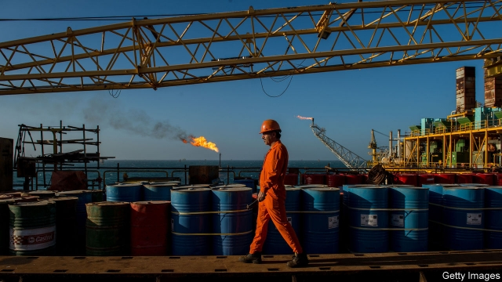
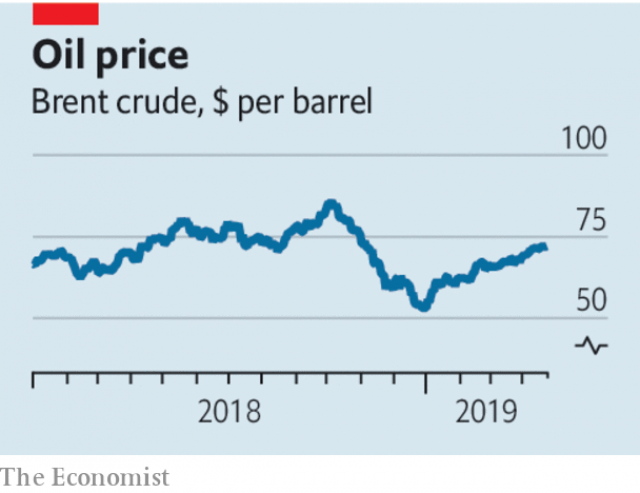

###### Spoiling the mood

# Rising oil prices could prevent a world economic rebound 

##### The risk of an oil-price shock is increasing 

 

> Apr 27th 2019 

THE SENSE of pessimism that hung over the world economy early this year has begun to lift in recent weeks. Trade flows are picking up in Asia, America’s retail sales have been strong, and even Europe’s beleaguered manufacturing industry has shown flickers of life. But it would not take much bad news to reinstate the gloom. One threat is that oil prices continue their upward march—on April 23rd the price of a barrel of Brent crude exceeded $74, the highest level for nearly six months. Though the dynamics of the oil market have changed over the past decade, dearer oil still acts as a drag on global growth. 

The latest jump in oil prices has resulted from anticipation of a shock to supply, rather than surging demand (see article). On April 22nd America said that it would end waivers granted to a number of big economies, including China, India and Turkey, which allowed them to import Iranian oil, bypassing America’s sanctions regime. These waivers were put in place after President Donald Trump pulled out of a nuclear deal with Iran in 2018. Their expiry on May 2nd could reduce the global supply of oil by more than 1m barrels per day (about 1% of the total). 

That is not the only threat to supply. War threatens production in Libya. Sanctions against Venezuela have taken supply off the market. Although a bottleneck in the Texan Permian basin will be relieved this year, it does not produce the heavy, sour crude found in Venezuela. And, after the American announcement, the head of Iran’s navy said that if it is prevented from using the Strait of Hormuz, through which one-fifth of the global oil supply flows, it could try to close the waterway for everyone else, too. 

 

Oil inventories are low, and it is far from clear that other producers will increase output enough to compensate for the supply shock. In the long term Saudi Arabia and other OPEC members have an incentive to avoid sky-high prices, which would lead to a new wave of capital pouring into American shale production. But the last time the Saudis complied with a request from the White House to pump more—after Mr Trump scrapped the Iran deal—they were then stung by his granting of the waivers. In public they have pledged to keep the market in balance, but they also say there is no need for immediate action. 

Working out what pricier oil means for the world economy is more complex than it used to be. In America gas-guzzling consumers will have to pay more to fill up their cars. But ever since the shale revolution, there has been an offsetting benefit to American GDP because higher prices stimulate investment in the Permian and other shale basins. Other producer countries are also more likely to spend any oil windfall than they used to be, supporting global demand. And more expensive oil should bring the benefit of lower carbon emissions (so long as it does not prompt the discovery of vast new oil fields). 

Yet right now, pricier oil would be bad news for the global economy. It would hit its weaker spots. Europe, whose economy is in worse shape than America’s, has no shale industry to compensate for a hit to its consumers. China, which imports vast quantities of the black stuff, was the source of much of the recent global growth scare. And economic crises in Turkey, Argentina and Pakistan would be made worse by the higher inflation and larger current-account deficits that a rising oil price would bring. 

Higher oil prices could also reduce central bankers’ leeway to see off any downturn. After oil prices rose in 2018, several central banks in emerging markets subsequently raised rates, fearing inflation. In America and Europe policymakers have this year been able to loosen the stance of monetary policy, providing economies with a much-needed boost to growth, because they can point to muted inflation expectations. Higher oil prices could start to put that trend into reverse. With many labour markets tight, central bankers are more likely to be spooked by oil-driven inflationary pressure. 

A serious oil-price shock remains a possibility at this stage rather than a probability. But with the world economy still in a fragile state, it is an uncomfortable risk to run. 

-- 

 单词注释:

1.rebound[ri'baund]:vi. 弹回, 返回, 产生事与愿违的结果 vt. 使弹回, 使返回 n. 反弹, 返回, 篮板球, 振作 rebind的过去式和过去分词 

2.APR[]:[计] 替换通路再试器 

3.pessimism['pesimizm]:n. 悲观, 悲观情绪, 悲观主义 [医] 悲观主义 

4.beleaguer[bi'li:gә]:vt. 围, 围攻 

5.manufacturing[.mænju'fæktʃәriŋ]:n. 制造业 a. 制造业的 

6.flicker['flikә]:n. 闪烁, 闪光, 颤动 vi. 闪动, 闪烁, 摇动, 扑动翅膀 vt. 使摇曳, 使闪烁 

7.reinstate[.ri:in'steit]:vt. 使复原, 使恢复, 使复立 

8.gloom[glu:m]:n. 忧郁, 暗处, 幽暗 vi. 变忧沉, 变黑暗 vt. 使忧郁, 使黑暗 

9.Brent[brent]:[经] 布兰特油田 

10.anticipation[æn.tisi'peiʃәn]:n. 预期, 预料 [医] 提前出现(如遗传病) 

11.surge[sә:dʒ]:n. 巨涌, 汹涌, 澎湃 vi. 汹涌, 澎湃, 颠簸, 猛冲, 突然放松 vt. 使汹涌奔腾, 急放 [计] 电压尖峰 

12.waiver['weivә]:n. 放弃, 弃权, 弃权声明书 [经] 弃权, 放弃权利 

13.Iranian[i'reiniәn]:a. 伊朗的, 伊朗语系的 n. 伊朗人, 伊朗语 

14.bypass['baipɑ:s]:n. 旁路 vt. 省略, 绕过, 忽视, 回避 

15.sanction['sæŋkʃәn]:n. 核准, 制裁, 处罚, 约束力 vt. 制定制裁规则, 认可, 核准, 同意 

16.regime[rei'ʒi:m]:n. 政权, 当权期间, 政体, 社会制度, 体制, 情态 [医] 制度, 生活制度 

17.Iran[i'rɑ:n]:n. 伊朗 

18.expiry[ik'spairi]:n. 终结, 满期, 呼气, 断气 [经] 满期, 到期 

19.Libya['libiә]:n. 利比亚 

20.Venezuela[,vene'zweilә]:n. 委内瑞拉 

21.bottleneck['bɒtlnek]:n. 瓶颈 [经] 瓶颈, 增产障碍 

22.Texan['teksәn]:a. 得克萨斯州的 n. 得克萨斯州的人, 得克萨斯人 

23.Permian['pә:miәn]:a. 二叠纪的, 二叠纪岩的 n. 二叠纪(岩) 

24.Hormuz['hɔ:mәz,hɔ:'mu:z]:霍尔木兹海峡(在伊朗和阿拉伯半岛之间,连接波斯湾[即阿拉伯湾]和阿曼湾) 

25.waterway['wɒtәwei]:n. 航道, 水路 [法] 水道, 水路航道 

26.inventory['invәntәri]:n. 详细目录, 存货清单 vt. 列入详细目录, 清点存货 [计] 存货清单 

27.producer[prә'dju:sә]:n. 生产者, 制作者, 制作人 [化] 发生器; (炉煤气)发生炉; 制气炉; 生产者 

28.saudi['sajdi]:a. 沙乌地阿拉伯（人或语）的 

29.Arabia[ә'reibiә]:n. 阿拉伯半岛 

30.OPEC['әjpek]:欧佩克(石油输出国家组织) 

31.incentive[in'sentiv]:n. 动机 a. 激励的 

32.shale[ʃeil]:n. 页岩 

33.saudi['sajdi]:a. 沙乌地阿拉伯（人或语）的 

34.comply[kәm'plai]:vi. 顺从, 依从 [法] 遵守, 承诺, 照做 

35.scrap[skræp]:n. 碎片, 残余物, 些微, 片断, 铁屑, 吵架 vt. 扔弃, 敲碎, 拆毁 vi. 互相殴打 a. 零碎拼凑成的, 废弃的 

36.pledge[pledʒ]:n. 诺言, 保证, 誓言, 抵押, 信物, 保人, 祝愿 vt. 许诺, 保证, 使发誓, 抵押, 典当, 举杯祝...健康 

37.pricy['praisi]:a. 昂贵的, 价格高的 

38.offset['ɒ:fset]:n. 抵消, 把...并列, 旁系, 支管, 用胶印法印 vt. 弥补, 抵消, 胶印 vi. 装支管 n. 偏移量 [计] 偏移量 

39.windfall['windfɒ:l]:n. 被风吹落的果子, 横财 [经] 意外损失 

40.emission[i'miʃәn]:n. 发射, 射出, 发行 [医] 发射, 遗精 

41.Argentina[.ɑ:dʒәn'ti:nә]:n. 阿根廷 

42.Pakistan[.pɑ:ki'stɑ:n]:n. 巴基斯坦 

43.inflation[in'fleiʃәn]:n. 胀大, 夸张, 通货膨胀 [化] 充气吹胀; 膨胀 

44.deficit['defisit]:n. 赤字, 不足额 [医] 短缺 

45.leeway['li:wei]:n. 风压差, 风压角, 可容许的误差, 余地 

46.downturn['dauntә:n]:n. (尤指经济方面的)衰退, 下降趋势 [电] 低迷时期 

47.subsequently['sʌbsikwәntli]:adv. 后来, 随后 

48.policymaker['pɔlisi.meikә]:n. 政策制定者；决策人 

49.stance[stæns]:n. 准备击球姿势, 站立的姿势, 位置, 姿态 [经] 地位, 形势 

50.monetary['mʌnitәri]:a. 货币的, 金钱的 [经] 货币的, 金融的 

51.banker['bæŋkә]:n. 银行家, 庄家 [经] 银行业者, 银行家 

52.spook[spu:k]:n. 幽灵, 鬼 vt. 惊吓, 鬼怪般地出没 vi. 惊吓而逃窜, 受惊 

53.inflationary[in'fleiʃәnәri]:a. 通货膨胀的, 通货膨胀倾向的 

