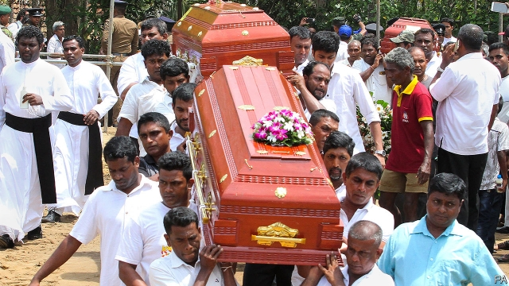

###### Easter evil

# The Sri Lanka bombers want a clash of civilisations. Don’t give in. 

##### The best response is to pursue terrorists, and avoid a backlash against Muslims 

 

> Apr 27th 2019 

A  FEW MONTHS ago National Thowheed Jamath (NTJ), an Islamist group from Sri Lanka, was known for little more than defacing statues of the Buddha. On April 21st nine of its members walked into churches and luxury hotels on the island and blew themselves up, killing more than 350 people. Islamic State (IS) claimed responsibility for the deadliest set of terrorist attacks in Asia in modern times (see article). 

How could this happen? Start with Sri Lanka’s bungling. The world has learned a great deal about how to thwart terrorists since September 11th 2001. A crucial lesson is that it is vital to share information quickly and widely, so that fragmentary intelligence can be pieced together and followed up. This is precisely what Sri Lanka’s government failed to do, despite receiving unusually detailed warnings. Part of the reason for that appears to be shameless politicking. The island’s president, Maithripala Sirisena, has been at loggerheads with the prime minister, Ranil Wickremesinghe, since the former tried to sack the latter in October. Mr Wickremesinghe has been excluded from meetings of the national security council since then. 

A second explanation is that, although Sri Lanka has no history of jihadist terrorism, nor even of much tension between Muslims and Christians, it sits in an ocean of bubbling extremism. In recent decades in South Asia, intolerant strands of Islam have edged out the broad-minded forms that used to predominate. That has created fertile ground for jihadists. The Maldives, just a short flight from Sri Lanka, sent more recruits to IS in Iraq and Syria as a proportion of its population than any other country. Bangladesh, across the Bay of Bengal, has suffered a wave of Islamist attacks on secular activists and minorities in the past six years. Sri Lanka’s suicide-bombers reportedly contacted IS veterans from both those countries. International jihadists have also cropped up across the Palk Strait in the Indian state of Tamil Nadu, which is bound to northern Sri Lanka by ethnic kinship. It was an IS suspect arrested there who is said to have yielded some of the intelligence passed to Sri Lanka’s government (which was then ignored). 

On top of all this, Mr Wickremesinghe says that some of the bombers had been to Syria; they are likely to have been among the three dozen Sri Lankans who have fought with IS. In short, Sri Lanka is not as quarantined from global jihadist networks as one might think. Few countries are. And as IS has been bombed out of its so-called caliphate, thousands of its fighters have dispersed the world over, grafting themselves onto local Islamist groups like Sri Lanka’s NTJ and disseminating ideology and expertise. The threat of jihadist attacks is therefore likely to grow. 

Last, the form of the atrocity in Sri Lanka—striking not only at hotels full of Westerners, but also at three churches—reflects the changing pattern of jihadist violence. Though al-Qaeda railed against “Jews and Crusaders” in the 1990s, it made its name striking secular targets, such as embassies and warships. Its more radical offshoot, IS, instead came to prominence in Iraq by slaughtering local Muslims who disagreed with its bloodthirsty interpretation of the Koran, often with a degree of violence that even al-Qaeda’s leaders thought excessive. 

IS has exported its modus operandi. In 2017 al-Qaeda in the Indian Subcontinent (AQIS), al-Qaeda’s South Asian branch, published a code of conduct that said Hindu, Muslim and Buddhist civilians and places of worship would not be attacked. By contrast, IS proudly claims attacks on religious targets, including churches in Egypt, the Philippines, Indonesia, Pakistan and now Sri Lanka. The aim of such sectarian terrorism is to promote the narrative of a clash of civilisations—an aim the jihadists share with white-nationalist terrorists, such as the one who attacked two mosques in New Zealand last month. 

Both groups want to sow discord and force people to choose sides. The jihadists would love to provoke a backlash against Muslims, in the hope of pushing more Muslims into their camp. Neither governments nor citizens should fall into that trap. Instead, they should work harder to catch terrorists, while doing their best to soothe relations between Muslims and their neighbours. It was the Muslim Council of Sri Lanka, remember, that first reported NTJ to the authorities three years ago. 

-- 

 单词注释:

1.sri[sri]:n. 斯里兰卡（Sri Lanka）；（拉）神圣罗马帝国（Sacrum Romanum Imperium） 

2.lanka[]:n. 兰卡；楞伽 

3.bomber['bɒmә]:n. 轰炸机, 投弹手 

4.clash[klæʃ]:n. 冲突, 撞击声, 抵触 vi. 冲突, 抵触 vt. 使发出撞击声 [计] 对撞 

5.civilisation[,sivilai'zeiʃən;-li'z-]:n. 文明, 文明世界, 文化, 开化, 教化 

6.terrorist['terәrist]:n. 恐怖分子 [法] 恐怖份子, 恐怖主义 

7.backlash['bæklæʃ]:n. 后冲, 强烈反对 [电] 反撞, 逆栅流 

8.Muslim['mjzlim; (?@) 'mʌzlem]:n. 伊斯兰教, 伊斯兰教教徒 

9.APR[]:[计] 替换通路再试器 

10.NTJ[]:日本国家剧院简称 

11.Islamist[iz'lɑ:mist]:n. 伊斯兰教主义者；回教教徒 

12.deface[di'feis]:vt. 损伤外观 [法] 毁伤外貌, 破坏外观, 涂污 

13.Buddha['budә]:n. 佛陀 

14.Islamic[iz'læmik]:a. 伊斯兰教的, 穆斯林的 

15.bungle['bʌŋgl]:v. 拙劣地工作, 粗制滥造, 把...搞糟 n. 粗劣, 失误, 笨拙 

16.thwart[θwɒ:t]:a. 横放的 vt. 反对, 阻挠, 横过 prep. 横过 adv. 横过 

17.quickly['kwikli]:adv. 很快地 

18.fragmentary['fræ^mәntәri]:a. 碎片的, 碎屑的, 片断的, 断片的, 碎块的, 不完全的, 不连续的, 不完整的 

19.precisely[pri'saisli]:adv. 精确地, 明确地, 刻板地, 拘泥地, 正好, 恰恰, 对, 正是如此, 确实如此, 不错 

20.shameless['ʃeimlis]:a. 不知羞耻的 

21.politick['pɔlitik]:vi. 进行政治活动, 谈论政治 

22.Maithripala[]:[网络] 迈特里帕拉 

23.Sirisena[]:n. (Sirisena)人名；(斯里)西里塞纳 

24.loggerhead['lɔ^әhed]:n. 傻瓜, 笨蛋 

25.Ranil[]:拉尼尔 

26.Wickremesinghe[]:n. 维克勒马辛哈 

27.jihadist[]:n. 伊斯兰圣战士 

28.terrorism['terәrizm]:n. 恐怖主义, 恐怖统治, 恐怖状态 [法] 胁迫, 暴政, 恐怖政治 

29.extremism[ik'stri:mizm]:n. 极端倾向, 极端论, 过激主义 

30.intolerant[in'tɔlәrәnt]:a. 不容忍的, 不容异说的, 偏执的, 偏狭的, 不宽容的, 不耐的, 不耐性的 

31.strand[strænd]:n. (绳索的)股, 绳, 串, 海滨, 河岸 vi. 搁浅 vt. 使搁浅, 使落后, 使陷于困境, 弄断, 搓 

32.Islam['izlɑ:m]:n. 伊斯兰教 

33.predominate[pri'dɒmineit]:vt. 掌握, 控制, 支配 vi. 占主导地位, 占优势 

34.Maldives['mɔ:ldaivz, 'mæl-]:马尔代夫(群岛)[亚洲岛国] 

35.Iraq[i'rɑ:k]:n. 伊拉克 

36.Syria['siriә]:n. 叙利亚 [经] 叙利亚 

37.Bangladesh[,bɑ:ŋ^lә'deʃ]:n. 孟加拉国 [经] 孟加拉共和国 

38.bengal[beŋ'^ɔ:l]:n. 孟加拉（位于亚洲） 

39.secular['sekjulә]:n. 修道院外的教士 a. 世俗的, 现世的, 长期的 

40.activist['æktivist]:n. 激进主义分子 

41.reportedly[ri'pɒ:tidli]:adv. 根据传说, 根据传闻, 据报道 

42.Palk[pɔ:lk]:Strait保克海峡(在印度半岛东南端和斯里兰卡岛之间) 

43.Tamil['tæmil]:n. 泰米尔人, 泰米尔语 

44.Nadu[]:n. (Nadu)人名；(罗)纳杜 abbr. 海军航空研制单位（naval air development unit） 

45.ethnic['eθnik]:a. 人种的, 种族的 [医] 人种的 

46.kinship['kinʃip]:n. 亲属关系 [法] 亲属关系, 家族关系, 关系 

47.lankan[]:[网络] 斯里兰卡南部的兰坎市 

48.quarantine['kwɒrәnti:n]:n. 隔离, 封锁交通, 检疫期 vt. 隔离, 排斥 

49.caliphate['kælifeit]:n. 伊斯兰教国王的职权或其领域 

50.disperse[dis'pә:s]:vt. 分散, 传播, 散开 vi. 分散 a. 分散的 [计] 分散 

51.graft[grɑ:ft]:n. 嫁接, 贪污 v. 嫁接, 移植, 贪污 

52.disseminate[di'semineit]:vt. 散播, 传播, 宣传 vi. 广为传播 

53.ideology[.aidi'ɒlәdʒi]:n. 思想体系, 意识形态, 观念学, 空论 [医] 观念学, 观念形态 

54.expertise[.ekspә:'ti:z]:n. 专家意见, 专门技术 [法] 专门知识, 专家意见 

55.atrocity[ә'trɒsiti]:n. 残暴, 凶恶, 暴行 [法] 暴行, 残酷, 残忍 

56.Jew[dʒu:]:n. 犹太人, 守财奴, 犹太教信徒 vt. 欺骗, 杀价 

57.crusader[kru:'seidә]:n. 十字军战士, 改革者 

58.warship['wɒ:ʃip]:n. 军舰, 战船 

59.offshoot['ɒ:fʃu:t]:n. 分支, 旁系, 衍生事物 

60.prominence['prɒminәns]:n. 突起, 突出, 显著, 突出物, 凸出 [医] 隆凸, 凸 

61.slaughter['slɒ:tә]:n. 残杀, 屠杀, 杀戮 vt. 残杀, 屠杀, 亏本出售 

62.bloodthirsty['blʌd.θә:sti]:a. 嗜杀的, 残忍的 

63.Koran[kɒ'rɑ:n]:n. <<可兰经>> 

64.modus['mәudәs]:[计] 假言的 [医] 方式, 方法 

65.operandi[ɔpə'rændai]:a. （拉丁）运作的 

66.subcontinent[sʌb'kɒntinәnt]:n. 次大陆 

67.Hindu['hindu:]:a. 印度教教徒的 n. 印度教教徒 

68.Muslim['mjzlim; (?@) 'mʌzlem]:n. 伊斯兰教, 伊斯兰教教徒 

69.proudly['praudli]:adv. 傲慢地, 自大地, 得意洋洋地 

70.Egypt['i:dʒipt]:n. 埃及 

71.Philippine['filipi:n]:a. 菲律宾(群岛)的, 菲律宾人的 

72.Indonesia[.indәu'ni:ʒә]:n. 印尼 

73.Pakistan[.pɑ:ki'stɑ:n]:n. 巴基斯坦 

74.sectarian[sek'tєәriәn]:a. 宗派的, 党派的, 偏狭的 n. 宗派成员, 闹宗派的人 

75.narrative['nærәtiv]:n. 叙述, 故事 a. 叙述的, 叙事的, 故事体的 

76.mosque[mɒsk]:n. 清真寺 

77.zealand['zi:lәnd]:n. 西兰岛（丹麦最大的岛） 

78.discord['diskɒ:d]:n. 不调和, 不和 vi. 不一致, (声音)刺耳 

79.provoke[prә'vәuk]:vt. 激怒, 惹起, 诱导 [法] 刺激, 煽动, 激怒 

80.soothe[su:ð]:vt. 缓和, 使安静, 安慰, 奉承 vi. 起安慰作用 

