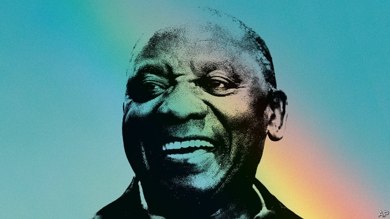

###### Good man, bad party

# To stop the rot in South Africa, back Cyril Ramaphosa 

##### The liberal opposition cannot win an election on May 8th. So it is up to the president to clean up his own party’s mess 

 

> Apr 25th 2019 

SINCE THE days of Nelson Mandela, one of the most effective slogans of the African National Congress (ANC), South Africa’s ruling party, has been “a better life for all”. The contrast with the old apartheid regime, which promised a good life only for whites, has never needed spelling out. As the party that helped liberate black South Africans from votelessness and segregation, the ANC has ruled uninterrupted since apartheid ended in 1994, always winning national elections by wide margins. The trouble is, when one party has nearly all the power, the kind of people who seek power in order to abuse it and grow rich flock to join that party. Corruption, always a problem, became so widespread under Jacob Zuma, South Africa’s atrocious president from 2009 to 2018, that a more accurate ANC slogan during his rule would have been “a better life for the president and his cronies”. 

As our special report in this issue describes, in those nine lost years Mr Zuma’s chums systematically plundered the state. Honest watchdogs were sacked. Investors fled, economic growth stalled, public debt soared and unemployment (even by a narrow definition) rose from 23% to 27%. Eskom, the bloated, looted national electricity firm, can no longer reliably keep the lights on or factories humming. Corruption has crippled public services. Many South Africans are frightened of their own police, and nearly 80% of nine- and ten-year-olds cannot read or understand a simple sentence. 

Yet there is hope. Mr Zuma is gone, narrowly ousted by his own party and now charged with some 700 counts of corruption. His replacement as party boss and president of South Africa, Cyril Ramaphosa, is an honest reformer. He is also a tremendously skilful politician—he was one of the chief negotiators who persuaded the apartheid regime to give up power long before it would have been forced to. At elections on May 8th voters have a choice. Do they back the ANC again, trusting that Mr Ramaphosa will continue to clean up the party and revive the nation? Or do they give the opposition a chance? (They cannot vote directly for the president; he is chosen by parliament, in which seats are allocated by proportional representation.) 

The case for dumping the ruling party is strong. It has been in power for 25 years—too long for any party, anywhere. Despite Mr Ramaphosa’s efforts, it is still stuffed with crooks, some of them too powerful for the president to sack. Though home to a broad range of ideologies, the ANC has recently seen a worrying resurgence of far-left populism among its cadres. For example, it vows to change the constitution to allow the expropriation of farmland without compensation. 

The case for backing the liberal opposition, the Democratic Alliance (DA), is also strong. It is far cleaner than the ANC. Its charismatic young leader, Mmusi Maimane, believes in free markets. The parts of the country that it runs, including Cape Town and Johannesburg, are islands of efficiency in a sea of murk and incompetence. Though the vast majority of municipalities are controlled by the ANC, a recent study by Good Governance Africa, a think-tank, found that 15 of the 20 best-governed were run by the DA, alone or in a coalition. The Economist endorsed the DA in 2014. But this time, with deep reservations, we would cast our notional vote, at the national level, for the ANC. 

Our reasons are painfully pragmatic. The DA has the right ideas for fixing South Africa, but is in no position to implement them. It is still seen as the party of those who are white, Indian or Coloured (to use the local term for mixed-race). Because black South Africans are 80% of the population and mostly support the ANC, the DA cannot win (except at the provincial level—and here, we would enthusiastically endorse the DA). For the national parliament, the crucial questions are: will the ANC win an outright majority? And will the election strengthen or weaken Mr Ramaphosa’s reforming hands? 

If the ANC does badly, it will undermine Mr Ramaphosa and embolden the large faction within his party that would like to see him stumble. These are the bigwigs who profited from the Zuma years, and did not mind the race-baiting that the Zuma camp used to distract public attention from its own misdeeds. It also includes some of the party’s hard left, who regard Mr Ramaphosa as altogether too friendly to capitalism. Given a chance, Mr Ramaphosa’s ANC rivals would love to replace him with someone more pliable—and that would be disastrous. 

If the ANC falls short of a governing majority and has to forge an alliance with a smaller party, things could be even worse. It might climb into bed with the Economic Freedom Fighters, a black-nationalist group that outdoes Mr Zuma in its racist demagoguery and disregard for economic reality. (It wants to seize all white-owned land, and nationalise mines, banks and other “strategic sectors” without compensation, for starters.) Such an alliance would foster an even more bloated, corrupt and ineffective state. 

The least bad plausible outcome, then, is for voters to give the ANC a solid majority, thus boosting Mr Ramaphosa and allowing him to shun the populists and face down the mafia within his own party. That way, he can continue the tough work of replacing useless Zuma appointees with law-abiding, competent people. Over the next five years he should also allow prosecutors free rein to hunt looters; break up Eskom’s power monopoly; enact a moratorium on job-killing regulations; take on the teachers’ unions that throttle education reform; and ensure that any land reform extends property rights rather than trampling on them. 

There is a big risk that none of this will happen, that the ANC has grown so rotten that no one can reform it. However, Mr Ramaphosa’s record so far suggests that he is more likely than anyone else to accomplish what is necessary. South Africa cannot afford for him to fail; nor can the rest of Africa. Despite the wasted Zuma years, the rainbow nation still has the continent’s most sophisticated economy, vibrant civil society and feisty media. Having overcome apartheid without a civil war, it has long been an inspiration to the world. All this is now in jeopardy, but Mr Ramaphosa, the man Mandela originally wanted to succeed him, has a chance to save his legacy. He must not blow it. 

-- 

 单词注释:

1.cyril['siril]:n. 西里尔（男子名） 

2.ramaphosa[]:[网络] 拉马福萨；拉马弗萨 

3.opposition[.ɒpә'ziʃәn]:n. 反对, 敌对, 相反, 在野党 [医] 对生, 对向, 反抗, 反对症 

4.cannot['kænɒt]:aux. 无法, 不能 

5.APR[]:[计] 替换通路再试器 

6.nelson['nelsn]:n. (摔跤用语)肩下握颈 

7.Mandela[mæn'delә]:纳尔逊曼德拉 Nelson, [1918, 南非黑人反种族隔离活动家] 

8.anc[]:abbr. 非洲民族会议（African National Council）；美国新闻社（American News Company）；（美国）大气氮公司（Atmospheric Nitrogen Corporation）；自动噪声消除器（Automatic Noise Canceller） 

9.apartheid[ә'pɑ:theit]:n. 种族隔离 

10.regime[rei'ʒi:m]:n. 政权, 当权期间, 政体, 社会制度, 体制, 情态 [医] 制度, 生活制度 

11.segregation[.segri'geiʃәn]:n. 隔离, 偏析, 被隔离的部分, 种族隔离 [化] 分离; 分凝; 离析; 偏析; 分聚 

12.uninterrupted['ʌn.intә'rʌptid]:a. 不间断的, 连续的, 不断的 

13.alway['ɔ:lwei]:adv. 永远；总是（等于always） 

14.corruption[kә'rʌpʃәn]:n. 腐败, 堕落, 贪污 [计] 论误 

15.jacob['dʒeikәb]:n. [圣经]雅各（以色列人的祖先）；雅各布（男子名） 

16.zuma[]: 祖玛 

17.atrocious[ә'trәuʃәs]:a. 残暴的, 凶恶的 

18.crony['krәuni]:n. 密友, 亲密伙伴, 好朋友 

19.chum[tʃʌm]:n. 密友, 室友 vi. 结为密友 

20.systematically[.sisti'mætikli]:adv. 有系统地, 有组织地, 有条理地 

21.plunder['plʌndә]:n. 抢夺, 掠夺品, 战利品 v. 掠夺, 抢劫, 抢夺 

22.watchdog['wɒtʃdɒg]:n. 看门狗, 监察人 [化] 监控设备; 监视器 

23.investor[in'vestә]:n. 投资者 [经] 投资者 

24.stall[stɒ:l]:n. 厩, 停车处, 牧师职位, 货摊, 托辞, 拖延 vt. 关入厩, 停顿, 推托, 支吾, 使陷于泥中 vi. 被关在厩内, 陷于泥中, 停止, 支吾 

25.soar[sɒ:]:n. 高扬, 翱翔 vi. 往上飞舞, 高耸, 翱翔 

26.eskom[]:[网络] 南非电力公司；南非国家电力公司；斯康 

27.bloat[blәut]:vt. 使膨胀, 腌制, 使自大 vi. 膨胀, 肿起 n. 肿胀病人 

28.loot[lu:t]:n. 赃物, 洗劫, 抢夺 v. 洗劫, 抢夺 

29.reliably[ri'laiәbli]:adv. 可靠地, 可信赖地 

30.hum[hʌm]:n. 嗡嗡声, 哼声, 杂声 vi. 发低哼声 vt. 哼, 用哼声表示 interj. 哼, 嗯 

31.narrowly['nærәuli]:adv. 狭窄地, 严密地, 仔细地, 几乎不, 勉强地, 仅仅 

32.oust[aust]:vt. 逐出, 罢黜, 剥夺, 驱逐 [法] 驱逐, 剥夺, 免职 

33.corruption[kә'rʌpʃәn]:n. 腐败, 堕落, 贪污 [计] 论误 

34.replacement[ri'pleismәnt]:n. 归还, 更换, 代替者 [医] 复位, 置换 

35.reformer[ri'fɒ:mә]:n. 改革家, 改革运动者 [化] 转化炉; 转化器; 重整器; 重整炉 

36.tremendously[trə'mendəslɪ]:adv. 极大地; 极端地; 极其; 非常 

37.skilful['skilful]:a. 灵巧的, 熟练的, 制作精巧的 

38.negotiator[ni'gәuʃieitә]:n. 磋商者, 交涉者, 议定者 [经] 谈判者, 交易者, 协商者 

39.voter['vәutә]:n. 选民, 投票人 [法] 选民, 选举人, 投票人 

40.revive[ri'vaiv]:vt. 使苏醒, 使复兴, 使振奋, 回想起, 重播 vi. 苏醒, 复活, 复兴, 恢复精神 

41.representation[.reprizen'teiʃәn]:n. 表示法, 表现, 陈述, 代表 [计] 表示法指定 

42.crook[kruk]:n. 钩, 弯曲部分, 坏蛋 vt. 使弯曲, 诈骗 vi. 弯曲 

43.ideology[.aidi'ɒlәdʒi]:n. 思想体系, 意识形态, 观念学, 空论 [医] 观念学, 观念形态 

44.resurgence[ri'sә:dʒәns]:n. 再起, 复活, 再现 

45.Populism['pɒpjulizm]:n. 平民主义, 民粹主义 

46.cadre['kædri.'kɑ:dә]:n. 框架, 干部 [经] 干部 

47.vow[vau]:n. 誓约, 誓言, 许愿 vi. 起誓, 发誓, 郑重宣言 vt. 立誓, 起誓要, 郑重地宣布 

48.expropriation[eks.prәupri'eiʃәn]:n. 征用, 收用, 征收 [经] 征用, 没收, 征购 

49.farmland['fɑ:mlænd]:n. 农田 

50.compensation[.kɒmpen'seiʃәn]:n. 补偿, 赔偿金, 工资 [医] 代偿(机能), 补偿 

51.alliance[ә'laiәns]:n. 联盟, 联合 [法] 同盟, 联盟, 联姻 

52.DA[,di:'ei]:美国地方检察官 [计] 数据采集, 数据管理员, 数据分析, 设计自动化 

53.charismatic[,kæriz'mætik]:a. 魅力, 能吸引大众的非凡能力, 神授的能力, 领袖人物感人的超凡魅力 

54.Mmusi[]:穆西 

55.Maimane[]:马伊马内 

56.cape[keip]:n. 岬, 海角, 披肩, 斗蓬 

57.Johannesburg[dʒәu'hænisbә:^]:约翰内斯堡[南非(阿扎尼亚)东北部城市] 

58.murk[mә:k]:a. 暗的, 阴沉的 n. 黝暗, 阴沉 

59.incompetence[in'kɔmpitәns]:n. 不胜任, 不够格, 不合格, 不适合, 无能力, 不熟练, 无资格 [医] 机能不全, 闭锁不全, 关闭不全 

60.municipality[.mju:nisi'pæliti]:n. 自治区, 市当局, 市民 [法] 市, 自治市, 自治地区 

61.governance['gʌvәnәns]:n. 统治, 统辖, 管理 [法] 统治, 管理, 支配 

62.coalition[.kәuә'liʃәn]:n. 结合体, 结合, 联合 [经] 联合, 联盟 

63.economist[i:'kɒnәmist]:n. 经济学者, 经济家 [经] 经济学家 

64.endorse[in'dɒ:s]:vt. 支持, 赞同, 背书于, 签署 [经] 赞成, 背书 

65.notional['nәuʃәnәl]:a. 概念的, 想像的 [经] 名义上的 

66.painfully['peinfuli]:adv. 痛苦地, 苦恼地, 费力地 

67.pragmatic[præ^'mætik]:a. 忙碌的, 爱管闲事的, 自负的, 固执己见的, 实际的, 务实的, 国事的, 国务的 [法] 闲断的, 固执己见的, 实用主义的 

68.provincial[prә'vinʃәl]:n. 外地人, 粗野的人 a. 省的, 外地的, 偏狭的 

69.enthusiastically[in.θju:zi'æstikli]:adv. 热心地, 狂热地 

70.outright['autrait]:a. 率直的, 完全的, 总共的, 直率的 adv. 完全地, 率直地, 立刻地, 一直向前 

71.undermine[.ʌndә'main]:vt. 在...下面挖, 渐渐破坏, 暗地里破坏 [法] 暗中破坏, 以阴谋中伤伤害 

72.embolden[im'bәuldn]:vt. 使大胆, 使有胆量 

73.faction['fækʃәn]:n. 小派系, 内讧 [法] 宗派, 派别, 小集团 

74.bigwig['bigwig]:n. 要人, 大亨 

75.distract[dis'trækt]:vt. 转移, 分心, 使发狂 

76.misdeed['mis'di:d]:n. 罪行, 犯罪 [法] 不端行为, 犯罪, 恶性 

77.capitalism['kæpitәlizәm]:n. 资本主义 [经] 资本主义 

78.disastrous[di'zɑ:strәs]:a. 损失惨重的, 悲伤的 

79.forge[fɒ:dʒ]:n. 熔炉, 铁工厂 vt. 打制, 锻造, 伪造 vi. 锻造, 伪造 

80.alliance[ә'laiәns]:n. 联盟, 联合 [法] 同盟, 联盟, 联姻 

81.racist['reisist]:n. 种族主义者 [法] 种族主义的, 种族歧视 

82.demagoguery['demәgɒgәri]:n. 煽动, 煽动行为, 散布谣言 

83.disregard[.disri'gɑ:d]:n. 忽视, 漠视 vt. 忽视, 不顾 

84.nationalise['næʃәnәlaiz]:vt. 把...收归国有, 使具有某国国籍, 使国有化 

85.sector['sektә]:n. 扇形, 部门, 部分, 函数尺, 象限仪, 段, 区段 vt. 把...分成扇形 [计] 扇面; 扇区; 段; 区段 

86.starter['stɑ:tә]:n. 开端者, 在起跑线上的人, 参加赛跑的人, 调度员, 起动机, 酵母 [计] 启动程序, 启动器 

87.foster['fɒstә]:a. 收养的, 养育的 vt. 养育, 抚育, 培养, 鼓励, 抱(希望) 

88.ineffective[.ini'fektiv]:a. 无效的 [法] 失效的, 无效的, 效率低的 

89.plausible['plɒ:zibl]:a. 貌似真实的, 貌似合理的, 说得煞有其事的 [法] 花言巧语的, 似乎有理的 

90.shun[ʃʌn]:vt. 避开, 规避, 避免 

91.Populist['pɔpjulist]:n. 民粹派的成员 

92.mafia['mæfiә]:n. 黑手党, 秘密政党 

93.appointee[ә.pɒin'ti:]:n. 被任命者 [法] 被指定的人, 被任命者 

94.prosecutor['prɒsikju:tә]:n. 实行者, 告发者, 公诉人 [法] 原告, 起诉人, 检举人 

95.looter[]:n. 掠夺者, 抢劫者 [法] 掠夺, 抢劫者 

96.monopoly[mә'nɒpәli]:n. 垄断, 专卖权, 独占事业 [经] 垄断, 专利品, 垄断(权)独占 

97.enact[i'nækt]:vt. 制定法律, 扮演, 颁布 [法] 法令, 法规, 条例 

98.moratorium[.mɒrә'tɒ:riәm]:n. 延期偿付, 暂停 [法] 延期偿付, 延缓履行, 延期偿还期 

99.throttle['θrɒtl]:n. 节流阀, 节气阀, 喉咙 vt. 扼喉咙, 使窒息, 压制, 使节流 vi. 窒息, 节流, 减速 

100.trample['træmpl]:n. 践踏(声), 蹂躏 v. 践踏, 无视 

101.sophisticate[sә'fistikeit]:n. 久经世故的人, 精于...之道的人 vt. 篡改, 曲解, 使变得世故, 掺合, 弄复杂 vi. 诡辩 

102.vibrant['vaibrәnt]:a. 振动的, 战栗的, 响亮的, 活跃的 

103.feisty['faisti]:a. 激动的, 活跃的, 好争吵的, 坐立不安的 

104.inspiration[.inspә'reiʃәn]:n. 灵感, 鼓舞人心的人或物, 妙计, 吸气 [医] 吸[气] 

105.jeopardy['dʒepәdi]:n. 危难, 危险 [法] 危险, 危难, 危险处境 

106.originally[ә'ridʒәnli]:adv. 本来, 原来, 最初, 就起源而论, 独创地 

107.legacy['legәsi]:n. 祖先传下来之物, 遗赠物 [经] 遗产, 遗赠物 

