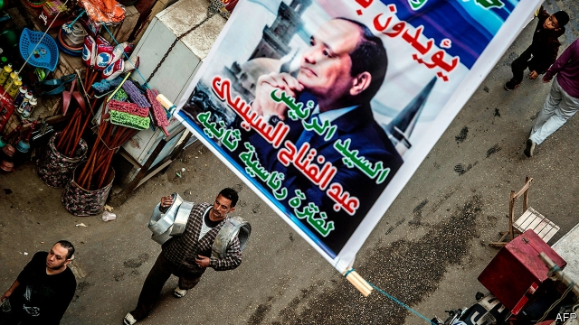
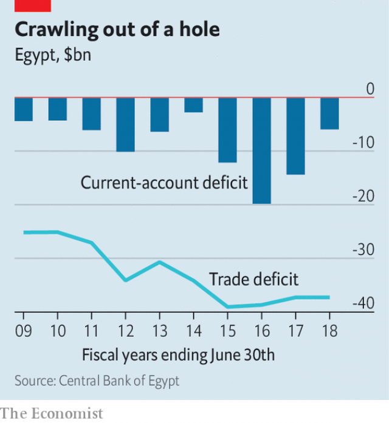

###### Running to stand still

# Egypt’s economy thrills investors, but locals are struggling 

##### The government’s reforms are causing pain at home 

 

> Apr 25th 2019 

THE INVESTORS gathered at a posh Cairo restaurant were eager to pour money into an economy that, just three years ago, lacked the hard currency to import cooking oil. A revolution in 2011 (and a coup two years later) tipped Egypt into economic crisis. Investors and tourists fled. Growth was anaemic. Unemployment peaked at 13.2%. President Abdel-Fattah al-Sisi had to seek a $12bn loan from the IMF in 2016. 

Since then, though, his government has followed what one executive admiringly calls “almost a caricature” of an IMF programme. The state has raised electricity and fuel prices. This summer the (previously massively subsidised) official price of many types of petrol will be indexed to market rates. Quite a few people have been trimmed from subsidy rolls. A budget deficit that hit 12.5% of GDP in 2015-16 has fallen. Next year it is expected to be a manageable 7.5%. The current-account deficit, which bottomed out at $19.8bn three years ago, was $6bn last year (see chart). Investors call Egypt the world’s hottest emerging market. Bond sales are oversubscribed. 

Despite the positive indicators, few Egyptians feel progress. The past few years have brought higher prices and stagnant wages. Mr Sisi has shown little sympathy for their distress. He dismissed complaints over a surge in the price of vegetables last year—then criticised Egyptians for being overweight. A new hint of discontent came earlier this month, when 89% of voters approved constitutional changes that let Mr Sisi stay in power until 2030, instead of 2022 under the previous charter. The result was a foregone conclusion, since his autocratic regime did not permit a “no” campaign. But turnout was just 44%. Sympathetic businessmen had to lure voters to the polls with boxes of food. 

 

For all the hot money flooding in, bricks-and-mortar investment is scarce. “I’m comfortable buying one-year paper,” says a trader from a big American firm. “Buying a factory would be a different story.” Inflows of foreign direct investment (FDI) were $6.6bn in the first half of the current fiscal year, unchanged from the previous year and 11% lower than 2016-17. Net FDI is down 35% over that two-year period. Much of it goes to hydrocarbons. Recent natural-gas discoveries have turned Egypt into a net exporter. Such investment boosts revenue, but creates few jobs. 

Officials insist that FDI is coming—that it is always a lagging indicator. Trade tensions and uncertain growth forecasts have caused investment to fall around the world. Some firms had profits stuck in Egypt during the dollar shortages and are leery about coming back. “It takes time to rebuild that confidence,” says Razan Nasser of HSBC, a bank. Though Egypt will not seek an extension when the IMF scheme ends in November, most analysts think it will stick with its reforms. 

But sluggish investment also reflects the weakness of Egypt’s domestic market. Its size—almost 100m people, with 2.5m added annually—means it will always have robust demand for basic consumer goods. Last year both Coca-Cola and Pepsi announced $500m in investments. Mars, a confectionery giant, is opening two new production lines. Few Egyptians can afford products that would create better-paying jobs, however. “It’s a classic developing market where 20% of the population has 80% of the purchasing power,” says the head of a local business federation. 

Take the car industry, which officials hope will be an engine of growth. Sales slumped after a devaluation in 2016 which halved the value of the pound. Even in a good year, though, only about 100,000 Egyptians can afford new cars. (Wealthy Saudi Arabia has one-quarter of Egypt’s population and sells about half a million.) 

Instead of selling cars at home, Egypt wants to export them to other parts of Africa and the Middle East. The government plans to offer incentives for using domestic suppliers: firms that buy lots of locally made components could have 80% shaved off their customs bills. Nissan has agreed to produce 100,000 cars in Egypt each year with El Nasr Automotive, a state-run firm. But Egypt will have to compete with Morocco, which has invested heavily in infrastructure. Textile firms, another possible source of jobs, will struggle to undercut big players in Bangladesh and Vietnam. 

The improvement in Egypt’s current account comes entirely from travel and transfers. Tourism revenues more than doubled to $9.8bn (4% of GDP) last year, while remittances grew by a fifth to $26.4bn. Both are important. Tourism employs one in ten workers. Hundreds of thousands of families rely on transfers. But the trade deficit in goods is getting wider. It hit $9.8bn in the first quarter of 2018-19, up $1bn from the previous year. Though the devaluation made Egyptian goods cheaper to export, it also made them more expensive to produce, because manufacturers depend on imports. Raw and intermediate goods make up 41% of Egypt’s import basket. 

After years of weak investment, there is little idle capacity at Egyptian factories. High interest rates mean local businesses cannot afford to borrow for expansion. In February the central bank cut the overnight lending rate by 100 basis points, to 16.75%. In March, however, the bank defied expectations and kept rates steady. The Ramadan holiday and a looming subsidy cut will bring higher inflation this summer, so further cuts are unlikely until autumn. 

There is one final obstacle to growth: the institution where Mr Sisi spent most of his life. It is hard to quantify how much of Egypt’s economy is controlled by the army. Its budget is secret, its profits untaxed. But everyone agrees it is growing. The minister of military production, Muhammad al-Assar, said his revenues hit 11.6bn pounds last year, a 130% increase. It has a $2bn deal with a Chinese firm to manufacture solar panels and an agreement with a French pharmaceutical giant to make vaccines. When firms struggled to get hold of dollars, the army offered them a deal—all the foreign currency you need, in exchange for a share of your company. Several executives tell a version of the same joke: “There are two kinds of successful businesses in Egypt, those run by the military, and those that will soon be run by the military.” 

Officials like to contrast Egypt’s recent progress with the dark days after 2011. Take a slightly longer view, though, and it looks like a reversion to the norm. Before the revolution Egypt posted healthy growth rates and manageable deficits. It was also a poor country with a weak industrial base, low wages—and a president out of touch with the struggles of his people. 

-- 

 单词注释:

1.investor[in'vestә]:n. 投资者 [经] 投资者 

2.APR[]:[计] 替换通路再试器 

3.posh[pɒʃ]:a. 豪华的, 漂亮的, 优雅的, 极好的 interj. 呸 

4.Cairo['kaiәrәu]:n. 开罗 

5.coup['ku:]:n. 砰然的一击, 妙计, 出乎意料的行动, 政变 [医] 发作, 中, 击 

6.Egypt['i:dʒipt]:n. 埃及 

7.anaemic[ә'ni:mik]:a. 贫血的, 患贫血症的, 无活力的 

8.IMF[]:国际货币基金组织 [经] 国际货币基金 

9.admiringly[әd'maiәriŋli]:adv. 钦佩地, 羡慕地 

10.caricature['kærikәtʃә]:n. 讽刺画, 漫画, 漫画手法 vt. 画成漫画讽刺 

11.massively[]:adv. 大而重, 厚实, 粗大, 强有力, 结实, 魁伟, 大块, 大量, 大规模, 实心, 块状 [计] 大规模地 

12.subsidise[]:vt. 给...补助金, 津贴, 资助 

13.deficit['defisit]:n. 赤字, 不足额 [医] 短缺 

14.manageable['mænidʒәbl]:a. 易办的, 易管理的, 易控制的 

15.bottome['bɔtәum]:博顿(姓氏) 

16.oversubscribe[.әuvәsәb'skraib]:vt. 超额认购(公债等), 过量预订 [经] 超额认购(公债等), 订购(某物)过多 

17.indicator['indikeitә]:n. 指示器, 指示剂, 指标 [计] 指示器 

18.stagnant['stægnәnt]:a. 不流动的, 停滞的, 不景气的, 萧条的, 污浊的, 迟钝的 [经] 萧条的 

19.sisi[]:n. (Sisi)人名；(意)西西 abbr. 短增量敏感指数（short increment sensitivity index） 

20.surge[sә:dʒ]:n. 巨涌, 汹涌, 澎湃 vi. 汹涌, 澎湃, 颠簸, 猛冲, 突然放松 vt. 使汹涌奔腾, 急放 [计] 电压尖峰 

21.criticise['kritisaiz]:v. 批评, 吹毛求疵, 非难 

22.discontent[.diskәn'tent]:n. 不满 

23.voter['vәutә]:n. 选民, 投票人 [法] 选民, 选举人, 投票人 

24.constitutional[.kɒnsti'tju:ʃәnl]:a. 宪法的, 立宪的, 体质的 [医] 全身的; 体质的 

25.charter['tʃɑ:tә]:n. 特许状, 执照, 宪章 vt. 特许, 发给特许执照 

26.forego[fɒ:'gәu]:vt. 放弃, 在...之前, 居先 

27.autocratic[.ɒ:tә'krætik]:a. 独裁的, 专制的 

28.regime[rei'ʒi:m]:n. 政权, 当权期间, 政体, 社会制度, 体制, 情态 [医] 制度, 生活制度 

29.turnout['tә:naut]:n. 聚集的人群, 出席者, 产量 [化] 输出; 产额 

30.lure[luә]:n. 饵, 诱惑 vt. 引诱, 诱惑 

31.trader['treidә]:n. 商人, 商船 [经] 交易者, 商船 

32.inflow['inflәu]:n. 流入, 流入物 

33.fdi[]:abbr. 飞行方向指示器（Flight Direction Indicator ）；世界牙科联合会（Federation Dentaire Internationale） 

34.fiscal['fiskәl]:a. 财政的, 国库的 [经] 财政上的, 会计的, 国库的 

35.unchanged[.ʌn'tʃeindʒd]:a. 无变化的 [经] 持稳的 

36.hydrocarbon[.haidrәu'kɑ:bәn]:n. 碳氢化合物 [化] 烃; 碳氢化合物 

37.exporter[ik'spɒ:tә]:n. 出口商, 输出者, 出口公司 [经] 出口商, 输出者 

38.alway['ɔ:lwei]:adv. 永远；总是（等于always） 

39.leery['liәri]:a. 机敏的, 猜疑的, 狡猾的 

40.Razan[]:[地名] 拉赞 ( 伊朗 ) 

41.Nasser['na:sə]:n. 纳塞尔（埃及总统, 1918-1970） 

42.hsbc[]:abbr. 汇丰银行（Hong Kong and Shang Hai Banking Corporation） 

43.analyst['ænәlist]:n. 分析者, 精神分析学家 [化] 分析员; 化验员 

44.sluggish['slʌgiʃ]:a. 偷懒的, 懒惰的, 迟钝的 [经] 萧条的, 呆滞的 

45.robust[rәu'bʌst]:a. 健康的, 强健的, 要用力气的, 坚定的, 粗野的 [计] 健壮性 

46.pepsi['pepsi]:n. 百事可乐（一种饮料的商标名称） 

47.mar[mɑ:]:vt. 损毁, 损伤, 糟蹋 n. 三月 

48.confectionery[kәn'fekʃәnәri]:n. 甜食, 糕饼制造业, 糖果店 [建] 糖食店 

49.federation[fedә'reiʃәn]:n. 联邦, 联合, 联盟 [法] 联邦, 联盟, 联邦政府 

50.slump[slʌmp]:n. 暴跌, 垂头弯腰的姿态 vi. 猛然掉落, 陷入, 衰落(经济等) 

51.devaluation[,di:vælju'eiʃәn]:n. 降低价值, 贬值 [经] 贬值 

52.halve[hɑ:v]:vt. 二等分, 对半分享, 把...减半 

53.saudi['sajdi]:a. 沙乌地阿拉伯（人或语）的 

54.Arabia[ә'reibiә]:n. 阿拉伯半岛 

55.incentive[in'sentiv]:n. 动机 a. 激励的 

56.locally['lәukәli]:adv. 地方性地, 局部性地, 在当地 

57.nissan[]:n. 尼桑（日产汽车名） 

58.el[el]:abbr. 预期损失（Expected Loss） 

59.nasr[]:[网络] 纳斯尔；纳赛尔；纳瑟 

60.automotive[.ɒ:tәu'mәutiv]:a. 汽车的 

61.Morocco[mә'rɒkәu]:n. 摩洛哥, 摩洛哥皮革 [机] 摩洛哥革 

62.infrastructure['infrәstrʌktʃә]:n. 基础结构, 基础设施 [经] 基础设施 

63.undercut['ʌndәkʌt]:n. 底切, 牛腰部下侧嫩肉, 下口, 下旋削球 vt. 廉价出售, 底切, 雕出, 下旋削球 vi. 切除底部 

64.Bangladesh[,bɑ:ŋ^lә'deʃ]:n. 孟加拉国 [经] 孟加拉共和国 

65.Vietnam[.vjet'næm]:n. 越南 

66.entirely[in'taiәli]:adv. 完全, 全然, 一概 

67.remittance[ri'mitns]:n. 汇款 [经] 汇款, 寄款, 支付(金额) 

68.cannot['kænɒt]:aux. 无法, 不能 

69.defy[di'fai]:vt. 藐视, 挑衅, 使落空 n. 挑战 

70.Ramadan[,ræmә'dɑ:n]:n. 斋戒月 

71.loom[lu:m]:n. 织布机, 若隐若现的景象 vi. 朦胧地出现, 隐约可见, 可怕地出现 

72.inflation[in'fleiʃәn]:n. 胀大, 夸张, 通货膨胀 [化] 充气吹胀; 膨胀 

73.quantify['kwɒntifai]:vt. 定量, 用数量表示, 测量 

74.untaxed['ʌn'tækst]:a. 免税的, 未完税的, 不负担过重的 

75.muhammad[]:n. 穆罕默德 

76.pharmaceutical[,fɑ:mә'sju:tikәl]:a. 药学的, 制药的, 药用的, 药物的, 药剂师的, 药师的 n. 药品, 成药, 药剂 

77.vaccine['væksi:n]:n. 牛痘苗, 疫苗 a. 疫苗的, 牛痘的 

78.reversion[ri'vә:ʃәn]:n. 回复, 复原, 归还, 继承权 [化] 返硫 

79.norm[nɒ:m]:n. 基准, 模范, 标准, 准则, 平均数 [化] 定额 

