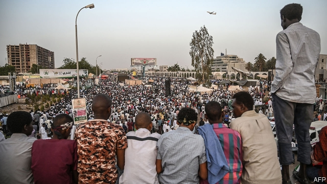

###### The struggle continues

# Sudan’s junta clings to power as protests grow 

##### The people have toppled two leaders, now they are hoping for a “third fall” 

 

> Apr 27th 2019 

TO WALK AMONG the protesters in Khartoum, Sudan’s capital, is to be caught up in an intoxicating scene. Students, cheeks painted with Sudanese flags, march past, singing revolutionary songs. As their noise subsides so others rise: the rhymes of passing street poets, the speeches of firebrands atop makeshift stages. All around friends grab each other for selfies, recording for history (and Facebook) their role in ending three decades of dictatorship. They may call it a sit-in, but here nothing is still. 

It was the protesters’ sustained energy over several months that led to the ousting of Omar al-Bashir, Sudan’s president since 1989, on April 11th. The next day they forced his successor, Awad Ibn Auf, to step down as well. Today the street is calling for the “third fall”, that of the ten-member Transitional Military Council (TMC), which is in charge of the country. “We have to keep applying the pressure,” says Abuzar Awad, a 31-year-old engineer. “Otherwise the military won’t give us our rights.” 

The military says it is willing to share power with a transitional government for an interim period, as a presidential election is prepared. But there is little doubt that it wants to maintain a hold on the country. For that reason the Sudanese Professionals Association (SPA), a coalition of trade unions that spearheads the protests, suspended talks with the TMC on April 21st. “We want the military to protect the country, not rule the country,” said Ismail Eltag, a lawyer and spokesman for the SPA. 

The talks resumed on April 24th. A spokesman for the TMC said the two sides had reached an “agreement on most demands” and that, in a show of good faith, it would dismiss three generals who were close to Mr Bashir. A joint committee has been formed to try to bring order to the negotiations. But much was left vague, including whether any transitional government would answer to the generals. 

Unhelpfully, there is something of a political vacuum on the civilian side. The SPA has no single leader and has struggled to agree on who should be part of any new government. Meanwhile, other political groupings under the opposition umbrella group, the Alliance of Freedom and Change, are jostling for position. “Unless there is a clear plan the military will take over again,” warns Osman Mirghani, a newspaper editor. 

Lieutenant-General Abdel Fattah Abdelrahman Burhan, the head of the TMC, and Muhammad Hamdan Dagalo, the deputy head who goes by the nickname Hemedti, say the right things, but seem reluctant to cede authority. Hemedti, a militia commander whom many believe to be the most powerful member of the TMC, is “playing a game”, says a Western diplomat, by suggesting to the demonstrators that he is on their side, while hoping to take the top job. 

The junta has much to lose. An estimated 65%-70% of state spending goes on security, compared with just 5% for public health and education. Families connected to the military and security services run the businesses that dominate the Sudanese economy. Corruption is rife. 

Neighbouring powers are helping the TMC cling on. On April 21st Saudi Arabia and the United Arab Emirates (UAE) gave Sudan $3bn worth of aid, including $500m in cash deposited at the central bank—a lifeline in an inflationary economy short of hard currency. At a meeting in Cairo on April 23rd, members of the African Union, chaired this year by Abdel Fattah al-Sisi, Egypt’s president (who himself took power in a coup), extended the bloc’s deadline for the TMC to give up power by three months. 

Egypt, Saudi Arabia and the UAE see opportunities in Sudan’s upheaval. Mr Bashir’s National Congress Party grew out of the Muslim Brotherhood, an Islamist group that is loathed by the three countries. They now spy a chance to tear Sudan away from the Islamists of Turkey and Qatar, their regional rivals. The trio also wants to stamp out any hope of a new Arab spring. Egypt, Saudi Arabia and the UAE are being “unhelpful”, says another diplomat. 

The “troika” of America, Britain and Norway is urging negotiations between the military and the protesters. It is also suggesting that the SPA reconsider some of its demands, such as having a civilian-led transitional government for four years (to allow the political scene to mature). 

The TMC may think it can buy time and grind down the protesters. But at the sit-in there is no sign of flagging spirits. If anything, the movement is growing. When a train from Atbara, more than 200 miles north, arrived in Khartoum on April 23rd, thousands of protesters greeted it. The carriages were as packed as those of a Tokyo subway train—but with more joyous passengers. On April 25th a “million-man march” was held in Khartoum, one of the largest gatherings yet. 

Sudanese youth are the vanguard of the protest movement, but this is not a juvenile revolt. Their parents are behind them. Abd Elazim Muhammad Kheir, a 65-year-old businessman, spent 21 years working at the Sudanese central bank. “All of the old regime are completely corrupt; if you’re not corrupt you cannot stay in office,” he says. “But the kids are not accepting it.” 

His 15-year-old son, Aamin, and 23-year-old daughter, Roan, have gone to the sit-in almost every day. Roan came back from Manchester, England, to join her peers. “I told them they will be killed, but they are willing to die for their country,” says Mr Kheir, with a mixture of fatherly pride and concern. Now he goes to the protests too. “To build a new society we have to sacrifice,” he says. 

-- 

 单词注释:

1.junta['dʒʌntә]:n. 以武力政变上台的(军)政府, 私党, 阴谋小集团, 政务会 

2.cling[kliŋ]:vi. 粘紧, 附着, 紧贴, 坚持 

3.topple['tɒpl]:vt. 推翻, 颠覆 vi. 倒塌, 摇摇欲坠 

4.APR[]:[计] 替换通路再试器 

5.protester[]:n. 抗议者, 持异议者, 拒付者 [经] 反对者 

6.Khartoum[ka:'tu:m]:n. 喀土穆（苏丹首府） 

7.intoxicate[in'tɒksikeit]:vt. 使陶醉, 使喝醉 

8.Sudanese[su:dә'ni:z]:a. 苏丹的, 苏丹人的 n. 苏丹人 

9.subside[sәb'said]:vi. 沉淀, 沉降, 平息 

10.firebrand['faiәbrænd]:n. 火把, 在燃烧的木柴, 煽动叛乱者 

11.atop[ә'tɒp]:adv. 在顶上 prep. 在...的顶上 

12.makeshift['meikʃift]:n. 权宜之计, 临时代用品 a. 权宜的, 临时代用的 

13.grab[græb]:n. 抓握, 掠夺, 强占, 东方沿岸帆船 vi. 抓取, 抢去 vt. 攫取, 捕获, 霸占 

14.selfies[]:[网络] 自拍照 

15.facebook[]:n. 脸谱网 

16.dictatorship[dik'teitәʃip]:n. 独裁者之职位, 独裁, 独裁政权 [法] 专攻, 独裁权 

17.oust[aust]:vt. 逐出, 罢黜, 剥夺, 驱逐 [法] 驱逐, 剥夺, 免职 

18.omar['әjmɑ:(r)]:n. 奥马尔（男子名） 

19.successor[sәk'sesә]:n. 继承者, 接任者 [计] 后继 

20.awad[]:n. (Awad)人名；(意、芬、阿拉伯)阿瓦德 

21.Ibn['ibən]:n. 伊本（阿拉伯男子名） 

22.auf[]:abbr. 法语国家大学协会（Agence universitaire de la Francophonie） 

23.transitional[træn'siʒәnl]:a. 变迁的, 过渡期的 [医] 转变的, 过渡的; 过渡型单核白细胞 

24.tmc[]:abbr. 交通管制（Traffic Movement Control）；运输器材司令部（[美]陆军）（Transportation Material Command） 

25.transitional[træn'siʒәnl]:a. 变迁的, 过渡期的 [医] 转变的, 过渡的; 过渡型单核白细胞 

26.interim['intәrim]:a. 暂时的, 临时的, 间歇的 n. 过渡时期 

27.presidential[.prezi'denʃәl]:a. 总统制的, 总统的, 首长的, 统辖的 [法] 总统的, 议长的, 总经理的 

28.spa[spɑ:]:n. 矿泉, 温泉浴场, 矿泉治疗地 [计] 软件出版者协会 

29.coalition[.kәuә'liʃәn]:n. 结合体, 结合, 联合 [经] 联合, 联盟 

30.spearhead['spiәhed]:n. 矛尖, 先锋队, 先头部队 vt. 做先锋, 带头 

31.Ismail[]:n. 伊斯梅尔（男子名） 

32.spokesman['spәuksmәn]:n. 发言人, 代言者 

33.Bashir[]:n. (Bashir)人名；(英、俄、阿富、巴基)巴希尔；(阿拉伯)贝希尔 

34.negotiation[ni.gәuʃi'eiʃәn]:n. 谈判, 磋商, 交涉 [经] 谈判, 协商 

35.unhelpfully[]:adv. 不起帮助作用地, 无用地, 不予帮组地 

36.grouping['gru:piŋ]:n. 分组 [计] 组 

37.opposition[.ɒpә'ziʃәn]:n. 反对, 敌对, 相反, 在野党 [医] 对生, 对向, 反抗, 反对症 

38.alliance[ә'laiәns]:n. 联盟, 联合 [法] 同盟, 联盟, 联姻 

39.jostle['dʒɒsl]:n. 推挤, 冲撞 vi. 推挤, 冲撞 vt. 推, 挤, 煽动 

40.Osman[ɔz'mɑ:n, ɔs-]:奥斯曼(1259-1326, 奥托曼 Ottoman 帝国的创建者) 

41.mirghani[]:米尔加尼 

42.Abdel[]:n. (Abdel)人名；(阿拉伯、哈萨、塔吉、吉尔、乌兹、阿塞、土库、乍、塞)阿卜杜勒 

43.Fattah[]:[网络] 法塔赫 

44.burhan[]:[网络] 布尔汗；证据；阿拉伯 

45.muhammad[]:n. 穆罕默德 

46.Hamdan[]:哈姆丹（苏丹城市, 东经 28º40' 北纬 12º30'） 

47.nickname['nikneim]:n. 绰号, 昵称 vt. 给...取绰号, 叫错名字 [计] 绰号 

48.cede[si:d]:vt. 割让 [法] 割让, 让与, 放弃 

49.militia[mi'liʃә]:n. 义勇军, 民兵组织, 国民军 

50.diplomat['diplәmæt]:n. 外交官, 有外交手腕的人 [法] 外交家, 外交官, 有权谋的人 

51.demonstrator['demәnstreitә]:n. 论证者, 证明者, 指示者, 示威者 [医] 示教者 

52.corruption[kә'rʌpʃәn]:n. 腐败, 堕落, 贪污 [计] 论误 

53.rife[raif]:a. 流行的, 盛传的, 充满的 

54.saudi['sajdi]:a. 沙乌地阿拉伯（人或语）的 

55.Arabia[ә'reibiә]:n. 阿拉伯半岛 

56.emirate[e'miәrit]:n. 埃米尔的地位, 酋长国 

57.UAE[]:阿拉伯联合酋长国 

58.Sudan[su:'dæn]:n. 苏丹 [化] 苯偶氮间苯二酚; 苏丹 

59.lifeline['laiflain]:n. 救生索, 生命线 

60.inflationary[in'fleiʃәnәri]:a. 通货膨胀的, 通货膨胀倾向的 

61.Cairo['kaiәrәu]:n. 开罗 

62.coup['ku:]:n. 砰然的一击, 妙计, 出乎意料的行动, 政变 [医] 发作, 中, 击 

63.Egypt['i:dʒipt]:n. 埃及 

64.upheaval[ʌp'hi:vl]:n. 举起, 隆起, 大变动, 剧变 

65.Muslim['mjzlim; (?@) 'mʌzlem]:n. 伊斯兰教, 伊斯兰教教徒 

66.Islamist[iz'lɑ:mist]:n. 伊斯兰教主义者；回教教徒 

67.loathe[lәuð]:vt. 厌恶, 憎恶 

68.Islamist[iz'lɑ:mist]:n. 伊斯兰教主义者；回教教徒 

69.Qatar['kɑ:tәr]:n. 卡塔尔 

70.regional['ri:dʒәnәl]:a. 地方的, 地域性的 [医] 区的, 部位的 

71.trio['tri:әu]:n. 三重唱 

72.unhelpful['ʌn'helpful]:a. 不起帮助作用的, 无用的, 无益的, 不予帮助的, 不予合作的 

73.troika['trɒikә]:n. 三头马车 

74.Norway['nɒ:wei]:n. 挪威 

75.reconsider[.ri:kәn'sidә]:v. 再考虑, 重新考虑 

76.Atbara['ætbərə; æt'bɑ:rɑ:]:n. 阿特巴拉河（位于苏丹东北部） 

77.joyous['dʒɒiәs]:a. 快乐的, 高兴的 

78.gathering['gæðәriŋ]:n. 聚集, 集中, 采集 [化] 富集 

79.vanguard['vængɑ:d]:n. 前锋, 先锋, 先驱 

80.juvenile['dʒu:vinail]:n. 少年, 少年读物 a. 少年的, 不成熟的, 适于少年的 

81.abd[]:abbr. [俚]准博士（All But Dissertation） 

82.regime[rei'ʒi:m]:n. 政权, 当权期间, 政体, 社会制度, 体制, 情态 [医] 制度, 生活制度 

83.cannot['kænɒt]:aux. 无法, 不能 

84.roan[rәun]:a. 沙毛的 n. 沙毛牲畜, 柔软的羊皮 

85.Manchester['mæntʃestә]:n. 曼彻斯特 

86.peer[piә]:n. 同等的人, 匹敌, 贵族 vi. 凝视, 窥视, 费力地看, 隐现 vt. 与...同等, 封为贵族 

87.fatherly['fɑ:ðәli]:a. 父亲的, 如父亲的, 慈爱的 

