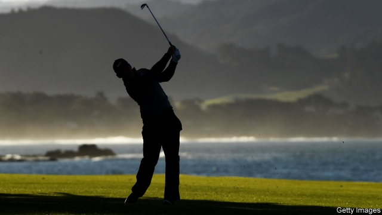

###### Sports psychology

# How hard a golf hole is does not depend solely on how hard it is 

##### Golfers try harder if the par has been lowered 

 

> Apr 27th 2019 

FED UP WITH watching professional golfers humble historic courses, tournament organisers have lengthened holes, dug deeper bunkers and grown thicker rough to make things harder. But traditionalists—and there are many—complain of vandalism to beloved venues. So what is a golf official to do? 

Some change the par of the holes—the number of strokes a good golfer should need to complete a hole. Par allows a set number of shots to reach the green, and then two putts to sink the ball. For men, holes over 430 metres (470 yards) are typically assigned a par of five. Those between 230 and 430 metres are par four. 

To make long holes seem trickier several courses have relabelled a par five as par four, so elite golfers over the years have played these holes as both. And that sets up an intriguing natural experiment. Did those golfers try harder when they played them as par fours? If so, they would be showing what behavioural economists call loss-aversion bias: working harder to cling to something they already have (their status as par players of that course) than they did to get it in the first place. 

To find out, Ryan Elmore and Andrew Urbaczewski of the University of Denver looked at scores from the US Open, a major tournament. They focused on two holes—the second at Pebble Beach and the ninth at Oakmont. Both have been switched in the past from par five to par four. And both courses hosted the Open at least twice in the years before and after the switch. 

The researchers’ analysis, posted on SSRN, a preprint site, is as startling as an alligator emerging from a water hazard. Unsurprisingly, players’ scores relative to par on these two holes got worse when they were par fours. But their absolute scores improved, by an average of a whole shot over a tournament (during which the golfers play the same course four times). That can be the difference between winning and losing. Scores on other holes did not change, so the improvement was not explained by generally better play, better equipment or better weather. It seems to have been caused by players trying to protect par. 

That is not a rational response. Golfers play against each other, not the course. The player who takes the fewest shots wins. Individual performance against par is irrelevant—except that, apparently, it isn’t. 

-- 

 单词注释:

1.golfer['gɒlfә]:n. 打高尔夫球的人 

2.par[pɑ:]:n. 标准, 票面价值, 平均数量, 同等水平 a. 票面的, 平常的, 标准的, 平价的 [计] 重新传输的肯定回答 

3.APR[]:[计] 替换通路再试器 

4.historic[hi'stɒrik]:a. 历史上著名的, 有历史性的 

5.lengthen['leŋθәn]:vt. 加长, 使延长 vi. 变长 

6.bunker['bʌŋkә]:n. 煤仓, 沙坑, 暗堡 vt. 击入沙坑, 使陷入困境 

7.vandalism['vændәlizm]:n. 故意毁坏文物的行为, 破坏他人财产的行为 

8.venue['venju:]:n. 犯罪地点, 审判地, 发生地点 

9.par[pɑ:]:n. 标准, 票面价值, 平均数量, 同等水平 a. 票面的, 平常的, 标准的, 平价的 [计] 重新传输的肯定回答 

10.putt[pʌt]:vt. 击球入洞 vi. 轻击高尔夫球 n. 轻轻一击(入洞) 

11.typically['tipikәli]:adv. 代表性地；作为特色地 

12.tricky['triki]:a. 狡猾的, 机敏的 

13.relabel[.ri:'leibәl]:vt. 重新贴标签于；重新用标签标明 

14.elite[ei'li:t]:n. 精华, 精锐, 中坚分子 

15.intrigue[in'tri:g]:n. 阴谋, 复杂的事 vi. 密谋, 私通 vt. 激起...的兴趣, 用诡计取得 

16.behavioural[bi'heivjәrәl]:a. 行为的 

17.economist[i:'kɒnәmist]:n. 经济学者, 经济家 [经] 经济学家 

18.cling[kliŋ]:vi. 粘紧, 附着, 紧贴, 坚持 

19.statu[]:[网络] 状态查看；雕像；特级雪花白 

20.ryan['raiәn]:n. 赖安（男子名） 

21.Elmore[]:埃尔莫尔 

22.andrew['ændru:]:n. 安德鲁（男子名） 

23.Denver['denvә]:n. 丹佛(美国城市) 

24.oakmont[]: [地名] [美国] 奥克蒙特 

25.SSRN[]:[网络] 社会科学研究网(social science research network)；社会科学研究网络；计算机网 

26.preprint['pri:.print. pri:'print]:vt. 预印 

27.alligator['æligeitә]:n. 短吻鳄 [机] 两栖装甲车 

28.unsurprisingly[]:adv. 不出所料的；不出奇的；意料中的 

29.fewest[]:[计] 最少的 

30.apparently[ә'pærәntli]:adv. 表面上, 清楚地, 显然地 

