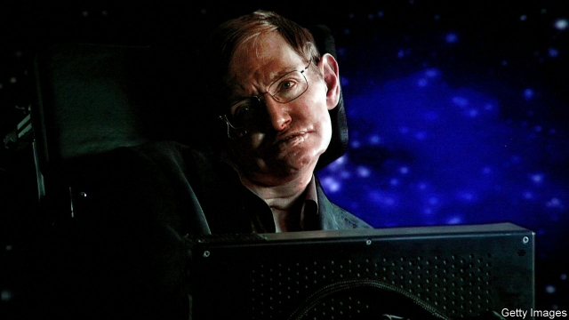

###### Medical technology

# How to give voice to the speechless 

##### Listen to, and translate, their brainwaves 

 

> Apr 27th 2019 

OF THE MANY memorable things about Stephen Hawking, perhaps the most memorable of all was his conversation. The amyotrophic lateral sclerosis that confined him to a wheelchair also stopped him talking, so instead a computer synthesised what became a world-famous voice. 

It was, though, a laborious process. Hawking had to twitch a muscle in his cheek to control a computer that helped him build up sentences, word by word. Others who have lost the ability to speak because of disease, or a stroke, can similarly use head or eye movements to control computer cursors to select letters and spell out words. But, at their best, users of these methods struggle to produce more than ten words a minute. That is far slower than the average rate of natural speech, around 150 words a minute. 

A better way to communicate would be to read the brain of a paralysed person directly and then translate those readings into synthetic speech. And a study published in Nature this week, by Edward Chang, a neurosurgeon at the University of California, San Francisco, describes just such a technique. Speaking requires the precise control of almost 100 muscles in the lips, jaw, tongue and throat to produce the characteristic breaths and sounds that make up sentences. By measuring the brain signals that control these vocal-tract muscles, Dr Chang has been able to use a computer to synthesise speech accurately. 

The volunteers for Dr Chang’s study were five people with epilepsy who had had electrodes implanted into their brains as part of their treatment. He and his colleagues used these electrodes to record the volunteers’ brain activity while those volunteers spoke several hundred sentences out loud. Specifically, the researchers tracked activity in parts of the brain responsible for controlling the muscles of the vocal tract. 

To convert those signals into speech they did two things. First, they trained a computer program to recognise what the signals meant. They did this by feeding the program simultaneously with output from the electrodes and with representations of the shapes the vocal tract adopts when speaking the test sentences—data known from decades of study of voices. Then, when the program had learned the relevant associations, they used it to translate electrode signals into vocal-tract configurations, and thus into sound. 

The principle proved, Dr Chang and his team went on to show that their system could synthesise speech even when a volunteer mimed sentences, rather than speaking them out loud. Although the accuracy was not as good, this is an important further step. A practical device that might serve the needs of people like Hawking would need to respond to brain signals which moved few or no muscles at all. Miming is a stepping stone to that. The team have also shown that the relationship between brain signals and speech is sufficiently similar from person to person for their approach to be employed to create a generic template that a user could fine-tune. That, too, will ease the process of making the technique practical. 

So far, Dr Chang has worked with people able to speak normally. The next stage will be to ask whether his system can work for those who cannot speak. There is reason for cautious optimism here. What Dr Chang is doing is analogous to the now well-established field of using brain-computer interfaces to allow paralysed individuals to control limb movements simply by thinking about what it is they want to do. Restoring speech is a more complex task than moving limbs—but sufficiently similar in principle to give hope to those now in a position similar to that once endured by the late Dr Hawking. 

-- 

 单词注释:

1.speechless['spi:tʃlis]:a. 不会说话的, 哑的, 说不出话的, 无言的, 非言语所能表达的, (非正式)烂醉的 

2.brainwave['breinweiv]:n. 脑(电)波, 灵感 

3.APR[]:[计] 替换通路再试器 

4.memorable['memәrәbl]:a. 值得纪念的, 难忘的 

5.stephen['sti:vn]:n. 斯蒂芬（男子名） 

6.amyotrophic[]:[医] 肌萎缩的 

7.lateral['lætәrәl]:n. 侧部, 支线, 边音 a. 侧面的, 旁边的 

8.sclerosis[skliә'rәusis]:n. 硬化症, 硬化, 僵化 [医] 硬化 

9.wheelchair['hwi:l.tʃєә]:n. 轮椅 

10.synthesise['sinθisaiz]:vt.vi. 综合, 合成, 接合 vt. 用合成法合成, 综合地处理 

11.laborious[lә'bɒ:riәs]:a. 艰苦的, 费劲的, 勤劳的 

12.twitch[twitʃ]:vi. 急拉, 抽搐, 阵痛 vt. 急拉, 攫取, 抽动 n. 急拉, 抽搐, 阵痛 

13.cursor['kә:sә]:n. 游标, 光标 [计] 光标 

14.paralyse['pærәlais]:vt. 使麻痹, 使瘫痪, 使无力, 使气馁, 终止 [医] 使麻痹, 使瘫痪 

15.edward['edwәd]:n. 爱德华（男子名） 

16.chang[tʃɑ:ŋ. tʃæŋ]:n. 青稞酒（等于chong） 

17.neurosurgeon[,njjәrәj's\\:dʒәn]:n. 神经外科医师 [医] 神经外科医师 

18.California[.kæli'fɒ:njә]:n. 加利福尼亚 

19.san[sɑ:n]:abbr. 存储区域网（Storage Area Networking） 

20.francisco[fræn'siskәu]:n. 弗朗西斯科（男子名, 等于Francis） 

21.accurately['ækjurәtli]:adv. 正确地, 精确地 

22.epilepsy['epilepsi]:n. 癫痫症 [医] 癫痫(羊痫疯) 

23.electrode[i'lektrәud]:n. 电极 [化] 电极; 焊条; 电焊条 

24.implant[im'plɑ:nt]:vt. 深植, 灌输, 嵌入 n. 植入物, 植入管 

25.specifically[spi'sifikli]:adv. 特定地, 明确地, 按特性 

26.vocal['vәukl]:a. 嗓音的, 声音的, 有声的, 歌唱的 n. 元音, 声乐作品 

27.tract[trækt]:n. 大片土地, 地带, 小册子 [医] 束, 道 

28.simultaneously[simәl'teiniәsly; (?@) saim-]:adv. 同时发生, 一齐, 同时, 同时存在 

29.representation[.reprizen'teiʃәn]:n. 表示法, 表现, 陈述, 代表 [计] 表示法指定 

30.configuration[kәn.figju'reiʃәn]:n. 结构, 表面配置, 外形, 配置 [计] 配置 

31.mime[maim]:n. 哑剧, 小丑, 滑稽戏 v. 摸拟表演 [计] 多用途互连网邮件扩展 

32.generic[dʒi'nerik]:a. 属类的, 一般的 [计] 一般的 

33.template['templit]:n. 样板, 模板, 垫木 [计] 模板 

34.cannot['kænɒt]:aux. 无法, 不能 

35.optimism['ɒptimizm]:n. 乐观主义, 乐观, 乐天 [医] 乐观主义, 乐观 

36.analogous[ә'nælәgәs]:a. 类似的, 相似的 [医] 类似的, 类同的 

37.interface['intәfeis]:n. 分界面, 接触面, 界面 [计] 接口, 界面 

