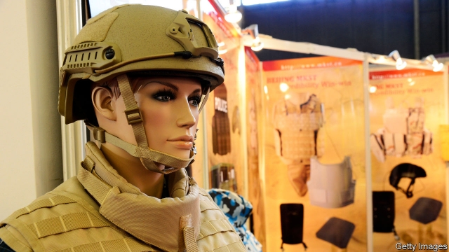

###### Materials science

# How to speed up the testing of new materials 

##### Ask questions first. Shoot afterwards 

 

> Apr 27th 2019 

THOMAS EDISON believed in the power of trial and error. “I have not failed,” he is alleged to have said. “I’ve just found ten thousand ways that won’t work.” After rejecting many alternatives, Edison’s team discovered the carbon filament and thus revolutionised electric lighting. 

Trial and error of this sort is a long-winded way of making discoveries. It is still, though, surprisingly common. The pharmaceutical industry has speeded things up by employing robotic devices that handle trays containing hundreds of test tubes or plates, permitting researchers to test, simultaneously, the effects of many potential drugs on cell cultures. But in other areas, notably materials science, tests are still done one at a time, by hand—and progress is often painfully slow. This is certainly true of the quest for better ceramics for body armour. 

And it is something Michael Golt of the United States Army Research Laboratory (ARL) is acutely aware of. America’s Congress has, he says, requested a 20% reduction in the weight of the body armour worn by the country’s troops. But historical trends suggest this improvement will take decades to achieve. Fortunately, Dr Golt has a plan to speed things up. 

Modern body armour is made of ceramic plates up to a centimetre thick. These plates are stronger and lighter than steel—strong enough to stop a rifle bullet. They are made by mixing powdered ceramics, typically silicon carbide or boron carbide, with small quantities of binding agent and then heating the mixture until it fuses. Experience shows that minute variations in the details of the composition, mixing and cooking involved in these recipes can make a big difference to the finished product. But, though theory suggests it should be possible to make ceramics more robust than those which already exist, in practice tinkering with existing successful recipes usually makes them worse. 

The challenge, therefore, is finding the right recipe for improvement among the zillions of possible wrong ones. And, at the moment, the only way to do this is to test plates by firing bullets at them—which is literally a one-shot process. Every variation in testing conditions, for example in the velocity or calibre of the bullet, requires a new plate, so gathering information is both time- and money-consuming. 

Dr Golt’s better way is to probe a ceramic plate’s source of strength—its particular granular structure—before firing anything at it. This is not a new idea per se. But the obvious way of doing it, which is to look at the grains through a microscope, has in practice proved a poor predictor of how well a plate can withstand a shot. Instead, Dr Golt probes the plates’ grain structures electrically. He and his colleagues at the ARL’s Aberdeen Proving Ground, in Maryland, have developed a test in which they apply alternating currents of various frequencies across a plate. 

Plates’ electrical properties, it turns out, are different at different frequencies, depending on their grain structure. Moreover, they vary in a way that is closely related to a plate’s ballistic performance. This gives an indication of how effective that plate is likely to be, and thus whether it is worth testing. Crucially, this electrical test can be automated in a way similar to the way that drug testing is automated, so that many plates, of many different compositions, can be tested quickly. And, better still, information from these tests can be run through a machine-learning system that permits researchers to explore the effects of slight changes in manufacture without having to test every possible combination with actual bullets. Only the most promising changes need to be turned into plates, to confirm that the software’s predictions were correct. 

This process is thus a vast improvement on the Edisonian approach of blindly testing everything. It has already helped the team produce plates which outperform existing versions. But Dr Golt would like to introduce a further tweak. A continuous feedback loop, in which the results of each ballistic test are used to adjust the manufacturing process automatically, would produce successive generations of new ceramics, each generation having superior properties to the last. 

Nor is Dr Golt’s technique necessarily restricted to ballistics. Applying it elsewhere could help uncover all sorts of new and improved ceramics for things like electronic devices, heat-resistant components in car engines and the blades of wind turbines (which have ceramic cores). Edison would surely have approved. 

-- 

 单词注释:

1.afterwards['ɑ:ftәwәdz]:adv. 然后, 后来 

2.APR[]:[计] 替换通路再试器 

3.thoma[]:n. (Thoma)人名；(阿尔巴、阿拉伯)索玛；(英、德、罗、匈、捷、塞、瑞典)托马 

4.Edison['edisn]:n. 爱迪生 

5.allege[ә'ledʒ]:vt. 宣称, 主张, 提出, 断言 [法] 断言, 指称, 指证 

6.filament['filәmәnt]:n. 细丝, 细线, 灯丝, 单纤维 [化] 长丝; 单丝(复丝中的单根细丝); 丝极 

7.revolutionise[,revә'lju:ʃənaiz]:vt. 使革命化, 彻底改革, 彻底改变 

8.pharmaceutical[,fɑ:mә'sju:tikәl]:a. 药学的, 制药的, 药用的, 药物的, 药剂师的, 药师的 n. 药品, 成药, 药剂 

9.robotic[rәu'bɔtik]:a. 自动的；机器人的, 像机器人的 

10.simultaneously[simәl'teiniәsly; (?@) saim-]:adv. 同时发生, 一齐, 同时, 同时存在 

11.notably['nәjtbәli]:adv. 显著地, 著名地, 尤其, 特别 

12.painfully['peinfuli]:adv. 痛苦地, 苦恼地, 费力地 

13.quest[kwest]:n. 探索, 寻求, 调查 v. 寻找, 找, 追寻猎物 

14.ceramic[si'ræmik]:a. 陶瓷的 n. 陶瓷制品 

15.armour['ɑ:mә]:n. 甲胄, 装甲, 潜水服 

16.michael['maikl]:n. 迈克尔（男子名） 

17.golt[]:[网络] 山羊 

18.arl[]:n. (Arl)人名；(土)阿勒 abbr. 容许可靠性程度 

19.acutely[ә'kju:tli]:adv. 尖锐地, 剧烈地 

20.typically['tipikәli]:adv. 代表性地；作为特色地 

21.silicon['silikәn]:n. 硅 [化] 硅Si 

22.carbide['kɑ:baid]:n. 碳化物 [化] 碳化物; 碳化钙; 电石 

23.boron['bɒ:rɒn]:n. 硼 [化] 硼B 

24.fuse[fju:z]:n. 保险丝, 导火线 v. 熔化, 融合 

25.robust[rәu'bʌst]:a. 健康的, 强健的, 要用力气的, 坚定的, 粗野的 [计] 健壮性 

26.tinker['tiŋkә]:n. 补锅匠, 会做各种修补活计的人 vi. 做焊锅匠, 笨拙的修补 vt. 修补 

27.zillion['ziljәn]:n. 无限大的数字 

28.literally['litәrәli]:adv. 逐字地, 按照字面上地, 不夸张地 

29.calibre['kælibә]:n. 口径, 才干, 水准 

30.probe[prәub]:n. 探索, 调查, 探针, 探测器 v. 用探针探测, 调查, 探索 

31.granular['grænjulә]:a. 颗粒的, 粒状的 [医] 粒状的, 颗粒状的 

32.SE[]:[计] 栈空, 系统扩充 [医] 硒(34号元素) 

33.predictor[pri'diktә]:n. 预言者 [计] 预示变量; 预测程序 

34.electrically[i'lektrikәli]:adv. 电力地；有关电地 

35.aberdeen[,æbә'di:n]:n. 亚伯丁（英国苏格兰一郡 ）；苏格兰粗毛猎狐狗（等于Aberdeenterrier） 

36.Maryland['merilәnd]:n. 马里兰州 

37.alternate['ɒ:ltәnәt]:a. 交替的, 轮流的, 间隔的 v. 轮流, (使)交替 

38.ballistic[bә'listik]:a. 弹道的 [医] 射击的, 冲击的 

39.crucially[ˈkru:ʃɪəlɪ]:adv. 至关重要地, 关键地 

40.automate['ɔ:tәmeit]:vt.vi. (使)自动化 [计] 自动化 

41.quickly['kwikli]:adv. 很快地 

42.prediction[pri'dikʃәn]:n. 预言, 预报 [化] 预测 

43.Edisonian[]:[网络] 传统方法是极为爱迪生的；爱迪生式 

44.blindly['blaindli]:adv. 轻率地, 盲目地 

45.outperform[.autpә'fɔ:m]:vt. 胜过；做得比……好 

46.tweak[twi:k]:n. 拧, 扭, 焦急 vt. 扭, 开足马力 

47.manufacturing[.mænju'fæktʃәriŋ]:n. 制造业 a. 制造业的 

48.Edison['edisn]:n. 爱迪生 

