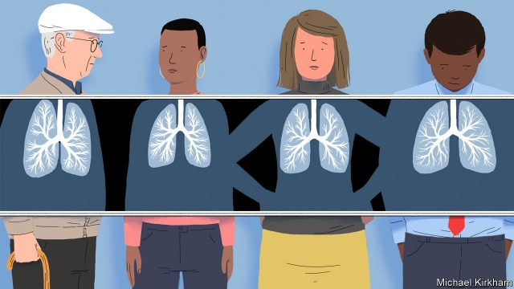
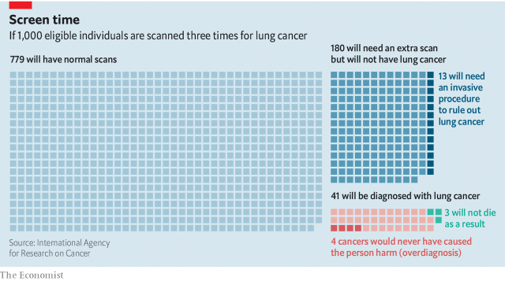

###### Cancer

# Screening for lung cancer is a controversial idea 

##### But the evidence now suggests it can work 

 

> Apr 27th 2019 

IT CAN START with something as trivial as a small cough that will not go away. But often lung cancers cause no symptoms at all until it is too late. Ask Graham Thomas, who in 2014 found that hiding behind his pneumonia was a lung cancer at stage IV of its development. Stage IV is medical jargon for a tumour which has spread to other parts of the body. There is no stage V. 

Mr Thomas now speaks out as part of a campaign by the Roy Castle Lung Cancer Foundation, a charity, to raise awareness about the illness in Britain. He started smoking at 14, and says people think he brought his illness on himself and that it is the cancer least deserving of sympathy. But he argues that perhaps it should not be, because it is the cancer that kills the most. 

One reason lung cancer is so deadly is that at the moment of diagnosis three-quarters of people have, like Mr Thomas, already arrived at stage IV. In Europe the five-year survival rate following diagnosis is around 13%, with little variation between countries. Finding tumours earlier would permit them to be treated before they spread—improving outcomes and reducing medical bills. Yet a lot of places which happily invite people to participate in screening programmes intended to uncover cancers of the breast, bowel, prostate gland and cervix have resisted extending the idea to cancers of the lung. 

The question is whether such screening would do more good than harm. Screening’s history shows the answer is not obvious. In 1985, for example, Japan began a mass-screening programme for neuroblastoma, a rare tumour of the infantile nervous system. The programme unmasked 337 such tumours in its first three years, but two decades later there was no evidence that this had reduced the number of children dying. The effort had mostly picked up slow-growing tumours which were unlikely to have had harmful outcomes. Yet the discovery of these tumours had prompted much unnecessary treatment. 

Prostate-cancer screening is similarly plagued. The current test often raises concern over a possible cancer which turns out not to be there (a false positive). Finding that out, however, involves tests such as biopsies which are invasive, painful and may cause infection. If a group of men aged 55 to 69 is screened regularly for more than a decade, 12% will experience such a false positive and may therefore undergo an unnecessary biopsy. Conversely, prostate-cancer screening misses 15% of men who actually do have cancer (a false negative). 

Moreover, even when prostate screening gets it right, by flagging up a tumour which really is there, that tumour is often one that would not have shortened a patient’s life, because he would have died of other causes before the tumour killed him (overdiagnosis). Yet all men who screening suggests have cancer are offered treatment, and many take it, risking side-effects such as incontinence and impotence. According to Bob Steele, a professor at the University of Dundee who is chairman of the UK National Screening Committee, “You have to treat 30 men to save one from dying.” 

The first evidence that screening for lung cancer might be beneficial, despite these sorts of concerns, came from an American study called the National Lung Screening Trial (NLST), which was conducted between 2002 and 2009. The NLST enrolled about 53,000 people aged between 55 and 74 who had a smoking history of 30 pack-years or more (one pack-year is the equivalent of one packet of cigarettes per day for a year). It tested standard chest x-rays against low-dose computerised tomography (CT)—an enhanced X-ray-based technique. Participants were screened once a year for three years, and appropriate treatment was offered to those whose scans suggested the presence of tumours. At the end of the trial those who had been CT-scanned were 20% less likely than those who had been X-rayed to have died from lung cancer. This was equivalent to three fewer deaths per 1,000 people screened, and also showed up as a decline in all-cause mortality of 7%. 

The NLST established CT scanning as the route to take. As Hilary Robbins of the International Agency for Research on Cancer, part of the World Health Organisation, observes, that trial still raised concerns about false positives because it flagged up 356 people in 1,000 as needing follow-ups. But improvements to the protocol used, which now ignores the smallest anomalies because they are rarely cancerous, have seen false-positive rates halve (see chart)—and the number of people suffering complications has fallen as well. 

 

The latest trial, NELSON, was conducted in Europe. It took ten years and involved four annual scans. Although it has not yet been published formally, its main conclusions were announced last year and were extremely encouraging. 

Two-thirds of cancers found in the experimental arm of the trial were at stage I or II of their growth, and thus eminently treatable. In the trial’s control arm, by contrast, two-thirds were at stage III or IV. Moreover, NELSON had a more nuanced approach to the problem of false positives. If something potentially sinister was seen, the protocol employed was to order a three-month follow-up scan. Only if a growth had expanded in the intervening period was it deemed likely to be cancerous and treated accordingly. Screening, the researchers behind NELSON found, decreased mortality by 26% in men and 61% in women over the course of the study. 

Evidence such as this has convinced some (though by no means all) that screening for lung cancer is worthwhile in some circumstances. And in one part of the world that conviction is being translated into action. There are now plans for more than half a million people in England who are current or former smokers to be offered, over the next four years, the chance to attend a lung-health check at a local clinic. This follows a pilot project in Manchester which screened 2,541 people and found 61 patients with lung cancer—80% of whose cancers were at an early stage. 

There is of course the question of cost, which some say is too high. Economists measure the efficiency of medical technology by how much health is gained for the money spent. The unit of health-gain used is the QALY (quality-adjusted life year, which attempts to factor in a patient’s experience as well as increased life expectancy). By this measure, the study in Manchester was extremely efficient. It cost £10,069 (about $13,000) per QALY—a third of the sum set by the NHS as the maximum for a procedure to be regarded as cost-effective. 

Though some sceptics still argue that money spent on screening would be better deployed trying to stop people smoking—or, better still, preventing them from starting in the first place—the case for screening smokers for lung cancer now seems a good one. There is a wrinkle, though. Focusing screening on smokers will certainly achieve the best outcomes. But that will leave out the one in five sufferers from the illness who have never touched a cigarette in their lives. To be cost-effective, screening needs to be focused on those, like Mr Thomas, who have knowingly put themselves in peril. Everyone else will be excluded from the process. What an irony. 

-- 

 单词注释:

1.APR[]:[计] 替换通路再试器 

2.trivial['tiviәl]:a. 琐碎的, 不重要的, 轻微的, 平常的 

3.graham['ɡreiәm]:a. 全麦的；粗面粉的；全麦粉制成的 

4.thoma[]:n. (Thoma)人名；(阿尔巴、阿拉伯)索玛；(英、德、罗、匈、捷、塞、瑞典)托马 

5.pneumonia[nju:'mәunjә]:n. 肺炎 [医] 肺炎 

6.iv[]:abbr. 输入阀；交互式视讯；自变量（Independent Variable） 

7.jargon['dʒɑ:gәn]:n. 专门术语, 行话, 梦话, 土语 [计] 行话 

8.tumour['tju:mә]:n. 瘤, 肿块 

9.V[vi:]:[计] 溢出, 变量, 向量, 检验, 虚拟, 垂直 [医] 钒(23号元素) 

10.roy[rɔi]:n. 罗伊（男子名） 

11.awareness[ә'weәnis]:n. 意识, 认识 [计] 识别, 议定, 明白 

12.diagnosis[.daiәg'nәusis]:n. 诊断 [计] 诊断 

13.bowel['bauәl]:n. 肠, 内脏, 内部 vt. 挖...的内脏 

14.prostate['prɒsteit]:a. 前列腺的 n. 前列腺 

15.gland[glænd]:n. 腺, 密封套 [化] 衬片; 密封垫 

16.cervix['sә:viks]:n. 器官的颈部, 颈 [医] 颈, 子宫颈 

17.neuroblastoma[,njuәrәblæs'tәumә]:n. [医]成神经细胞瘤 

18.infantile['infәntail]:a. 婴儿的, 幼稚的, 初期的 [医] 婴儿的, 幼稚的 

19.unmask[.ʌn'mɑ:sk]:vi. 脱去假面具 vt. 暴露 

20.plague[pleig]:n. 瘟疫, 天罚, 麻烦, 灾祸 vt. 折磨, 使苦恼, 使得灾祸 

21.biopsy['bai.ɒpsi]:n. 活组织检查 [医] 活组织检查 

22.invasive[in'veisiv]:a. 侵入的, 侵略性的, 攻击性的 

23.infection[in'fekʃәn]:n. 传染, 影响, 传染病 [医] 传染, 感染 

24.shorten['ʃɒ:tn]:vt. 弄短, 缩短, 减少 vi. 缩小, 变短 

25.overdiagnosis[]:[网络] 过度诊断；诊断过滥；诊断过度 

26.incontinence[in'kɒntinәns]:n. 无节制, 荒淫, 失禁 [医] 失禁, 无节制 

27.impotence['impәtәns]:n. 无力, 虚弱, 无效, 阳萎 [医] 阳萎, 无能力 

28.bob[bɒb]:vt. 剪短, 敲击 vi. 振动, 上下跳动 n. 短发, 悬挂的饰品, 浮子, 摆动, 轻敲, 5便士 

29.steele[sti:l]:n. 斯蒂尔（姓氏） 

30.Dundee[dʌn'di:]:敦提[英国苏格兰东部港市](泰赛德区首府) 

31.UK[ju: 'kei]:n. 联合王国 

32.nlst[]:[网络] 肺癌筛查研究；肺癌筛查试验；国家肺癌筛查试验 

33.enrol[in'rәul]:vt. 登记, 使加入 vi. 参军, 注册 

34.computerise[kәm'pju:tәraiz]:vt. （英）用计算机处理；给…装备计算机（等于computerize） 

35.tomography[tә'mɒgrәfi]:n. X线断层摄影术 [医] X线体层照相术, X线断层照相术 

36.participant[pɑ:'tisipәnt]:n. 参加者, 参与者 a. 有份的, 参加的, 参与的 

37.les[lei]:abbr. 发射脱离系统（Launch Escape System） 

38.mortality[mɒ:'tælәti]:n. 必死的命运, 死亡数目, 死亡率 [医] 必死性, 死亡率 

39.CT[]:计算机断层扫描 [计] 通信终端, 计算机终端, 计算机断层造影, 计数器 

40.Hilary['hilәri]:n. 希拉里(m.& f.) , 即Hilarius, Saint 

41.Robbins['rɔbinz]:罗宾斯(①姓氏 ②Frederick Chapman, 1916-, 美国医学家, 曾获1954年诺贝尔生理学-医学奖) 

42.organisation[,ɔ: ^әnaizeiʃən; - ni'z-]:n. 组织, 团体, 体制, 编制 

43.protocol['prәutәkɒl]:n. 草案, 礼仪, 协议 v. 拟定 [计] 协议, 协议列表实用程序 

44.anomaly[ә'nɒmәli]:n. 不规则, 反常事物, 畸形 [医] 异常, 反常 

45.cancerous['kænsәrәs]:a. 癌的, 似癌的, 生癌的 [医] 癌性的 

46.halve[hɑ:v]:vt. 二等分, 对半分享, 把...减半 

47.complication[.kɒmpli'keiʃәn]:n. 复杂化, 复杂情况 [医] 并发症, 并发病 

48.nelson['nelsn]:n. (摔跤用语)肩下握颈 

49.formally['fɒ:mәli]:adv. 正式地, 形式上 

50.ii[]:abbr. 微光（Image Intensification） 

51.eminently[]:adv. 很, 突出地, 非常 

52.treatable[]:a. 好对付的, 能处理的, 能治疗的 

53.iii[]:num. 罗马数字3 

54.nuance[nju:'ɑ:ns]:n. 细微差别 

55.potentially[pә'tenʃәli]:adv. 可能地, 潜在地 

56.sinister['sinistә]:a. 不吉利的, 凶恶的, 左边的 [医] 左的 

57.intervene[.intә'vi:n]:vi. 插入, 调停, 干涉 [经] 进场干预 

58.deem[di:m]:v. 认为, 相信 

59.conviction[kәn'vikʃәn]:n. 定罪, 信服, 坚信 [法] 定罪, 证明有罪, 判罪 

60.Manchester['mæntʃestә]:n. 曼彻斯特 

61.economist[i:'kɒnәmist]:n. 经济学者, 经济家 [经] 经济学家 

62.qaly[]:abbr. quality-adjusted life-year 质量调整寿命年龄 

63.expectancy[ik'spektәnsi]:n. 期待, 期望的事物, 嘱望, 希望, 期望, 预期 [医] 预期 

64.nh[]:abbr. 不吸湿的（nonhygroscopic）；全日空航空公司；美国地名, 新罕布什尔（New Hampshire） 

65.sceptic['skeptik]:n. 怀疑论者 

66.deploy[di'plɒi]:v. 展开, 配置 

67.sufferer['sʌfәrә]:n. 受难者, 被害者, 患者 [法] 受害者, 受难者 

68.knowingly['nәjiŋli]:adv. 会意地, 心照不宣地, 故意地, 有意地, 老练地 [法] 心照不宣地, 故意地, 有意地 

69.peril['peril]:n. 危险, 冒...之险, 险境, 险因 vt. 置...于险境, 冒险, 危及 

70.irony['aiәrәni]:n. 反语, 讽刺, 具有讽刺意味的事 

