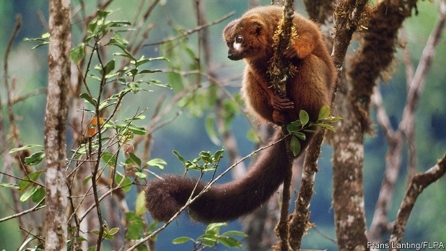

###### Primatology

# Why have some lemurs lost their colour vision? 

##### It helps them see better in the dark 

 

> Apr 27th 2019 

PRIMATES’ TRICHROMATIC colour vision, with its red-, blue- and green-sensitive cone cells in the retina of the eye, is better than that of most mammals, which have to limp along dichromatically. It is thought to have evolved because primates are generally arboreal frugivores, and fruit are often brightly coloured. Some lemurs, however, are exceptions. They do indeed live in trees and consume fruit. But they have only two sorts of cone cell and are therefore unable to distinguish what other primates see as red and green, even though close relatives are trichromatic. That might be expected to make it hard to pick out red fruit, in particular, from a green, leafy background. 

The assumption until now has been that these lemurs have been unlucky and have lost part of their colour vision by chance at some point in the past. But Rachel Jacobs of George Washington University, in America, disagrees. A paper she has published in Behavioral Ecology and Sociology argues that these lemurs’ loss of the ability to see red, as it were, is no accident. 

Colour-blind lemurs all belong to the genus Eulemur, meaning they are closely related. That suggests they descend from a single individual, alive in the fairly recent evolutionary past, in which the pertinent mutation happened. To find out more, Dr Jacobs and her colleagues collected blood from 142 animals belonging to ten species of Eulemur and analysed the DNA of the cells therein to search for this mutation. 

Two of the ten, they found, had no relevant mutation, and presumably retained trichromatic vision. The others were, indeed, mutated in a way that made them dichromatic. But, to their surprise, not all in the same way. Seven of the eight shared one particular mutation. The other, Eulemur rubriventer, had a different one. Colour blindness has thus evolved twice in this group, meaning it is probably no accident. But if it is not an accident, then how does it help a lemur to have what is, on the face of things, a diminution of its visual capability? 

To find out, Dr Jacobs and her colleagues, who were already studying Eulemur rubriventer, spent eight months following nine troops of them through the Madagascan forest. They noted every item of food the animals consumed and used a spectrometer to measure the amount of light each food type reflected. 

The result of this arduous travail was the discovery that Eulemur rubriventer is indeed adept at finding red fruit. The crucial point was that unlike their primate cousins, monkeys and apes, which are mainly diurnal, lemurs come out at night. The advantage of trichromy disappears in darkness, when colours are hard to distinguish. But the spectrometer data showed that fruit still stand out against a leafy background because they reflect more light than leaves do, and therefore look brighter. 

These observations suggest that colour vision ceases to be an advantage at night. But Dr Jacobs goes further. She proposes that full colour vision might actually hinder the animals’ night sight, by interfering with perceptions of brightness. This will require further testing. But, if true, it would be enough for evolution to reverse itself and favour the dichromatic mutations that members of Eulemer now sport. 

-- 

 单词注释:

1.primatology[.praimә'tɒlәdʒi]:n. 灵长目动物学 

2.lemur['li:mә]:n. 狐猴 

3.APR[]:[计] 替换通路再试器 

4.trichromatic[.traikrәu'mætik]:a. 三色的, 用三色的, 三色视的 [医] 三色的; 三色视的 

5.cone[kәun]:n. 圆锥体, 球果 vt. 使成锥形 

6.retina['retinә]:n. 视网膜 [医] 视网膜 

7.mammal[mæmәl]:n. 哺乳动物 [化] 哺乳动物 

8.limp[limp]:n. 跛行 a. 柔软的, 无力的, 软弱的 vi. 跛行 

9.dichromatically[]:[网络] 二重色 

10.primate['praimit]:n. 大主教, 灵长目动物 [医] 灵长类 

11.arboreal[ɑ:'bәuriәl]:a. 树的, 栖于树木的 [医] 树的, 树上生活的 

12.frugivore['fru:dʒivɔ:(r)]:n. (尤指灵长目)食果动物 

13.brightly['braitli]:adv. 生辉地, 明亮地, 鲜明地 

14.trichromatic[.traikrәu'mætik]:a. 三色的, 用三色的, 三色视的 [医] 三色的; 三色视的 

15.leafy['li:fi]:a. 叶茂盛的, 多叶的, 叶状的 

16.rachel['reitʃәl]:n. 雷切尔（女子名） 

17.jacob['dʒeikәb]:n. [圣经]雅各（以色列人的祖先）；雅各布（男子名） 

18.george[dʒɔ:dʒ]:n. 乔治（男子名）；自动操纵装置；英国最高勋爵勋章上的圣乔治诛龙图 

19.Washington['wɒʃiŋtn]:n. 华盛顿 

20.behavioral[bi'heivjәrәl]:a. 行为的 

21.sociology[.sәusi'ɒlәdʒi]:n. 社会学 [医] 社会学 

22.genus['dʒi:nәs]:n. 种, 类 [医] 属(分类) 

23.evolutionary[,i:vә'lu:ʃәnәri]:a. 展开的, 进化论的, 进化的, 发展的 [计] 进化的, 改良的, 发展的 

24.pertinent['pә:tinәnt]:a. 相关的, 中肯的, 切题的 [法] 恰当的, 有关的 

25.mutation[mju:'teiʃәn]:n. 变化, 突变, 元音变化 [化] 突变 

26.specie['spi:ʃi]:n. 硬币 [经] 硬币 

27.DNA[]:脱氧核糖核酸 [计] 无效数据, 数字网络体系结构, 分布式网络体系结构 

28.therein[.ðєәr'in]:adv. 在其中, 在那里, 在那一点上 

29.mutate['mju:teit]:vi. 变化, 产生变异, 变化元音 vt. 使变异 

30.dichromatic[.daikrәu'mætik]:a. 两色的, 两变色性的, 二色视的 [医] 二色性的; 二色视的 

31.blindness['blaindnis]:n. 盲目, 失明, 愚昧 [医] 盲, 视觉缺失 

32.diminution[.dimi'nju:ʃәn]:n. 减少, 缩小, 减低 [医] 减少, 减小 

33.madagascan[ˌmædə'ɡæskən]:a. 马达加斯加的 

34.spectrometer[spek'trɒmitә]:n. 分光计, 谱仪 [化] 分光计; 分光仪 

35.arduous['ɑ:djuәs]:a. 费力的, 努力的, 险峻的 

36.travail['træveil]:n. 分娩的痛苦, 阵痛, 辛劳 vi. 发生阵痛, 辛劳 

37.adept[ә'dept]:a. 熟练的, 老练的, 巧妙的 n. 能手, 内行 

38.ape[eip]:n. 无尾猿 [计] 应用程序评价 

39.diurnal[dai'ә:nl]:a. 每日的, 一日间的, 白天的 [医] 昼现的(丝虫), 昼间的 

40.datum['deitәm]:n. 论据, 材料, 资料, 已知数 [医] 材料, 资料, 论据 

41.hinder['hindә]:a. 后面的 v. 阻碍, 打扰 

42.perception[pә'sepʃәn]:n. 知觉, 感觉, 领悟力, 获取 [医] 知觉 

43.brightness['braitnis]:n. 光亮, 明亮, 聪明 [计] 亮度 

