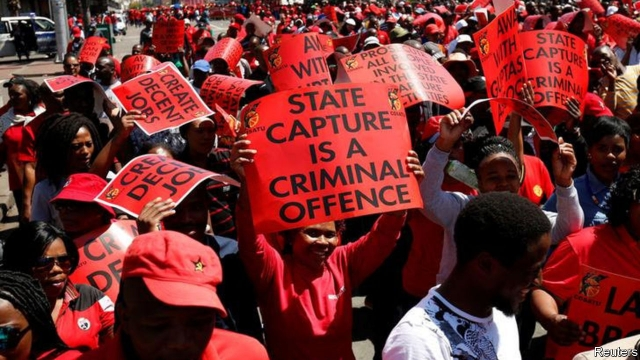

###### Corruption

# A decade of “state capture” has damaged South Africa’s institutions 

##### Cyril Ramaphosa must reverse much of what Jacob Zuma did 

 

> Apr 25th 2019 

AT A COFFEE shop on the outskirts of Pretoria, South Africa’s capital, an official from the Special Investigating Unit (SIU) walks in, checks whether he recognises anyone, sits down, and emits a long sigh. Last year he was appointed by President Ramaphosa to be one of his men inside the key criminal-justice institution, tasked with investigating serious cases of graft. What he found has shocked him. “I’m in the lion’s den,” he says, insisting on anonymity. “This country will take a long time to fix.” 

Corruption in South Africa did not suddenly spring up in the Zuma era. Under apartheid there were networks of graft among the armed forces, businessmen and the ruling National Party. After the ANC won the election in 1994 it deployed its cadres throughout national and local government as part of a web of patronage. A corrupt arms deal finalised by South Africa in 1999, for which Mr Zuma still faces more than 700 criminal charges, is only the most high-profile case of dirty business from that era. 

But it was Mr Zuma’s tenure that gave rise to “state capture”. The term, popularised by Thuli Madonsela, the former public protector, or legal ombudsman, refers to the wholesale takeover of public institutions by associates of the former president, often facilitated by shameless international firms. Estimated costs of the plundering amount to hundreds of billions of rand. Among those accused of being the worst offenders were the Gupta brothers, three Indian-born businessmen who were Mr Zuma’s patrons, and whose alliance with the former president’s allies led to a popular moniker, the “Zuptas”. They have denied wrongdoing. 

The damage to South Africa’s international reputation has been equally grave. In 1996 Transparency International, a watchdog, rated it the least corrupt country of those it investigated in Africa. Today it is assessed as more corrupt than poorer states such as Rwanda, Namibia and Senegal. Last year five Western embassies wrote a memorandum warning that, unless Mr Ramaphosa rooted out corruption, his efforts to attract investment would falter. 

Fortunately for South Africa some of its institutions remained strong. Dogged investigative journalists from outlets such as amaBhungane and the Daily Maverick exposed scandals. So, too, did brave whistleblowers and opposition politicians, especially those from the Democratic Alliance (DA). Prosecutors such as Ms Madonsela pursued their cases with bravery and vigour. Without these, South Africa would have been in a far worse state. 

Not that it is in great shape now. Few state-owned enterprises (SOEs) or public departments escaped capture. Whether it was Transnet, a state-owned transport company, or South African Airways, the “Zuptas” have been accused of trying to take it over. But the case of Eskom, which provides 95% of the country’s electricity, shows how deep the rot went—and how hard it will be for the Ramaphosa government to clean up. “Eskom is our story,” says William Gumede of the University of Witwatersrand. 

By the time Mr Zuma became president Eskom was already struggling. In 1994 its total capacity was 36,000MW, more than that of South Korea, which had 29,000MW. In that year most black people did not have electricity in their homes, so it would have been logical to expect a surge in demand. But poor planning and mismanagement meant that by 2014, Eskom’s capacity had crept up to just 44,000MW, whereas South Koreans had 85,000MW. 

Worse was to follow. Of all the SOEs Eskom was particularly “ripe for looting”, notes Stephan Hofstatter in his book on the utility published in 2018. It spends 140bn rand ($10bn) per year on operating expenses, including 50bn rand on coal to fuel its power stations. That is a lot of cash for dodgy deals and kickbacks. 

In perhaps the most infamous case of the state-capture era, Eskom’s boss allegedly joined with senior political figures to squeeze Glencore, a commodities firm, into selling a coal mine to an investment company owned by one of Mr Zuma’s sons and the Gupta brothers. To facilitate the deal Eskom reportedly agreed to buy what turned out to be poor-quality coal from the new owners at an above-market rate—and paid them upfront so that they had the money to buy Glencore’s assets in the first place. 

Last year Mr Ramaphosa overhauled Eskom’s board. He appointed a new boss and brought back Pravin Gordhan, a former finance minister, to run the department in charge of SOEs. He then said the utility would be broken up to improve its performance. 

Yet there is little sign of improvement. In the first months of 2019 South Africans have faced regular blackouts as part of a policy of “load-shedding”. Eskom is also putting extra pressure on the country’s strained public finances. It has roughly 420bn rand in debt, most of which is covered by state guarantees equivalent to 5% of GDP. In February, the treasury announced it would give Eskom a 69bn rand bailout so it could afford the debt payments. “Eskom is the biggest threat to the South African economy,” says Anton Eberhard, chair of the president’s advisory panel on the utility. 

Though South Africa’s SOEs remain in trouble, Mr Ramaphosa has made progress repairing the institutions designed to curb wrongdoing. In December he appointed Shamila Batohi, a respected lawyer, to head the National Prosecuting Authority (NPA). That followed appointments of several new policemen to senior jobs in the South African Police Service. He has replaced Tom Moyane, who as head of the South African Revenue Service (SARS), allegedly tried to stop staff from making well-connected criminals pay tax. And in February the president pledged to reform the intelligence services, which Mr Zuma corrupted, and announced that the SIU would “fast track” the requisition of stolen assets. 

These steps are indicative of Mr Ramaphosa’s way of working. Rather than push for arrests he has adhered to due process, while incrementally trying to place sound people in charge of institutions. That is probably wise, for now. But if elected in May he will come under increasing public pressure to ensure that those guilty of state capture are prosecuted, including those in his own party. 

Such pressure is growing because of another tactic of Mr Ramaphosa’s: the reliance on inquiries to expose wrongdoing. These include inquiries into SARS, the Public Investment Corporation and the NPA. But the most wide-ranging is the Judicial Commission of Inquiry into Allegations of State Capture, otherwise known as the Zondo commission, after its presiding judge, Raymond Zondo. 

It has offered jaw-dropping testimony. At multiple hearings in January and March, Angelo Agrizzi, the former chief operating officer of Bosasa, a logistics company, detailed how the firm won tenders. He said it would give 75m rand every year in bribes to ANC politicians and affiliated officials. In one alleged case cash was stuffed inside a Louis Vuitton handbag and given to an ally of Mr Zuma’s. Nomvula Mokonyane, the environment minister, was said to have received Christmas hampers, help with the cost of relatives’ funerals, and cars for her daughter. When the daughter kept crashing the cars Mr Agrizzi said he would pay for driving lessons. 

The Zondo commission has also helped uncover that Bosasa paid Mr Ramaphosa’s son, Andile, 2m rand for “advisory” work, and its boss gave 500,000 rand to the president’s ANC campaign. Mr Ramaphosa has told allies that there are to be no “holy cows” in dealing with corruption. That commitment may soon be tested. 

Ferial Haffajee, one of the many South African journalists to have helped chronicle state capture, describes the Zondo commission as a second Truth and Reconciliation Commission, in reference to the hearings in the 1990s that shed light on abuses committed under apartheid. Today the truth is again slowly coming out. Reconciliation will take longer, not least since so much of the corruption has been the work of the ruling party. 

-- 

 单词注释:

1.corruption[kә'rʌpʃәn]:n. 腐败, 堕落, 贪污 [计] 论误 

2.cyril['siril]:n. 西里尔（男子名） 

3.ramaphosa[]:[网络] 拉马福萨；拉马弗萨 

4.jacob['dʒeikәb]:n. [圣经]雅各（以色列人的祖先）；雅各布（男子名） 

5.zuma[]: 祖玛 

6.APR[]:[计] 替换通路再试器 

7.pretoria[pri'tɔ:riә]:n. 比勒陀利亚[南非（阿扎尼亚）首都] 

8.siu[]:abbr. 国际海员工会（Seafarers' International Union）；系统接口单元（System Interface Unit） 

9.graft[grɑ:ft]:n. 嫁接, 贪污 v. 嫁接, 移植, 贪污 

10.den[den]:n. 兽穴, 洞穴 [法] 匪巢, 贼窝 

11.anonymity[.ænә'nimiti]:n. 匿名, 姓氏不明 [计] 匿名信件 

12.apartheid[ә'pɑ:theit]:n. 种族隔离 

13.anc[]:abbr. 非洲民族会议（African National Council）；美国新闻社（American News Company）；（美国）大气氮公司（Atmospheric Nitrogen Corporation）；自动噪声消除器（Automatic Noise Canceller） 

14.deploy[di'plɒi]:v. 展开, 配置 

15.cadre['kædri.'kɑ:dә]:n. 框架, 干部 [经] 干部 

16.patronage['pætrәnidʒ]:n. 赞助, 恩赐态度, 光顾, 任免权, 保护人的身分 [经] 光顾, 资助, 赞助 

17.finalise[]:vt. 把(计划)最后定下来, 定稿 [经] 使...结束 

18.tenure['tenjuә]:n. 享有, 保有期 [经] (财产,职位等的)占有, 占有权 

19.popularise['pɔpjjlәraiz]:vt.vi. 使通俗化, 使受欢迎, 使大众化, 使普及, 宣传, 推广 

20.protector[prә'tektә]:n. 保护者, 保护物, 保护装置 [医] [催化]保护质, 保护器 

21.ombudsman['ɒmbudzmæn]:n. (专查官员舞弊的)调查官 [法] 调查专员, 监察专员, 司法专员 

22.wholesale['hәulseil]:n. 批发 a. 批发的, 大规模的 adv. 大规模, 照批发方式 vi. 经营批发业, 批发 vt. 批发 

23.takeover[]:n. 接管, 接收 [经] 接收 

24.facilitate[fә'siliteit]:vt. 使容易, 促进, 帮助 [法] 使容易, 使便利, 推进 

25.shameless['ʃeimlis]:a. 不知羞耻的 

26.plunder['plʌndә]:n. 抢夺, 掠夺品, 战利品 v. 掠夺, 抢劫, 抢夺 

27.rand[rænd]:n. 兰特, (非正式)边, 田埂, 缘 [经] 兰特 

28.offender[ә'fendә]:n. 罪犯, 无礼的人, 得罪人的人 

29.Gupta[]:n. (Gupta)人名；(德、意、印、孟、尼)古普塔 笈多 

30.patron['peitrәn]:n. 赞助人, 顾客, 保护人 [法] 保护人, 庇护人, 赞助人 

31.alliance[ә'laiәns]:n. 联盟, 联合 [法] 同盟, 联盟, 联姻 

32.ally['ælai. ә'lai]:n. 同盟者, 同盟国, 助手 vt. 使联盟, 使联合, 使有关系 vi. 结盟 

33.moniker['mɔnikә(r)]:n. 名字, 绰号 

34.wrongdoing['rɒŋ'du:iŋ]:n. 干坏事, 坏事 

35.equally['i:kwәli]:adv. 相等地, 同样地, 平等地 

36.transparency[træns'pærәnsi]:n. 透明, 透明度, 透过性, 透明物, 清晰 [计] 透明性; 透明 

37.watchdog['wɒtʃdɒg]:n. 看门狗, 监察人 [化] 监控设备; 监视器 

38.rwanda[rj'ændә]:n. 卢旺达（东非国家）；卢旺达语 

39.Namibia[nә'mi:biә]:n. 纳米比亚 

40.Senegal[,seni'^ɔ:l]:n. 塞内加尔 

41.memorandum[.memә'rændәm]:n. 备忘录, 外交备忘录, 交易备忘录 [经] 备忘录, 便笺, 便函 

42.corruption[kә'rʌpʃәn]:n. 腐败, 堕落, 贪污 [计] 论误 

43.falter['fɒ:ltә]:vt. 支吾地说 vi. 支吾, 蹒跚地走 n. 颤抖, 支吾, 踌躇 

44.investigative[in'vestigeitiv]:a. 审查的, 调查的, 好研究的 [法] 调查的, 审查的, 受调查研究的 

45.maverick['mævәrik]:n. 未烙饲主印记的小牛, 持不同意见的人 vi. 迷路 

46.whistleblower['wɪsəlˌbləʊə]: <美俚>告密者, 揭发者 

47.opposition[.ɒpә'ziʃәn]:n. 反对, 敌对, 相反, 在野党 [医] 对生, 对向, 反抗, 反对症 

48.alliance[ә'laiәns]:n. 联盟, 联合 [法] 同盟, 联盟, 联姻 

49.DA[,di:'ei]:美国地方检察官 [计] 数据采集, 数据管理员, 数据分析, 设计自动化 

50.prosecutor['prɒsikju:tә]:n. 实行者, 告发者, 公诉人 [法] 原告, 起诉人, 检举人 

51.vigour['vigә]:n. 精力, 活力, 力量, 效力, 气势 

52.transnet[]:[网络] 南非运输公司；南非运输集团；南非国家港务局 

53.airway['єәwei]:n. 空中航线, 风道 [医] 导气管 

54.eskom[]:[网络] 南非电力公司；南非国家电力公司；斯康 

55.william['wiljәm]:n. 威廉（男子名）；[常作W-][美俚]钞票, 纸币 

56.gumede[]:[网络] 古米德 

57.Witwatersrand[wit'wɔ:tәz,rænd, vәt'vɑ:tәs,rɑ:nt]:威特沃特斯兰德 

58.Korea[kә'riә]:n. 朝鲜, 韩国 

59.surge[sә:dʒ]:n. 巨涌, 汹涌, 澎湃 vi. 汹涌, 澎湃, 颠簸, 猛冲, 突然放松 vt. 使汹涌奔腾, 急放 [计] 电压尖峰 

60.mismanagement[]:n. 管理不善；处置失当 

61.Korean[kә'riәn]:n. 朝鲜人, 朝鲜语 a. 朝鲜人的, 朝鲜语的 

62.loot[lu:t]:n. 赃物, 洗劫, 抢夺 v. 洗劫, 抢夺 

63.Stephan[]:n. 斯蒂芬（男子名） 

64.hofstatter[]:[网络] 霍夫斯达特 

65.dodgy['dɒdʒi]:a. 狡猾的, 逃避的, 难弄的 

66.kickback['kikbæk]:n. 回答, 反扑, 退还 [电] 蹴后 

67.allegedly[ә'ledʒidli]:adv. 依其申述 

68.Glencore[]:[网络] 嘉能可；交易商嘉能可；嘉能可公司 

69.commodity[kә'mɒditi]:n. 农产品, 商品, 有用的物品 [经] 商品, 货物, 日用品 

70.reportedly[ri'pɒ:tidli]:adv. 根据传说, 根据传闻, 据报道 

71.upfront[ˌʌpˈfrʌnt]:a. 正直的, 坦率的; 最前面的, 首要的; 在前面的; 预先的 adv. 在最前面; 提前支付（工资） 

72.asset['æset]:n. 资产, 有益的东西 

73.overhaul[.әuvә'hɒ:l]:vt. 分解检查, 翻修, 精细检查, 彻底革新 n. 分解检查, 精细检查, 大检修 

74.pravin[]:[网络] 准备 

75.Gordhan[]:[网络] 南非财政部长郭德翰 

76.blackout['blækaut]:n. 灯火管制, 暂时的意识丧失, 灯火熄灭, 删除 [计] 电网掉电 

77.treasury['treʒәri]:n. 国库, 宝库, 财政部, 国库券 [经] 库存, 国库, 金库 

78.bailout['beilaut]:跳伞 

79.anton['æntәn]:n. 安东（男子名） 

80.Eberhard[]:埃伯哈德（人名、品牌名） 

81.advisory[әd'vaizәri]:a. 顾问的, 咨询的, 劝告的 [法] 劝告的, 忠告的, 咨询的 

82.curb[kә:b]:n. 抑制, 勒马绳, 边石 vt. 抑制, 束缚, 勒住 

83.shamila[]:[网络] 沙米拉 

84.prosecute['prɒsikju:t]:vt. 告发, 起诉, 彻底进行, 执行, 从事 vi. 告发, 起诉, 作检察官 

85.npa[]:abbr. Newspaper Publishers' Association <英>报纸出版商协会 

86.tom[tɒm]:n. 雄性动物, 雄猫 

87.sars[]:非典型肺炎（Severe Acute Respiratory Syndromes） 

88.pledge[pledʒ]:n. 诺言, 保证, 誓言, 抵押, 信物, 保人, 祝愿 vt. 许诺, 保证, 使发誓, 抵押, 典当, 举杯祝...健康 

89.requisition[.rekwi'ziʃәn]:n. 正式请求, 申请, 需要, 征用, 通知单, 申请书, 引渡要求 vt. 征用, 要求 

90.indicative[in'dikәtiv]:a. 指示的, 象征的, 表示...的 [经] 指标的 

91.incrementally[,inkri'məntəli]:adv. 逐渐地 

92.tactic['tæktik]:n. 一项战术, 一条策略 a. 战术的, 顺序的, 排列的 

93.judicial[dʒu:'diʃәl]:a. 法庭的, 公正的, 审判上的, 司法的 [法] 司法的, 审判上的, 法官的 

94.allegation[.æli'geiʃәn]:n. 断言, 主张, 申辩 [法] 声明, 事实陈述, 断言 

95.preside[pri'zaid]:vi. 统辖, 当主人, 主持 [法] 主持, 负责, 指挥 

96.raymond['reimɔnd]:n. 雷蒙德（男子名） 

97.testimony['testimәni]:n. 证言, 证据, 声明 [医] 证据 

98.angelo['ændʒilәu]:n. 安吉洛（男子名） 

99.logistic[lәu'dʒistik]:a. 逻辑的, 后勤学的 

100.bribe[braib]:n. 贿赂 vt. 贿赂, 收买 vi. 行贿 

101.affiliate[ә'filieit]:vt. 使紧密联系, 使附属, 接纳, 收养 vi. 发生联系, 参加 

102.allege[ә'ledʒ]:vt. 宣称, 主张, 提出, 断言 [法] 断言, 指称, 指证 

103.louis['lu(:)i, 'lu(:)is]:n. 路易斯（男子名） 

104.vuitton[]:n. 威登（法国一时尚品牌） 

105.hamper['hæpә]:n. 食篮, 阻碍物, 食盒 vt. 阻碍, 使困累, 妨碍, 牵制 

106.ferial['fiәriәl]:a. 平日的 

107.haffajee[]:[网络] 哈菲耶 

108.chronicle['krɒnikl]:n. 年代记, 记录, 编年史 vt. 把...载入编年史 

109.reconciliation[,rekәnsili'eiʃәn]:n. 和解, 和好, 复交, 调解, 调停, 和谐, 一致, 甘愿, 顺从 [经] (银行往来)调节, 调和, 一致 

