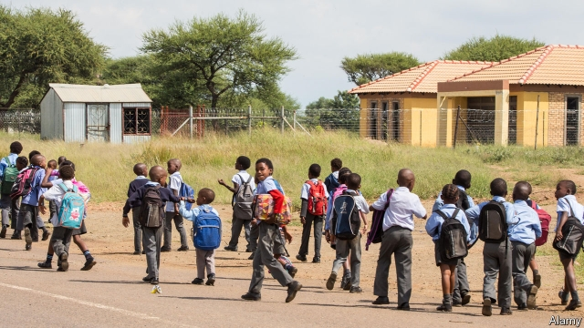
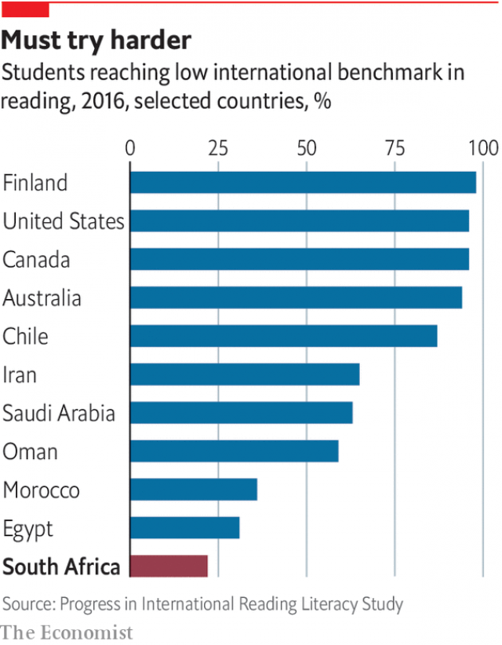

###### Education

# A lousy education system wastes the potential of South Africa’s younger generation 

##### The government is hostage to the biggest teaching union 

 

> Apr 25th 2019 

WHEN YOUR correspondent arrives at Hlabizulu primary school, near the town of Willowvale in the Eastern Cape, there is the familiar sound of children playing, but it is not break time. The pupils have been left to their own devices. In one classroom they have been padlocked inside. “What can we do?” asks one of the staff. “They’re locked in because they have no teachers.” Just three of the seven teaching staff have turned up for work. 

Locking up children may be unusual but a similar lack of learning occurs on a daily basis in South African schools. For even when teachers show up they often do not teach pupils anything. “There is very little education taking place here,” sighs Mkhuseli Ngcube of Public School Partnerships, an NGO trying to change that. 

Education both reflects and entrenches the inequalities in South African society. The top 200 high schools in the country produce more distinction marks in maths and science exams than the other 6,476 high schools put together. Meanwhile in 47% of high schools not a single pupil meets a commonly accepted international standard for maths. The equivalent figure in Botswana is just 2%. These schools could be called “cognitive wastelands”, says Nic Spaull of Stellenbosch University. 

Apartheid still casts a shadow over education. Non-whites were deliberately given poor schooling, lest they get uppity or, worse, skilled. In 1994 per-pupil spending was 1.5 to 5 times higher for white pupils, depending on the location of the school. Hendrik Verwoerd, the architect of apartheid, said blacks should be educated enough only to be “hewers of wood and drawers of water”. 

The legacy of this racism is starkly apparent in the villages around Willowvale. Most pupils’ parents have left to seek work in nearby cities such as East London. They leave their children with grandparents, most of whom are illiterate. 

After 1994 the ANC opted for a compromise on education policy. Formerly white-only schools would have to accept children from all races, but they could still charge fees. In theory they cannot exclude any pupil for being too poor, but in practice, poor children do not live near these schools, and the costs of transport, uniforms, sports and trips make them prohibitively expensive. 

As in other areas of South African life the effect of post-apartheid policy has been to replace a system directly based on race with one based on wealth (and thus, still indirectly racially skewed). More than 180 of the top 200 schools took only white pupils under apartheid. Today non-whites make up 60% of the pupils across all fee-charging schools, but they are overwhelmingly from the country’s elites. 

Since 1994 there has been some progress. There is no basis to the notion that education is worse than under apartheid, notes Mr Spaull. Piecing together evidence from various test data, he reckons children today are roughly two years ahead of where they would have been before 1994. Yet in recent years progress is “stalling”, he says. South Africa ranks bottom or near-bottom when countries are ranked by their pupils’ scores in comparable international tests. Nearly 80% of children in grade four (9- or 10-year-olds) cannot read and understand sentences in any language; 61% of pupils a year older cannot add or subtract whole numbers. 

Small wonder then that, of the 100 pupils who begin a school year, just 50-60 can be expected to take the end-of-school "matriculation" exam, with 40-50 passing, and only six going on to complete university. All of this has a big impact on a labour market that offers a premium for skilled labour. The jobless rate for people with a high-school certificate (28%) is more than quadruple that for university graduates. 

The quality of teaching is a major obstacle to better education. Nearly four in five maths teachers cannot do the sums expected of their 12- or 13-year-old pupils. Many of these teachers were themselves educated under apartheid. Nevertheless the lack of accountability for poor performance has been the responsibility of ANC governments. It is all but impossible to fire a teacher in South Africa. Even when school leaders are suspected of sexual harassment of pupils they are more likely to be moved to a different school than prosecuted. 

 

The problems of South African schools are not for a lack of money. Public spending on education is more than 6% of GDP, a higher share than the average in the OECD club of mostly rich countries. Spending is also higher than in other African countries with better results, such as Kenya. The tolerance of failure, as well as the relatively lavish spending on salaries, is largely a result of the power of teaching unions. The South African Democratic Teachers Union (SADTU) is one of the largest unions in the Congress of South African Trade Unions, the federation that forms part of the “tripartite alliance” with the ANC, along with the South African Communist Party. SADTU’s political influence means it can get away with stunning levels of mediocrity and corruption. 

Its shamefulness was outlined in a report for the government in 2016. Written by John Volmink, it documented widespread fraud and corruption in the school system, such as the sale of jobs for cash or cows. It also found that SADTU was in “de facto control” of the education departments in six of the nine provinces in the country, concluding that “it is not improbable to say that schooling throughout South Africa is run by SADTU”. 

Those who can afford to extricate their children from this mess are doing so. Low-cost private schools are increasingly popular. Parents are showing similar preferences for the private over the public as they do in other sectors. In 1997 the number of private security guards and policemen was the same. Today there are three times more private guards than police. No one who can afford private health care relies on the public system. 

Yet, given the state of the South African economy, there is a limit to the number of people who can afford to go private. The future of the poorest pupils depends on government policy. Mr Ramaphosa has made some promising suggestions, for example saying that he will embrace an intensive evidence-based reading programme championed by Mr Spaull. That would be a great start. But ultimately a better education system requires the president to take on the unions. Only then will teachers spend more time teaching children than looking out for their own interests. 

-- 

 单词注释:

1.lousy['lauzi]:a. 污秽的, 恶心的, 生虱的 

2.hostage['hɒstidʒ]:n. 人质, 抵押品 [经] 人质, 抵押品 

3.APR[]:[计] 替换通路再试器 

4.Willowvale[]:[地名] 威洛韦尔 ( 南非 ) 

5.cape[keip]:n. 岬, 海角, 披肩, 斗蓬 

6.padlock['pædlɒk]:n. 挂锁, 关闭, 禁止进入 

7.partnership['pɑ:tnәʃip]:n. 合伙, 合股, 合作关系 [经] 合伙(合作)关系, 全体合伙人 

8.ngo[]:abbr. 民间组织；非政府组织（Non-Governmental Organization） 

9.entrench[in'trentʃ]:vt. 围以壕沟, 防护, 保卫, 使处于牢固地位 vi. 掘壕, 侵犯 

10.inequality[.ini'kwɒliti]:n. 不平等, 不同, 不平坦, 不平均 n. 不平等, 不等式 [计] 不等式 

11.botswana[bɔt'swɑ:nә]:n. 博茨瓦纳（非洲中南部国家） 

12.cognitive['kɒgnitiv]:a. 认知的, 认识的 

13.wasteland['weistlænd]:n. 荒地, 未开垦地 

14.NIC[nik]:[计] 网络接口卡, 网络信息中心 

15.stellenbosch['stelәnbɒʃ]:vt. 调离要职, 调任闲职 

16.apartheid[ә'pɑ:theit]:n. 种族隔离 

17.uppity['ʌpiti]:a. 自负的, 傲慢的,不易控制的 

18.Hendrik[]:n. (Hendrik)人名；(法)昂德里克 

19.verwoerd[]:费武尔德 

20.apartheid[ә'pɑ:theit]:n. 种族隔离 

21.hewer['hju:ә]:n. 砍伐者, 煤矿工 

22.legacy['legәsi]:n. 祖先传下来之物, 遗赠物 [经] 遗产, 遗赠物 

23.racism['reisizm]:n. 种族主义, 种族偏见 [法] 种族主义, 种族歧视, 种族歧视主张 

24.starkly[]:adv. 完全, 分明地, 赤裸裸地 

25.illiterate[i'litәrәt]:n. 文盲 a. 目不识丁的, 没受教育的 

26.anc[]:abbr. 非洲民族会议（African National Council）；美国新闻社（American News Company）；（美国）大气氮公司（Atmospheric Nitrogen Corporation）；自动噪声消除器（Automatic Noise Canceller） 

27.opt[ɒpt]:vi. 选择 

28.formerly['fɒ:mәli]:adv. 从前, 以前 

29.cannot['kænɒt]:aux. 无法, 不能 

30.prohibitively[]:adv. 禁止, 起阻止作用, 抑制 

31.indirectly[]:adv. 间接, 曲折, 迂回, 不直截了当, 不诚实, 不坦率 [计] 间接地 

32.racially['reiʃәli]:adv. 按人种, 人种上 

33.skew[skju:]:a. 斜的, 歪的 n. 歪斜, 偏态家庭关系 vi. 歪斜, 侧转 vt. 使歪斜, 曲解 [计] 扭斜; 歪斜; 偏斜 

34.overwhelmingly[.әuvә'hwelmiŋli]:adv. 压倒性地, 不可抵抗地 

35.elite[ei'li:t]:n. 精华, 精锐, 中坚分子 

36.datum['deitәm]:n. 论据, 材料, 资料, 已知数 [医] 材料, 资料, 论据 

37.reckon['rekәn]:vt. 计算, 总计, 估计, 认为, 猜想 vi. 数, 计算, 估计, 依赖, 料想 

38.stall[stɒ:l]:n. 厩, 停车处, 牧师职位, 货摊, 托辞, 拖延 vt. 关入厩, 停顿, 推托, 支吾, 使陷于泥中 vi. 被关在厩内, 陷于泥中, 停止, 支吾 

39.premium['pri:miәm]:n. 额外补贴, 奖金, 奖赏, 保险费 [医] 保险费 

40.jobless['dʒɔblis]:a. 失职的, 无职业的 [经] 失业的 

41.quadruple['kwɒdrupl]:a. 四倍的, 四重的, 四部分组成的 n. 四倍 vt. 使成四倍 vi. 成为四倍 

42.accountability[ә.kauntә'biliti]:n. 负有责任, 可说明性 [化] 衡算计量 

43.harassment['hærәsmәnt]:n. 困扰, 烦扰, 烦恼 [法] 折磨, 骚扰, 侵扰 

44.prosecute['prɒsikju:t]:vt. 告发, 起诉, 彻底进行, 执行, 从事 vi. 告发, 起诉, 作检察官 

45.Oecd[]:[经] 已开发国家组织 

46.Kenya['kenjә]:n. 肯尼亚 

47.lavish['læviʃ]:a. 大方的, 丰富的, 浪费的 vt. 浪费, 滥用, 慷慨给予 

48.federation[fedә'reiʃәn]:n. 联邦, 联合, 联盟 [法] 联邦, 联盟, 联邦政府 

49.tripartite[.trai'pɑ:tait]:a. 三重的, 分成三部分的 

50.alliance[ә'laiәns]:n. 联盟, 联合 [法] 同盟, 联盟, 联姻 

51.stunning['stʌniŋ]:a. 打昏迷的, 弄得人昏头昏脑的, 令人震惊的 

52.mediocrity[.mi:di'ɒkriti]:n. 平常, 平庸之才 

53.corruption[kә'rʌpʃәn]:n. 腐败, 堕落, 贪污 [计] 论误 

54.shamefulness[ˊʃeimfulnis]:n. 可耻;不名誉 

55.john[dʒɔn]:n. 盥洗室, 厕所, 嫖客 

56.fraud[frɒ:d]:n. 欺骗, 欺诈, 诡计, 骗子 [经] 欺诈, 舞弊, 骗子 

57.de[di:]:[化] 非对映体过量 [医] 铥(69号元素铥的别名,1916年Eder离得的假想元素) 

58.facto[]:[法] 实际上, 事实上 

59.improbable[im'prɒbәbl]:a. 不大可能的, 不象发生的, 荒谬可笑的 [法] 未必会的, 不大可能发生的, 未必确实的 

60.extricate['ekstrikeit]:vt. 使解脱, 救出 

61.sector['sektә]:n. 扇形, 部门, 部分, 函数尺, 象限仪, 段, 区段 vt. 把...分成扇形 [计] 扇面; 扇区; 段; 区段 

62.ramaphosa[]:[网络] 拉马福萨；拉马弗萨 

