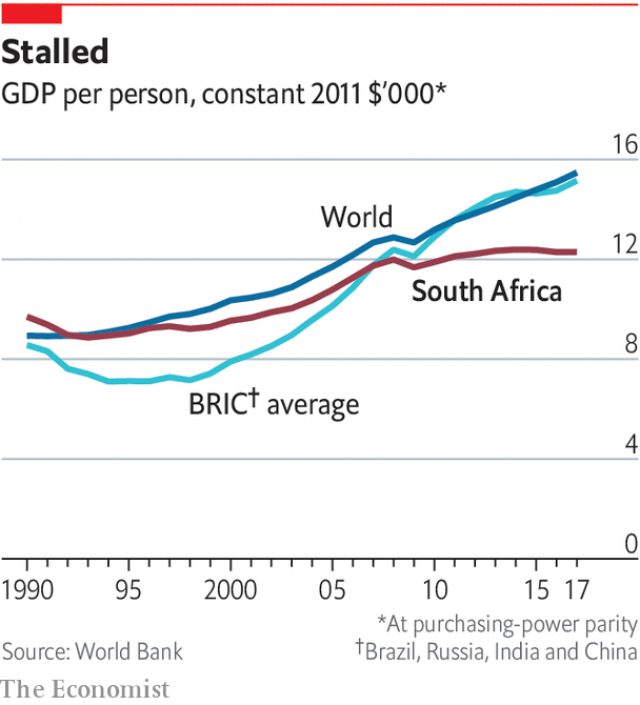

###### South Africa

# Cyril Ramaphosa faces a daunting task if he wins the South African election on May 8th 

##### He has brought the country back from the brink, but it is still teetering 

 

> Apr 25th 2019 

ON A SATURDAY evening in Soweto there are few better places than Chaf Pozi. Beers are flowing, meat is grilling and patrons are dancing with a sense of rhythm and abandon that is alien to a journalist from The Economist. It is an exhilarating spectacle. It is also a revealing one, for it hints at progress made by South Africa in the 25 years since the end of apartheid, the brutal system of white rule formally established in 1948. At the restaurant in the Johannesburg township, patrons paying upwards of 140 rand ($10) for a meal are mostly from the black middle class, which has grown since 1994. They mix easily with a smattering of white revellers. 

The world pays less attention to South Africa than it did a generation ago. Nelson Mandela’s release from prison in 1990, and his victory in the country’s first democratic elections four years later, captured the global imagination. Though interest has waned, the country, which goes to the polls on May 8th, still matters. Partly this is for material reasons. South Africa is the most industrialised economy in Africa, the continent’s business hub and its most influential actor on the global stage. Yet just as important is its symbolism. If it were to overcome its history of repression and racism, that would offer hope to all countries, in Africa and beyond. 

And South Africa is a better place to live than in 1994. A liberal constitution protects the rights of all citizens, no matter their race. The poor have more of their basic needs met. The share of households without electricity fell from 42% in 1996 to 10% in 2016, while the fraction going hungry has plummeted. Blacks make up 50% of the country’s middle class, according to recent research. This is much lower than their overall share of the population (80%) but it is a sign of uneven progress. Black South Africans now account for more sales of suburban homes than whites do. 

Most South Africans believe that race relations are better today than they were in 1994. A survey published in 2016 by the Institute of Race Relations (IRR), a think-tank, found that 54% of respondents felt relations were better than a generation ago, with 22% saying they had stayed the same, and 20% believing they had worsened. According to the same study, just 5% of South Africans said “racism” was the biggest issue facing the country. 

There are other signs of tensions easing. The vast majority of parents say they do not care about the race of their children’s teachers. Interracial marriage remains rare, but has risen from 1 in 303 in 1996 to 1 in 95 by 2011. Popular culture reflects some of these shifts. In “The Bachelor”, a popular television show, a white South African man chooses a partner from 24 women of all races. He is not put off by the prospect of paying lobola, or bride price, if necessary. (What this says about gender relations is less clear.) Though racial animosity endures, everyday interactions in schools, universities, and the workplace, as well as the passing of generations, is slowly making things better. 

That is the good news. The bad news is that most of the progress made since 1994 came before 2009. It was then that Jacob Zuma began his nine-year reign as president, during which time the thuggish kleptocrat and his cronies ransacked state-owned enterprises (SOEs), plundered local and provincial governments, and ravaged the law-enforcement institutions set up to curb such looting. The corruption of the ruling African National Congress (ANC) predated Mr Zuma, and is outlasting him, but it was the former president who took venality to stratospheric levels. 

 

The Zuma administration also ran the economy into the ground while ramping up public spending. The ratio of debt to GDP rose from 26% in 2008-9 to 56% in 2018-19. GDP per person is lower than it was in 2013. Analysis by Standard Bank suggests that, relative to the trajectory the country was on before Mr Zuma became president, his regime lost South Africa 1.1trn rand ($78bn) in GDP, 300bn rand in taxes, and more than 1m jobs. 

The damage of the Zuma years extends beyond the economy. In a deeply unequal society with a violent past, a sense of mutual obligation is especially important. Yet, though South Africa has some of the largest mineral reserves on the planet, the commodity it needs most—trust—is in short supply. 

Data seem to support this. In February the Edelman Trust barometer, an annual poll by the eponymous public relations firm, found that just 21% of South Africans trust their government, the lowest share among the 26 countries it surveys. Research by Afrobarometer published last year found low levels of trust in institutions such as the police, which is distrusted by nearly two-thirds of the populace. A separate report in October by the same pan-African research organisation discovered that 62% of South Africans would be willing to trade democracy for an unelected leader “who could impose law and order, and deliver housing and jobs”. 

 

Nearly half of South Africans were born after the end of apartheid—the so-called “born free” generation—and frustration with democracy is often sharpest among the young. At Chaf Pozi restaurant, plenty of that group have gripes. “There were all these promises made to us, but not enough has been done for black people,” says Lesedi Kgasago. “In 1993 you and I would not be having a beer and discussing politics—that’s a huge change,” says Sechaba Nkitseng. “But I still wake up in a shack in Soweto with two unemployed parents.” Keneiloe Tutu explains that she graduated from college a year ago and has not found work. “There are literally no jobs.” 

It must feel like that. South Africa has 0.8% of the world’s population and 3.2% of the unemployed. Nearly 40% of those aged 15-34 are not in work, training or education. The inability of so many people to find work exacerbates South Africa’s levels of inequality, which are among the highest in the world. The highest-earning 10% receive 55-60% of all income, while the richest 10% own 90-95% of all wealth, according to Anna Orthofer of Stellenbosch University. Research published in 2018 by Simone Schotte, Rocco Zizzamia and Murray Leibbrandt claims that the decisive factor in being middle class or not is whether someone in your household has a job. Roughly one quarter of the country has a rich world standard of living. The other three-quarters are struggling. 

If unaddressed, many South Africans believe that the mix of corruption, an incompetent state, low growth, high unemployment and extreme inequality could threaten the country’s future. “If South Africa does not take the desperation of poor people seriously,” writes Frans Cronje of the IRR, “We will get to a point where a rampaging mob will march down West Street in Sandton [Johannesburg’s main business district] and set fire to the banks and the law firms…a really dangerous cocktail is developing.” 

Fortunately Mr Zuma is no longer president. In February 2018, after a bruising battle within the ANC, Cyril Ramaphosa succeeded his rival. The 66-year-old had long sought the top job. As a teenager in Soweto he told his flabbergasted father that he would one day be president. And there is probably no one with as much experience in the main arenas of South African life. 

In the 1980s Mr Ramaphosa led the National Union of Mineworkers. Bobby Godsell of Anglo American, a mining conglomerate, called him “the most skilled negotiator I have ever met”. These skills were tested in the 1990s, when Mr Ramaphosa became secretary-general of the ANC and led talks on the transition to democracy. In 2000 Tony Blair asked him to help oversee the disarmament process after the Good Friday agreement in Northern Ireland. 

At the end of the 1990s Mandela, against his own instincts, bowed to pressure from within the ANC, and anointed Thabo Mbeki as his successor rather than Mr Ramaphosa, who went into business, one of a small number of well-connected black South Africans to benefit from the policy of “black economic empowerment”. Sold as a mass scheme, it benefited a lucky few, who got preferential access to equity in large firms. 

After making about $450m in short order, Mr Ramaphosa returned to politics. In 2012 he was elected the ANC’s deputy president, and in 2014 became deputy president of the country. Critics ask what he was doing while the country was being looted. Friends argue he was biding his time before moving against Mr Zuma’s camp at the ANC’s conference in 2017. They say this was typical of the man: persuasive, patient, ruthless when necessary. 

Since taking over, Mr Ramaphosa has slowly begun to repair the damage done by Mr Zuma. Pollsters predict he will be returned as president in the election on May 8th. Much of the South African establishment, including many businessmen, are rooting for him. They argue that Mr Ramaphosa is the only person who can reform the country while holding its social fabric together. “He is the last hope for democracy,” argues Colin Coleman, the chief executive of Goldman Sachs in sub-Saharan Africa. 

Yet it would be naive to put too much hope in one person. This special report will argue that, though Mr Ramaphosa is a marked improvement on his predecessor, he faces huge challenges. If he truly wants to turn things around he needs to restore the battered institutions while embracing radical reforms to the economy and public services. This will require him to take on vested interests in his own party, and quickly. Mr Ramaphosa may be a patient man, but South Africa is running out of time. 

-- 

 单词注释:

1.cyril['siril]:n. 西里尔（男子名） 

2.ramaphosa[]:[网络] 拉马福萨；拉马弗萨 

3.daunt[dɒ:nt]:vt. 威吓, 难倒, 使气馁 

4.brink[briŋk]:n. 边缘, 陡岸 

5.teeter['ti:tә]:vi. 步履不稳地走动, 踉跄, 摇晃, 摇摆不定, 摇摇欲坠, 玩跷跷板 n. 踉跄, 摇摆, 跷跷板 

6.APR[]:[计] 替换通路再试器 

7.Soweto[sɔ:'wetj]:索韦托[南非] 

8.chaf[]:[网络] 查夫；鵭；厨师 

9.patron['peitrәn]:n. 赞助人, 顾客, 保护人 [法] 保护人, 庇护人, 赞助人 

10.alien['eiljәn]:n. 外国人, 外侨 a. 外国的, 相异的 

11.economist[i:'kɒnәmist]:n. 经济学者, 经济家 [经] 经济学家 

12.exhilarate[ig'zilәreit]:vt. 使高兴, 使愉快, 鼓励 

13.apartheid[ә'pɑ:theit]:n. 种族隔离 

14.brutal['bru:tәl]:a. 残忍的, 野蛮的, 不讲理的 

15.formally['fɒ:mәli]:adv. 正式地, 形式上 

16.Johannesburg[dʒәu'hænisbә:^]:约翰内斯堡[南非(阿扎尼亚)东北部城市] 

17.township['taunʃip]:n. 小镇, 镇区 [法] 镇区, 乡 

18.rand[rænd]:n. 兰特, (非正式)边, 田埂, 缘 [经] 兰特 

19.smatter['smætә]:v. 略知, 略懂 n. 一知半解, 肤浅知识, 少数 

20.reveller['revlә]:n. 狂欢者, 欢宴者 

21.les[lei]:abbr. 发射脱离系统（Launch Escape System） 

22.nelson['nelsn]:n. (摔跤用语)肩下握颈 

23.wane[wein]:n. 减少, 衰微, 败落, 亏缺, 月亏 vi. 变小, 亏缺, 衰落, 消逝, 退潮 

24.industrialise[in'dʌstriәlaiz]:vi.vt. (使)工业化 

25.hub[hʌb]:n. 毂, 木片, 中心 [计] 插座; 插孔; 集线器, 集中器, 连接器, 中继站 

26.symbolism['simbәlizm]:n. 象征主义, 符号论 [医] 象征主义 

27.repression[ri'preʃәn]:n. 抑制, 压抑, 制止 [医] 压抑, 抑制 

28.racism['reisizm]:n. 种族主义, 种族偏见 [法] 种族主义, 种族歧视, 种族歧视主张 

29.plummete[]:[网络] 直线下降 

30.uneven[.ʌn'i:vәn]:a. 不平坦的, 不均等的, 奇数的 

31.suburban[sә'bә:bәn]:a. 郊外的, 郊区的, (贬)偏狭的, 土气的, 见识不广的 n. 郊区居民 

32.irr['ɪr]:abbr. infrared rays 红外线; irregular 不规则的; infrared reflectance 红外反射; irredeemable （公债、纸币等）不能偿还的 

33.respondent[ri'spɒndәnt]:a. 回答的, 应答的, 反射的 n. 应答者, 被告 

34.worsen['wә:sn]:vt. 使更坏, 使恶化 vi. 变得更坏, 恶化 

35.interracial[.intә'reiʃjәl]:a. 人种间的, 人种混合的 

36.lobola['lәubәlә]:n. (南非土人的习俗)男方在婚前送给新娘的财礼 

37.gender['dʒendә]:n. 性 vt. 产生 

38.animosity[.æni'mɒsiti]:n. 仇恨, 憎恶, 敌意 

39.jacob['dʒeikәb]:n. [圣经]雅各（以色列人的祖先）；雅各布（男子名） 

40.zuma[]: 祖玛 

41.thuggish['θʌ^iʃ]:[法] 暗杀的, 杀人的, 暴行的 

42.kleptocrat[]:贪官污吏 腐败政客 

43.crony['krәuni]:n. 密友, 亲密伙伴, 好朋友 

44.ransack['rænsæk]:vt. 到处搜索, 遍寻, 掠夺, 洗劫 [法] 洗劫, 抢劫, 掠夺 

45.plunder['plʌndә]:n. 抢夺, 掠夺品, 战利品 v. 掠夺, 抢劫, 抢夺 

46.provincial[prә'vinʃәl]:n. 外地人, 粗野的人 a. 省的, 外地的, 偏狭的 

47.ravage['rævidʒ]:n. 破坏, 蹂躏 v. 毁坏, 破坏, 掠夺 

48.curb[kә:b]:n. 抑制, 勒马绳, 边石 vt. 抑制, 束缚, 勒住 

49.loot[lu:t]:n. 赃物, 洗劫, 抢夺 v. 洗劫, 抢夺 

50.corruption[kә'rʌpʃәn]:n. 腐败, 堕落, 贪污 [计] 论误 

51.anc[]:abbr. 非洲民族会议（African National Council）；美国新闻社（American News Company）；（美国）大气氮公司（Atmospheric Nitrogen Corporation）；自动噪声消除器（Automatic Noise Canceller） 

52.predate['pri:'deit]:vt. 倒填...的日期, 把...的日期填早, 在日期上早于, 在日期上先于 [经] 提前日期 

53.outlast[.aut'lɑ:st]:vt. 比...长久, 从...中逃生 

54.venality[vi:'nælәti]:n. 唯利是图, 以权谋私, 甘受贿赂 [法] 贪污, 唯利是图, 甘受贿赂 

55.stratospheric[.strætәu'sferik]:a. 同温层的 

56.ramp[ræmp]:n. 斜坡, 坡道, 敲诈 vi. 狂跳乱撞, 乱冲, 敲诈, 蔓延 vt. 使有斜面, 敲诈 

57.trajectory[trә'dʒektri]:n. 轨道, 弹道, 轨线 [化] 轨道 

58.regime[rei'ʒi:m]:n. 政权, 当权期间, 政体, 社会制度, 体制, 情态 [医] 制度, 生活制度 

59.unequal[.ʌn'i:kwәl]:a. 不相等的, 不规则的, 不能胜任的 [经] 不平均的, 不等的 

60.commodity[kә'mɒditi]:n. 农产品, 商品, 有用的物品 [经] 商品, 货物, 日用品 

61.datum['deitәm]:n. 论据, 材料, 资料, 已知数 [医] 材料, 资料, 论据 

62.Edelman[]:n. (Edelman)人名；(英、法、意、芬、瑞典)埃德尔曼 埃德尔曼 

63.barometer[bә'rɒmitә]:n. 气压计 [化] 气压计 

64.eponymous[i'pɒnimәs]:a. 齐名的 

65.distrust[dis'trʌst]:n. 不信任 vt. 不信任 

66.populace['pɒpjulәs]:n. 平民, 大众, 人口 

67.organisation[,ɔ: ^әnaizeiʃən; - ni'z-]:n. 组织, 团体, 体制, 编制 

68.unelected[ˌʌnɪˈlektɪd]:a. 未经选举的 

69.frustration[frʌs'treiʃәn]:n. 挫折, 顿挫 [医] 挫折 

70.Sharpe['ʃa:p]:n. 夏普指数；夏普指标；夏普（人名） 

71.gripe[graip]:n. 紧握, 柄, 把手, 控制 vt. 抓紧, 抱住, 使肠痛, 激怒 vi. 肠绞痛, 抱怨 

72.sechaba[]:塞查巴 

73.shack[ʃæk]:n. 陋屋, 棚屋 vi. 居住, 暂住 

74.unemployed[.ʌnim'plɒid]:a. 失业的, 未被利用的 [经] 没有被雇用的, 失业的, 没有被利用的 

75.tutu['tu:tu:]:n. (芭蕾舞女演员用)短裙 

76.literally['litәrәli]:adv. 逐字地, 按照字面上地, 不夸张地 

77.inability[.inә'biliti]:n. 无能, 无力 

78.exacerbate[ek'sæsәbeit]:vt. 使恶化, 使增剧, 激怒, 使加剧 

79.inequality[.ini'kwɒliti]:n. 不平等, 不同, 不平坦, 不平均 n. 不平等, 不等式 [计] 不等式 

80.anna['ænә]:n. 安娜（女子名） 

81.stellenbosch['stelәnbɒʃ]:vt. 调离要职, 调任闲职 

82.Simone[]:n. 西蒙妮（电影名）；西蒙（女子名） 

83.schotte[]: [人名] 肖特 

84.rocco[]:n. 罗科（男子名, 姓氏） 

85.murray['mʌri, 'm\\:-]:n. 默里（男子名）；墨累河（澳大利亚东南部一条河流） 

86.decisive[di'saisiv]:a. 决定性的, 坚定的, 果断的 

87.unaddressed['ʌnә'drest]:a. (信等)不写姓名地址的,无姓名地址的 

88.incompetent[in'kɒmpitәnt]:a. 无能力的, 无资格的, 机能不全的, 不胜任的 n. 无能力者 

89.desperation[.despә'reiʃәn]:n. 绝望 

90.fran[fræn]:n. 弗兰（Frances的昵称, 女子名） 

91.cronje[]:[网络] 克罗涅 

92.rampage['ræmpeidʒ]:n. 乱闹, 乱冲, 暴跳 vi. 乱闹, 狂暴 

93.mob[mɒb]:n. 暴民, 民众, 暴徒 vt. 大举包围, 蜂拥进入, 围攻 vi. 聚众生事 

94.sandton[]: [地名] [南非共和国] 桑顿 

95.cocktail['kɒkteil]:n. 鸡尾酒, 开味品 a. 鸡尾酒会的 

96.flabbergast['flæbәgæst]:vt. 使大吃一惊, 哑然失色 

97.arena[ә'ri:nә]:n. 角斗场, 舞台, 场地 [医] 尿沉渣, 尿沙; 脑沙 

98.mineworker['mainwә:kә]:n. 矿工 

99.bobby['bɒbi]:n. 警察 

100.godsell[]: [人名] 戈德塞尔 

101.anglo['æŋ^lәj]:n. 英国人 

102.conglomerate[kәn'glɒmәrit]:a. 聚成球形的, 砾岩性的 n. 集成物, 混合体, 砾岩 v. (使)凝聚成团 

103.negotiator[ni'gәuʃieitә]:n. 磋商者, 交涉者, 议定者 [经] 谈判者, 交易者, 协商者 

104.transition[træn'ziʃәn]:n. 转变, 转换, 变迁, 过渡时期, 临时转调 [化] 跃迁 

105.tony['tәuni]:a. 高贵的, 时髦的 

106.blair[bleә(r)]:n. 布莱尔（男子名） 

107.oversee[.әuvә'si:]:vt. 向下看, 了望, 监督, 偷看到 [法] 监察, 监督, 俯瞰 

108.disarmament[dis'ɑ:mәmәnt]:n. 裁军 [法] 裁军, 解除军备 

109.Mandela[mæn'delә]:纳尔逊曼德拉 Nelson, [1918, 南非黑人反种族隔离活动家] 

110.anoint[ә'nɒint]:vt. 涂油, 施以涂油礼 [医] 涂油膏 

111.thabo[]:[网络] 塔博 

112.mbeki[]:[网络] 姆贝基；南非总统姆贝基；南非总统穆白吉 

113.successor[sәk'sesә]:n. 继承者, 接任者 [计] 后继 

114.empowerment[ɪm'paʊəmənt]:n. 授权; 许可 

115.preferential[.prefә'renʃәl]:a. 优先的, (关税等)优惠的 [经] 特惠的; 特惠关税率, 优先权 

116.equity['ekwiti]:n. 公平, 公正 [经] 权益, 产权 

117.politic['pɒlitik]:a. 精明的, 明智的, 策略的 

118.bide[baid]:vt. 等候, 住, 忍耐, 等待 

119.persuasive[pә'sweisiv]:a. 有说服力的, 劝诱的, 劝导性的 

120.ruthless['ru:θlis]:a. 无情的, 残忍的, 毫不留情的, 彻底的 [法] 无情的, 残忍的 

121.pollster['pәulstә]:n. 民意调查人, 民意测验经办人 

122.colin['kɔlin]:n. 科林（男子名） 

123.coleman['kәulmәn]:n. 科尔曼（姓氏） 

124.goldman[]:n. 高曼（姓氏） 

125.Sachs[zaks]:n. 萨克斯（汽车零配件生产厂商） 

126.naive[nɑ:'i:v]:a. 天真的, 纯真的, 幼稚的 

127.predecessor[.predi'sesә]:n. 前任, 先辈, 前身 [医] 初牙, 前辈, 祖先 

128.batter['bætә]:v. 连续猛打（尤其指妇女），猛击 n. 面糊（食物），击球员，打击手 

129.quickly['kwikli]:adv. 很快地 

