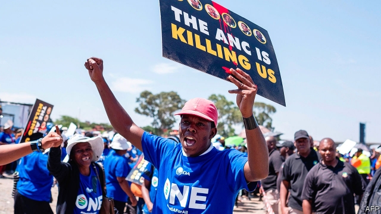

###### The ANC

# Cyril Ramaphosa must start his reforms within the ANC 

##### The president’s party is rife with corruption 

 

> Apr 25th 2019 

“WE ARE THE ones left after the dead,” says Thulani Cele. “We are the lucky ones.” Sitting on a plastic chair in a shelter made from corrugated iron at the Glebelands hostel in the uMlazi township on the outskirts of Durban, Mr Cele (who was too scared to give his real name) describes the past several years living in fear. 

The housing estate was built during apartheid, one of many residential complexes where male workers were confined when away from their home villages. Today 15,000-20,000 people live here in squalor, often crammed a half-dozen to a room. Yet the scale of the hostel makes it a juicy source of votes at elections and of corruption the rest of the time, for whoever controls Glebelands has access to an income stream of rent and upkeep contracts. 

These prizes seem to be worth killing for. Since 2014 more than 115 Glebelands residents have been murdered. Many were ANC members who objected to the ways of Robert Mzobe, an ANC councillor accused of corruption, and Bongani Hlope, a local warlord who terrorised residents. “Glebelands is a microcosm,” argues Mary de Haas, a researcher into local violence. Throughout the country violence is regularly meted out by one faction of the ANC against another. From 2000 to 2017 nearly 300 political assassinations have been recorded, many of them ANC members. 

The world may still think of the ANC as the organisation that led the struggle against apartheid, Nelson Mandela’s party. It still has many thoughtful and courageous politicians. But over the past 25 years it has become deeply corrupt. “The thing I hate about the ANC is the normlessness they’ve brought to the country,” says Paulus Zulu of the University of KwaZulu Natal. “The amorality.” 

President Ramaphosa faces a huge task in patching up South Africa’s institutions. But the organisation in most need of reform is his own party. Without cleaning up the ANC he will struggle to enact his agenda. For much of the ANC remains opposed to Mr Ramaphosa, whether out of ideology, self-preservation or both. 

The origins of the president’s fragile position lie in his victory at the ANC National Conference. Held every five years these meetings decide the leadership of the party. In December 2017 he won the presidency of the party, and so, later, the presidency of the country, by a margin of 179 out of 4,701 votes. The top six officials on the National Executive Committee, the main decision-making body, are finely balanced between the president’s camp and his enemies. At the time Mr Ramaphosa told friends that this victory would have to do—“We settle for the beachhead,” he said. Yet he still has a war on his hands with the allies of Mr Zuma. 

There is not a single “Zuma faction”, but a series of overlapping groups. One is the set of hard-left ideologues who do not trust Mr Ramaphosa’s pro-business instincts. Since the ANC still pays lip-service to being a Marxist organisation, with some members addressing each other as “comrade”, it can be hard to distinguish champagne socialists from real ones. But the latter still exist. 

Then there are the Zuma allies in cabinet positions deemed too powerful to dislodge. For example Bathabile Dlamini, who last year was found by the Constitutional Court to have been “reckless” and “grossly negligent” in her conduct before an inquiry into her ineptitude as the minister in charge of welfare payments. In the 2000s the party devolved more power to the nine provinces, encouraging the growth of local barons. Many of these, such as Supra Mahumapelo, a strongman and former premier in North West province, have patronage networks that they do not want unspun by Mr Ramaphosa. Since they control a lot of party cadres, they must be handled with care. 

Increasingly regional barons have taken up positions in Luthuli House, the ANC headquarters. It is here that the party’s day-to-day operations are conducted and decisions are made about party jobs. This includes who gets to become MPs. 

The secretary-general of the party is Ace Magashule, another client of Mr Zuma’s. From 2009 to 2018 he was premier of the Free State—one of the provincial big men. Under him the province cemented its reputation for corruption, including with a deal using 570m rand of public funds to set up a failing dairy farm, which went to a group involving his son, Mr Zuma’s son and the Guptas. Mr Magashule has denied any wrongdoing. 

Another former regional baron is David Mabuza, the deputy president of both the ANC and the country. Mr Mabuza was appointed by Mr Zuma as premier of Mpumalanga in 2009, shortly after he donated 400,000 rand for the former president’s fourth wedding. As premier he faced many allegations of misconduct. In 2017 Mr Mabuza used his power to be the kingmaker at the ANC election. At the last moment he switched from Mr Zuma’s ex-wife and preferred candidate (since he assumed she would protect him from prosecution) to Mr Ramaphosa, ensuring his victory. Many close to the president fear that his deputy wants to dislodge him. 

Mr Ramaphosa’s supporters say much will change after the election. They believe a clear victory would give him a mandate, make it easier to push his policies, and encourage amoral cadres to align with his camp. Yet there is no magic share of the vote that can solve problems with his party. 

There are two reasons for that. The first is that the ANC has already adopted several left-wing policies. While all the attention at the conference in 2017 was on personalities, the party also formally agreed to support a national minimum wage, expropriation of land without compensation, and the nationalisation of the central bank. Mr Ramaphosa may try to limit the negative sideeffects from these ideas, but the fact that they exist as party policy reduces his room for manoeuvre. 

The second reason why a clear Ramaphosa victory will not solve his internal problems is that it will not change the occupants of the ANC’s senior positions. It is possible that certain senior figures could face prosecution for their roles in state-capture scandals. But many wield a lot of power over delegates at future ANC conferences and could make life difficult for the president. 

Those people who want to see Mr Ramaphosa go after the worst of his party have so far been disappointed. The clearest evidence for his weakness came in March, when the ANC published its list of candidates for the election. It is a rogues’ gallery, full of people fingered by state-capture inquiries. 

-- 

 单词注释:

1.anc[]:abbr. 非洲民族会议（African National Council）；美国新闻社（American News Company）；（美国）大气氮公司（Atmospheric Nitrogen Corporation）；自动噪声消除器（Automatic Noise Canceller） 

2.cyril['siril]:n. 西里尔（男子名） 

3.ramaphosa[]:[网络] 拉马福萨；拉马弗萨 

4.rife[raif]:a. 流行的, 盛传的, 充满的 

5.corruption[kә'rʌpʃәn]:n. 腐败, 堕落, 贪污 [计] 论误 

6.APR[]:[计] 替换通路再试器 

7.thulani[]:[网络] 兰尼 

8.cele[]:suff. 疝；肿物 

9.corrugate['kɒrugeit]:vt. 使起皱, 成波状 vi. 起皱 a. 有皱的, 起皱的, 波状的 

10.glebeland[]:[网络] 教会附属地 

11.hostel['hɒstәl]:n. 青年招待所, 宿舍, 旅店 

12.Umlazi[]:[地名] 乌姆拉济 ( 南非 ) 

13.township['taunʃip]:n. 小镇, 镇区 [法] 镇区, 乡 

14.Durban['dә:bәn]:德班[南非(阿扎尼亚)东部港市] 

15.apartheid[ә'pɑ:theit]:n. 种族隔离 

16.residential[.rezi'denʃәl]:a. 住宅的, 与居住有关的 [法] 有关居住的, 房产的:居所的, 适于居住的 

17.squalor['skwɒlә]:n. 肮脏, 贫穷, 不干净 

18.cram[kræm]:vt. 塞满, 填满, 猛吃 vi. 贪吃 n. 极度拥挤, 死记硬背 

19.upkeep['ʌpki:p]:n. 维持, 维修费 [经] 维修费, 养护费, 保养 

20.Robert['rɔbәt]:[法] 警察 

21.councillor['kaunsilә]:n. 地方议会成员, 议会委员, 顾问, 评议员, 参赞 [法] 议员, 评议员, 顾问 

22.Bongani[]:朋加尼 

23.warlord['wɒ:lɒ:d]:n. 军阀, 军阀式领袖 

24.terrorise['terәraiz]:vt. 使恐怖, 恐吓, 威胁, 胁迫 vi. 引起恐怖, 实行恐怖统治 

25.microcosm['maikrәukɒzm]:n. 小宇宙, 小世界, 人类 

26.mary['meәri]:n. 玛丽（女子名） 

27.de[di:]:[化] 非对映体过量 [医] 铥(69号元素铥的别名,1916年Eder离得的假想元素) 

28.HAA[]:abbr. 重型防空武器（Heavy Anti-Aircraft） 

29.mete[mi:t]:vt. 量, 测量, 分配 n. 边界, 界石 

30.faction['fækʃәn]:n. 小派系, 内讧 [法] 宗派, 派别, 小集团 

31.assassination[ә.sæsi'neiʃәn]:n. 暗杀 [法] 暗杀, 行刺 

32.organisation[,ɔ: ^әnaizeiʃən; - ni'z-]:n. 组织, 团体, 体制, 编制 

33.nelson['nelsn]:n. (摔跤用语)肩下握颈 

34.courageous[kә'reidʒәs]:a. 勇敢的, 大胆的, 有胆量的 

35.normlessness[]:[网络] 失范；无规范感；无范感 

36.paulus[]: [男子名] 保罗斯 Paul的变体 

37.zulu['zu:lu:]:n. 祖鲁语；祖鲁人 

38.Kwazulu[]:n. (Kwazulu)人名；(纳米)夸祖卢 

39.natal['neitl]:a. 出生的, 诞生的 [医] 分娩的, 生产的; 臀的 

40.amorality[.eimɔ'rælәti]:n. 超道德, 非道德；道德无涉性 

41.enact[i'nækt]:vt. 制定法律, 扮演, 颁布 [法] 法令, 法规, 条例 

42.ideology[.aidi'ɒlәdʒi]:n. 思想体系, 意识形态, 观念学, 空论 [医] 观念学, 观念形态 

43.presidency['prezidәnsi]:n. 总统职权, 总裁职位 

44.finely['fainli]:adv. 雅致地, 仔细地, 敏锐地, 微细地 

45.beachhead['bi:tʃhed]:n. 滩头堡 

46.ally['ælai. ә'lai]:n. 同盟者, 同盟国, 助手 vt. 使联盟, 使联合, 使有关系 vi. 结盟 

47.zuma[]: 祖玛 

48.sery[]:n. (Sery)人名；(俄)谢雷；(科特)塞里 

49.overlap[.әuvә'læp]:n. 重叠, 重复, 部分的同时发生 vt. 重叠, 重复, 与...同时发生 vi. 迭盖, 部分的同时发生 [计] 重叠 

50.ideologue['aidi:әulɔ^]:n. 理论家, 思想家,空想家 

51.champagne[ʃæm'pein]:n. 香槟酒, 香槟酒色 [化] 香槟酒 

52.deem[di:m]:v. 认为, 相信 

53.dislodge[dis'lɒdʒ]:vt. 逐出, 使移动, 驱逐 vi. 离开原位 

54.dlamini[]:[网络] 德拉米尼；总理德拉米尼；赖米尼 

55.constitutional[.kɒnsti'tju:ʃәnl]:a. 宪法的, 立宪的, 体质的 [医] 全身的; 体质的 

56.reckless['reklis]:a. 不介意的, 大意的, 鲁莽的, 不顾后果的 [法] 不注意的, 粗心大意的, 鲁莽的 

57.grossly['grәusli]:adv. 非常, 很, 粗 

58.negligent['neglidʒәnt]:a. 疏忽的, 粗心的, 不在意的 

59.ineptitude[in'eptitju:d]:n. 不适当, 愚笨, 愚昧言行 [法] 不称职, 无能, 不适当 

60.devolve[di'vɒlv]:vt. 转移, 下放(权力等), 委托 vi. 被移交 

61.baron['bærәn]:n. 男爵 [法] 男爵, 贵族, 大王 

62.supra['sju:prә]:adv. 在上；在前 

63.strongman[ˈstrɒŋmæn]:n. 大力士 

64.patronage['pætrәnidʒ]:n. 赞助, 恩赐态度, 光顾, 任免权, 保护人的身分 [经] 光顾, 资助, 赞助 

65.unspun[]:[网络] 不行 

66.cadre['kædri.'kɑ:dә]:n. 框架, 干部 [经] 干部 

67.regional['ri:dʒәnәl]:a. 地方的, 地域性的 [医] 区的, 部位的 

68.Luthuli[lu:'tu:li:]:卢图利(①姓氏 ②Albert John, 1898-1967, 南非的非洲人解放运动领袖, 曾获1960年诺贝尔和平奖) 

69.headquarter[,hed'kwɔ:tә]:vt. 将...的总部设在 

70.MP[]:国会议员, 下院议员 [计] 宏处理程序, 维护程序, 线性规划, 微程序, 多处理器 

71.ace[eis]:n. 幺点, 好手, 少许, 发球得分 a. 一流的, 杰出的 [计] 应答允许, 自适应计算机试验, 自动呼叫设备, 自动执行控制 

72.client['klaiәnt]:n. 客户, 顾客, 委托人 [计] 客户, 客户机, 客户机程序 

73.provincial[prә'vinʃәl]:n. 外地人, 粗野的人 a. 省的, 外地的, 偏狭的 

74.rand[rænd]:n. 兰特, (非正式)边, 田埂, 缘 [经] 兰特 

75.Gupta[]:n. (Gupta)人名；(德、意、印、孟、尼)古普塔 笈多 

76.wrongdoing['rɒŋ'du:iŋ]:n. 干坏事, 坏事 

77.david['deivid]:n. 大卫；戴维（男子名） 

78.mabuza[]:[网络] 马布扎 

79.mpumalanga[]: [地名] [南非共和国] 姆普马兰加 

80.donate['dәuneit]:v. 捐赠 

81.allegation[.æli'geiʃәn]:n. 断言, 主张, 申辩 [法] 声明, 事实陈述, 断言 

82.misconduct[.mis'kɒndʌkt]:vt. 办错, 使行为不端 n. 办错, 渎职, 通奸 

83.kingmaker['kiŋmeikә]:n. 拥立国王者, 有权支配要职的任命者 

84.prosecution[.prɒsi'kju:ʃәn]:n. 执行, 经营, 起诉 

85.supporter[sә'pɒ:tә]:n. 支持者, 后盾, 迫随者, 护身织物 [法] 支持者, 赡养者, 抚养者 

86.mandate['mændeit]:n. 命令, 指令, 要求 vt. 委任统治 

87.amoral[ei'mɒrәl]:a. 不属于道德范畴的, 无从区分是非的 

88.align[ә'lain]:vi. 排列, 排成一行, 结盟 vt. 使结盟, 使成一行, 校正 

89.formally['fɒ:mәli]:adv. 正式地, 形式上 

90.expropriation[eks.prәupri'eiʃәn]:n. 征用, 收用, 征收 [经] 征用, 没收, 征购 

91.compensation[.kɒmpen'seiʃәn]:n. 补偿, 赔偿金, 工资 [医] 代偿(机能), 补偿 

92.nationalisation[,næʃәnәlai'zeiʃәn; -li'z-]:n. 国有化, 国营 

93.manoeuvre[mә'nu:vә]:n. 调遣, 演习, 策略 vi. 调动, 演习, 用策略 vt. 调动, 操纵 

94.occupant['ɒkjupәnt]:n. 占有者, 居住者, 占用者 

95.wield[wi:ld]:vt. 挥舞, 运用 

