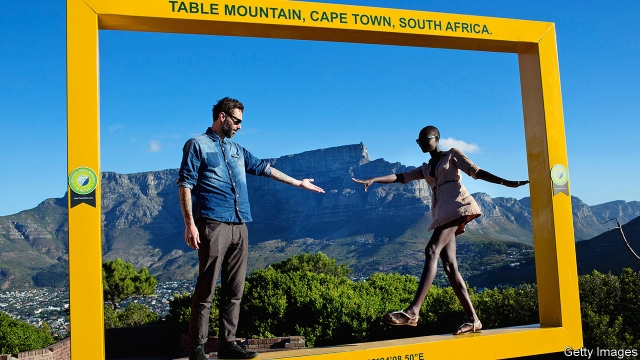

###### The future

# Even if Cyril Ramaphosa wins South Africa’s election, the future will not be easy 

##### The country cannot just rely on the ANC any longer 

 

> Apr 25th 2019 

ACROSS SOUTHERN Africa self-styled liberation parties have proved adept at clinging on to power. Angola, Botswana, Mozambique, Namibia and Zimbabwe are all still run by the parties that took office after the end of white rule. The ANC, which came to power last among its peers, has also proved stubbornly enduring. 

Despite presiding over a lost decade, opinion polls suggest that it will retain power at the elections on May 8th. The average support for the party in the eight publicly available opinion polls published since Cyril Ramaphosa became president is 56.4%. That would be a drop from its performance in the 2014 national elections (62%), but re-election nevertheless. 

There are several reasons for the party’s resilience. The ANC can point to its (patchy) delivery of basic services and social grants, which it alleges would be threatened if it were voted out. Though it will lose votes in townships to the hard-left Economic Freedom Fighters, its role in the struggle counts for a lot among black voters, especially older ones. This emotional pull is combined with a perceived lack of alternatives. 

The main opposition party, the Democratic Alliance (DA), has done progressively better at national elections since its founding in 2000, winning 22% in 2014. A strong showing at the 2016 local elections (27%) suggested that it was poised to challenge the ANC. But while it retains the loyalty of most white and “coloured” voters, especially in its stronghold in the Western Cape, it needs to win over more black voters, a task made harder since the departure of the singularly unpopular Mr Zuma. Since 2015 it has had a black leader, Mmusi Maimane, but it remains divided between its mostly white, mostly liberal members, and its newer recruits from the black middle class, who are seen to want a more active state. 

If the ANC wins in May, then what? Recently there have been some pessimistic predictions made about the future of South Africa. In “How Long Will South Africa Survive?”, published in 2017, R.W. Johnson, who wrote a book of the same title in 1977 predicting the end of apartheid, forecast that the country would soon face “regime change” as a result of the “complete fecklessness” of ANC rule. The elevation of Mr Ramaphosa seems to have changed little; last year Mr Johnson wrote that: “It feels as if the country is beginning to unravel, that it is slipping towards ungovernability.” 

It is not hard to find other examples of reasoned apocalypticism. Some think it inevitable that South Africa will eventually need to go cap in hand to the International Monetary Fund. Others worry that corruption and economic conditions will lead to a scenario reminiscent of the Arab spring protests throughout 2011. 

On the other hand there are the optimists imbued with a sense of “Ramaphoria”. Once he gets a “mandate” (60% of the vote is often mooted), they argue, South Africa will be back on track. The president will clean up his party, bring discipline to the SOEs, entice enough foreign investment so that the economy will grow by at least 5% per year and all will be well. 

Yet it might be the case that South Africa avoids the worst while improving only slowly. (Jan Smuts, the country’s prime minister during the second world war, once said that in South Africa, “the best never happens, and the worst never happens”, though it is not clear whether he asked black South Africans whether they agreed.) In his first year Mr Ramaphosa has made uneven progress cleaning up South Africa’s institutions, within the limits set by his own caution and his party’s dynamics. That pattern of stuttering, incremental repair work is the surest guide to the next five years. 

It is also possible that, even if he does a competent job, he may be the last ANC president to enjoy a majority. For, though the party should hang on this time around, it seems unable to add to its existing core of voters, which have hovered around 11m for the past four national elections. Since the adult population has ticked up over that time, the party’s share of registered voters has progressively slipped. In the four national elections since 1999 it took 58%, 53%, 50% and then 45% of the share of those signed up to vote. Because only about 70% of registered voters actually go to the polling booths, it will survive for now. But the pattern is one of decline. 

That would not be a bad thing. Despite the ANC’s official history, the struggle against apartheid was fought by more than a single party. South Africa has a vibrant democracy with resilient institutions such as its judiciary, press and civil society, all of which protected the country during the Zuma era. In the DA it has an opposition that has been consistent in holding the ANC to account. 

This special report has sought to show that South Africa faces profound challenges, whether related to corruption, the economy or public services. So long as the ANC is in power Mr Ramaphosa is the best person to address them. Yet it is not healthy for a democracy when a ruling party sees itself as indispensable, or when voters see a single person as the only hope for the country, as some South Africans say of the president. Democracy means real choices. And in the future, South Africa could do with more of them. 

-- 

 单词注释:

1.cyril['siril]:n. 西里尔（男子名） 

2.ramaphosa[]:[网络] 拉马福萨；拉马弗萨 

3.cannot['kænɒt]:aux. 无法, 不能 

4.anc[]:abbr. 非洲民族会议（African National Council）；美国新闻社（American News Company）；（美国）大气氮公司（Atmospheric Nitrogen Corporation）；自动噪声消除器（Automatic Noise Canceller） 

5.APR[]:[计] 替换通路再试器 

6.adept[ә'dept]:a. 熟练的, 老练的, 巧妙的 n. 能手, 内行 

7.cling[kliŋ]:vi. 粘紧, 附着, 紧贴, 坚持 

8.Angola[æŋ'^әulә]:[经] 安哥拉 

9.botswana[bɔt'swɑ:nә]:n. 博茨瓦纳（非洲中南部国家） 

10.Mozambique[.mәuzәm'bi:k]:n. 莫桑比克 

11.Namibia[nә'mi:biә]:n. 纳米比亚 

12.Zimbabwe[zim'bɑ:bwei]:n. 津巴布韦 

13.peer[piә]:n. 同等的人, 匹敌, 贵族 vi. 凝视, 窥视, 费力地看, 隐现 vt. 与...同等, 封为贵族 

14.stubbornly[]:adv. 倔强地；顽固地 

15.preside[pri'zaid]:vi. 统辖, 当主人, 主持 [法] 主持, 负责, 指挥 

16.resilience[ri'ziliәns]:n. 弹回, 有弹力, 恢复力 [化] 回弹; 弹性; 弹回性; 回能; 弹能 

17.patchy['pætʃi]:a. 补缀的, 凑合的, 不调和的, 散落的, 斑驳的, 不完全的 

18.allege[ә'ledʒ]:vt. 宣称, 主张, 提出, 断言 [法] 断言, 指称, 指证 

19.township['taunʃip]:n. 小镇, 镇区 [法] 镇区, 乡 

20.voter['vәutә]:n. 选民, 投票人 [法] 选民, 选举人, 投票人 

21.opposition[.ɒpә'ziʃәn]:n. 反对, 敌对, 相反, 在野党 [医] 对生, 对向, 反抗, 反对症 

22.alliance[ә'laiәns]:n. 联盟, 联合 [法] 同盟, 联盟, 联姻 

23.DA[,di:'ei]:美国地方检察官 [计] 数据采集, 数据管理员, 数据分析, 设计自动化 

24.progressively[]:adv. 进步, 先进, 向前进, 不断前进, 累进, 渐进, 逐渐, 渐次, 主张进步, 进行性 

25.poise[pɒiz]:n. 平衡, 均衡, 姿势, 镇静, 安静, 砝码 vt. 使平衡, 使悬着, 保持...姿势 vi. 平衡, 悬着, 准备好 

26.stronghold['strɒŋhәuld]:n. 要塞, 堡垒, 大本营 

27.cape[keip]:n. 岬, 海角, 披肩, 斗蓬 

28.singularly['siŋgjulәli]:adv. 少见地, 不可思议地, 异常地 

29.unpopular['ʌn'pɔpjulә]:a. 不得人心的, 不受欢迎的, 不流行的 

30.zuma[]: 祖玛 

31.Mmusi[]:穆西 

32.Maimane[]:马伊马内 

33.prediction[pri'dikʃәn]:n. 预言, 预报 [化] 预测 

34.rw[]:abbr. 卢旺达（Rwanda）；辐射武器（radiation weapon）；辐射战（radiological warfare）；阁下（Right worshipful） 

35.johnson['dʒɔnsn]:n. 约翰逊（姓氏） 

36.apartheid[ә'pɑ:theit]:n. 种族隔离 

37.regime[rei'ʒi:m]:n. 政权, 当权期间, 政体, 社会制度, 体制, 情态 [医] 制度, 生活制度 

38.fecklessness['feklisnis]:n. 没有价值, 没有长远目标, 不负责任 

39.elevation[.eli'veiʃәn]:n. 海拔, 提高, 仰角 [计] 仰角 

40.unravel[.ʌn'rævl]:vt. 阐明, 解决, 解开 vi. 散开 

41.ungovernability[]:[网络] 不可治理性；无法治理；不可管治 

42.apocalypticism[ә,pɔkә'liptisizәm]:n. [宗]启示论 

43.monetary['mʌnitәri]:a. 货币的, 金钱的 [经] 货币的, 金融的 

44.corruption[kә'rʌpʃәn]:n. 腐败, 堕落, 贪污 [计] 论误 

45.scenario[si'nɑ:riәu]:n. 剧本提纲, 情节, 剧本, 方案, 事态 [计] 方案 

46.reminiscent[.remi'nisnt]:a. 回忆的, 怀旧的 n. 往事叙述者, 回忆录作者 

47.optimist['ɔptimist]:n. 乐观者, 乐观主义者 

48.imbue[im'bju:]:vt. 使感染, 灌输, 使浸透 

49.mandate['mændeit]:n. 命令, 指令, 要求 vt. 委任统治 

50.moot[mu:t]:n. 大会, 模拟案件, 辩论会 a. 未决议的, 无实际意义的 vt. 讨论, 争论 

51.entice[in'tais]:vt. 诱骗, 引诱, 怂恿 

52.smut[smʌt]:n. 煤尘, 污迹, 黑穗病 vt. 弄脏 vi. 患黑穗病 

53.uneven[.ʌn'i:vәn]:a. 不平坦的, 不均等的, 奇数的 

54.stutter['stʌtә]:n. 口吃, 结结巴巴 v. 结结巴巴地说 

55.incremental[.inkri'mentl]:a. 增加的, 增值的 [经] 增长的, 增量的 

56.hover['hʌvә]:vi. 盘旋, 翱翔, 徘徊 vt. 孵 n. 翱翔 

57.vibrant['vaibrәnt]:a. 振动的, 战栗的, 响亮的, 活跃的 

58.resilient[ri'ziliәnt]:a. 弹回的, 有弹力的 [医] 回弹的, 回能的 

59.judiciary[dʒu:'diʃiәri]:a. 司法的, 法院的, 法官的 n. 司法部, 司法系统, 法官 

60.profound[prә'faund]:a. 极深的, 深厚的, 深刻的, 渊博的 

