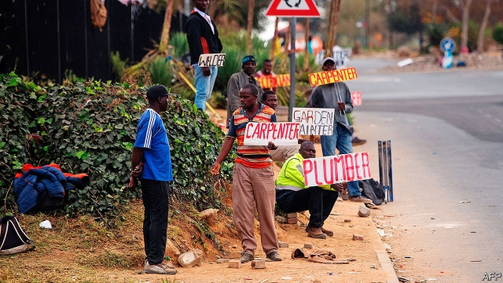
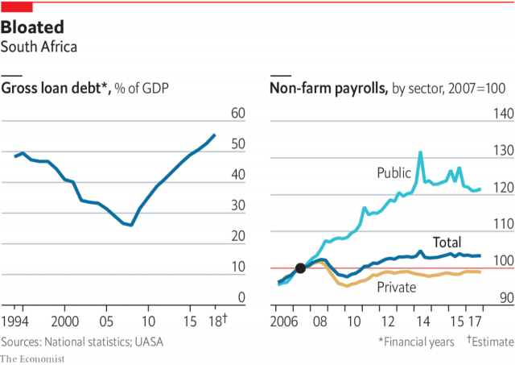

###### The economy

# High unemployment is a symptom of South Africa’s economic malaise 

##### More than 40% of 15- to 24-year-olds grow up in houses without anyone in employment 

 

> Apr 25th 2019 

AFTER LEAVING school in 2006 Delvia Mbalati spent the next 12 years looking for a job. Her search took her from her village in Limpopo, a province in the north of the country, to Johannesburg, where she spent a year studying for a qualification at a college which turned out to be a fraud. Whenever her mother scraped together funds she took other courses, but they proved useless too. Whatever work she sought the result was the same: rejection. The 32-year-old’s self-esteem plummeted. Three years ago the mother-of-two began selling vegetables from her home to make ends meet. Ms Mbalati’s experience is not unusual. The average secondary-school graduate does not get her first job until the age of 30. By that time most of them will be parents. 

The struggle to get a job partly reflects how hard it is to search for one. Under apartheid non-whites were forcibly moved to areas far from city centres. The spatial inequality endures, making transport time-consuming and costly. On average black South Africans spend more than 100 minutes per day commuting, almost four times as much as the average American commuter. A study published in 2016 found that young unemployed people spent 560 rand ($38) per month searching for work, an amount more than the average per-person income of their households. The barriers are not just financial. Since more than 40% of 15- to 24-year-olds grow up in houses without anyone in employment, they lack role models and contacts in the workplace. 

Harambee, a social enterprise founded in 2011, is making it easier for young people to find work, and for companies to hire them. As well as paying for transport and mobile data, it acts as a finishing school, assessing jobseekers’ skills, boosting their confidence and helping them look for work. Because companies trust the Harambee brand, they are more likely to give its graduates a chance. Vodacom, a telecoms firm, has even set up a call centre in the Harambee office in Johannesburg. And since October Ms Mbalati has been working there. “When I took my first call I was shaking. I couldn’t even hold my mouse,” she recalls. But over time she has thrived. “I am a transformed person,” she says. “I am happy with this person that I have become.” 

Organisations like Harambee are impressive. But the scale of the unemployment crisis is vast. Opinion polls suggest unemployment is the most important issue for South Africans, and with good reason. Only Venezuela has a higher official unemployment rate. South Africa also has a large number of people who have given up looking. The country has 38.1m people aged 15-64; just 16.5m are employed. This ratio, equating to just over two workers for every five people of working-age, is far lower than the global average, which is nearly three in five. 

The history of the South African economy partly explains these horrible numbers. Though precise data are hard to find, the unemployment rate grew steadily during the last two decades of apartheid, which can be thought of as a system of feudal capitalism for blacks and coloureds and cushy socialism for whites. South Africa’s isolation from the global economy alongside structural changes to mining, manufacturing and agriculture meant that growth slowed and there was less demand for unskilled labour. Since black South Africans were deliberately undereducated, and were hindered from moving to find work, the unemployment rate probably grew to about 13-15% by the time of transition. 

After the ANC took power in 1994 unemployment rose further, reaching 25% by the end of Nelson Mandela’s time in office. This was caused by a perfect storm of post-apartheid problems, says Abhijit Banerjee of MIT. Because non-whites could move more freely to look for work, many previously idle people, especially black women, began looking again for jobs. At the same time as this supply of unskilled labour was growing, structural changes in the economy meant that demand for it was falling. 

Economic theory would suggest that the rational response would be to make it easier and cheaper to hire people. Better to have people in poorly paid jobs than no jobs at all. But the ANC, through a mix of left-wing ideology, the need to keep its allies in trade unions happy, and its experience of apartheid, went in the other direction. It legislated for a highly regulated labour market. The ANC empowered trade unions and wage-bargaining councils, while insisting that firms larger than 50 people had to hire a minimum share of non-white workers. (This is why a disproportionate share of South African businesses have 49 employees.) It pursued this while rolling out cash grants for poor parents and pensioners. 

These policy decisions set South Africa on its path to chronically high joblessness. They also helped crimp the export-oriented, labour-intensive manufacturers that had ensured high growth and employment in other emerging markets. The result was what Mr Gordhan, the former finance minister now in charge of SOEs, calls “an insider-outsider economy”, where the minority with a steady formal job can live a rich-world lifestyle, and the rest suffer. 

And the problem is getting worse. Over the past decade South Africa’s labour force has grown by almost 4m, but the number of people in employment has increased by only 2m. Yet if economic growth had continued on its path before Mr Zuma, unemployment would have been merely awful, rather than horrific. From 1994 to 2008 Mandela and his successor, Thabo Mbeki, pursued prudent macroeconomic policies that sought to keep inflation, interest rates and public debt low. 

During that time GDP growth averaged 3.6%. In the three years before 2008 it surpassed 5%, the threshold many economists set for growth that could have a serious impact on the unemployment rate. Under Mr Zuma, however, growth averaged only 1.6%, just higher than the rate of population growth. Last year the economy entered recession and in total grew only 0.8%. 

Certainly the former president had some unlucky timing. The global financial crisis of 2008, followed by a collapse in commodity prices, inevitably hit an open, mineral-rich economy. But South Africa has not recovered. The policies of the Zuma administration towards several of South Africa’s key industries bordered on the masochistic. Tourism was undermined by daft visa regulations. Mining investment dried up as a result of proposals, encapsulated in the draft mining charter of 2017, that more equity in firms be handed over to black investors. “No gold will be produced in South Africa in ten years time,” predicts a former chairman of a mining house. Manufacturing was hobbled by labour-market regulations. All these steps were done under the banner of “radical economic transformation”, a hollow slogan that often served to distract from the wholesale looting by the ruling party. 

While Mr Zuma was harming the private sector he was expanding the state. The number of workers in “community and social services”, a proxy for civil servants, increased from 2.7m to 3.6m. The civil-service wage bill has risen by an average of more than 10% per year since 2009. On current trends spending on welfare and state workers will account for all government revenue by 2026. 

High public spending and low growth has left the country in a perilous fiscal position. After running surpluses every year from 2005-6 to 2008-9, there has been a fiscal deficit every year since. Debt-interest payments will make up 13% by 2021-22, more than is spent on health or education. The ratio of public debt to GDP will reach 60% by 2023-24. The real figure is even higher once debts from SOES are added. Because of this, two of the three major credit-rating agencies assess South African debt as “junk”. 

Rather than add to the competence of the state, the Zuma splurge encouraged its evisceration. In private the honest civil servants who have remained are aghast at the woeful administration. Others worry about the effects of corruption at the South African Revenue Service, and the ever greater reliance on a small group of taxpayers. Just 1% of taxpayers pay 61% of personal income tax. 

High unemployment, low growth, and an indebted, corrupted state—this is Mr Ramaphosa’s inheritance. Since taking office in February 2018 he has tried to strike an upbeat tone, insisting that growth and jobs are his priorities. He has brought back wise old hands such as Mr Gordhan and Tito Mboweni, the finance minister. He has travelled abroad to drum up investment, and hosted investment and jobs “summits” at home. (In private, diplomats note that it is much easier to get a meeting to talk about investment with the president than it is to talk about foreign policy.) 

 

In February, at the annual state of the nation address, he proposed a number of sensible policies, such as easing the visa regime to boost tourism. He outlined the aim of raising South Africa’s ranking in the World Bank’s “ease of doing business” list from 82 to inside the top 50. 

Yet it would be wrong to expect too much. The capacity of the state has been denuded. Even if he could do what he wants to do, many believe it would be insufficient. It would take 25 years of 5% growth to bring unemployment down to internationally normal levels, reckons Mike Schussler, an economist. But official growth forecasts for the next three years are about 2%. And there is no sign that the president is willing to change the basic insider/outsider structure of the economy. A national minimum wage, which came into effect in January, will make it harder for the unskilled to find work, says Ann Bernstein of the Centre for Development and Enterprise, a think-tank. “We need policies for the labour force we have, not the highly skilled one we wished we had,” she says. 

-- 

 单词注释:

1.malaise[mæ'leiz]:n. 不舒服 [医] 不适, 欠爽 

2.APR[]:[计] 替换通路再试器 

3.Limpopo[lim'pәjpәj]:n. 林波波河 

4.Johannesburg[dʒәu'hænisbә:^]:约翰内斯堡[南非(阿扎尼亚)东北部城市] 

5.fraud[frɒ:d]:n. 欺骗, 欺诈, 诡计, 骗子 [经] 欺诈, 舞弊, 骗子 

6.rejection[ri'dʒekʃәn]:n. 拒绝, 抛弃, 驳回, 被抛弃的东西, 呕出物 [化] 报废; 拒收 

7.plummete[]:[网络] 直线下降 

8.apartheid[ә'pɑ:theit]:n. 种族隔离 

9.forcibly['fɒ:sәbli]:adv. 强制地, 用力地 

10.spatial['speiʃәl]:a. 空间的, 受空间条件限制的, 占地位的 [医] 隙的, 间隙的, 腔的; 空间的, 立体的 

11.inequality[.ini'kwɒliti]:n. 不平等, 不同, 不平坦, 不平均 n. 不平等, 不等式 [计] 不等式 

12.commute[kә'mju:t]:vt. 交换, 折偿, 减轻 vi. 代偿, 经常乘车来往 

13.commuter[kә'mju:tә]:n. 乘公共车辆上下班者, 月季票乘客 [经] 非(当地)居民 

14.unemployed[.ʌnim'plɒid]:a. 失业的, 未被利用的 [经] 没有被雇用的, 失业的, 没有被利用的 

15.rand[rænd]:n. 兰特, (非正式)边, 田埂, 缘 [经] 兰特 

16.harambee[hɑ:'rɑ:mbi:]:<斯瓦希里>n.& int.哈兰比(齐心协力的意思) 

17.datum['deitәm]:n. 论据, 材料, 资料, 已知数 [医] 材料, 资料, 论据 

18.telecom['telәkɔm]:telecommunication 电信 

19.organisation[,ɔ: ^әnaizeiʃən; - ni'z-]:n. 组织, 团体, 体制, 编制 

20.Venezuela[,vene'zweilә]:n. 委内瑞拉 

21.equate[i'kweit]:vt. 使相等, 视为平等 vi. 等同 

22.feudal['fju:dәl]:a. 封建制度的, 封地的, 领地的 

23.capitalism['kæpitәlizәm]:n. 资本主义 [经] 资本主义 

24.coloured['kʌlәd]:a. 有色的, 有...色的, 经过渲染的, 有色彩的, 伪装的, 有色人种的, 混血种的 n. 有色人种的人, 混血人 [计] 着色的 

25.cushy['kuʃi]:a. 舒适的, 安逸的 

26.isolation[.aisә'leiʃәn]:n. 隔绝, 孤立, 隔离 [化] 分离; 生物分离 

27.manufacturing[.mænju'fæktʃәriŋ]:n. 制造业 a. 制造业的 

28.les[lei]:abbr. 发射脱离系统（Launch Escape System） 

29.unskilled[.ʌn'skild]:a. 无(特殊)技能的, 不熟练的, 拙劣的 

30.undereducated[,ʌndәr'edju:keitid, -dʒj-]:a. 受教育不足的,未受良好教育的 

31.hinder['hindә]:a. 后面的 v. 阻碍, 打扰 

32.transition[træn'ziʃәn]:n. 转变, 转换, 变迁, 过渡时期, 临时转调 [化] 跃迁 

33.anc[]:abbr. 非洲民族会议（African National Council）；美国新闻社（American News Company）；（美国）大气氮公司（Atmospheric Nitrogen Corporation）；自动噪声消除器（Automatic Noise Canceller） 

34.nelson['nelsn]:n. (摔跤用语)肩下握颈 

35.abhijit[]:[网络] 二十八宿中无阿芘哩社；女宿；牛宿 

36.banerjee[]:n. (Banerjee)人名；(印)班纳吉 

37.mit[mit]:n. 手, 连指手套, 棒球手套, 拳击手套, 马萨诸塞理工学院, 麻省理工学院 vt. 与...握手, 用手铐铐住, 逮捕 [计] 麻省理工学院, 模块化智能终端 

38.poorly['puәli]:adv. 贫穷地, 不充分地, 贫乏地 a. 身体不舒服的 

39.ideology[.aidi'ɒlәdʒi]:n. 思想体系, 意识形态, 观念学, 空论 [医] 观念学, 观念形态 

40.ally['ælai. ә'lai]:n. 同盟者, 同盟国, 助手 vt. 使联盟, 使联合, 使有关系 vi. 结盟 

41.legislate['ledʒisleit]:vi. 制定法律 vt. 用立法规定 

42.empower[im'pauә]:vt. 授予权力, 允许, 使能够 [法] 授权, 准许, 转委 

43.disproportionate[.disprә'pɒ:ʃәnit]:a. 不成比例的 

44.pensioner['penʃәnә(r)]:n. 领取抚恤金者, (英国剑桥大学的)自费生, 为金钱所收买的人, 帮佣 [法] 领取退休金者, 领取抚恤金者 

45.chronically['krɒnikli]:adv. 慢性地, 长期地, 习惯性地 

46.joblessness['dʒɔblisnis]:n. 失业；无活可干（jobless的名词形式） 

47.crimp[krimp]:n. 诱人当兵的人, 拳曲, 鬈发 vt. 诱...去当兵, 使拳曲, 使有褶 

48.Gordhan[]:[网络] 南非财政部长郭德翰 

49.lifestyle['laifstail]:n. 生活方式 

50.zuma[]: 祖玛 

51.horrific[hɒ'rifik]:a. 令人毛骨悚然的, 感到恐惧的 

52.Mandela[mæn'delә]:纳尔逊曼德拉 Nelson, [1918, 南非黑人反种族隔离活动家] 

53.successor[sәk'sesә]:n. 继承者, 接任者 [计] 后继 

54.thabo[]:[网络] 塔博 

55.mbeki[]:[网络] 姆贝基；南非总统姆贝基；南非总统穆白吉 

56.prudent['pru:dnt]:a. 审慎的, 三思而后行的, 精明的, 节俭的 

57.macroeconomic[-mik]:n. 整体经济 

58.inflation[in'fleiʃәn]:n. 胀大, 夸张, 通货膨胀 [化] 充气吹胀; 膨胀 

59.surpass[sә'pɑ:s]:vt. 超越, 凌驾, 胜过 

60.threshold['θreʃәuld]:n. 门槛, 入口, 开端, 阈 [计] 阈; 阈值 

61.economist[i:'kɒnәmist]:n. 经济学者, 经济家 [经] 经济学家 

62.recession[ri'seʃәn]:n. 后退, 凹处, 衰退, 归还 [医] 退缩 

63.timing['taimiŋ]:n. 时间选择, 时间测定, 定时, 调速 [计] 定时器时钟 

64.commodity[kә'mɒditi]:n. 农产品, 商品, 有用的物品 [经] 商品, 货物, 日用品 

65.inevitably[in'evitәbli]:adv. 不可避免地 

66.masochistic[ˌmæsə'kɪstɪk]:a. 性受虐狂者的, 受虐狂者的 

67.undermine[.ʌndә'main]:vt. 在...下面挖, 渐渐破坏, 暗地里破坏 [法] 暗中破坏, 以阴谋中伤伤害 

68.daft[dɑ:ft. dæft]:a. 愚笨的, 癫狂的, 狂闹的 

69.encapsulate[in'kæpsәleit]:vt. 装入胶囊, 封进内部, 压缩 vi. 做成胶囊 

70.charter['tʃɑ:tә]:n. 特许状, 执照, 宪章 vt. 特许, 发给特许执照 

71.equity['ekwiti]:n. 公平, 公正 [经] 权益, 产权 

72.investor[in'vestә]:n. 投资者 [经] 投资者 

73.manufacturing[.mænju'fæktʃәriŋ]:n. 制造业 a. 制造业的 

74.hobble['hɒbl]:vi. 蹒跚 vt. 使跛行, 阻碍 n. 跛行 

75.distract[dis'trækt]:vt. 转移, 分心, 使发狂 

76.wholesale['hәulseil]:n. 批发 a. 批发的, 大规模的 adv. 大规模, 照批发方式 vi. 经营批发业, 批发 vt. 批发 

77.loot[lu:t]:n. 赃物, 洗劫, 抢夺 v. 洗劫, 抢夺 

78.sector['sektә]:n. 扇形, 部门, 部分, 函数尺, 象限仪, 段, 区段 vt. 把...分成扇形 [计] 扇面; 扇区; 段; 区段 

79.proxy['prɒksi]:n. 代理, 代理人, 委托书 [经] 代理人, 代表权, 授权书 

80.perilous['perilәs]:a. 危险的, 濒临毁灭的 

81.fiscal['fiskәl]:a. 财政的, 国库的 [经] 财政上的, 会计的, 国库的 

82.surpluse[]:[网络] 尚余 

83.deficit['defisit]:n. 赤字, 不足额 [医] 短缺 

84.splurge[splә:dʒ]:n. 炫耀, 夸示 vi. 炫耀, 卖弄, 挥霍 vt. 挥霍 

85.evisceration[]:[医] 去脏术, 脏器除去术 

86.aghast[ә'gɑ:st]:a. 惊骇的, 吓呆的 

87.woeful['wәuful]:a. 悲伤的, 悲哀的 

88.corruption[kә'rʌpʃәn]:n. 腐败, 堕落, 贪污 [计] 论误 

89.taxpayer['tækspeiә]:n. 纳税人 [法] 纳税人, 纳税义务人 

90.indebted[in'detid]:a. 负债的, 受惠的 [法] 负债的, 法律上有义务偿还的 

91.inheritance[in'heritәns]:n. 遗传, 遗产 [医] 遗传 

92.upbeat['ʌpbi:t]:n. 弱拍, 上升, 兴旺 a. 上升的, 乐观的 

93.tito['ti:tәj]:n. 提托（男子名） 

94.diplomat['diplәmæt]:n. 外交官, 有外交手腕的人 [法] 外交家, 外交官, 有权谋的人 

95.regime[rei'ʒi:m]:n. 政权, 当权期间, 政体, 社会制度, 体制, 情态 [医] 制度, 生活制度 

96.denude[di'nju:d]:vt. 使裸露, 剥下, 剥夺 [医] 剥露, 剥脱 

97.internationally[.intә'næʃәnәli]:adv. 国际性地, 在国际间 

98.reckon['rekәn]:vt. 计算, 总计, 估计, 认为, 猜想 vi. 数, 计算, 估计, 依赖, 料想 

99.mike[maik]:vi. 偷懒, 游手好闲 n. 休息, 游手好闲, 扩音器, 话筒 

100.schussler[]:[网络] 纤维状 

101.ann[æn]:n. 安（女子名） 

102.Bernstein[bә:n'stein]:[德]琥珀, 伯恩斯坦(姓氏) 

