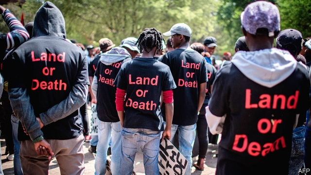

###### Land reform

# Land reform will continue to be one of South Africa’s biggest problems 

##### A constitutional amendment will not solve the issue 

 

> Apr 25th 2019 

SIGNED INTO law by Nelson Mandela in 1996, South Africa’s constitution is one of the world’s great liberal documents. It enshrines the basic rights of all South Africans to equality before the law, regardless of race, gender or sexuality. It insists on citizens’ rights to education, health care and shelter. Mandela said that it showed, “We are at last maturing to become a normal society.” 

One section has, however, remained controversial. Section 25 outlines the law on land and property rights, prohibiting the “arbitrary deprivation of property”, while limiting expropriation to cases in the public interest, for which landholders would receive “just and equitable” compensation. Since its founding in 2013 the Economic Freedom Fighters (EFF), a hard-left black-nationalist offshoot of the ANC, has called for this section to be ripped up. It wants Zimbabwe-style seizures, with all land passing to the ownership of the state. Though this policy would be the fast-track to economic ruin it has proved attractive to some frustrated voters. 

The ANC long opposed changes to Section 25. But last year, fearing that the EFF was eroding its base of black voters, and keen to make life difficult for Mr Ramaphosa, the left wing of the party persuaded it to support “expropriation without compensation”. The government is now committed to amending the constitution. 

Though Mr Ramaphosa vows that any change will not hurt the economy, many people are worried. Opponents say it is just one of more than two dozen initiatives launched since 2007 that jeopardise property rights. A further assault, they say, would undermine a fragile environment for investment. 

Any discussion of land in South Africa must reckon with the unequal legacy of white rule. It must also recognise that since 1994 the ANC’s approach to land has involved administrative incompetence and widespread corruption. That has meant the poorest, landless South Africans continue to suffer. 

There were wars of conquest in southern Africa before Dutch settlers arrived in 1652. But white rule changed the nature of conflicts over land. Superior weaponry meant the taking of land was a one-way occurrence. And whites legislated for, and codified, dispossession in a way that was also new. In 1913 the Natives Land Act reserved 90% of the country for whites, who then made up 21% of the population. Under the formalised racism of apartheid 3.5m blacks were forcibly moved to isolated reservations called “homelands”. These were often far from places of work, so men would have to travel and stay in single-sex hostels (like Glebelands). Thus apartheid not only deprived black South Africans of the ability to own property, but also broke up family units. Today much of the most concentrated poverty is in the former homelands. 

Mr Ramaphosa calls the displacement of black people South Africa’s “original sin”. When the ANC took office in 1994 it pledged to tackle historic injustices. It promised restitution to those removed from their land after 1913, funding for the broader redistribution of land from whites to blacks, and strengthening of property rights for the black majority. It set itself the target of transferring 30% of white land to black ownership by 2014. 

Today more land is under black ownership. Although there is no comprehensive audit of land based on the race of owners, a paper by Wandile Sihlobo and Tinashe Kapuya estimates that 17.4m hectares (43m acres) have been transferred from white ownership since 1994, equivalent to 21% of freehold farmland. This includes land bought by the state or by individuals on the open market. “Land reform, with the assistance of the market, has, therefore, moved us closer to the 30% target than what is commonly believed,” the authors conclude. 

That more has not been achieved is primarily the failure of the ANC. More than 90% of land bought and redistributed by the state lies fallow, much of it turned over to subsistence farming or squatter camps. Commercial farming is a complex, capital-intensive business. But few black farmers were given the skills or capital to help them pursue such projects. The government spends more money each year on security for VIPs than on land redistribution. 

Progress in the area of land restitution—compensation for those known to have been disposessed—has been similarly slow. Nelson Mandela’s government said that all claims would have to be submitted by 1998. But the complexity of the cases soon overwhelmed the bureaucracy. Rather than fund the process properly the ANC let the cases pile up. Then in 2009 there was a “catastrophic shift”, says Glenn Farred of AFRA, an NGO that campaigns on behalf of the landless. After Mr Zuma became president he allowed new claims to be filed, and prioritised the often dubious cases of powerful tribal authorities. 

And yet this is not even the biggest failure of land policy. Under apartheid most black citizens had no land titles, which meant they had no ability to borrow against their property or to sell land for market value. The ANC promised that it would secure tenure for the landless. But, as William Beinart, Peter Delius and Michelle Hay argue in their book, “Rights to Land”, most people’s property rights are “probably weaker and more uncertain” than in 1994. 

These include the 60% of landowners who have “off-register” titles, where their property is not part of a formal register. Then there are the roughly 20m South Africans in the former homelands, who have next to no property rights. In theory the land is owned “communally”. In practice it belongs to local leaders. And, says Aninka Claassens of the University of Cape Town, since those leaders are useful for getting out the vote, and for providing kickbacks, the ANC has joined with them in “extraordinary levels of corruption”. 

At best the desire for land reform is an understandable reflection of the enduring inequalities caused by white rule. At worst it is a cynical tool that risks hurting the economy and thus the poorest citizens. Either way it threatens to undermine confidence in Mr Ramaphosa’s economic policies. Like any politician, the president has to take into account the dynamics of his party. But a truly reformist president would not just meekly accept a needless change to the constitution. He would properly fund land reforms. And he would insist that the millions of people left landless by apartheid and the ANC finally get title to their own piece of earth. 

-- 

 单词注释:

1.constitutional[.kɒnsti'tju:ʃәnl]:a. 宪法的, 立宪的, 体质的 [医] 全身的; 体质的 

2.amendment[ә'mendmәnt]:n. 修订, 改善, 改良, 改正 [化] 调理剂; 修正 

3.APR[]:[计] 替换通路再试器 

4.nelson['nelsn]:n. (摔跤用语)肩下握颈 

5.Mandela[mæn'delә]:纳尔逊曼德拉 Nelson, [1918, 南非黑人反种族隔离活动家] 

6.enshrine[in'ʃrain]:vt. 入庙祀奉, 铭记 

7.gender['dʒendә]:n. 性 vt. 产生 

8.sexuality[.sekʃu'æliti]:n. 性征, 性行为, 性欲 [医] 性别, 性欲 

9.deprivation[.depri'veiʃәn]:n. 剥夺, 剥夺官职, 免职 [医] 丧失, 剥夺, 缺乏 

10.expropriation[eks.prәupri'eiʃәn]:n. 征用, 收用, 征收 [经] 征用, 没收, 征购 

11.landholder['lændhәuldә]:n. 地主, 借地人 

12.equitable['ekwitәbl]:a. 公平的, 公正的 [法] 公平的, 公正的, 平衡法的 

13.compensation[.kɒmpen'seiʃәn]:n. 补偿, 赔偿金, 工资 [医] 代偿(机能), 补偿 

14.eff[ef]:vt. [俚]弄糟 

15.offshoot['ɒ:fʃu:t]:n. 分支, 旁系, 衍生事物 

16.anc[]:abbr. 非洲民族会议（African National Council）；美国新闻社（American News Company）；（美国）大气氮公司（Atmospheric Nitrogen Corporation）；自动噪声消除器（Automatic Noise Canceller） 

17.rip[rip]:n. 裂痕, 破绽, 拉裂, 浪子, 巨浪 vi. 被拉开, 裂开, 猛冲 vt. 撕, 扯, 劈 

18.seizure['si:ʒә]:n. 捕获, 夺取, 占领, 捕获物, 没收, 充公 [医] 发作; 癫痫发作 

19.voter['vәutә]:n. 选民, 投票人 [法] 选民, 选举人, 投票人 

20.erode[i'rәud]:vt. 腐蚀, 侵蚀 vi. 受腐蚀 

21.ramaphosa[]:[网络] 拉马福萨；拉马弗萨 

22.amend[ә'mend]:vt. 修改, 改善, 改良 vi. 改过自新 

23.vow[vau]:n. 誓约, 誓言, 许愿 vi. 起誓, 发誓, 郑重宣言 vt. 立誓, 起誓要, 郑重地宣布 

24.jeopardise[]:vt. 使受危险, 危及, 危害 [法] 使受危害, 使陷入危险, 危及 

25.assault[ә'sɒ:t]:n. 攻击, 袭击 vt. 袭击, 攻击 vi. 发动攻击 

26.undermine[.ʌndә'main]:vt. 在...下面挖, 渐渐破坏, 暗地里破坏 [法] 暗中破坏, 以阴谋中伤伤害 

27.reckon['rekәn]:vt. 计算, 总计, 估计, 认为, 猜想 vi. 数, 计算, 估计, 依赖, 料想 

28.unequal[.ʌn'i:kwәl]:a. 不相等的, 不规则的, 不能胜任的 [经] 不平均的, 不等的 

29.legacy['legәsi]:n. 祖先传下来之物, 遗赠物 [经] 遗产, 遗赠物 

30.administrative[әd'ministrәtiv]:a. 管理的, 行政的 [法] 行政的, 管理的, 遗产管理的 

31.incompetence[in'kɔmpitәns]:n. 不胜任, 不够格, 不合格, 不适合, 无能力, 不熟练, 无资格 [医] 机能不全, 闭锁不全, 关闭不全 

32.corruption[kә'rʌpʃәn]:n. 腐败, 堕落, 贪污 [计] 论误 

33.landless['lændlis]:a. 无土地的, 无土地所有权的 

34.Dutch[dʌtʃ]:n. 荷兰人, 荷兰语 a. 荷兰的 

35.weaponry['wepәnri]:n. 武器, 军备, 武器设计研制学 

36.legislate['ledʒisleit]:vi. 制定法律 vt. 用立法规定 

37.codify['kәudifai]:vt. 编成法典 [法] 使成文法化, 编成法典, 编纂 

38.dispossession[.dispә'zeʃәn]:n. 强占不动产, 驱逐, 夺取 [法] 剥夺, 抢夺, 强占 

39.formalise['fɔ:məlaɪz]:vt. 使（协议、计划等）成书面文字形式; 使成为正式, 使具有一定形式 

40.racism['reisizm]:n. 种族主义, 种族偏见 [法] 种族主义, 种族歧视, 种族歧视主张 

41.apartheid[ә'pɑ:theit]:n. 种族隔离 

42.forcibly['fɒ:sәbli]:adv. 强制地, 用力地 

43.hostel['hɒstәl]:n. 青年招待所, 宿舍, 旅店 

44.glebeland[]:[网络] 教会附属地 

45.deprive[di'praiv]:vt. 剥夺, 使丧失 [法] 剥夺, 剥夺, 夺去 

46.displacement[dis'pleismәnt]:n. 换置, 移位, 移动, 取代 [化] 顶替展开法 

47.pledge[pledʒ]:n. 诺言, 保证, 誓言, 抵押, 信物, 保人, 祝愿 vt. 许诺, 保证, 使发誓, 抵押, 典当, 举杯祝...健康 

48.tackle['tækl]:n. 工具, 复滑车, 滑车, 装备, 扭倒 vt. 固定, 处理, 抓住 vi. 扭倒 

49.historic[hi'stɒrik]:a. 历史上著名的, 有历史性的 

50.injustice[in'dʒʌstis]:n. 不公平, 非正义的行为 [法] 不公正, 不公平, 权利侵害 

51.restitution[.resti'tju:ʃәn]:n. 归还, 偿还, 赔偿 [医] 整复, 恢复, 转回(胎头) 

52.redistribution['ri:distri'bju:ʃәn]:n. 重新分配, 再分发 [计] 重新分配 

53.audit['ɒ:dit]:n. 审计, 查帐 vt. 查(帐), 旁听 vi. 查账 [计] 查帐; 审查; 检查 

54.hectare['hektɑ:]:n. 公顷 [经] 公顷 

55.freehold['fri:hәuld]:n. 自由保有, 不动产, 自由保有官职 [经] 不动产所有权 

56.farmland['fɑ:mlænd]:n. 农田 

57.redistribute[.ri:di'stribjut]:vt. 重新分配, 再分发 [经] 再分配, 重新分配 

58.fallow['fælәu]:n. 休耕地 a. 休耕的, 淡棕色的 

59.subsistence[sәb'sistәns]:n. 生存, 生活 [医] 生存 

60.squatter['skwɒtә]:n. 蹲着的人, 擅自占用土地或房屋者 vi. 涉水而过 

61.VIP[]:n. 要人, 大人物 [化] 血管活性肠肽 

62.complexity[kәm'pleksiti]:n. 复杂, 复杂性, 复杂的事物 

63.overwhelm[.әuvә'hwelm]:vt. 淹没, 受打击, 制服, 压倒, 使不知所措 [法] 打翻, 倾覆, 覆盖 

64.bureaucracy[bjuә'rɒkrәsi]:n. 官僚, 官吏 [法] 官僚主义, 官僚政治, 官僚机构 

65.catastrophic[.kætә'strɒfik]:a. 悲惨的, 灾难的 

66.glenn[^len]:n. 格伦（男子名） 

67.farred[]:adj. 【物】远红外的 [网络] 远红光 

68.afra[]:n. (Afra)人名；(西、葡、阿拉伯)阿弗拉；(英)阿弗拉，阿芙拉(女名)；(匈)奥弗劳 abbr. 平均运费率定值；运费费率平均运价 

69.ngo[]:abbr. 民间组织；非政府组织（Non-Governmental Organization） 

70.zuma[]: 祖玛 

71.prioritise[praɪ'ɒrəˌtaɪz]:vt. 给予…优先权; 按优先顺序处理; 出轻重缓急 vi. 把事情按优先顺序排好（等于prioritize） 

72.dubious['dju:biәs]:a. 可疑的, 不确定的 

73.tribal[traibl]:a. 部落的, 宗族的 

74.tenure['tenjuә]:n. 享有, 保有期 [经] (财产,职位等的)占有, 占有权 

75.william['wiljәm]:n. 威廉（男子名）；[常作W-][美俚]钞票, 纸币 

76.beinart[]:n. (Beinart)人名；(英)贝纳特 

77.peter['pi:tә]:vi. 逐渐消失, 逐渐减少 

78.Delius[]:德利厄斯（人名） 

79.Michelle[mɪ'ʃɛl]:n. 米歇尔（女子名） 

80.landowner['lændәunә]:n. 地主 [法] 土地所有人, 地主 

81.communally[]:adv. 社区地；公有地 

82.cape[keip]:n. 岬, 海角, 披肩, 斗蓬 

83.kickback['kikbæk]:n. 回答, 反扑, 退还 [电] 蹴后 

84.understandable[.ʌndә'stændәbl]:a. 可以理解的 

85.inequality[.ini'kwɒliti]:n. 不平等, 不同, 不平坦, 不平均 n. 不平等, 不等式 [计] 不等式 

86.cynical['sinikәl]:a. 愤世嫉俗的, 讽刺的, 冷嘲的 

87.reformist[ri'fɒ:mist]:n. 改良主义者, 改革者 

88.meekly['mi:kli]:adv. 温顺地, 柔和地, 忠厚地 

89.needles[]:n. 针数, 千针本；折页顶针（needle复数形式） 

