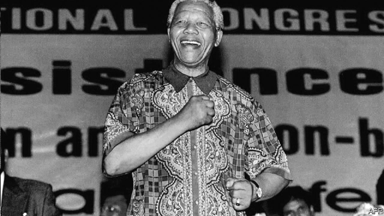

###### Father of the nation

# Some South Africans are rethinking Nelson Mandela’s legacy 

##### Youngsters question whether the late president made too many concessions 

 

> Apr 25th 2019 

SINCE THE 100th anniversary of his birth last year the world has been busy celebrating Nelson Mandela. In December pop stars such as Beyoncé, Jay-Z and Ed Sheeran appeared at a “Mandela 100” concert in Johannesburg. In February a museum exhibition curated by his family foundation began its global tour in London. A month earlier viewers of “Icons”, a British TV show, voted Madiba, the clan name by which he is affectionately known in South Africa, as the greatest figure of the 20th century. 

Yet at the same time as being feted abroad, his legacy is being rethought at home. Prompted by the persistence of inequality and economic hardship, some young South Africans are questioning whether the late president did enough to emancipate black people economically. “There’s a growing sense of anti-Mandela,” says Eugene Dhlamini, a 29-year-old from Soweto. “As our generation studies history we are making up our own minds about the decisions he made.” Some feel Madiba made too many concessions to whites during the time of democratic transition. 

It is a sentiment supported by the left-wing of the ANC and its offshoot, the Economic Freedom Fighters (EFF). Julius Malema, the thuggish populist leader of the EFF has called Madiba a “sell-out”. 

Some correction to Madiba’s shiny image is perhaps useful. The idea, often pushed by his family, of the man as a secular saint was apparent at events like the Johannesburg concert. It is also there in the Mandela-branded tea that visitors can buy at the gift shop on Robben Island, where he spent 18 of his 27 years in jail. 

All of which may make it harder to point out, for example, that he was soft on corruption within the ANC or that many other people in the struggle have been crowded out by his deification. And there is a genuine debate to be had about the economic policies of the 1990s. It does South Africans no favours to elevate anyone to cult-like status. 

Yet there is a danger of inaccurate revisionism, and of being taken in by the cynical posturing of the likes of Mr Malema. Madiba was undoubtedly a brave, moral person who was a visionary leader. To read “Long Walk to Freedom”, his autobiography, is to learn of innumerable personal sacrifices made in the name of the cause. 

The notion of Madiba selling out black South Africans is also laughable. Leaving aside the self-evident success he had in winning equal democratic rights for non-white South Africans, it is worth remembering the circumstances of the negotiations over transition in the 1990s. The country was broke and in a three-year recession. Violent elements, often supported by far-right groups, were killing dozens of the ANC’s own members. Some thought civil war a real possibility. Madiba not only prevented that but broadly achieved everything he sought in the negotiations (thanks in part to Mr Ramaphosa, who led the ANC team in talks with the National Party). 

Plenty of young South Africans are unwilling to besmirch Madiba. ‘They say the negotiations were a sell-out,” says 17-year-old student, Onthetile Aphane. “But it was a ‘sell-out’ that gave us our human rights.” 

-- 

 单词注释:

1.rethink[ri:'θiŋk]:v. 再想, 重想 

2.nelson['nelsn]:n. (摔跤用语)肩下握颈 

3.legacy['legәsi]:n. 祖先传下来之物, 遗赠物 [经] 遗产, 遗赠物 

4.concession[kәn'seʃәn]:n. 特许, 让步, 认可 [经] 核准, 许可, 特殊(权) 

5.APR[]:[计] 替换通路再试器 

6.Mandela[mæn'delә]:纳尔逊曼德拉 Nelson, [1918, 南非黑人反种族隔离活动家] 

7.ED[]:[计] 电子设备, 密码设备, 数据结束, 工程设计, 错误检测, 外部设备 

8.sheeran[]: [人名] 希兰 

9.Johannesburg[dʒәu'hænisbә:^]:约翰内斯堡[南非(阿扎尼亚)东北部城市] 

10.curate['kjurit]:n. 助理牧师 

11.icon['aikɒn]:n. 画像, 肖像, 偶像, 图标, 像标 [计] 像标, 图标 

12.madiba[]:[地名] 马迪巴 ( 南非 ) 

13.clan[klæn]:n. 氏族, 宗族, 集团 [医] 支 

14.affectionately[ә'fekʃәnitli]:adv. 挚爱地, 亲切地 

15.fete[feit]:n. 庆祝, 祭祀, 节日 vt. 宴请, 招待 

16.persistence[pә'sistәns]:n. 固执, 坚持不懈, 持续(性), 存留(状态) [电] 持久 

17.inequality[.ini'kwɒliti]:n. 不平等, 不同, 不平坦, 不平均 n. 不平等, 不等式 [计] 不等式 

18.emancipate[i'mænsipeit]:vt. 释放, 解放 

19.economically[i:kә'nɔmikәli]:adv. 节约地, 不浪费地, 节省地, 节俭地, 在经济上, 在经济学上 

20.eugene[ju:'ʒein, 'ju:dʒi:n]:n. 尤金（男子名） 

21.Soweto[sɔ:'wetj]:索韦托[南非] 

22.transition[træn'ziʃәn]:n. 转变, 转换, 变迁, 过渡时期, 临时转调 [化] 跃迁 

23.sentiment['sentimәnt]:n. 感情, 感伤, 情操, 情绪, 感想, 意见 [医] 情感, 情操 

24.anc[]:abbr. 非洲民族会议（African National Council）；美国新闻社（American News Company）；（美国）大气氮公司（Atmospheric Nitrogen Corporation）；自动噪声消除器（Automatic Noise Canceller） 

25.offshoot['ɒ:fʃu:t]:n. 分支, 旁系, 衍生事物 

26.eff[ef]:vt. [俚]弄糟 

27.julius['dʒu:ljәs]:n. 朱利叶斯（男子名） 

28.malema[]: [地名] [莫桑比克] 马莱马 

29.thuggish['θʌ^iʃ]:[法] 暗杀的, 杀人的, 暴行的 

30.Populist['pɔpjulist]:n. 民粹派的成员 

31.shiny['ʃaini]:a. 有光泽的, 发光的, 辉煌的, 磨光的, 磨损的 

32.secular['sekjulә]:n. 修道院外的教士 a. 世俗的, 现世的, 长期的 

33.robben[]:n. 洛宾（男子名） 

34.corruption[kә'rʌpʃәn]:n. 腐败, 堕落, 贪污 [计] 论误 

35.deification[.di:ifi'keiʃәn]:n. 奉为神, 奉若神明, 神化 

36.elevate['eliveit]:vt. 举起, 提拔, 鼓舞 

37.statu[]:[网络] 状态查看；雕像；特级雪花白 

38.inaccurate[in'ækjurit]:a. 错误的, 不准确的 [化] 不精确 

39.revisionism[ri'viʒәnizm]:n. 修正主义 [法] 修正主义 

40.cynical['sinikәl]:a. 愤世嫉俗的, 讽刺的, 冷嘲的 

41.posture['pɒstʃә]:n. 姿势, 态度, 情形, 形势 vt. 作...的姿势 vi. 作姿势 

42.visionary['viʒәnәri]:a. 幻像的, 幻想的, 梦想的 n. 有眼力的人, 空想家, 梦想者 

43.innumerable[i'nju:mәrәbl]:a. 无数的, 数不清的 

44.laughable['lɑ:fәbl]:a. 可笑的, 有趣的 

45.negotiation[ni.gәuʃi'eiʃәn]:n. 谈判, 磋商, 交涉 [经] 谈判, 协商 

46.recession[ri'seʃәn]:n. 后退, 凹处, 衰退, 归还 [医] 退缩 

47.broadly['brɒ:dli]:adv. 宽广地, 明白地, 无礼貌地 

48.ramaphosa[]:[网络] 拉马福萨；拉马弗萨 

49.besmirch[bi'smә:tʃ]:vt. 弄污 

