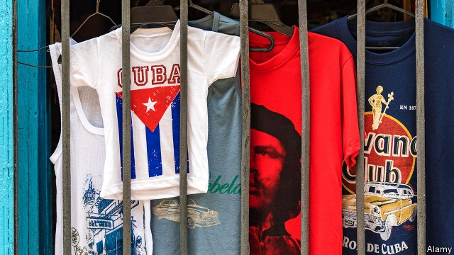

###### Tackling the troika of tyranny

# Donald Trump steps up pressure on Venezuela, Cuba and Nicaragua 

##### America pushes harder for regime changes 

 

> Apr 27th 2019 

JUAN GUAIDÓ, recognised as Venezuela’s interim president by the United States and more than 50 other countries, has called for the country’s biggest-ever street protests on May 1st. So far, neither mass demonstrations nor economic miseries have been able to dislodge the dictatorship of Nicolás Maduro. Now President Donald Trump is adding an extra weapon: lawsuits directed at Cuba, Mr Maduro’s main supporter. From May 2nd the way will be open for a flood of them: Mr Trump has decided to let American citizens seek damages against foreign companies that are using properties seized after the 1959 revolution. The move is part of a raft of measures meant to help topple the “troika of tyranny”, as John Bolton, Mr Trump’s national security adviser, calls the left-wing regimes of Cuba, Venezuela and Nicaragua. 

Previous presidents, heeding the concerns of trading partners, repeatedly suspended the “Title III” provisions of the 1996 Helms-Burton Act. These would allow Americans to pursue claims in the United States against companies “trafficking” in properties expropriated by Cuba. Mr Trump likes to be different. On April 17th his secretary of state, Mike Pompeo, announced that the suspension would go. 

On the same day, in a pugnacious (and alliterative) speech in Miami to veterans of the failed invasion in 1961 of Cuba’s Bay of Pigs, Mr Bolton unveiled several actions against the “triangle of terror”, whose leaders—Mr Maduro, Daniel Ortega of Nicaragua and Miguel Díaz-Canel in Cuba—he dubs the “three stooges of socialism”. There is to be a limit on remittances to Cuba, of $1,000 per person per quarter. More painful, perhaps, will be further restrictions on non-family travel. Venezuela’s central bank, which has tried to offset the effects of tough American sanctions on oil by selling gold, faces new restrictions on transactions with the United States. Mr Bolton also promised extra penalties on Nicaragua’s Bancorp, which he described as “the Ortega slush fund”. 

Removing Mr Maduro and ending communism in Cuba would be triumphs. Mr Bolton paints the prospect of “the first completely free hemisphere in human history”. Mr Maduro depends on Cuban spies to warn him of coup plots. Cuba gets cheap Venezuelan oil, which has propped up the economy and filled the gap left by the collapse of its previous benefactor, the Soviet Union. The mutual dependence makes sanctions on either a “two-fer”, weakening both regimes, says Mr Bolton. 

The economies of both countries are already in dire straits. Venezuelans are going hungry and fleeing the country in droves; GDP will shrink by a terrifying 25% this year, forecasts The Economist Intelligence Unit, a sister company of The Economist. Cuba has seen oil supplies from Venezuela dwindle (from 90,000 barrels a day in 2015 to around 30,000) and growth all but vanish. Now fear of lawsuits is likely to put a chill on foreign investment. 

The hard line is popular with Mr Trump’s base, especially in Florida, home to many émigrés from Cuba and Venezuela and a vital swing state. But what goes down a treat in Miami does not necessarily play well in Madrid or Montreal. 

The European Union and Canada have reacted angrily to the Title III change, calling its extraterritorial reach “contrary to international law” and threatening reprisals. Those could include referring the matter to the World Trade Organisation (though the United States is adept at gumming up its complaints procedures). A more potent riposte could be counterclaims against American companies with assets in the EU, a possibility under EU “blocking legislation”. At least the lawyers will be happy. 

Many companies are not. Big investors in Cuba include Canadian miners, such as Sherritt International, Spanish hotel chains like Meliá and French firms, including Pernod Ricard, which sells Havana Club rum. The potential number of claims is large. The United States has certified nearly 6,000 claims for property confiscated in Cuba, with a total value (including interest) of perhaps $8bn. As many as 200,000 uncertified claims could be considered. 

In some ways, the latest sanctions work against the administration’s efforts to dislodge Mr Maduro. Mr Trump himself has worked unusually hard to co-ordinate a regional coalition against the Venezuelan regime. Tightening the screws on Cuba is bound to remind some of its members of cold-war days, when the United States threw its weight around in the region. They will no doubt continue to back Mr Guaidó. But they may distance themselves from American policy, for example by backing European-led efforts to negotiate with Mr Maduro a democratic transition, which the United States views with scepticism. 

A spat within the coalition will be worth it if the extra pressure drives Mr Maduro out of office. There is little sign that will happen soon. Life in Caracas is awful, but not much more awful than before the United States toughened oil sanctions. The Red Cross is starting to bring aid to Venezuelans hardest hit by the crisis. Mr Bolton’s bet is that Mr Maduro’s regime is more brittle than that of Cuba, which has survived six decades of sanctions. He probably expected to be proven right by now. 

-- 

 单词注释:

1.tackle['tækl]:n. 工具, 复滑车, 滑车, 装备, 扭倒 vt. 固定, 处理, 抓住 vi. 扭倒 

2.troika['trɒikә]:n. 三头马车 

3.tyranny['tirәni]:n. 专制, 暴政 [法] 苛政, 暴政, 专横 

4.Venezuela[,vene'zweilә]:n. 委内瑞拉 

5.Cuba['kju:bә]:n. 古巴 

6.Nicaragua[,nikә'rɑ:^wә, ,nikә'ræ^juә]:[经] 尼加拉瓜 

7.regime[rei'ʒi:m]:n. 政权, 当权期间, 政体, 社会制度, 体制, 情态 [医] 制度, 生活制度 

8.APR[]:[计] 替换通路再试器 

9.juan[hwɑ:n]:n. 胡安（男子名） 

10.interim['intәrim]:a. 暂时的, 临时的, 间歇的 n. 过渡时期 

11.demonstration[.demәn'streiʃәn]:n. 示范, 实证 [医] 示教, 实物教授 

12.misery['mizәri]:n. 痛苦, 悲惨, 不幸, 穷困 

13.dislodge[dis'lɒdʒ]:vt. 逐出, 使移动, 驱逐 vi. 离开原位 

14.dictatorship[dik'teitәʃip]:n. 独裁者之职位, 独裁, 独裁政权 [法] 专攻, 独裁权 

15.maduro[mә'duәrәu]:a. 色深味浓的烟草做的, (雪茄)色深味浓的 

16.lawsuit['lɒ:sju:t]:n. 诉讼 [法] 诉讼, 诉讼案件 

17.supporter[sә'pɒ:tә]:n. 支持者, 后盾, 迫随者, 护身织物 [法] 支持者, 赡养者, 抚养者 

18.raft[ræft]:n. 筏, 救生筏, 大量 vi. 乘筏 vt. 筏运, 制成筏 

19.topple['tɒpl]:vt. 推翻, 颠覆 vi. 倒塌, 摇摇欲坠 

20.john[dʒɔn]:n. 盥洗室, 厕所, 嫖客 

21.bolton['bәultәn]:a. 可用螺栓固定的 

22.adviser[әd'vaizә]:n. 顾问, 劝告者, 指导教师 [法] 顾问, 劝告者 

23.heed[hi:d]:n. 注意, 留心 v. 注意, 留心 

24.iii[]:num. 罗马数字3 

25.trafficking[ˈtræfikɪŋ]:n. 非法交易 

26.expropriate[eks'prәuprieit]:vt. 剥夺, 没收, 征用 [法] 征用, 没收, 剥夺...的所有权 

27.mike[maik]:vi. 偷懒, 游手好闲 n. 休息, 游手好闲, 扩音器, 话筒 

28.pompeo[]:n. (Pompeo)人名；(意)蓬佩奥 

29.pugnacious[pʌg'neiʃәs]:a. 好斗的 

30.alliterative[ә'litәrәtiv]:a. 头韵的, 头韵体的 

31.Miami[mai'æmi]:n. 迈阿密 

32.unveil[.ʌn'veil]:vt. 揭开, 揭幕, 除去...的面纱 vi. 显露, 除去面纱 

33.daniel['dænjәl]:n. 丹尼尔（男子名） 

34.Ortega[]:奥尔特加（人名） 奥尔特加（地名, 阿根廷、哥伦比亚） 

35.Miguel[mi'gel]:n. 米格尔（男子名） 

36.dub[dʌb]:vt. 配音, 轻点, 授予称号, 击 n. 一下击鼓声, 笨蛋 

37.stooge[stu:dʒ]:n. 喜剧配角(或丑角), 下手, 助手 vi. 充当配角 

38.remittance[ri'mitns]:n. 汇款 [经] 汇款, 寄款, 支付(金额) 

39.offset['ɒ:fset]:n. 抵消, 把...并列, 旁系, 支管, 用胶印法印 vt. 弥补, 抵消, 胶印 vi. 装支管 n. 偏移量 [计] 偏移量 

40.sanction['sæŋkʃәn]:n. 核准, 制裁, 处罚, 约束力 vt. 制定制裁规则, 认可, 核准, 同意 

41.transaction[træn'sækʃәn]:n. 交易, 办理, 学报, 和解协议 [计] 事务处理 

42.penalty['penәlti]:n. 处罚, 刑罚, 罚款, 罚球, 报应, 不利结果, 妨碍 [经] 罚金(款), 违约金 

43.bancorp[]:[网络] 合众银行；美国银行公司；美国银行集团 

44.slush[slʌʃ]:n. 烂泥, 雪水, 无聊的言情内容, 胡说八道 vt. 溅湿, 灌泥浆于 vi. 在雪泥(或泥浆)中走 

45.hemisphere['hemisfiә]:n. 半球, 地球的半面, 大脑半球 [医] 半球 

46.Cuban['kju:bәn]:a. 古巴的, 古巴人的 n. 古巴人 

47.coup['ku:]:n. 砰然的一击, 妙计, 出乎意料的行动, 政变 [医] 发作, 中, 击 

48.venezuelan[,venә'zweilәŋ]:a. 委内瑞拉的；委内瑞拉人的 

49.prop[prɒp]:n. 支柱, 支持者, 倚靠人, 道具, 螺旋桨 vt. 支撑, 维持 

50.benefactor['benifæktә]:n. 恩人, 捐助者, 施主 [法] 捐赠人, 赠送人 

51.dependence[di'pendәns]:n. 依赖, 依存, 信赖 [医] 依赖(如对药物的依赖,即瘾或癖), 从属, 偏利共生 

52.dire[daiә]:a. 可怕的, 悲惨的, 阴沉的, 极端的 

53.venezuelan[,venә'zweilәŋ]:a. 委内瑞拉的；委内瑞拉人的 

54.drove[drәuv]:n. 畜群 drive的过去式 

55.economist[i:'kɒnәmist]:n. 经济学者, 经济家 [经] 经济学家 

56.dwindle['dwindl]:vi. 减少, 缩小, 衰落 vt. 使缩小 

57.Florida['flɒridә]:n. 佛罗里达州 

58.Madrid[mә'drid]:n. 马德里 

59.montreal[,mɔntri'ɔ:l]:n. 蒙特利尔（加拿大东南部港市） 

60.angrily['æŋgrili]:adv. 愤怒地 

61.extraterritorial['ekstrә,teri'tɔ:riәl]:a. 治外法权 [法] 治外法权的 

62.reprisal[ri'praizl]:n. 报复, 报仇, 报复性劫掠 [法] 复仇, 报复, 报复性暴力为 

63.organisation[,ɔ: ^әnaizeiʃən; - ni'z-]:n. 组织, 团体, 体制, 编制 

64.adept[ә'dept]:a. 熟练的, 老练的, 巧妙的 n. 能手, 内行 

65.potent['pәutnt]:a. 有力的, 有说服力的, 有效的 [医] 有力的, 有性交能力的 

66.riposte[ri'pәust]:n. (击剑中)还击, 机敏的回答 vi. 迅速还击, 机敏回答 

67.counterclaim['kauntәkleim]:v. 反诉 n. 反诉, 反索赔 

68.asset['æset]:n. 资产, 有益的东西 

69.EU[]:[化] 富集铀; 浓缩铀 [医] 铕(63号元素) 

70.investor[in'vestә]:n. 投资者 [经] 投资者 

71.sherritt[]:[网络] 谢里特国际公司；加拿大谢里特国际公司；谢里特公司 

72.pernod[p?ә'nәu]:n. 法国绿茴香酒 

73.Ricard['rikɑ:(r)]:n. 茴香调味开胃酒 

74.Havana[hә'vænә]:n. 哈瓦那, 哈瓦那雪茄烟 

75.rum[rʌm]:n. 朗姆酒 a. 古怪的, 奇特的 

76.certify['sә:tifai]:v. 证明, 保证 

77.confiscate['kɒnfiskeit]:vt. 没收, 把...充公, 查抄 a. 被没收的 

78.uncertified[]:[法] 未经证明的, 无证明书的 

79.regional['ri:dʒәnәl]:a. 地方的, 地域性的 [医] 区的, 部位的 

80.coalition[.kәuә'liʃәn]:n. 结合体, 结合, 联合 [经] 联合, 联盟 

81.tighten['taitn]:vt. 勒紧, 使变紧 vi. 变紧, 绷紧 

82.transition[træn'ziʃәn]:n. 转变, 转换, 变迁, 过渡时期, 临时转调 [化] 跃迁 

83.scepticism['skeptisizm]:n. 怀疑论, 怀疑主义 [医] 多疑癖 

84.caracas[kә'rækәs]:n. 加拉加斯（委内瑞拉首都） 

85.toughen['tʌfn]:v. (使)变坚韧, (使)变顽强 

