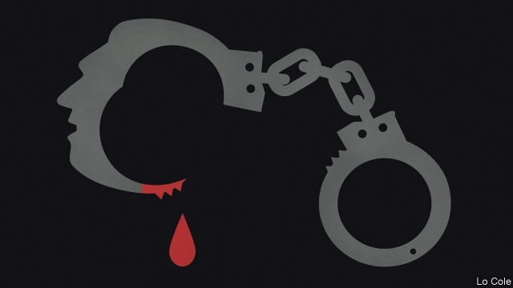

###### Bello

# Making sense of the suicide of Alan García, a former president of Peru 

##### Shooting himself was a desperate attempt at vindication. It may fail 

 

> Apr 27th 2019 

EVERYTHING ABOUT Alan García was big: his bulky frame, his oratory, his political talents, his ambition, his sense of self-importance, his mistakes and moral flaws. In the end he took the biggest, and saddest, decision: to end his life on April 17th after police arrived at his house in Lima to jail him for alleged corruption. A proud man, subject to depression, that was a humiliation he was not prepared to suffer. He was not the first Latin American leader to take that way out. But he may have merely postponed, not averted, condemnation. 

When first elected as Peru’s president in 1985, aged just 36, he fancied himself an anti-imperialist lion like Cuba’s Fidel Castro. He declared a partial default on Peru’s foreign debt and spent public money like confetti. It ended badly, in hyperinflation, slump and a failed bid to nationalise the banks. Mr García could not curb either the terrorism of the Shining Path Maoist guerrillas or the abuses of the army in repressing it. 

Yet in 2006 he was back, older and wiser. He understood that the world had changed and that Peru had to be part of it. He backed a free-trade deal with the United States. The Pacific Alliance of free-trading Latin American countries was his idea. Helped by the commodity boom, he presided over roaring economic growth and built roads. 

There was always a shadow behind the accomplished statesman. Critics claimed he had taken rake-offs on a contract to buy fighter jets and on a deal with Bettino Craxi, a corrupt Italian Socialist, to build an urban railway. Nothing was ever proved. In exile in the 1990s Mr García acquired a flat in an elegant part of Paris. He used his influence over congress, courts and the media to deflect awkward questions. 

Then Odebrecht, a Brazilian construction firm, admitted paying bribes totalling $29m to three Peruvian governments. A new generation of independent prosecutors went after Mr García. He insisted that he was clean. “There weren’t, and won’t be, bank accounts, bribes nor wealth,” he wrote in a final letter to his six children that constitutes his political testament. 

He is the latest in a line of Latin American politicians who took their own lives. Others include two Chilean presidents, José Manuel Balmaceda and Salvador Allende; a Bolivian, Germán Busch; and Brazil’s Getúlio Vargas. Though the circumstances and their stature varied, all faced political failure. 

Their action was striking, since Latin America has low (though rising) suicide rates, perhaps because the Catholic church is sternly against it. In a study of these cases, James Dunkerley, a British historian, wrote that a political culture permeated by personalism, a degree of violence and notions of heroism might be at work. “Political suicide constitutes a final terrestrial act of vindication of both person and cause,” he concluded. That is how Mr García wanted it, as his letter shows: “I leave…my corpse as a display of my disdain for my adversaries.” 

But he may not have the last word. Prosecutors are continuing to interrogate close aides, who did have millions in secret bank accounts. Perhaps because its parties are weaker and politicians more discredited, Peru has gone further than anywhere except Brazil in investigating the corruption spread across Latin America by construction companies. One former president, Ollanta Humala, and his wife spent nine months in “preventive detention”. Two days after Mr García’s death, a judge ordered the preventive jailing of another, Pedro Pablo Kuczynski, aged 80 and in hospital, for 36 months. A third, Alejandro Toledo, who allegedly took $20m in bribes, is resisting extradition from the United States. (Keiko Fujimori, an opposition leader, has been in jail for six months for obstructing a probe into her party’s financing.) All the suspects deny wrongdoing. 

These investigations are an overdue attempt to hold the powerful accountable. Tragic though it is, Mr García’s suicide is not a reason to halt them. But it should prompt a change of methods. Throwing people in jail without charge, trial or sentence is the practice of dictators, not democracies. (The fact that some 35,000 ordinary Peruvians are in pre-trial detention is an outrage, not a justification.) Parading former presidents in handcuffs before the media, which was to have been Mr García’s fate, violates the presumption of innocence—a crucial distinction between the rule of law and the Inquisition. In that respect only, the death of a giant political figure by his own hand should prompt a rethink by Peru’s judiciary. 

-- 

 单词注释:

1.bello[]:n. 贝罗（姓氏） 

2.suicide['sjuisaid]:n. 自杀, 自杀者 v. 自杀 a. 自杀的 

3.alan['ælәn]:n. 艾伦（男子名） 

4.Peru[pә'ru:]:n. 秘鲁 

5.vindication[.vindi'keiʃәn]:n. 辩护, 证明无辜, 辩明 [法] 辩明, 辩白, 辩护 

6.APR[]:[计] 替换通路再试器 

7.bulky['bʌlki]:a. 庞大的 [机] 庞大, 笨重 

8.oratory['ɔrәtәri]:n. 演讲, 雄辩术, 演讲术, 雄辩 

9.flaw[flɒ:]:n. 缺点, 裂纹, 瑕疵, 一阵狂风 [化] 划痕; 裂缝; 裂纹 

10.lima['li:mә]:n. 利马（秘鲁首都） 

11.allege[ә'ledʒ]:vt. 宣称, 主张, 提出, 断言 [法] 断言, 指称, 指证 

12.corruption[kә'rʌpʃәn]:n. 腐败, 堕落, 贪污 [计] 论误 

13.humiliation[hju:.mili'eiʃәn]:n. 耻辱, 丢脸, 谦卑 

14.avert[ә'vә:t]:vt. 转开, 避免, 防止 

15.condemnation[kɒndem'neiʃәn]:n. 非难, 宣告有罪, 非难的理由 

16.fidel[fi'del]:n. 卡斯特罗（男子名） 

17.Castro['kæstrəu]:n. 卡斯特罗（古巴领导人, 1976-2006年在任） 

18.default[di'fɒ:lt]:n. 违约, 不履行责任, 缺席, 默认值 v. 疏怠职责, 缺席, 拖欠, 默认 [计] 默认; 默认值; 缺省值 

19.confetti[kәn'feti]:n. 糖果, 五彩纸屑 

20.hyperinflation[,haipәrin'fleiʃәn]:n. 恶性通货膨胀 

21.slump[slʌmp]:n. 暴跌, 垂头弯腰的姿态 vi. 猛然掉落, 陷入, 衰落(经济等) 

22.nationalise['næʃәnәlaiz]:vt. 把...收归国有, 使具有某国国籍, 使国有化 

23.curb[kә:b]:n. 抑制, 勒马绳, 边石 vt. 抑制, 束缚, 勒住 

24.terrorism['terәrizm]:n. 恐怖主义, 恐怖统治, 恐怖状态 [法] 胁迫, 暴政, 恐怖政治 

25.Maoist['majist]:n. 毛泽东主义者  a. 毛泽东的,毛(泽东)主义的 

26.guerrilla[gә'rilә]:n. 游击队 

27.repress[ri'pres]:vt. 镇压, 抑制, 压制 vi. 压制 

28.alliance[ә'laiәns]:n. 联盟, 联合 [法] 同盟, 联盟, 联姻 

29.commodity[kә'mɒditi]:n. 农产品, 商品, 有用的物品 [经] 商品, 货物, 日用品 

30.preside[pri'zaid]:vi. 统辖, 当主人, 主持 [法] 主持, 负责, 指挥 

31.alway['ɔ:lwei]:adv. 永远；总是（等于always） 

32.bettino[]:[网络] 贝蒂诺；天诺 

33.craxi[]: [人名] 克拉克西 

34.exile['eksail]:n. 放逐, 流放, 被放逐者 vt. 放逐, 流放, 使背井离乡 

35.deflect[di'flekt]:vt. 转移, 使偏斜 vi. 偏斜 

36.Odebrecht[]:[网络] 里切特集团；里切特公司 

37.Brazilian[brә'ziljәn]:n. 巴西人 a. 巴西的, 巴西人的 

38.bribe[braib]:n. 贿赂 vt. 贿赂, 收买 vi. 行贿 

39.Peruvian[pә'ru:viәn]:a. 秘鲁的, 秘鲁人的, 秘鲁文化的 n. 秘鲁人 

40.prosecutor['prɒsikju:tә]:n. 实行者, 告发者, 公诉人 [法] 原告, 起诉人, 检举人 

41.constitute[kәn'stitjut]:vt. 构成, 组成, 任命 [建] 构造, 组成 

42.testament['testәmәnt]:n. 遗嘱, <<圣约书>> [法] 遗言, 遗嘱, 确实的证明 

43.Chilean['tʃiliәn]:n. 智利人, 智利讲的西班牙语 a. 智利文化的, 智利人的, 智利的 

44.manuel['mænjuel]:n. 曼纽尔（男子名）；曼努埃尔二世（拜占庭皇帝约翰五世的次子） 

45.balmaceda[]:n. (Balmaceda)人名；(西)巴尔马塞达 

46.Salvador['sælvәdɔ:]:[经] 萨尔瓦多 

47.Allende[]:n. (Allende)人名；(西)阿连德 

48.bolivian[bә'liviәn]:a. 玻利维亚的；玻利维亚人的 

49.Busch[buəʃ]:n. 布施（姓氏） 

50.VARGAS[]:瓦尔加斯, 瓦格斯（人名） 巴尔加斯（地名, 在阿根廷、巴拿马、玻利维亚、古巴、洪都拉斯） 

51.stature['stætʃә]:n. 身材, 身高, 高度 [医] 身材, 身高 

52.sternly['stә:nli]:adv. 严格地, 严肃地, 严厉地 

53.jame[]: 灰岩井 

54.dunkerley[]: [人名] 邓克利 

55.historian[hi'stɒ:riәn]:n. 历史学家, 记事者 

56.permeate['pә:mieit]:vt. 弥漫, 渗透, 充满, 影响, 感染 vi. 透入, 散布 

57.personalism['pә:sәnlizm]:n. 个性, 个人影响, 人格主义 

58.heroism['herәuizm]:n. 英勇, 勇敢事迹, 豪侠行为 

59.terrestrial[tә'restriәl]:n. 地球上的人 a. 地球的, 陆生的, 陆地的, 人间的 

60.corpse[kɒ:ps]:n. 尸体 [医] 尸体 

61.disdain[dis'dein]:n. 蔑视 vt. 蔑视, 鄙弃 

62.adversary['ædvәsәri]:n. 敌手, 对手 a. 敌手的, 敌对的 

63.interrogate[in'terәgeit]:vt. 质问, 讯问, 审问 vi. 质问, 讯问 

64.aide[eid]:n. 助手, 副官 [计] 数据输入的可说明性 

65.discredit[dis'kredit]:n. 无信用, 丢脸, 不名誉 vt. 不信, 怀疑, 使丢脸 

66.Brazil[brә'zil]:n. 巴西 

67.ollanta[]:[网络] 奥兰达；奥良塔 

68.humala[]:[网络] 乌玛拉 

69.preventive[pri'ventiv]:a. 预防的, 防止的 n. 防止物, 预防方法, 预防药 

70.detention[di'tenʃәn]:n. 阻止, 监禁, 拘留 [医] 隔离, 拘留, 滞留, 停滞 

71.pedro['pi:drәu]:n. 彼得牌戏（一种纸牌戏） 

72.Pablo['pæblәu]:n. 巴勃罗（西班牙籍体育明星）；帕布洛（英国水槽产品品牌）；帕布鲁（西班牙著名画家毕加索的姓） 

73.kuczynski[]:[网络] 库琴斯基；库津斯基；库辛斯基 

74.Alejandro[]:n. 亚历杭德罗（男子名） 

75.toledo[tә'li:dәu]:n. 托莱多（美国港市） 

76.allegedly[ә'ledʒidli]:adv. 依其申述 

77.extradition[.ekstrә'diʃәn]:n. 引渡逃犯, 亡命者送还本国 [法] 引渡 

78.keiko[]:n. 山田圭子（歌手）；凯科（男子名） 

79.fujimori[]:[网络] 藤森；秘鲁总统藤森；秘鲁前总统藤森 

80.opposition[.ɒpә'ziʃәn]:n. 反对, 敌对, 相反, 在野党 [医] 对生, 对向, 反抗, 反对症 

81.obstruct[әb'strʌkt]:vt. 阻隔, 妨碍, 阻塞, 遮没 vi. 设障碍 

82.probe[prәub]:n. 探索, 调查, 探针, 探测器 v. 用探针探测, 调查, 探索 

83.wrongdoing['rɒŋ'du:iŋ]:n. 干坏事, 坏事 

84.accountable[ә'kauntәbl]:a. 负有责任的, 可说明的, 可解释的 [经] 负有责任的 

85.tragic['trædʒik]:a. 悲惨的, 悲剧的 

86.dictator['dikteitә]:n. 命令者, 独裁者 

87.Peruvian[pә'ru:viәn]:a. 秘鲁的, 秘鲁人的, 秘鲁文化的 n. 秘鲁人 

88.outrage['autreidʒ]:n. 暴行, 侮辱, 愤怒 vt. 凌辱, 虐待, 触犯 

89.justification[.dʒʌstifi'keiʃәn]:n. 辩护, 证明正当, 释罪 [计] 调整 

90.handcuff['hændkʌf]:vt. 给...戴上手铐 n. 手铐 

91.presumption[pri'zʌmpʃәn]:n. 专横, 放肆, 假定, 推测 [法] 假定, 推测, 设想 

92.inquisition[.inkwi'ziʃәn]:n. 调查, 探究, 审理, 宗教裁判所 [医] 调查, 审查 

93.rethink[ri:'θiŋk]:v. 再想, 重想 

94.judiciary[dʒu:'diʃiәri]:a. 司法的, 法院的, 法官的 n. 司法部, 司法系统, 法官 

