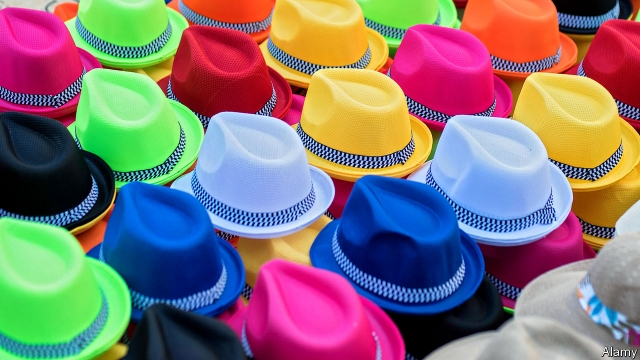

###### Miffed, but moderate

# Panama’s voters are angry, but politicians are not offering fundamental change 

##### The main contenders for the presidency find little to argue about 

 

> Apr 27th 2019 

PANAMA IS AMONG the luckier countries in Latin America. Drug-traffickers mostly bypass the isthmus, preferring to ship cocaine to the United States through northerly neighbours. A forest protected the country from Colombia’s long-running insurgencies. Its canal provided $1.7bn to the treasury last year, an eighth of the government’s budget. Panama’s citizens are the second-richest in Latin America. Thanks partly to the canal, its economy is the fastest-growing. The social safety-net is generous by regional standards and life expectancy matches that in the United States. 

These boons do not exempt Panama from problems that bedevil many Latin American countries. Three dozen families control the economy. Politics and business are prone to corruption. Odebrecht, a Brazilian construction firm that bribed politicians across Latin America, paid $100m to suborn Panamanian officials. The “Panama papers”, leaked in 2016, revealed that some of the firms housed in Panama City’s gleaming office blocks are dedicated to helping people across the globe launder money and dodge taxes. Panama’s schools perform poorly in international rankings. It is among the most unequal countries in Latin America, against stiff competition. 

The presidential and congressional elections scheduled for May 5th are unlikely to produce radical change. That is not because voters are satisfied. At every opportunity since the return of democracy in 1989 they have chosen a president from a party different from that of the incumbent. They are likely to do it again this time. The approval rating of Juan Carlos Varela, the president, is a dismal 12%. The presidential candidate of his Panameñista Party has little chance (Mr Varela cannot compete). 

Yet his successor is unlikely to be much different. The half-dozen leading contenders for the presidency espouse the same sort of centre-right policies that Mr Varela does. The sole left-winger is expected to win 1% of the vote. In part that may be because Panama’s role as a gateway of global commerce makes obvious the benefits of business. Panama is thus reassuringly different from Latin American countries such as Mexico and Brazil, where angry voters recently turned to radical populists. 

The problem is that Panamanians have little political choice. In presidential debates the candidates agreed on tweaks to pro-market policies. There is little argument about the direction Panama should take, says Roberto Troncoso, a lawyer. It needs big changes. The next president will have to prove that those can happen without a change in the political consensus. 

The current front-runner is Laurentino Cortizo, the sensible but bland nominee of the Democratic Revolutionary Party. Founded by Omar Torrijos, Panama’s dictator in the 1970s, it has been out of power since 2009. Perhaps for that reason, Mr Cortizo could win nearly half the vote in the one-round election (though polls have been spectacularly wrong before). 

He was born to money and ran his family’s farming and construction firms. Education reform is “the star that will light up” his government, he says. He would offer free school meals and improve evaluation. 

More colourful candidates are available. Rómulo Roux, whom the polls put a distant second, is the heir of Ricardo Martinelli, a former president who is in prison awaiting trial on charges that he spied on political foes. Despite that, many Panamanians remember the supermarket mogul’s presidency from 2009 to 2014 as a good time. The economy grew by nearly 8% a year and the capital got a new metro (built partly by Odebrecht). 

Mr Roux adds populist flavouring to the centrist porridge. He tells voters to keep their receipts for medicines they buy so he can reimburse them when he becomes president. His pitch appeals to Yasmin de León, a government-office cleaner. Sitting with friends by a roadside in Boca de Caja, a seaside slum, she rails against men in corbatitas (little ties) who live in the apartment towers just metres away. She remembers Mr Martinelli’s presidency as “spectacular” and hopes Mr Roux will continue his work. (Mr Martinelli is running from his jail cell to be a congressman and mayor of Panama City.) 

Ricardo Lombana, a lawyer who is competing as an independent, is the only leading candidate to criticise the political class. He says that his rivals from established parties cannot cure corruption because “they need to make a pact within the corrupt system to arrive in government”. Polls place him third, but he is rising. 

The main candidates have similar ideas for coping with the most urgent problems. These include water scarcity, caused by climate change and leaky pipes, and a public pension fund that could run out of money within a decade. Less acute but just as worrying is the parlous state of Panama’s institutions. Underpaid judges are swayed by bribes or political influence. The national assembly is widely seen as corrupt, in part because lawmakers are allowed to spend money with little oversight.  

The most important task of the next president and congress will be to strengthen such institutions. Among the main ideas are shrinking the national assembly from 71 members, introducing congressional term limits and ending unsupervised spending by legislators. Top judges would serve for longer terms and more junior ones would get higher pay. Such changes would require amending the constitution. 

One of the few areas of dispute among candidates is how to enact such changes. The front-runners favour submitting amendments to two successive congresses and then seeking approval in a referendum. Others, including Mr Lombana, would rather convene an assembly to rewrite the constitution, which might open the door to risky changes. Institutional change of some sort is needed. Without it, voters may ditch moderation. 

-- 

 单词注释:

1.miff[mif]:n. 小争执, 愠怒 vt. 使恼怒 vi. 恼羞成怒 

2.voter['vәutә]:n. 选民, 投票人 [法] 选民, 选举人, 投票人 

3.contender[kәn'tendә(r)]:n. 参赛者, 争论者, 斗争者, 竞争者 

4.presidency['prezidәnsi]:n. 总统职权, 总裁职位 

5.APR[]:[计] 替换通路再试器 

6.Panama[.pænә'mɑ:]:n. 巴拿马, 巴拿马城 

7.bypass['baipɑ:s]:n. 旁路 vt. 省略, 绕过, 忽视, 回避 

8.isthmus['ismәs]:n. 地峡, 峡部 [医] 峡 

9.cocaine[kә'kein]:n. 可卡因, 古柯碱 [化] 可卡因; 古柯碱 

10.northerly['nɒ:ðәli]:a. 北方的, 向北的, 来自北方的 adv. 向北, 自北来 

11.insurgency[in'sә:dʒәnsi]:n. 叛乱状态, 发生暴动 [法] 暴动, 起义, 叛乱 

12.treasury['treʒәri]:n. 国库, 宝库, 财政部, 国库券 [经] 库存, 国库, 金库 

13.regional['ri:dʒәnәl]:a. 地方的, 地域性的 [医] 区的, 部位的 

14.expectancy[ik'spektәnsi]:n. 期待, 期望的事物, 嘱望, 希望, 期望, 预期 [医] 预期 

15.boon[bu:n]:n. 恩惠 

16.exempt[ig'zempt]:n. 免税者, 被免除义务者 a. 免除的 vt. 使免除, 豁免 

17.Panama[.pænә'mɑ:]:n. 巴拿马, 巴拿马城 

18.bedevil[bi'devl]:vt. 使痛苦, 使苦恼, 虐待 

19.politic['pɒlitik]:a. 精明的, 明智的, 策略的 

20.prone[prәun]:a. 俯伏的, 面向下的, 有...倾向的 [医] 旋前的, 伏的, 俯的 

21.corruption[kә'rʌpʃәn]:n. 腐败, 堕落, 贪污 [计] 论误 

22.Odebrecht[]:[网络] 里切特集团；里切特公司 

23.Brazilian[brә'ziljәn]:n. 巴西人 a. 巴西的, 巴西人的 

24.bribe[braib]:n. 贿赂 vt. 贿赂, 收买 vi. 行贿 

25.suborn[sʌ'bɒ:n]:vt. 使作伪证, 唆使, 怂恿, 收买 

26.Panamanian[.pænә'meiniәn]:a. 巴拿马的 n. 巴拿马人 

27.gleam[gli:m]:n. 光束, 微光, 反光 vi. 闪烁, 隐约地闪现 vt. 使发微光, 使闪烁 

28.dedicate['dedikeit]:vt. 献出, 贡献 

29.launder['lɒ:ndә]:n. 流水槽 v. 洗衣, 烫衣 

30.dodge[dɒdʒ]:v. 避开, 躲避 n. 诡计, 躲藏 

31.poorly['puәli]:adv. 贫穷地, 不充分地, 贫乏地 a. 身体不舒服的 

32.ranking['ræŋkiŋ]:n. 等级, 地位 a. 上级的, 头等的, 超群的 

33.unequal[.ʌn'i:kwәl]:a. 不相等的, 不规则的, 不能胜任的 [经] 不平均的, 不等的 

34.presidential[.prezi'denʃәl]:a. 总统制的, 总统的, 首长的, 统辖的 [法] 总统的, 议长的, 总经理的 

35.congressional[kәn'greʃәnl]:a. 会议的, 议会的, 国会的 [法] 代表大会的, 大会的, 议会的 

36.incumbent[in'kʌmbәnt]:a. 现任的, 依靠的, 负有义务的 n. 领圣俸者, 在职者 

37.juan[hwɑ:n]:n. 胡安（男子名） 

38.carlo[]:n. 卡洛（男子名） 

39.varela[]: [地名] [阿根廷、哥伦比亚、古巴、几内亚比绍] 巴雷拉 

40.dismal['dizmәl]:a. 阴沉的, 凄凉的, 令人忧郁的 n. 低落的情绪, 沼泽 

41.cannot['kænɒt]:aux. 无法, 不能 

42.successor[sәk'sesә]:n. 继承者, 接任者 [计] 后继 

43.espouse[i'spauz]:vt. 支持, 赞成, 嫁, 娶 [法] 娶, 出嫁, 信奉 

44.gateway['geitwei]:n. 门, 通路 [计] 网关 

45.reassuringly[ˌri:ə'ʃʊərɪŋlɪ]:adv. 安慰地, 鼓励地 

46.Brazil[brә'zil]:n. 巴西 

47.Populist['pɔpjulist]:n. 民粹派的成员 

48.Panamanian[.pænә'meiniәn]:a. 巴拿马的 n. 巴拿马人 

49.tweak[twi:k]:n. 拧, 扭, 焦急 vt. 扭, 开足马力 

50.Roberto[]:n. 罗伯托（人名） 

51.troncoso[]:[网络] 科索；特龙科索 

52.bland[blænd]:a. 温和的, 乏味的, 冷漠的 [医] 温和的, 淡的 

53.nominee[.nɒmi'ni:]:n. 被提名者, 被任命者 [经] 被指定人 

54.omar['әjmɑ:(r)]:n. 奥马尔（男子名） 

55.torrijos[]: [人名] 托里霍斯; [地名] [菲律宾、西班牙] 托里霍斯 

56.dictator['dikteitә]:n. 命令者, 独裁者 

57.spectacularly[]:adv. 引人注目地；壮观地 

58.evaluation[i.vælju'eiʃәn]:n. 评估, 估价, 求值 [计] 鉴定; 评价; 求值 

59.colourful['kʌlәful]:a. 颜色丰富的, 鲜艳的, 艳丽的, 多色的, 丰富多彩的, 吸引人的, 引人入胜的 [计] 有色的 

60.roux[ru:]:n. roux (Fr.)掺油面粉糊（用于做浓羹汤） 

61.Ricardo[ri'kɑ:dәu]:里卡多(姓氏) 

62.martinelli[]:n. (Martinelli)人名；(英)马蒂内利；(法、意、塞)马丁内利 

63.foe[fou]:n. 仇敌, 反对者, 敌人, 对手 

64.metro['metrәu]:n. 地铁 

65.centrist['sentrist]:n. 中间党派的成员, 温和主义者 [法] 中间派议员, 中立派议员 

66.reimburse[.ri:im'bә:s]:vt. 付还, 偿还, 赔偿 [经] 偿付, 赔还, 付还; 偿还 

67.Yasmin[]:n. 优思明（避孕药名） 

68.de[di:]:[化] 非对映体过量 [医] 铥(69号元素铥的别名,1916年Eder离得的假想元素) 

69.León[]:[地名] 莱昂 ( 墨、尼加、西 ) 

70.roadside['rәudsaid]:n. 路旁, 路边 a. 路边的 

71.boca[]:abbr. 国际职业建筑人员与法规管理人员联合会 

72.caja[]:[网络] 储蓄银行；储蓄银行业；储蓄所 

73.spectacular[spek'tækjulә]:a. 公开展示的, 惊人的, 壮观的 n. 奇观, 惊人之举, 展览物 

74.congressman['kɒŋgresmәn]:n. 国会议员, 众议院议员 [法] 国会议会 

75.lombana[]:[网络] 隆巴纳；隆巴那 

76.criticise['kritisaiz]:v. 批评, 吹毛求疵, 非难 

77.pact[pækt]:n. 契约, 协定, 条约 [化] 合同 

78.scarcity['skɑ:siti]:n. 缺乏, 不足, 缺少 [经] 缺乏, 不足 

79.leaky['li:ki]:a. 有漏洞的, 易泄漏秘密的, 爱哭的 [电] 漏的 

80.les[lei]:abbr. 发射脱离系统（Launch Escape System） 

81.parlous['pɑ:lәs]:a. 危险的, 不易对付的, 精明的, 麻烦的 adv. 非常地, 极度地 

82.underpay['ʌndә'pei]:vt. 少付...工资, 付给...不足额的工资 [经] 付给不足额的工资 

83.lawmaker[lɒ:'meikә]:n. 立法者 

84.unsupervised[]:[计] 无监督的 

85.legislator['ledʒisleitә]:n. 立法者, 立法官, 立法委员 [法] 立法者, 立法机关成员, 立法委员 

86.amend[ә'mend]:vt. 修改, 改善, 改良 vi. 改过自新 

87.enact[i'nækt]:vt. 制定法律, 扮演, 颁布 [法] 法令, 法规, 条例 

88.amendment[ә'mendmәnt]:n. 修订, 改善, 改良, 改正 [化] 调理剂; 修正 

89.referendum[.refә'rendәm]:n. （就重大政治或社会问题进行的）全民公决，全民投票 

90.convene[kәn'vi:n]:vt. 集合, 召集, 召唤 vi. 聚集, 集合 

91.risky['riski]:a. 危险的 

92.institutional[.insti'tju:ʃәnәl]:a. 制度的, 公共机构的, 学会的 [法] 组织机构的, 制度的, 公共机构的 

93.moderation[.mɒdә'reiʃәn]:n. 缓和, 适度, 温和 [化] 慢化 

