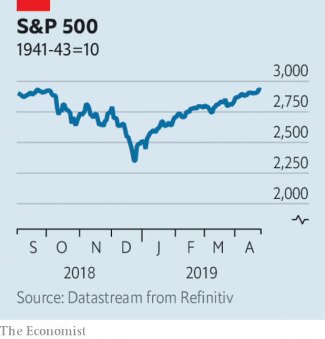

###### Lexington

# Business this week 

> Apr 27th 2019 

The British government reportedly gave the go ahead for Huawei to supply equipment for Britain’s 5G networks. The controversial decision comes after America urged its allies not to use telecoms hardware made by Huawei, which Washington believes to be a security threat because of alleged ties to China’s army. Huawei will provide antennas and other transmission equipment for Britain’s 5G infrastructure, but it is banned from more sensitive parts of the networks that handle customer data. See article. 

Kraft Heinz announced that Bernardo Hees would step down in June as chief executive, an abrupt move amid a mountain of problems at the food giant, including a $15.4bn write-down. The new CEO is Miguel Patricio, who has worked for 20 years in senior jobs at Anheuser-Busch InBev. His appointment is backed by 3G Capital, an investment group that brought about the mergers which created both Kraft Heinz and AB InBev. See article. 

Boeing reported a quarterly net profit of $2.2bn. Revenue from its commercial-aircraft division was $1bn lower than in the same quarter a year ago, which the aerospace company said reflected a fall in deliveries of the 737 MAX aircraft, which was grounded in March. Boeing ditched its profit forecast for 2019, as it works to sort out problems with the MAX. 

Nissan issued its second profit warning this year, in part because of “the impact of recent corporate issues on sales”. The Japanese carmaker sacked Carlos Ghosn as its boss last November amid allegations of financial wrongdoing, which he denies. He was indicted on a fourth charge this week, but also granted bail. 

Facebook set aside $3bn to cover a potential fine from America’s Federal Trade Commission for violating an agreement that promised it would not collect personal data and share it without permission. The FTC began investigating the social-media company after last year’s Cambridge Analytica scandal. Facebook warned that the penalty could be as high as $5bn. 

Investors were delighted with Twitter’s earnings. The social-media company reported its sixth successive quarterly profit on the back of a surge in revenues, to $787m. Its measure of daily users, counting only those who see ads, rose to 134m. Twitter said its improved performance was explained in part by weeding out abusive content, around 40% of which is now detected by machine-learning algorithms. 

 

The S&P 500 index hit a new high. Stockmarkets have broadly recovered from their drubbing in 2018. The S&P 500 has registered its best start to a year since 1987. Shares in tech companies fared particularly badly last year, but the NASDAQ has also reached a new record. 

Not everyone has had a good start to the year.  UBS described the first quarter as “challenging”, as earnings at its core wealth-management business and its investment bank declined significantly. Still, the Swiss bank made an overall net profit of $1.1bn. 

Impeded by restructuring costs and extra capital requirements, Deutsche Bank and Commerzbank abandoned their plan to merge. 

America demanded that countries stop buying Iranian oil or face sanctions, ending months of waivers for Iran’s biggest buyers. The price of oil rose sharply in response, pushing Brent crude to $75 a barrel. See article. 

Occidental offered to buy Anadarko for $55bn, exceeding Chevron’s recent $49bn bid, which has been accepted by Anadarko’s board. Anadarko is so alluring because of its assets in shale oil. 

South Korea’s economy unexpectedly shrank in the first quarter, by 0.3% compared with the previous three months, the worst performance since the financial crisis. Korean exports have fallen sharply. 

Britain’s competition regulator blocked the merger of J. Sainsbury and Asda, a subsidiary of Walmart, which would have created the country’s biggest supermarket chain. The regulator found that the deal would have led to higher prices. 

Herman Cain withdrew his name for consideration for a seat on the board of the Federal Reserve. Donald Trump’s desire to nominate Mr Cain had sparked a backlash, even among Republicans worried that the president was seeking to undermine the independence of the central bank by appointing his supporters. 

The British government started the formal process for seeking the next governor of the Bank of England. Mark Carney has held the job since 2013. Britain’s chancellor of the exchequer, Philip Hammond, hopes to sign someone for an eight-year contract, a period which will see Britain mired in the process of withdrawing from the EU. After three years of Brexit, Mr Hammond believes that “Stability has a value”. 

-- 

 单词注释:

1.lexington['leksiŋtәn]:n. 列克星敦市（位于美国肯塔基州） 

2.APR[]:[计] 替换通路再试器 

3.reportedly[ri'pɒ:tidli]:adv. 根据传说, 根据传闻, 据报道 

4.huawei[]: 华为 

5.ally['ælai. ә'lai]:n. 同盟者, 同盟国, 助手 vt. 使联盟, 使联合, 使有关系 vi. 结盟 

6.telecom['telәkɔm]:telecommunication 电信 

7.Washington['wɒʃiŋtn]:n. 华盛顿 

8.allege[ә'ledʒ]:vt. 宣称, 主张, 提出, 断言 [法] 断言, 指称, 指证 

9.antenna[æn'tenә]:n. 天线, 触须, 触角 [化] 天线 

10.infrastructure['infrәstrʌktʃә]:n. 基础结构, 基础设施 [经] 基础设施 

11.datum['deitәm]:n. 论据, 材料, 资料, 已知数 [医] 材料, 资料, 论据 

12.kraft[krɑ:ft]:n. 牛皮纸 

13.heinz[]:n. 海因茨（姓氏）；亨氏食品公司（世界著名的食品供应商, 主要产品包括调味品和餐食两大类） 

14.Bernardo[]:伯纳多（人名） 

15.hee[]:abbr. 家庭娱乐引擎（Home Entertainment Engine）；高情绪表达（High Expressed Emotion）；韩依依（服装品牌） 

16.amid[ә'mid]:prep. 在其间, 在其中 [经] 在...中 

17.ceo[]:abbr. 首席执行官；执行总裁（chief executive officer） 

18.Miguel[mi'gel]:n. 米格尔（男子名） 

19.Patricio[]:n. (Patricio)人名；(西、葡)帕特里西奥 

20.inbev[]:[网络] 英博；英博啤酒集团；英博集团 

21.merger['mә:dʒә]:n. 合并, 归并 [经] 购并 

22.ab[æb]:prep. 从, 自 [计] 地址总线 

23.boe[bəu]:abbr. back outlet eccentric 后偏心（轮）出口 

24.aerospace['єәrәuspeis]:n. 航天空间, 航天技术 

25.MAX[mæks]:[计] 最大 

26.nissan[]:n. 尼桑（日产汽车名） 

27.corporate['kɒ:pәrit]:a. 社团的, 合伙的, 公司的 [经] 团体的, 法人的, 社团的 

28.carmaker['kɑ:,meikә(r)]:n. 汽车制造商 

29.carlo[]:n. 卡洛（男子名） 

30.ghosn[]:[网络] 戈森 

31.allegation[.æli'geiʃәn]:n. 断言, 主张, 申辩 [法] 声明, 事实陈述, 断言 

32.wrongdoing['rɒŋ'du:iŋ]:n. 干坏事, 坏事 

33.indict[in'dait]:vt. 起诉, 控告, 指控 [法] 控告, 揭发, 对...起诉 

34.bail[beil]:n. 保释, 拎环, 杓, 栅栏 vt. 保释, 舀水 

35.facebook[]:n. 脸谱网 

36.ftc[]:abbr. （美）联邦贸易委员会（Federal Trade Commission）；（日）公平贸易委员会（Fair Trade Commission） 

37.Cambridge['keimbridʒ]:n. 剑桥 

38.analytica[]:[网络] 生化及实验室技术展；生化技术博览会；慕尼黑生技医疗仪器展 

39.penalty['penәlti]:n. 处罚, 刑罚, 罚款, 罚球, 报应, 不利结果, 妨碍 [经] 罚金(款), 违约金 

40.investor[in'vestә]:n. 投资者 [经] 投资者 

41.earning['ә:niŋ]:n. 收入（earn的现在分词） 

42.surge[sә:dʒ]:n. 巨涌, 汹涌, 澎湃 vi. 汹涌, 澎湃, 颠簸, 猛冲, 突然放松 vt. 使汹涌奔腾, 急放 [计] 电压尖峰 

43.twitter['twitә]:n. 啁啾, 唧唧喳喳声 vi. 啭, 啁啾, 颤抖 vt. 嘁嘁喳喳地讲, 抖动 

44.abusive[ә'bju:siv]:a. 恶言谩骂的, 被滥用的, 腐败的, 虐待的 

45.algorithm['ælgәriðm]:n. 算法 [计] 算法 

46.stockmarket[s'tɒkmɑ:kɪt]: 证券市场; 证券交易所; 证券行情 

47.broadly['brɒ:dli]:adv. 宽广地, 明白地, 无礼貌地 

48.drubbing['drʌbiŋ]:n. 殴打, 痛击 

49.tech[tek]:n. 技术学院或学校 

50.nasdaq['næz,dæk]:abbr. 全国证券交易商自动报价系统协会（National Association of Securities Dealers Automated Quotation） 

51.UB[]:[计] 上限 

52.significantly[]:adv. 值得注目地；意味深长地 

53.impede[im'pi:d]:vt. 妨碍, 阻碍, 阻止 

54.restructuring[]:[计] 重构的 

55.deutsche[]:n. 德意志联邦共和国马克 

56.commerzbank[]: 德国商业银行公司总部所在地：德国主要业务：银行 

57.merge[mә:dʒ]:vt. 使合并, 使消失, 吞没 vi. 合并, 渐渐消失 [计] 合并 

58.Iranian[i'reiniәn]:a. 伊朗的, 伊朗语系的 n. 伊朗人, 伊朗语 

59.sanction['sæŋkʃәn]:n. 核准, 制裁, 处罚, 约束力 vt. 制定制裁规则, 认可, 核准, 同意 

60.waiver['weivә]:n. 放弃, 弃权, 弃权声明书 [经] 弃权, 放弃权利 

61.buyer['baiә]:n. 买主, 买方 [经] 买主, 买方, 买手 

62.Brent[brent]:[经] 布兰特油田 

63.occidental[.ɒksi'dentәl]:n. 欧美人, 西方人 a. 欧美的, 西方的, 西方国家的 

64.anadarko[]:[网络] 阿纳达科；纳达科；阿纳达科公司 

65.allure[ә'luә]:vt. 引诱, 吸引 n. 魅力, 诱惑力 

66.asset['æset]:n. 资产, 有益的东西 

67.shale[ʃeil]:n. 页岩 

68.unexpectedly[]:adv. 想不到的, 突然的, 意外的, 出乎意料的 

69.Korean[kә'riәn]:n. 朝鲜人, 朝鲜语 a. 朝鲜人的, 朝鲜语的 

70.regulator['regjuleitә]:n. 调整者, 校准者, 校准器, 调整器, 标准钟 [化] 调节剂; 调节器 

71.j[dʒei]:n. 字母j 

72.Sainsbury['seinzbәri]:塞恩斯伯里(姓氏) 

73.Asda[]:n. 阿斯达（超市名字） 

74.subsidiary[sәb'sidiәri]:n. 子公司, 附件, 辅助者 a. 辅助的, 次要的, 津贴的 

75.walmart['wɔlma:t]: 沃尔玛（世界连锁零售企业） 

76.herman['hә:mәn]:n. 赫尔曼（男子名） 

77.cain[kein]:n. 凶手；杀兄弟者；该隐（亚当之子） 

78.nominate['nɒmineit]:vt. 提名, 任命, 命名 [法] 提名...为候选人, 指定, 推荐 

79.backlash['bæklæʃ]:n. 后冲, 强烈反对 [电] 反撞, 逆栅流 

80.undermine[.ʌndә'main]:vt. 在...下面挖, 渐渐破坏, 暗地里破坏 [法] 暗中破坏, 以阴谋中伤伤害 

81.supporter[sә'pɒ:tә]:n. 支持者, 后盾, 迫随者, 护身织物 [法] 支持者, 赡养者, 抚养者 

82.carney['kɑ:ni]:v. 哄骗 n. 哄骗的话 

83.chancellor['tʃɑ:nsәlә]:n. 大臣, 总理, 首相, 大使馆/领事馆的一等秘书, 司法官, 大学校长 

84.exchequer[iks'tʃekә]:n. (英国)财政部, 国库 [法] 国库, 财源, 财政法院 

85.philip['filip]:n. 菲利普（男子名） 

86.hammond['hæmәnd]:n. 哈蒙德（美国城市） 

87.mire[maiә]:n. 泥沼, 泥泞 vt. 使陷于泥泞, 使陷入困境 vi. 掉进泥坑 

88.EU[]:[化] 富集铀; 浓缩铀 [医] 铕(63号元素) 

89.Brexit[]:[网络] 英国退出欧盟 

