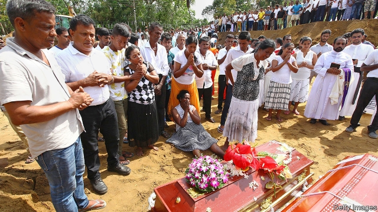
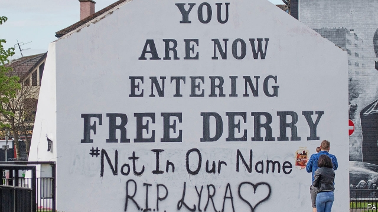

###### Lexington

# Politics this week 

 

> Apr 27th 2019 

Jihadists in Sri Lanka suicide-bombed three churches and three hotels on Easter Sunday, killing more than 350 people. Islamic State claimed responsibility. The Sri Lankan authorities blamed a little-known local group, which they say may have had external help. The government received several detailed warnings, but does not seem to have acted on them. The president asked his chief of staff and the head of the police to resign. It emerged that the president had been excluding the prime minister and his allies from national security meetings. See article. 

Joko Widodo won re-election as president of Indonesia, beating Prabowo Subianto, a former general who also ran against him in 2014. Now as then, Mr Prabowo has refused to concede defeat, saying the election was rigged. See article. 

Kazakhstan’s ruling party named the acting president, Kassym-Zhomart Tokayev, as its candidate for a snap presidential election in June. That all but guarantees Mr Tokayev’s election to a full term. He has been acting president since Nursultan Nazarbayev, the incumbent of 30 years, resigned abruptly in March. 

A court in Hong Kong sentenced eight activists for their role in the pro-democracy “Umbrella Movement” of 2014. The harshest punishments, of 16 months in jail, were imposed on two academics. A Baptist minister also received a 16-month prison term, but it was suspended. See article. 

China’s president, Xi Jinping, attended a naval display in celebration of the 70th anniversary of the Chinese fleet. Ships from 13 other countries joined the ceremonies. America did not send a vessel. Senior Americans were also absent from a gathering in Beijing of about 40 leaders and representatives from dozens of countries to discuss China’s Belt and Road Initiative. See article. 

Myanmar’s highest court upheld the conviction of two journalists from Reuters for breaking the law on state secrets. The journalists say they were framed by the security services for revealing a massacre of civilians by the army. 

Egyptians voted to approve constitutional amendments that increase the powers of President Abdel-Fattah al-Sisi and allow him to stay in office until 2030. Turnout was low, despite bribes of food parcels for many who cast a ballot. 

Jared Kushner, Donald Trump’s son-in-law and adviser, said a long-delayed peace plan for Israelis and Palestinians will be unveiled in June. 

Saudi Arabia executed 37 people on charges of terrorism, including one who was crucified. Most of those killed were from the Shia minority. Human-rights groups accused the government of holding sham trials and using the death penalty to stamp out dissent. 

Two weeks after large demonstrations drove Omar al-Bashir from power in Sudan, talks between protesters and the military continued. The army said it would share power with a technocratic government as a presidential election is prepared. But it seems reluctant to give up control. Big protests were held in the capital, Khartoum. See article. 

The world’s largest drone-delivery network was launched in Ghana. Zipline, an American startup, will distribute vaccines and other medical supplies by operating 600 drone flights a day. 

The Trump administration announced new sanctions on Cuba, Nicaragua and Venezuela, which it calls the “troika of tyranny”. Americans can now sue people or companies that do business involving property expropriated after Cuba’s revolution in 1959. John Bolton, the American national security adviser, announced that America would further restrict travel to Cuba by people who do not have relatives there. See article. 

Alan García, a former president of Peru, killed himself after police arrived at his home to arrest him. Prosecutors were investigating allegations that he received bribes from Odebrecht, a Brazilian construction company. See article. 

Argentina’s pro-business president, Mauricio Macri, froze prices of 64 consumer items, from milk to jam, for six months. Mr Macri hopes that inflation, which was 54.1% in the year to March, will fall before the presidential election, due to be held in October. Cristina Fernández de Kirchner, his populist predecessor, is leading in the polls. 

Volodymyr Zelensky was elected president of Ukraine, trouncing the incumbent, Petro Poroshenko, with an astonishing 73% of the vote. A comedian whose political experience consisted of playing a president on TV, Mr Zelensky now has to deal with a war in the east of the country, corrupt oligarchs and a disenchanted electorate. It was a rare democratic transfer of power in the former Soviet Union. See article. 

Vladimir Putin played host to Kim Jong Un, the leader of North Korea, in his first visit to Russia. After the apparent failure of his negotiations with Donald Trump, the North Korean dictator may be looking for a new friend. 

 

Lyra McKee, a 29-year-old journalist, was killed in Northern Ireland by gunfire aimed at the police during rioting in Londonderry. Local residents, known for their distrust of the authorities, were quick to contact police with information about the killing. The “Free Derry” mural, a symbol of the Troubles, had “Not In Our Name” added to it and red handprints were daubed on the office of a political party supported by the New IRA, which apologised for the murder. See article. 

Democrats in America’s House of Representatives debated the Mueller report. Nancy Pelosi, the Speaker, cautioned against trying to impeach President Donald Trump, since he is sure to be acquitted in the Senate. Democratic presidential candidates seemed much keener. See article. 

The queen invited Donald Trump to Britain ahead of the 75th anniversary of the D-Day landings in June. Mr Trump will hope for a better reception than last year, when he slipped in to sip tea with the queen at Windsor Castle. Protesters then floated a baby-Trump blimp over London. 

-- 

 单词注释:

1.lexington['leksiŋtәn]:n. 列克星敦市（位于美国肯塔基州） 

2.politic['pɒlitik]:a. 精明的, 明智的, 策略的 

3.APR[]:[计] 替换通路再试器 

4.jihadist[]:n. 伊斯兰圣战士 

5.sri[sri]:n. 斯里兰卡（Sri Lanka）；（拉）神圣罗马帝国（Sacrum Romanum Imperium） 

6.lanka[]:n. 兰卡；楞伽 

7.Islamic[iz'læmik]:a. 伊斯兰教的, 穆斯林的 

8.lankan[]:[网络] 斯里兰卡南部的兰坎市 

9.ally['ælai. ә'lai]:n. 同盟者, 同盟国, 助手 vt. 使联盟, 使联合, 使有关系 vi. 结盟 

10.Joko[]:[网络] 佐戈；上甲；彩绘阿祥 

11.widodo[]:[网络] 阿斯 

12.Indonesia[.indәu'ni:ʒә]:n. 印尼 

13.prabowo[]:[网络] 拉波沃；拉博沃 

14.concede[kәn'si:d]:vt. 承认, 退让 vi. 让步 

15.presidential[.prezi'denʃәl]:a. 总统制的, 总统的, 首长的, 统辖的 [法] 总统的, 议长的, 总经理的 

16.nursultan[]:[网络] 努苏坦 

17.nazarbayev[]:[网络] 纳扎尔巴耶夫；总统纳扎尔巴耶夫；哈萨克的纳扎尔巴耶夫 

18.incumbent[in'kʌmbәnt]:a. 现任的, 依靠的, 负有义务的 n. 领圣俸者, 在职者 

19.abruptly[ә'brʌptli]:adv. 突然地, 唐突地 

20.hong[hɔŋ]:n. （中国、日本的）行, 商行 

21.kong[kɔŋ]:n. 含锡砾石下的无矿基岩；钢 

22.activist['æktivist]:n. 激进主义分子 

23.Baptist['bæptist]:n. 施洗礼者, 浸礼会教友 

24.uphold[ʌp'hәuld]:vt. 支撑, 赞成, 鼓励, 举起, 坚持 [法] 确认, 赞成, 支持 

25.conviction[kәn'vikʃәn]:n. 定罪, 信服, 坚信 [法] 定罪, 证明有罪, 判罪 

26.Reuter['rɔitә]:n. 路透社, 路透通讯社 

27.massacre['mæsәkә]:n. 大屠杀 vt. 大屠杀, 残杀 

28.constitutional[.kɒnsti'tju:ʃәnl]:a. 宪法的, 立宪的, 体质的 [医] 全身的; 体质的 

29.amendment[ә'mendmәnt]:n. 修订, 改善, 改良, 改正 [化] 调理剂; 修正 

30.turnout['tә:naut]:n. 聚集的人群, 出席者, 产量 [化] 输出; 产额 

31.bribe[braib]:n. 贿赂 vt. 贿赂, 收买 vi. 行贿 

32.ballot['bælәt]:n. 投票, 投票用纸, 抽签 vi. 投票, 抽签 vt. 投票选出, 拉选票 

33.jare[]:abbr. Japanese Antarctic Research Expedition 日本南极科学考察队 

34.kushner[]: [人名] 库什纳 

35.adviser[әd'vaizә]:n. 顾问, 劝告者, 指导教师 [法] 顾问, 劝告者 

36.Israeli[iz'reili]:a. 以色列的, 以色列人(语)的 n. 以色列人 

37.Palestinian[,pælis'tiniәn]:[经] 巴勒斯坦的 

38.unveil[.ʌn'veil]:vt. 揭开, 揭幕, 除去...的面纱 vi. 显露, 除去面纱 

39.saudi['sajdi]:a. 沙乌地阿拉伯（人或语）的 

40.Arabia[ә'reibiә]:n. 阿拉伯半岛 

41.terrorism['terәrizm]:n. 恐怖主义, 恐怖统治, 恐怖状态 [法] 胁迫, 暴政, 恐怖政治 

42.crucify['kru:sifai]:vt. 十字架上钉死 

43.shia[]:n. 什叶；什叶派（等于Shiah） 

44.sham[ʃæm]:n. 假, 赝品, 骗子, 哄骗 a. 假的, 伪造的 vt. 假装, 冒充 vi. 装假 

45.penalty['penәlti]:n. 处罚, 刑罚, 罚款, 罚球, 报应, 不利结果, 妨碍 [经] 罚金(款), 违约金 

46.dissent[di'sent]:n. 异议 vi. 持异议, 不同意 

47.demonstration[.demәn'streiʃәn]:n. 示范, 实证 [医] 示教, 实物教授 

48.omar['әjmɑ:(r)]:n. 奥马尔（男子名） 

49.Sudan[su:'dæn]:n. 苏丹 [化] 苯偶氮间苯二酚; 苏丹 

50.protester[]:n. 抗议者, 持异议者, 拒付者 [经] 反对者 

51.technocratic[ˌteknə'krætɪk]:a. 由技术专家官员组成的；受技术官僚影响的 

52.Ghana['gɑ:nә]:n. 加纳 

53.zipline[]:[网络] 滑索；高空飞索；高空滑缆 

54.startup[]:[计] 启动 

55.vaccine['væksi:n]:n. 牛痘苗, 疫苗 a. 疫苗的, 牛痘的 

56.drone[drәun]:n. 雄蜂, 懒惰者, 嗡嗡的声音, 无人驾驶飞机(或船) vi. 嗡嗡作声, 混日子 vt. 低沉地说 

57.sanction['sæŋkʃәn]:n. 核准, 制裁, 处罚, 约束力 vt. 制定制裁规则, 认可, 核准, 同意 

58.Cuba['kju:bә]:n. 古巴 

59.Nicaragua[,nikә'rɑ:^wә, ,nikә'ræ^juә]:[经] 尼加拉瓜 

60.Venezuela[,vene'zweilә]:n. 委内瑞拉 

61.troika['trɒikә]:n. 三头马车 

62.tyranny['tirәni]:n. 专制, 暴政 [法] 苛政, 暴政, 专横 

63.sue[su:]:vt. 控告, 起诉, 请求 vi. 提出诉讼, 提出请求 

64.expropriate[eks'prәuprieit]:vt. 剥夺, 没收, 征用 [法] 征用, 没收, 剥夺...的所有权 

65.john[dʒɔn]:n. 盥洗室, 厕所, 嫖客 

66.bolton['bәultәn]:a. 可用螺栓固定的 

67.alan['ælәn]:n. 艾伦（男子名） 

68.Peru[pә'ru:]:n. 秘鲁 

69.prosecutor['prɒsikju:tә]:n. 实行者, 告发者, 公诉人 [法] 原告, 起诉人, 检举人 

70.allegation[.æli'geiʃәn]:n. 断言, 主张, 申辩 [法] 声明, 事实陈述, 断言 

71.Odebrecht[]:[网络] 里切特集团；里切特公司 

72.Brazilian[brә'ziljәn]:n. 巴西人 a. 巴西的, 巴西人的 

73.Mauricio[]:n. 毛利西奥（男子名） 

74.macri[]: [人名] 麦克里 

75.inflation[in'fleiʃәn]:n. 胀大, 夸张, 通货膨胀 [化] 充气吹胀; 膨胀 

76.Cristina[]:n. 克里斯蒂娜（电视剧中的人物） 

77.de[di:]:[化] 非对映体过量 [医] 铥(69号元素铥的别名,1916年Eder离得的假想元素) 

78.kirchner[]:柯克纳（人名） 

79.Populist['pɔpjulist]:n. 民粹派的成员 

80.predecessor[.predi'sesә]:n. 前任, 先辈, 前身 [医] 初牙, 前辈, 祖先 

81.volodymyr[]:[网络] 昊宇 

82.zelensky[]:[网络] 泽伦斯基 

83.ukraine[ju(:)'krein]:n. 乌克兰（原苏联一加盟共和国, 现已独立） 

84.trounce[trauns]:vt. 痛打, 严惩 

85.petro[]:n. 佩特罗（女子名）；[宗]（希）彼得（男子名, 涵义为石头） 

86.Poroshenko[]:[网络] 波罗申科 

87.comedian[kә'mi:djәn]:n. 喜剧演员 

88.oligarch['ɒligɑ:k]:n. 寡头政治执政者 

89.disenchant[.disin'tʃɑ:nt]:vt. 使清醒 

90.electorate[i'lektәrit]:n. 选民, 有选举权者, 选区 [法] 选民, 选举团, 选区 

91.Vladimir[vlɑ'dimɪr]:n. 弗拉基米尔（古罗斯弗拉基米尔-苏兹达里公国的古都） 

92.putin['putin]:n. 普京（人名） 

93.kim[]:n. 金姆（人名） 

94.jong[jɔŋ]:n. 小伙子；（旧时的）青年男奴 

95.UN[ʌn]:pron. 家伙, 东西 [经] 联合国 

96.Korea[kә'riә]:n. 朝鲜, 韩国 

97.negotiation[ni.gәuʃi'eiʃәn]:n. 谈判, 磋商, 交涉 [经] 谈判, 协商 

98.Korean[kә'riәn]:n. 朝鲜人, 朝鲜语 a. 朝鲜人的, 朝鲜语的 

99.dictator['dikteitә]:n. 命令者, 独裁者 

100.Lyra['laiәrә]:n. 天琴座 [医] 琴, 琴形物 

101.McKee[]:n. (McKee)人名；(英)麦基 

102.gunfire['gʌnfaiә]:n. 炮火, 号炮报时, 炮击 

103.riot['raiәt]:n. 暴动, 喧闹, 放纵 vi. 发动, 暴动, 纵情, 放荡 vt. 浪费, 挥霍 

104.Londonderry[,lʌndәn'deri]:伦敦德里(英国港市) 

105.distrust[dis'trʌst]:n. 不信任 vt. 不信任 

106.Derry['deri]:n. 民谣, 歌谣 

107.mural['mjuәrәl]:a. 壁的, 壁上的, 壁似的 n. 壁画 

108.handprint['hændprint]:n. 手印 

109.daub[dɒ:b]:v. 涂抹, 乱画, 弄脏 n. 污迹, 劣画 

110.ira['aiәrә]:abbr. 爱尔兰共和军（Irish Republican Army）；个人退休帐户（Individual Retirement Account） 

111.apologise[ә'pɔlәdʒaiz]:vi. 道歉（等于apologize） 

112.democrat['demәkræt]:n. 民主人士, 民主主义者, 民主党党员 [经] 民主党 

113.Mueller[]:米勒（人名） 

114.nancy['nænsi]:n. 女性化的男人 a. 女性化的, 同性恋的 

115.pelosi[]:佩洛西 

116.impeach[im'pi:tʃ]:vt. 控告, 怀疑, 检举, 弹劾 [法] 控告, 检举, 弹劾 

117.acquit[ә'kwit]:vt. 无罪释放, 表现, 使履行 [法] 开释, 释放, 免 

118.sip[sip]:n. 啜饮, 小口喝, 抿 vi. 啜饮 vt. 啜 [计] 单列直插式组件 

119.windsor['winzә]:n. 温莎（地名, 伦敦西方的城市） 

120.blimp[blimp]:n. 软式小型飞船, 顽固的保守分子 

