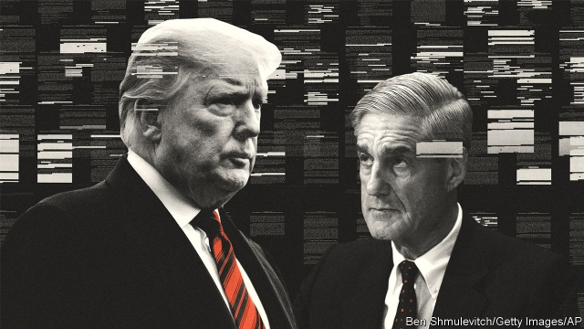
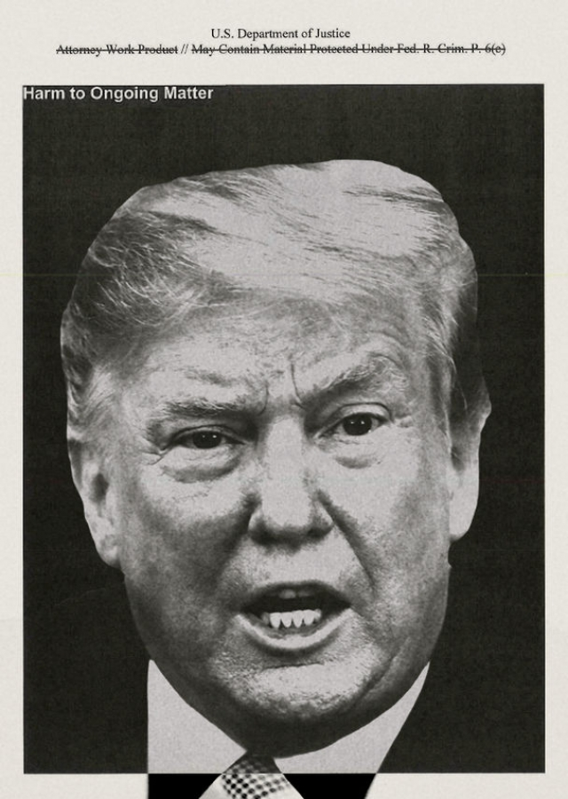

###### Executive privileges

# After Robert Mueller’s report 

##### For the time being, the president is above the law 

 

> Apr 27th 2019 

THE DAY after Robert Mueller’s report was made public, Elizabeth Warren, a contender for the Democratic presidential nomination who is polling in the single digits, tried to distinguish herself from the pack by calling for Donald Trump’s impeachment. A couple of other candidates, including Kamala Harris, weakly echoed her call. Democratic congressional leaders, by contrast, did not. Nancy Pelosi, the Speaker of the House, has spent the days since April 18th, when Mr Mueller’s report came out, tamping down calls from her left flank to start impeachment proceedings. Her second-in-command, Steny Hoyer, believes that “going forward on impeachment is not worthwhile.” 

Mr Mueller described a level of presidential misbehaviour that would be shocking were it not for the frog-boiling nature of living through the Trump presidency. Yet Republicans overwhelmingly back the president, which makes removing Mr Trump from office a dim prospect. Democrats fear an unsuccessful effort to remove Mr Trump would help the president. But just moving on as if it were business as usual seems unacceptable too, signalling as it would that the only limit to the power of presidents is what they can get away with politically. How Congress and American political institutions respond in the coming weeks to Mr Mueller’s report will set precedents that could last for decades. 

Mr Trump insists that he is “not even a little bit” worried about impeachment. “Only high crimes and misdemeanours can lead to impeachment,” he tweeted. “There were no crimes by me (No Collusion, No Obstruction), so you can’t impeach.” This is an imperfect reading of the evidence against him and of historical precedent. 

In 1868 Andrew Johnson was impeached for (among other things) bringing the presidency into “contempt, ridicule and disgrace”, which is not a crime. Presidential campaigns often pay fines for violating campaign-finance laws, but no rational person would argue that those peccadillos constitute impeachable offences. Gerald Ford, who became president after Richard Nixon resigned rather than face impeachment, cynically but accurately said that “an impeachable offence is whatever a majority of the House of Representatives considers it to be at a given moment in history.” 

In 1998 the House decided that lying to a grand jury and tampering with witnesses constituted impeachable offences against Bill Clinton. In 1974 the House felt that obstructing a federal investigation, abusing executive power and ignoring subpoenas constituted impeachable offences committed by Nixon. Neither president was removed (nor was Johnson, who escaped by a single Senate vote). 

Where does the behaviour chronicled in the Mueller report stand on the Johnson-Nixon-Clinton scale? Mr Mueller’s investigation “did not establish that members of the Trump Campaign conspired or co-ordinated with the Russian government in its election interference activities.” Yet the two sides were working towards the same goal (Mr Trump’s election) and were eager to help each other. Russian outreach began not long after Mr Trump announced his candidacy. By spring 2016 a Russian-linked professor was offering “dirt” on Hillary Clinton’s campaign to one of Mr Trump’s foreign-policy advisers. 

That summer, Donald Trump junior, Jared Kushner, Mr Trump’s son-in-law and adviser, and Paul Manafort, his campaign chairman, met a Russian lawyer who promised “official documents and information that would incriminate Hillary.” Mr Manafort shared internal campaign data with Konstantin Kilimnik, an employee of his who both American intelligence and Rick Gates, Mr Manafort’s right-hand man, believed had links to Russian intelligence. 

Meanwhile, Russian military-intelligence officers were hacking into and stealing documents from Democratic Party servers and email accounts of people working for Mrs Clinton’s campaign; and employees of the Internet Research Agency, a company based in St Petersburg, were building fake social-media accounts that reached as many as 126m people. 

Both spooks and trolls repeatedly helped Mr Trump. The trolls staged pro-Trump rallies in at least three states. Five hours after Mr Trump asked “Russia, if you’re listening” to find 30,000 emails that Mrs Clinton supposedly deleted, the spooks began targeting Mrs Clinton’s personal office. An hour after a television network released a video of Mr Trump boasting about sexual assault, WikiLeaks released thousands of emails stolen from Mrs Clinton’s campaign chairman by the GRU, Russia’s military-intelligence agency. 

Had Mr Trump not dulled the word “collusion” through overuse, it might seem to describe the relationship between his campaign and the Russian government: mutual aid coupled with persistent dissembling. Two former Trump campaign officials have pleaded guilty to lying to federal investigators about their contacts with Russia. The president’s personal lawyer testified that Mr Trump “knew of and directed the Trump-Moscow negotiations [to build a tower there] throughout the campaign and lied about it.” Mr Mueller says that his report may not provide a full picture of Trump-Russia links because people they interviewed “sometimes provided information that was false or incomplete,” while others “deleted relevant communications.” 

The second part of Mr Mueller’s report concerns obstruction of justice. Before becoming attorney general, William Barr wrote a memo arguing that a president could not obstruct justice through the lawful exercise of his powers. Mr Mueller demolishes that theory. In his summary Mr Barr cited the absence of an underlying crime (conspiring with Russia) and Mr Trump’s habit of carrying out his obstructive acts in public (often via Twitter) as mitigating circumstances; Mr Mueller did not have time for that either. Mr Barr said that the president was “frustrated and angered by a sincere belief that the investigation was undermining his presidency.” But there is no exception for hurt feelings in the obstruction statutes. 

Mr Barr also said that the White House “fully co-operated” with the probe. In fact Mr Trump refused to be interviewed, submitting only written answers. Mr Mueller sniffed at “the insufficiency of those responses,” noting that Mr Trump claimed some form of memory failure more than 30 times. Other answers were “incomplete or imprecise”. Mr Barr decided that the evidence failed to establish that Mr Trump obstructed justice. Mr Mueller does not seem so certain: “While this report does not conclude that the president committed a crime, it also does not exonerate him.” 

Certainly the president engaged in conduct that a layman might consider obstructive. He fired James Comey, the FBI director, after Mr Comey did not accede to Mr Trump’s request that he “lift the cloud” of “this Russia business” and publicly state that the president was not under investigation. He tried to get Jeff Sessions, his former attorney general, to curtail Mr Mueller’s investigation. He repeatedly tried to compel subordinates to lie about matters under investigation. 

He told Don McGahn, the White House counsel, to sack Mr Mueller. Mr McGahn (who comes out rather well) refused, complaining that the president had asked him to “do crazy shit”. “The president’s efforts to influence the investigation were mostly unsuccessful,” Mr Mueller wrote, “but that is largely because the persons who surrounded the president declined to carry out orders or accede to his requests.” 

 

Mr Mueller declined to recommend prosecution because Justice Department guidelines warn against indicting a sitting president. But he left open the prospect of a post-presidential indictment, noting that he gathered evidence now “when memories were fresh and documentary materials were available.” And he recognised that “the separation-of-powers doctrine authorises Congress to protect official proceedings…from corrupt, obstructive acts, regardless of their source.” 

Congressional Democrats do not agree on what such protection means in practice. The progressive wing was already keen to impeach; Mr Mueller’s report just added some petrol to their fire. But that makes impeachment look partisan rather than evidence-based, which will make joining them harder for the moderates from swing districts that Democrats rely on for their majority. A Politico/Morning Consult poll taken after the Mueller report’s release shows Mr Trump’s approval rating at 39%, tying an all-time low—but still five points higher than support for impeachment. 

That could change if further malfeasance comes to light. Democrats are chasing Mr Trump’s tax returns and may start yanking on threads Mr Mueller left dangling. Who destroyed evidence, and why? If Mr Trump really is innocent, why was his reaction, on learning of Mr Mueller’s appointment, to slump back in his chair and say, “Oh, my God. This is terrible. This is the end of my presidency. I’m fucked.” 

The White House is already resisting the Democrats’ efforts to subpoena some of those named in Mr Mueller’s report, contending that they are politically motivated. Legally that argument is weak, but the political salience of obstruction may wane during a long court fight. Others have tried to minimise Mr Mueller’s findings. Mr Kushner said that the investigation harmed America more than Russian election-meddling did. Rudy Giuliani, one of Mr Trump’s lawyers, said that he saw nothing wrong in accepting help from Russia. 

Impeding a federal investigation and accepting help from a foreign adversary are precisely the sorts of offences that the founders would have considered impeachable. James Madison considered impeachment a remedy for “perfidy”, “peculation [self-dealing from public funds]” and “betray[ing]…trust to foreign powers.” The Justice Department warns against indicting a president because “the...impeachment process ensures that the immunity [from indictment] would not place the President ‘above the law’.” But if that process is not applicable to a president whose party controls a chamber of Congress, then in practical terms the president is protected from both indictment and impeachment. He is above the law. 

-- 

 单词注释:

1.Robert['rɔbәt]:[法] 警察 

2.APR[]:[计] 替换通路再试器 

3.elizabeth[i'lizәbәθ]:n. 伊丽莎白（女子名） 

4.warren['wɒrәn]:n. 养兔场, 拥挤的地区 

5.contender[kәn'tendә(r)]:n. 参赛者, 争论者, 斗争者, 竞争者 

6.presidential[.prezi'denʃәl]:a. 总统制的, 总统的, 首长的, 统辖的 [法] 总统的, 议长的, 总经理的 

7.nomination[.nɒmi'neiʃәn]:n. 提名, 任命, 提名权 

8.digit['didʒit]:n. 数字, 位数, 指头 [计] 数位; 位 

9.impeachment[im'pi:tʃmәnt]:[法] 控告, 检举, 弹劾 

10.kamala[kә'meilә]:n. [植] 粗糠柴 

11.harris['hæris]:n. 哈里斯（英国苏格兰一地区）；哈里斯（姓氏） 

12.weakly['wi:kli]:a. 弱的, 虚弱的 adv. 微弱地, 虚弱地 

13.congressional[kәn'greʃәnl]:a. 会议的, 议会的, 国会的 [法] 代表大会的, 大会的, 议会的 

14.nancy['nænsi]:n. 女性化的男人 a. 女性化的, 同性恋的 

15.pelosi[]:佩洛西 

16.tamp[tæmp]:vt. 用粘土填塞, 捣固, 夯实 n. 捣棒, 夯 

17.flank[flæŋk]:n. 侧面, 侧腹, 胁, 腰窝肉 vt. 攻击侧面, 守侧面 vi. 侧面与...相接 

18.proceeding[prәu'si:diŋ]:n. 进行, 程序, 行动, 诉讼程序, 事项 [化] 会议论文集 

19.steny[]: [人名] 斯滕尼 

20.hoyer[]: [人名] 霍耶 

21.Mueller[]:米勒（人名） 

22.misbehaviour[.misbi'heivjә]:n. 行为无礼貌, 行为不端 

23.presidency['prezidәnsi]:n. 总统职权, 总裁职位 

24.overwhelmingly[.әuvә'hwelmiŋli]:adv. 压倒性地, 不可抵抗地 

25.democrat['demәkræt]:n. 民主人士, 民主主义者, 民主党党员 [经] 民主党 

26.unacceptable[.ʌnәk'septәbl]:a. 无法接受的, 不受欢迎的 [法] 不能接受的, 不受欢迎的, 难以承认的 

27.politically[]:adv. 政治上 

28.precedent['presidәnt]:n. 先例, 前例 a. 在先的, 在前的 

29.misdemeanour[.misdi'mi:nә]:n. 行为不端 [法] 不轨行为, 轻罪, 行为失检 

30.tweet[twi:t]:vi. 啁啾 n. 小鸟叫声 

31.collusion[kә'lu:ʃәn]:n. 共谋, 勾结 [经] 勾结, 串通, 串同舞弊 

32.obstruction[әb'strʌʃәn]:n. 障碍, 妨碍, 闭塞物 [医] 梗阻, 不通 

33.impeach[im'pi:tʃ]:vt. 控告, 怀疑, 检举, 弹劾 [法] 控告, 检举, 弹劾 

34.imperfect[im'pә:fikt]:a. 不完美的, 不完整的, 减弱的, 未完成过去时的 n. 未完成体 

35.andrew['ændru:]:n. 安德鲁（男子名） 

36.johnson['dʒɔnsn]:n. 约翰逊（姓氏） 

37.ridicule['ridikju:l]:n. 嘲笑, 愚弄, 笑柄 vt. 嘲笑, 嘲弄, 愚弄 

38.disgrace[dis'greis]:n. 耻辱, 不名誉 vt. 使受耻辱, 使失体面 

39.presidential[.prezi'denʃәl]:a. 总统制的, 总统的, 首长的, 统辖的 [法] 总统的, 议长的, 总经理的 

40.peccadillo[.pekә'dilәu]:n. 轻罪, 小过, 小瑕疵 

41.constitute[kәn'stitjut]:vt. 构成, 组成, 任命 [建] 构造, 组成 

42.impeachable[im'pi:tʃәbl]:a. 可控告的, 可弹劾的, 可怀疑的 [法] 可控告的, 可弹劾的, 可怀疑的 

43.gerald['dʒerәld]:n. 杰拉尔德（男子名, 义为勇敢的战士） 

44.ford[fɒ:d]:n. 浅滩, 福特汽车 v. 涉过, 涉水 

45.richard['ritʃәd]:n. 理查德（男子名） 

46.nixon['niksn]:n. 尼克松（美国第37任总统） 

47.cynically[]:adv. 爱嘲笑地；冷笑地 

48.accurately['ækjurәtli]:adv. 正确地, 精确地 

49.tamper['tæmpә]:vi. 干预, 拨弄, 贿赂, 损害, 篡改 vt. 篡改 n. 捣棒, 打夯机, 填塞者 

50.clinton['klintәn]:n. 克林顿（男子名） 

51.obstruct[әb'strʌkt]:vt. 阻隔, 妨碍, 阻塞, 遮没 vi. 设障碍 

52.subpoena[sәb'pi:nә]:n. 传票 vt. 传审, 传唤 

53.chronicle['krɒnikl]:n. 年代记, 记录, 编年史 vt. 把...载入编年史 

54.conspire[kәn'spaiә]:vi. 阴谋, 协力, 共谋 vt. 图谋 

55.outreach[aut'ri:tʃ]:vt. 超出...的范围, 作超出能力所及的事而害及自己, 占...的上风, 胜过 vi. 走得太远, 伸出, 展开 

56.candidacy['kændidәsi]:n. 候选人的地位, 候选资格 [法] 候选人的身份, 资格 

57.Hillary['hiləri:]:n. 希拉里（美国现任国务卿） 

58.adviser[әd'vaizә]:n. 顾问, 劝告者, 指导教师 [法] 顾问, 劝告者 

59.jare[]:abbr. Japanese Antarctic Research Expedition 日本南极科学考察队 

60.kushner[]: [人名] 库什纳 

61.paul[pɔ:l]:n. 保罗（男子名） 

62.manafort[]:[网络] 马纳福特 

63.incriminate[in'krimineit]:vt. 连累, 暗示...有罪, 控告 [法] 控告, 使入罪, 连累 

64.datum['deitәm]:n. 论据, 材料, 资料, 已知数 [医] 材料, 资料, 论据 

65.Konstantin[]:n. (Konstantin)人名；(丹、希、法、捷、俄、塞、保、德)康斯坦丁 

66.kilimnik[]:[网络] 克里姆尼克；基利姆尼克 

67.rick[rik]:n. 草堆 vt. 把...堆成垛 

68.hack[hæk]:n. 劈, 砍, 砍痕, 出租车, 干咳, 晒架, 鹤嘴锄 vt. 劈, 砍, 出租, 用旧 vi. 劈, 砍, 干咳, 驾驶出租车 a. 出租的 

69.server['sә:vә]:n. 服伺者, 上菜用具, 发球员 n. 服务器 [计] 服务器, 服务器启动程序, 服务台程序 

70.Mr['mistә(r)]:先生 [计] 存储器回收程序, 多重请求 

71.ST[]:[计] 段表, 状态, 系统测试, 直端连接器 [化] 磺胺噻唑 

72.petersburg['pi:tәzbә:^]:n. 彼得斯堡（美国城市）；彼得堡（苏联城市列宁格勒旧称） 

73.fake[feik]:n. 假货, 欺骗, 诡计 a. 假的 vt. 假造, 仿造 vi. 伪装 

74.spook[spu:k]:n. 幽灵, 鬼 vt. 惊吓, 鬼怪般地出没 vi. 惊吓而逃窜, 受惊 

75.troll[trɒl]:vi. 滚动, 参加轮唱, 曳绳钓鱼 vt. 使转动, 轮唱, 高唱, 用曳绳钓(鱼) n. 转动, 轮唱, 钓绳 

76.rally['ræli]:n. 重振旗鼓, 集合, 群众集会, 跌停回升 v. 重整旗鼓, 集合, 恢复精神, 团结, 挖苦, 嘲笑 

77.supposedly[sә'pәuzidli]:adv. 想象上, 看上去像, 被认为是, 恐怕, 按照推测 

78.assault[ә'sɒ:t]:n. 攻击, 袭击 vt. 袭击, 攻击 vi. 发动攻击 

79.wikileaks[]: 维基解密 

80.gru[]:n. (Gru)人名；(法)格吕 abbr. 格勒乌, 苏军总参谋部情报总局（Glavnoe Razvedivatelnoe Upravlenie） 

81.collusion[kә'lu:ʃәn]:n. 共谋, 勾结 [经] 勾结, 串通, 串同舞弊 

82.overuse[.әuvәr'ju:z]:vt. 使用过度 n. 过度使用, 任意驱使 

83.persistent[pә'sistәnt]:a. 固执的, 坚持的, 持续的, 作用持久的 [法] 坚持的, 固执的, 持续的 

84.dissemble[di'sembl]:v. 掩饰, 假装不知道 

85.plead[pli:d]:vi. 辩护, 恳求 vt. 为...辩护, 提出...借口, 托称, 恳求 

86.investigator[in'vestigeitә]:n. 调查者, 审查者 [法] 审查员, 侦查员, 调查员 

87.testify['testifai]:v. 证明, 作证, 声明, 表明 

88.negotiation[ni.gәuʃi'eiʃәn]:n. 谈判, 磋商, 交涉 [经] 谈判, 协商 

89.incomplete[.inkәm'pli:t]:a. 不完全的, 未完成的, 不完善的 [机] 不完全的 

90.obstruction[әb'strʌʃәn]:n. 障碍, 妨碍, 闭塞物 [医] 梗阻, 不通 

91.attorney[ә'tә:ni]:n. 代理人, 律师 [经] 律师, 代理人 

92.william['wiljәm]:n. 威廉（男子名）；[常作W-][美俚]钞票, 纸币 

93.barr[]:abbr. 翻转形态（Bump and Run Reversal） 

94.memo['memәu]:n. 备忘录 [经] 备忘录 

95.lawful['lɒ:ful]:a. 法律许可的, 守法的, 合法的 [经] 合法的, 法定的 

96.demolish[di'mɒliʃ]:vt. 毁坏, 破坏, 粉碎 

97.cite[sait]:vt. 引用, 引证, 表彰 [建] 引证, 指引 

98.underlie[.ʌndә'lai]:vt. 位于...之下, 成为...的基础 

99.obstructive[әb'strʌktiv]:a. 引起阻塞的, 阻碍的, 妨碍的 n. 妨碍物 

100.twitter['twitә]:n. 啁啾, 唧唧喳喳声 vi. 啭, 啁啾, 颤抖 vt. 嘁嘁喳喳地讲, 抖动 

101.mitigate['mitigeit]:vt. 温和, 缓和, 减轻 [医] 缓和, 减轻 

102.undermine[.ʌndә'main]:vt. 在...下面挖, 渐渐破坏, 暗地里破坏 [法] 暗中破坏, 以阴谋中伤伤害 

103.fully['fuli]:adv. 十分地, 完全地, 充分地 

104.probe[prәub]:n. 探索, 调查, 探针, 探测器 v. 用探针探测, 调查, 探索 

105.insufficiency[.insә'fiʃәnsi]:n. 不充分, 不足, 不适当 [医] 机能不全, 闭锁不全, 关闭不全 

106.imprecise[.impri'saiz]:a. 不严密的, 不精确的, 不明确的 

107.exonerate[ig'zɒnәreit]:vt. 免除, 证明无罪 [法] 解放, 开释, 免罪 

108.layman['leimәn]:n. 俗人, 门外汉, 凡人 [医] 外行, 业外人 

109.jame[]: 灰岩井 

110.comey[]: [人名] 科米 

111.FBI[]:美国联邦调查局 [经] 美国联邦调查局 

112.accede[æk'si:d]:vi. 同意, 正式加入, 就任, 继任 

113.jeff[dʒef]:n. 杰夫（男子名, 等于Jeffrey） 

114.curtail[kә:'teil]:vt. 缩减, 剥夺, 简略 [法] 剥夺特权 

115.subordinate[sә'bɒ:dnit]:n. 属下, 附属物 a. 下级的, 次要的, 附属的 vt. 使居下位, 使服从 

116.don[dɒn]:n. 西班牙贵族(或绅士), 先生, 阁下 vt. 穿上 

117.counsel['kaunsәl]:n. 商议, 忠告, 法律顾问 v. 商议, 劝告 

118.shit[ʃit]:vi. 拉屎 vt. 欺骗, 在...拉屎 n. 粪, 屎 interj. 狗屁 

119.prosecution[.prɒsi'kju:ʃәn]:n. 执行, 经营, 起诉 

120.guideline['gaidlain]:n. 指导路线, 方针, 指标 [经] 指导路线, 方针, 准则 

121.indict[in'dait]:vt. 起诉, 控告, 指控 [法] 控告, 揭发, 对...起诉 

122.indictment[in'daitmәnt]:n. 起诉, 控告, 起诉状 [经] 起诉书 

123.documentary[.dɒkju'mentәri]:n. 记录片 a. 文件的 

124.doctrine['dɒktrin]:n. 教条, 学说 [医] 学说 

125.authorise['ɔ:θәraiz]:vt. 授权；批准；允许；委任（等于authorize） 

126.congressional[kәn'greʃәnl]:a. 会议的, 议会的, 国会的 [法] 代表大会的, 大会的, 议会的 

127.partisan['pɑ:tizn]:n. 党羽, 虔诚信徒, 同党, 游击队员 a. 党派的, 偏袒的, 效忠的, 献身的, 盲目推崇的 

128.malfeasance[mæl'fi:zns]:n. 不正当, 不法行为, 坏事, 渎职 [经] 不法行为, 违法乱纪 

129.yank[jæŋk]:v. 猛拉 

130.dangle['dæŋgl]:vi. 摇晃地悬挂着, 追求 vt. 使摇晃地悬挂 n. 悬垂 

131.slump[slʌmp]:n. 暴跌, 垂头弯腰的姿态 vi. 猛然掉落, 陷入, 衰落(经济等) 

132.fuck[fʌk]:vt. 与...性交, 欺骗, 诅咒 vi. 性交 n. 性交, 些微, 杂种 interj. 他妈的, 混帐 

133.contend[kәn'tend]:vi. 奋斗, 斗争, 竞争 vt. 为...斗争 

134.legally['li:gәli]:adv. 法律上, 合法地 [法] 法律上, 合法地, 法定地 

135.salience['seiliәns]:n. 显著, 卓越, 突出, 突起, 特征 

136.wane[wein]:n. 减少, 衰微, 败落, 亏缺, 月亏 vi. 变小, 亏缺, 衰落, 消逝, 退潮 

137.minimise[]:vt. 使减到最少/最小, 使降到最低限度, 使缩到最小, 极度轻视 

138.rudy['ru:di]:n. 鲁迪（男子名, Rudolf的昵称） 

139.giuliani[]:朱利亚尼（人名） 

140.impede[im'pi:d]:vt. 妨碍, 阻碍, 阻止 

141.adversary['ædvәsәri]:n. 敌手, 对手 a. 敌手的, 敌对的 

142.precisely[pri'saisli]:adv. 精确地, 明确地, 刻板地, 拘泥地, 正好, 恰恰, 对, 正是如此, 确实如此, 不错 

143.founder['faundә]:n. 创立者, 建立者 vt. 使沉没, 使摔倒, 弄跛, 浸水, 破坏 vi. 沉没, 摔到, 变跛, 倒塌, 失败 

144.madison['mædisn]:n. 麦迪逊（姓氏）；麦迪逊（美国城市） 

145.perfidy['pә:fidi]:n. 不诚实, 背信弃义(行为) [法] 叛变, 出卖, 背信弃义 

146.peculation[]:n. 挪用, 侵吞公款, 盗用 [经] 贪污, 挪用 

147.immunity[i'mju:niti]:n. 免疫, 免疫性, 免除 [化] 免疫性 

