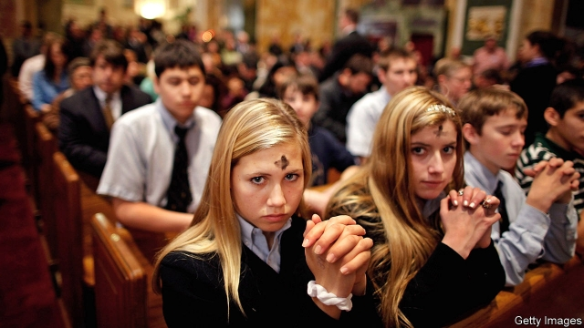

###### Churchgoing

# American religion is starting to look less exceptional 

##### To be young is not quite heaven 

 

> Apr 27th 2019 

FOR ANYONE who studies Americans and their beliefs, the most startling phenomenon of recent times has been the rise of the religious “nones”. About a quarter of the total population, and about a third of those who became adults in the new millennium, identify with no creed. Some new figures suggest the flight from organised religion is even quicker than previously thought. 

The share of Americans who acknowledge being members of a religious group is falling much faster than the proportion who, perhaps loosely, hew to one faith tradition or another. Comparing 2016-2018 with the last three years of the 20th century, declared participants in organised religion have plunged by nearly 20 points to 52%. And among millennials, signing up to a church is a minority (42%) pursuit, according to Gallup, a venerable pollster. 

Membership of any faith is plummeting much faster among Democrats (71% to 48%) than among Republicans (77% to 69%) and it is not hard to imagine why. The closer the embrace between church and the Republican Party, the less appealing faith becomes to those on the left. But religion-watchers see a vast generational change which transcends political loyalty and will eventually embrace politically conservative youngsters too. 

A change towards what, exactly? According to Mike Hout, a sociology professor at New York University, what Americans are rejecting is not the transcendent but simply structures and organisation. Younger Americans are more atomised and provisional in everything they do, from work to relationships, and that affects religious behaviour. He finds it telling that some polls suggest a steady to slightly rising belief in an afterlife, but declining faith in a Christian heaven: people often prefer things to be vague. 

Americans in their 20s have long been less devout than their seniors, but in the old days, they eventually married and brought their children to church. Many of today’s young parents were raised without a faith so they have none to go back to, notes Robert Jones of the Public Religion Research Institute, an independent study centre. 

On the face of things, the United States is now on a path towards secularism that is already far advanced in western Europe, while other rich democracies like Canada are somewhere in between. Gallup’s numbers suggest Democrats are now about as religious as Britons are. “America is not such an outlier any more,” says Mark Silk, a religion professor at Trinity College in Connecticut. 

-- 

 单词注释:

1.les[lei]:abbr. 发射脱离系统（Launch Escape System） 

2.exceptional[ik'sepʃәnәl]:a. 例外的, 异常的, 特别的 

3.APR[]:[计] 替换通路再试器 

4.nones[nәunz]:n. (古罗马历中)3、5、7、11月之第7日或他月之第5日之祈祷 

5.millennium[mi'leniәm]:n. 千禧年, 一千年 

6.creed[kri:d]:n. 宗教信条, 教义, 纲领 

7.loosely['lu:sli]:adv. 松弛地, 宽松地, 不紧 

8.hew[hju:]:vt. 砍, 砍倒, 砍成 vi. 砍, 劈, 坚持 

9.participant[pɑ:'tisipәnt]:n. 参加者, 参与者 a. 有份的, 参加的, 参与的 

10.millennials[mɪ'leniəl]:adj. 一千年的；一千年至福的 [网络] 千禧世代；千禧之子；千禧一代 

11.Gallup['^ælәp]:n. 盖洛普（姓氏）；盖洛普（George Horace, 1901-美国统计学家, 盖洛普民意测验的创始人） 

12.venerable['venәrәbl]:a. 庄严的, 值得尊敬的 

13.pollster['pәulstә]:n. 民意调查人, 民意测验经办人 

14.membership['membәʃip]:n. 会员的资格, 全体会员, 会员数目 [法] 会员资格, 成员资格, 会籍 

15.plummete[]:[网络] 直线下降 

16.democrat['demәkræt]:n. 民主人士, 民主主义者, 民主党党员 [经] 民主党 

17.generational[]:a. 生殖的, 世代的, 代与代之间的, 一代的, 生育的 

18.transcend[træn'send]:vt. 超越, 胜过 

19.politically[]:adv. 政治上 

20.mike[maik]:vi. 偷懒, 游手好闲 n. 休息, 游手好闲, 扩音器, 话筒 

21.hout[]: [地名] [荷兰] 豪特 

22.sociology[.sәusi'ɒlәdʒi]:n. 社会学 [医] 社会学 

23.york[jɔ:k]:n. 约克郡；约克王朝 

24.transcendent[træn'sendәnt]:a. 卓越的, 出类拔萃的, 超常的 n. 卓越的人, 超绝物 

25.organisation[,ɔ: ^әnaizeiʃən; - ni'z-]:n. 组织, 团体, 体制, 编制 

26.atomise['ætәjmaiz]:vt.<主英>=atomize 

27.provisional[prә'viʒәnl]:a. 暂时的, 暂定的, 临时的 [医] 临时的 

28.afterlife['ɑ:ftәlaif]:n. 来世, 下半生 

29.devout[di'vaut]:a. 虔诚的, 虔敬的, 诚恳的 

30.Robert['rɔbәt]:[法] 警察 

31.jones[dʒәunz]:n. 琼斯（姓氏） 

32.secularism['sekjulәrizm]:n. 现世主义, 宗教与教育分离论 

33.Briton['britәn]:n. 大不列颠人, 英国人 

34.outly[]:[网络] 欧特利 

35.trinity['triniti]:n. 三人一组, 三个一组的东西, 三位一体 

36.Connecticut[kә'netikәt]:n. 康涅狄格 

