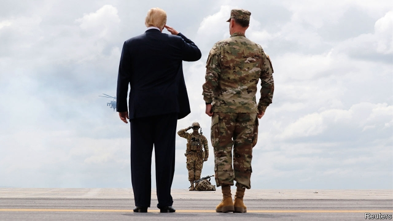

###### The Yemen war

# Congress fails to claw back the right to wage war 

##### President Donald Trump vetoes a law to end America’s role in the Yemen war 

 

> Apr 27th 2019 

WERE THE founding fathers to return, suggested Michael Beschloss, a historian, in “Presidents of War”, they would be “thunderstruck” to discover how the power to kick off major wars could now rest on the whim of a president. Presidents have “regularly told Congress to go to hell” on such matters, as Harry Truman admiringly noted of James Polk, the 11th president. Donald Trump is keeping up that tradition. On April 16th he wielded his veto for only the second time in his presidency to strike down a bill that might have forced him to end America’s support for the Saudi-led war against the Houthi militia in Yemen. The fighting has caused what the UN calls the world’s worst humanitarian crisis. 

That the bill got so far, so quickly, is notable in itself. It sped through Congress–passing the Republican-controlled Senate on March 13th and the House on April 4th—because of expedited procedures, never before used, granted by the War Powers Resolution. This act was passed in 1973 in response to Richard Nixon’s secretive expansion of the Vietnam war. In theory, the resolution tied presidents’ hands by requiring them first to consult Congress before sending forces abroad, and then to ask Congress for a declaration of war or a specific mandate to keep them there beyond 60 days. In practice, most presidents have either stretched or ignored the law. 

Much of the recent stretching has occurred as a result of the sprawling “war on terror”. Three days after the terrorist attacks of September 11th 2001, Congress passed an Authorisation for Use of Military Force (AUMF) permitting George Bush to go after those who “planned, authorised, committed or aided” the atrocity. 

That was clearly a reference to al-Qaeda, then holed up in Afghanistan. But by 2016 the AUMF had been used by Mr Bush and his successor, Barack Obama, 37 times to justify action in 14 countries, “even against groups that did not exist on 9/11”, points out Christopher Anders of the American Civil Liberties Union. Mr Obama, for instance, deployed the AUMF for his war on Islamic State in Iraq and Syria even though the group angrily split from al-Qaeda long ago. 

The War Powers Resolution was gutted long before the elastic AUMF created loopholes wide enough to fly F-16s through. Most presidents after Nixon have simply ignored it, declaring its demands to be an unconstitutional infringement on their executive powers. When the Kosovo war crossed the 60-day mark in 1999, Bill Clinton insisted that Congress had expressed approval by ponying up money for it—never mind that the War Powers Resolution explicitly says that does not count, and that lawmakers are loth to cut off funds for troops in the line of fire. 

The most inventive approach has been to pretend that, contrary to appearances, there is in fact no war. In 2011 Mr Obama said he was free to bomb Libya because the action was led by NATO, did not involve “sustained fighting or active exchanges of fire” and was unlikely to escalate—and so did not meet the definition of “hostilities” envisaged by the War Powers Resolution. Mr Trump has put forward much the same argument for his own entanglement in Yemen (which started under Mr Obama). Indeed, had he signed the Yemen bill rather than vetoed it, it is likely that his administration would have claimed its provisions did not apply to Yemen anyway. 

Lawmakers are right to roll their eyes at such make-believe. After all, American commanders sit in an operations room in Riyadh next to their Saudi counterparts. American engineers service the Saudi warplanes. Until recently American planes refuelled the Saudi bombers mid-flight too. War at arm’s length is still war. 

Meanwhile, the fighting has left 10m Yemenis “one step away from famine”, warns the UN’s World Food Programme. Congress, though exasperated, does not have the numbers to override Mr Trump’s veto. But it is likely to continue the fight in other ways, such as by tacking riders onto the annual National Defence Authorisation Act, which is much trickier for the president to quash. At least some of the founding fathers would have approved. 

-- 

 单词注释:

1.yeman[]:[网络] 也门；叶门；园艺业的普及则始于也门 

2.APR[]:[计] 替换通路再试器 

3.michael['maikl]:n. 迈克尔（男子名） 

4.historian[hi'stɒ:riәn]:n. 历史学家, 记事者 

5.thunderstruck['θʌndәstrʌk]:a. 惊愕的, 吓呆的, 遭雷击的 

6.whim[hwim]:n. 一时的兴致, 冲动, 怪念头, 绞盘 

7.harry['hæri]:vt. 掠夺, 使苦恼, 强使前行, 折磨, 骚扰 

8.truman['tru:mәn]:n. 杜鲁门（男子名） 

9.admiringly[әd'maiәriŋli]:adv. 钦佩地, 羡慕地 

10.jame[]: 灰岩井 

11.polk[pɔlk]:vi. [口]跳波尔卡舞 

12.wield[wi:ld]:vt. 挥舞, 运用 

13.veto['vi:tәu]:n. 否决权 vt. 否决, 禁止 

14.presidency['prezidәnsi]:n. 总统职权, 总裁职位 

15.houthi[]:[网络] 胡塞；也门一侧胡塞；什叶派胡塞 

16.militia[mi'liʃә]:n. 义勇军, 民兵组织, 国民军 

17.UN[ʌn]:pron. 家伙, 东西 [经] 联合国 

18.humanitarian[hju:.mæni'tєәriәn]:n. 人道主义者, 博爱者, 基督凡人论者 a. 人道主义的, 博爱的, 凡人论的 

19.quickly['kwikli]:adv. 很快地 

20.notable['nәutәbl]:n. 著名人士, 值得注意之事物 a. 值得注意的, 显著的 

21.expedit[]:n. 埃克佩迪（品牌名称） 

22.richard['ritʃәd]:n. 理查德（男子名） 

23.secretive[si'kri:tiv]:a. 秘密的, 偷偷摸摸的, 分泌的, 促进分泌的 

24.Vietnam[.vjet'næm]:n. 越南 

25.declaration[.deklә'reiʃәn]:n. 宣告, 说明, 宣布 [计] 说明 

26.mandate['mændeit]:n. 命令, 指令, 要求 vt. 委任统治 

27.sprawl[sprɒ:l]:vi. 伸开手足躺, 爬行, 蔓生, 蔓延 vt. 懒散地伸开, 使蔓生, 使不规则地伸展 n. 伸开手足躺卧姿势 

28.terrorist['terәrist]:n. 恐怖分子 [法] 恐怖份子, 恐怖主义 

29.authorisation[,ɔ:θəraɪ'zeɪʃən]:n. 授权；批准 

30.aumf[]:[网络] 授权使用武力决议(Authorization for Use of Military Force)；军事力量的授权；军事武力使用授权书 

31.george[dʒɔ:dʒ]:n. 乔治（男子名）；自动操纵装置；英国最高勋爵勋章上的圣乔治诛龙图 

32.authorise['ɔ:θәraiz]:vt. 授权；批准；允许；委任（等于authorize） 

33.atrocity[ә'trɒsiti]:n. 残暴, 凶恶, 暴行 [法] 暴行, 残酷, 残忍 

34.Afghanistan[æf'gænistæn]:n. 阿富汗 

35.successor[sәk'sesә]:n. 继承者, 接任者 [计] 后继 

36.barack[bɑ:'ræk]:n. 巴拉克（男子名） 

37.obama[]:n. 奥巴马(姓) 

38.christopher['kristәfә]:n. 克里斯多夫（男子名） 

39.ander[]:n. (Ander)人名；(匈)翁代尔；(瑞典、英)安德 

40.deploy[di'plɒi]:v. 展开, 配置 

41.Islamic[iz'læmik]:a. 伊斯兰教的, 穆斯林的 

42.Iraq[i'rɑ:k]:n. 伊拉克 

43.Syria['siriә]:n. 叙利亚 [经] 叙利亚 

44.angrily['æŋgrili]:adv. 愤怒地 

45.gut[gʌt]:n. 剧情, 内容, 内脏, 肚子, 海峡, 勇气 vt. 取出内脏, 毁坏...的内部 

46.loophole['lu:phәul]:n. 枪眼, 小窗, 换气孔 

47.nixon['niksn]:n. 尼克松（美国第37任总统） 

48.unconstitutional['ʌnkɔnsti'tju:ʃәnәl]:a. 违反宪法的, 不符合宪法的 [法] 违反宪法的, 违宪的, 不合宪法规定的 

49.infringement[in'frindʒmәnt]:n. 违犯, 侵害, 违反, 侵犯 [计] 违反, 侵犯, 侵权, 侵犯 

50.Kosovo['kɔ:sәvәj]:科索沃[南斯拉夫自治省名] 

51.clinton['klintәn]:n. 克林顿（男子名） 

52.ponying[]:矮种马, 小型马( pony的现在分词 )；£25 25 英镑 

53.explicitly[]:adv. 明确地；明白地 

54.lawmaker[lɒ:'meikә]:n. 立法者 

55.loth[lәuθ]:a. 不愿意的, 厌恶的 

56.inventive[in'ventiv]:a. 善于创造的, 发明的 

57.Libya['libiә]:n. 利比亚 

58.NATO['neitәj]:北大西洋公约组织, 北约组织 [经] 北大西洋公约组织 

59.hostility[hɒs'tiliti]:n. 敌意, 敌对, 反对 

60.envisage[in'vizidʒ]:vt. 面对, 正视, 想象 

61.entanglement[in'tæŋglmәnt]:n. 纠缠, 卷入, 缠绕物 [化] 缠结 

62.riyadh[ri:'jɑ:d]:n. 利雅得（阿拉伯半岛中部的城市） 

63.saudi['sajdi]:a. 沙乌地阿拉伯（人或语）的 

64.counterpart['kauntәpɑ:t]:n. 副本, 复本, 配对物, 相应物 [经] 副本, 正副二份中之一 

65.warplane['wɒ:plein]:n. 军用飞机 

66.refuel[ri:'fju:әl]:v. 补给燃料 

67.bomber['bɒmә]:n. 轰炸机, 投弹手 

68.Yemeni['jemәni]:n. 也门人 a. 也门的, 也门人的 

69.exasperate[ig'zæspәreit]:vt. 使恼怒, 激怒, 恶化 a. 糙面的, 恼怒的, 激怒的 

70.override[.әuvә'raid]:vt. 推翻, 无视, 对...有最后发言权, 制服, 践踏, 奔越过 [经] 代理佣金, 代销佣金 

71.tack[tæk]:n. 平头钉, 大头钉, 粗缝针脚, 行动方针, 食物 vt. 以大头针钉住, 附加 

72.tricky['triki]:a. 狡猾的, 机敏的 

73.quash[kwɒʃ]:vt. 撤销, 平息, 镇压 [法] 撤销, 废止, 宣布无效 

