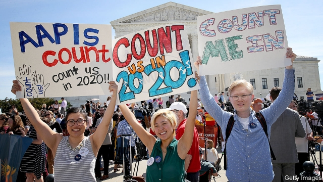

###### Census and sensibility

# Counting America in 2020 

##### The Supreme Court seems inclined to let the Trump administration add a question on citizenship to the census 

 

> Apr 27th 2019 

LAST JUNE, when his vote clinched a 5-4 majority blessing President Donald Trump’s entry ban on travellers from several Muslim countries, Justice Anthony Kennedy subtly wagged his finger in the president’s direction. Even when the judiciary grants executive officials “substantial deference”, Justice Kennedy wrote, it is an “urgent necessity” that they respect “constitutional guarantees and mandates”. A year later, with another controversial Trump administration policy blocked by a trio of federal district courts, the Supreme Court again appears poised to hand the executive branch a victory. But with Justice Brett Kavanaugh in Justice Kennedy’s chair, the conservative majority is more resolute. Mr Trump will probably score a party-line win. 

The case, Department of Commerce v New York, asks whether Wilbur Ross, the commerce secretary, lawfully added a question about citizenship to the 2020 census despite evidence that the move would scare off millions of people from completing the form. The constitution requires a count of “the whole number of persons in each State” every ten years. The census dictates how the 435 seats in the House of Representatives are allocated, and thus how many electoral-college votes should go to each state. Hundreds of billions of federal dollars are divided up according to state population, too. Areas where people are undercounted will suffer until at least 2030. 

Soon after taking office in February 2017 Mr Ross sat down with Steve Bannon, Mr Trump’s erstwhile adviser, known for his hard line against immigration, to discuss adding a citizenship question to the census. Before announcing the decision, the commerce secretary undertook a belated quest to find a legal justification for doing so. At the oral argument, Justice Elena Kagan told the solicitor general, Noel Francisco, “you can’t really read this record without sensing” that the need for a citizenship query was “contrived”. Only after floating the concept with the Department of Justice (DOJ) and the Department of Homeland Security and phoning the attorney-general, Justice Kagan recounted, did the attorney-general come through with a letter saying the question was needed to enforce the Voting Rights Act of 1965. The request contradicted the view of experts from the Census Bureau and six of its former directors who served under both Democratic and Republican administrations. 

Mr Ross’s stated justification for querying citizenship, the lower courts found, was just a pretext. The rulings did not mention that in recent years conservatives have not exactly demonstrated a desire to maximise turnout from ethnic minorities at election time. Judge Jesse Furman pointed to evidence that the question would result in less accurate and less complete citizenship data than other surveys while dampening response rates disproportionately in immigrant and Hispanic households. Together with similar rulings in California and Maryland, Judge Furman in New York found a “veritable smorgasbord” of procedural irregularities surrounding the addition of the citizenship question. Given those deficiencies, he found Mr Ross’s move to be “arbitrary and capricious”, in violation of administrative law. 

At the hearing, the five Republican-appointed justices, including Mr Trump’s two, sounded untroubled by Mr Ross’s rationale for amending the census form. Justice Neil Gorsuch noted that “virtually every English-speaking country and a great many others besides ask this question in their censuses.” Justice Kavanaugh added that the “United Nations recommends” asking about citizenship. The census asked the question from the early 19th century until 1950, and a portion of households were asked the question until 2000. Justices Samuel Alito and Gorsuch teamed up to speculate about other reasons immigrants might not fill out the questionnaire. Maybe “socioeconomic status”, “education” or “language ability” contribute to the differential response rates between citizens and non-citizens, Justice Alito mused. 

Mr Francisco gratefully received this benefit of the doubt, and tersely parried the liberal justices’ arguments. “It really does boil down”, Mr Francisco said, “to whether the secretary’s judgment here is a reasonable one.” And in weighing whether to sacrifice a decline in response rates for more citizenship data, Mr Ross “reasonably chose to go with the bird in the hand.” The oral argument suggests the five conservatives have a clear—if fraught—path to approving the question. The justices can simply defer to the official, brushing aside evidence about his motives. 

-- 

 单词注释:

1.census['sensәs]:n. 户口普查 vt. 实施统计调查 

2.sensibility[.sensi'biliti]:n. 感性, 感觉, 情感 [医] 感觉性, 感受性; 感觉, 感觉能力 

3.citizenship['sitizәnʃip]:n. 国籍, 市民权, 市民的身份 [法] 公民权, 公民资格, 公民身分 

4.census['sensәs]:n. 户口普查 vt. 实施统计调查 

5.APR[]:[计] 替换通路再试器 

6.clinch[klintʃ]:n. 钉牢 v. 敲弯, 用臂钳住 

7.traveller['trævlә]:n. 旅行者 [经] 旅行商 

8.Muslim['mjzlim; (?@) 'mʌzlem]:n. 伊斯兰教, 伊斯兰教教徒 

9.anthony['æntәni]:n. 安东尼（人名） 

10.kennedy['kenidi]:n. 肯尼迪（姓氏, 美国第35任总统） 

11.subtly['sʌtli]:adv. 敏锐地, 巧妙地, 精细地 

12.judiciary[dʒu:'diʃiәri]:a. 司法的, 法院的, 法官的 n. 司法部, 司法系统, 法官 

13.deference['defәrәns]:n. 顺从, 尊重 

14.constitutional[.kɒnsti'tju:ʃәnl]:a. 宪法的, 立宪的, 体质的 [医] 全身的; 体质的 

15.mandate['mændeit]:n. 命令, 指令, 要求 vt. 委任统治 

16.trio['tri:әu]:n. 三重唱 

17.poise[pɒiz]:n. 平衡, 均衡, 姿势, 镇静, 安静, 砝码 vt. 使平衡, 使悬着, 保持...姿势 vi. 平衡, 悬着, 准备好 

18.brett[bret]:n. 布雷特（男子名） 

19.kavanaugh[]: [人名] 卡瓦诺 

20.resolute['rezәlu:t]:n. 果断的人 a. 坚决的, 刚毅的, 毅然的 

21.V[vi:]:[计] 溢出, 变量, 向量, 检验, 虚拟, 垂直 [医] 钒(23号元素) 

22.york[jɔ:k]:n. 约克郡；约克王朝 

23.wilbur['wilbә]:n. 威尔伯（男子名, 等于Wilber） 

24.ros[]:abbr. 只读存储器（Read-Only-Storage）；活性氧（Reactive oxygen species） 

25.lawfully[]:adv. 守法地；合法地 

26.undercounted[]:[网络] 不足 

27.steve[]:n. 史蒂夫（男子名） 

28.bannon[]:n. (Bannon)人名；(英)班农 

29.erstwhile['ә:stwail]:adv. 以前, 往昔地 a. 以前的, 往昔的 

30.adviser[әd'vaizә]:n. 顾问, 劝告者, 指导教师 [法] 顾问, 劝告者 

31.belated[bi'leitid]:a. 迟来的 [法] 过了期的, 落后了的 

32.quest[kwest]:n. 探索, 寻求, 调查 v. 寻找, 找, 追寻猎物 

33.justification[.dʒʌstifi'keiʃәn]:n. 辩护, 证明正当, 释罪 [计] 调整 

34.elena[ә'leinә,'elәnә]:n. 埃琳娜（女子名, 等于Helen） 

35.kagan[]:n. (Kagan)人名；(英)卡根；(俄、芬、瑞典、法)卡甘 

36.solicitor[sә'lisitә]:n. (英)律师, 初级律师, (美)法务官, (美)掮客, 游说者, (美)募捐者 [经] 募损者, 律师 

37.Noel[nәu'el]:n. 圣诞节, 圣诞颂歌 

38.francisco[fræn'siskәu]:n. 弗朗西斯科（男子名, 等于Francis） 

39.query['kwiәri]:n. 疑问, 疑问号, 质问, 查询 v. 询问, 质问 [计] 查询 

40.contrive[kәn'traiv]:v. 发明, 设计, 图谋 

41.doj[]:abbr. Department of Justice <美国>司法部 

42.recount[ri'kaunt]:vt. 详述, 叙述, 重新计算 n. 重新计算 

43.pretext['pri:tekst]:n. 借口, 托词 v. 以...为借口 

44.ruling['ru:liŋ]:n. 判决, 裁定, 统治 a. 统治的, 支配的, 普遍的 

45.maximise['mæksimaiz]:vt. 把...增加到最大限度, 把...扩大到最大限度, 充分重视, 找出...的最高值 

46.turnout['tә:naut]:n. 聚集的人群, 出席者, 产量 [化] 输出; 产额 

47.ethnic['eθnik]:a. 人种的, 种族的 [医] 人种的 

48.Jesse['desi]:n. 耶西(<<圣径>>故事人物) 

49.furman[]: [人名] [英格兰人姓氏] 弗曼 Firmin的变体 

50.les[lei]:abbr. 发射脱离系统（Launch Escape System） 

51.datum['deitәm]:n. 论据, 材料, 资料, 已知数 [医] 材料, 资料, 论据 

52.dampen['dæmpәn]:vt. 弄湿, 使沮丧 vi. 变湿, 丧气 

53.disproportionately[]:adv. 不匀称, 不相称 

54.Hispanic[his'pænik]:a. 西班牙的 

55.California[.kæli'fɒ:njә]:n. 加利福尼亚 

56.Maryland['merilәnd]:n. 马里兰州 

57.veritable['veritәbl]:a. 名副其实的, 真实的, 确实的, 真的 

58.smorgasbord['smɔ:^әsbɔ:d]:n. 瑞典式自助餐 

59.procedural[prә'si:dʒәrәl]:a. 程序上的 [经] 程序上的 

60.irregularity[i.regju'læriti]:n. 不规则, 例外, 违反规则的行为 [化] 不匀度 

61.deficiency[di'fiʃәnsi]:n. 缺乏, 不足 [医] 缺乏, 不足 

62.capricious[kә'priʃәs]:a. 反复无常的, 多变的, 任性的 

63.violation[.vaiә'leiʃәn]:n. 违反, 违背, 妨碍 [法] 违犯, 违背, 违反 

64.administrative[әd'ministrәtiv]:a. 管理的, 行政的 [法] 行政的, 管理的, 遗产管理的 

65.untroubled['ʌn'trʌbld]:a. 不烦恼的, 无忧虑的, 未被扰乱的, 未受骚扰的, 平静的 

66.rationale[.ræʃә'nɑ:li]:n. 基本原理 [医] 原理, 理论 

67.amend[ә'mend]:vt. 修改, 改善, 改良 vi. 改过自新 

68.neil[]:n. 尼尔（男子名） 

69.gorsuch[]: [人名] [英格兰人姓氏] 戈萨奇 Gossage的变体 

70.samuel['sæmjuәl]:n. 撒母耳（希伯来先知）；塞缪尔（男子名） 

71.alito[]:n. (Alito)人名；(英)阿利托 

72.speculate['spekjuleit]:vi. 深思, 推测, 投机 [经] 投机 

73.socioeconomic['sәuʃiәu,i:kә'nɔmik]:a. 社会经济学的 

74.statu[]:[网络] 状态查看；雕像；特级雪花白 

75.differential[difә'renʃәl]:a. 差别的, 特异的, 微分的 n. 差别, 两路线运费差额, 工资差额 

76.muse[mju:z]:n. 沉思, 冥想 v. 沉思, 冥想, 若有所思地凝望或说 

77.gratefully['greitfuli]:adv. 感激地 

78.tersely[tɜ:slɪ]:adv. 简洁地, 精练地 

79.parry['pæri]:vt. 挡开, 回避, 闪避的回答 n. 挡开, 回避, 闪避的回答 

80.judgment['dʒʌdʒmәnt]:n. 裁判, 宣告, 判决书 [医] 判断 

81.reasonably['ri:znәbli]:adv. 适度地, 相当地 

82.defer[di'fә:]:vi. 推迟, 延期, 听从 vt. 使推迟, 使延期 

