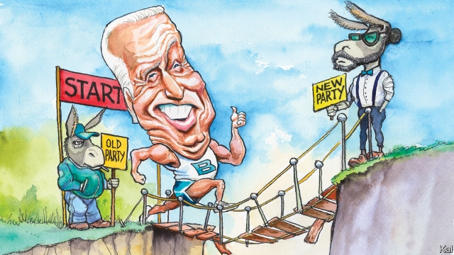

###### Lexington

# Joe Biden provides a fossil record of how the Democrats have changed 

##### The former vice-president will have to show he has changed with it 

 

> Apr 25th 2019 

ENTERING TO Bruce Springsteen’s “We Take Care of Our Own”, as his friend Barack Obama used to, Joe Biden performed a dress rehearsal for his long-awaited entry to the Democratic primary in Washington, DC, earlier this month. His audience, burly delegates of the International Brotherhood of Electrical Workers, were the sort of working-class voters the 76-year-old former vice-president is counting on to nullify the hard-left. He duly regaled them with familiar lines about Scranton, the Pennsylvanian mining-town his family fled almost seven decades ago. He also cracked gags about the recent controversy over his career-long habit of sniffing, kissing and pawing at women. “I just want you to know,” he deadpanned to the union men—twinkly old Uncle Joe style—that he “had permission to hug” their leader. If that is how Mr Biden, who enters the primary this week as the front-runner, means to handle his long and spotted history of statements and behaviour anathema to the modern Democratic Party, he might not last long. 

As things stand, he owes his lead status to propitious circumstances, including the apparent lack of an outstanding alternative and his association with the revered Mr Obama. There is an obvious risk that he will fizzle as he did during two previous presidential runs, when he was an outsider and much less of a target to his opponents than he is now. Mr Biden is knowledgeable, likeable, right-minded, hugely experienced and polished in the way of an old-style variety show host. The way he glides up and down the emotional register—one moment seething, the next lachrymose—is something to behold. He is also garrulous, gaffe-prone and not obviously au fait with modern America. In other words, he has work to do, assuming he has the energy for it. Meanwhile, the suspicion that his candidacy is an anachronism makes it an extreme test-case for the Democrats’ biggest dilemma: how to reconcile the ideological purity demanded by an activist wing increasingly dedicated to racial, gender and sexual equality, with the real world of muddy compromises and more mixed social attitudes. 

This tension in the party is in part a product of the erosion of its unionised base, which has left it with a more fractured coalition of hipsters, minorities and immigrants. Such diversity requires constant management, leading to an almost fetishistic attention to liberal unifying principles by Democratic activists, which engenders intolerance. This is at odds with the more nuanced views of most voters. Mr Biden’s partnership with Mr Obama—the hip son of an African migrant—bridged the gap. The question is whether the bridge can still stand in the absence of its Obama-sized pier. 

Hence the early attention to the many ways Mr Biden—over the course of a career in Democratic politics that began when the party still contained segregationists—has offended against contemporary liberal standards. Early examples include his dismissive treatment, as chairman of the Senate Judiciary Committee, of Anita Hill, a black woman who accused Clarence Thomas of sexual harassment during his Supreme Court confirmation hearing; Mr Biden’s disdainful attitude towards busing as a means to racially integrate schools; and his support for Bill Clinton’s draconian criminal-justice reforms. More such examples will arise. Mr Biden has a decades-long reputation for stirring controversy and his current main rival, Bernie Sanders, an emerging one for ruthlessness. 

Certain kinds of past transgression are now straightforwardly disqualifying among Democrats. In light of #MeToo, Mr Clinton has become an embarrassment. The more interesting thing about Mr Biden’s case is that he does not appear guilty of anything that was considered inappropriate at the time. His mistreatment of Ms Hill reflected the usual 1980s male chauvinism. It was also intended to help a black man reach the Supreme Court bench. Similarly, some of his policy positions have come to seem controversial mainly due to ignorance about their circumstances. Criminal-justice reform in the 1990s was fuelled by a fear of violent crime that has been largely forgotten on the left. Busing was in many places counter-productive; it exacerbated racial tension and left schools as segregated but worse-run than they were before. These contradictions represent a challenge to the Democrats’ liberal mullahs which is further complicated by Mr Biden’s mercurial nature. 

American politics has a strong redemption tradition. Yet Mr Biden’s career is not merely defined by a relentless and contrite movement towards more liberal positions. Rather, he has always been broadly liberal, but with a propensity to lapse. He started work on the Violence Against Women Act, one of his big achievements, a year before his mishandling of Ms Hill. This makes him, warts and all, as contradictory as most voters, and in that sense a cautionary lesson for the purist left. Whether it can learn from it, however, will depend less on Mr Biden’s record than his present skill at explaining, defending and, where necessary, apologising for it. This is also the main reason to worry about his candidacy. 

“The past is never past, it is always present”, Mr Biden’s favourite singer, Mr Springsteen, once said. In the same way, political skeletons tend to do damage only when they highlight some current weakness. Mr Sanders had no trouble brushing off his patchy history on gun control because his progressive bona fides were not in doubt. Hillary Clinton’s callousness towards her husband’s female accusers was damaging, because it chimed with her reputation for cynicism. Mr Biden, who enters the race much-loved on the left, despite his shortcomings, has an easier opportunity to account for his record. He should defend his support for criminal-justice reform, explain his opposition to busing—and apologise to Ms Hill and to anyone upset by his handsiness. But does he have the contemporary political nous to make such necessary judgments and the discipline to stick by them? If not, he will fail, because those are also the biggest questions about his candidacy. That is why his recent joking about groping was so ominous. 

-- 

 单词注释:

1.lexington['leksiŋtәn]:n. 列克星敦市（位于美国肯塔基州） 

2.joe[dʒәu]:n. 乔（男子名） 

3.biden[baidən]: [人名] 拜登 

4.fossil['fɒsәl]:n. 化石, 古物 a. 化石的, 陈腐的, 守旧的 

5.democrat['demәkræt]:n. 民主人士, 民主主义者, 民主党党员 [经] 民主党 

6.APR[]:[计] 替换通路再试器 

7.Bruce[bru:s]:n. 布鲁斯 

8.barack[bɑ:'ræk]:n. 巴拉克（男子名） 

9.obama[]:n. 奥巴马(姓) 

10.Washington['wɒʃiŋtn]:n. 华盛顿 

11.DC[]:直流电 [计] 数据单元, 数据中心, 数据代码, 数据通信, 数据控制, 数字控制, 直流 

12.burly['bә:li]:a. 结实的, 粗壮的, 率直的 

13.voter['vәutә]:n. 选民, 投票人 [法] 选民, 选举人, 投票人 

14.nullify['nʌlifai]:vt. 使无效, 废弃, 取消 [化] 使等于零; 作废 

15.duly['dju:li]:adv. 恰当地, 充分地, 适当地, 及时地 

16.regale[ri'geil]:vt. 款待, 使快乐 vi. 享用 n. 盛宴, 佳肴, 款待 

17.scranton['skræntәn]:n. 斯克兰顿（美国宾夕法尼亚州东北部城市） 

18.Pennsylvanian[.pensil'veinjәn]:a. 宾夕法尼亚的 n. 宾夕法尼亚人 

19.gag[gæg]:n. 箝口物, 箝制言论, 讨论终结 vt. 阻塞, 压制言论自由, 使窒息, 使呕吐, 插科打浑, 欺骗 vi. 窒息, 作呕, 欺骗, 插科打浑 

20.controversy['kɒntrәvә:si]:n. 论争, 辩论, 论战, 争论 [法] 论战, 争论, 争吵 

21.deadpanned[]:adj. 不带感情色彩的(地) n. 毫无表情的喜剧演员 [网络] 无表情的脸；冷面；面无表情 

22.anathema[ә'næθәmә]:n. 令人厌恶的人, 强烈的遣责, 诅咒, 咒逐, 革出教门 

23.statu[]:[网络] 状态查看；雕像；特级雪花白 

24.propitious[prә'piʃәs]:a. 顺利的, 适合的, 吉祥的, 慈悲的 

25.rever[]:n. 作梦（歌名） 

26.fizzle['fizl]:n. 嘶嘶声, 失败 vi. 发嘶嘶声, 失败 

27.presidential[.prezi'denʃәl]:a. 总统制的, 总统的, 首长的, 统辖的 [法] 总统的, 议长的, 总经理的 

28.outsider[' aut'saidә]:n. 外人, 局外人, 非会员, 外行, 门外汉, 比赛中获胜可能性不大的选手 [经] 外船公司 

29.les[lei]:abbr. 发射脱离系统（Launch Escape System） 

30.knowledgeable['nɒlidʒәbl]:a. 聪明的, 有知识的 

31.likeable['laikәbl]:a. 可爱的, 值得喜欢的, 迷人的 

32.hugely['hju:dʒli]:adv. 巨大地, 非常地 

33.sethe[]:n. (Sethe)人名；(德)泽特 

34.behold[bi'hәuld]:vt. 看到, 注视 vi. 看 

35.garrulous['gærulәs]:a. 饶舌的, 多嘴的, 喋喋不休的 

36.AU[әu]:[计] 加法器, 运算器, 声频 [医] 金(79号元素) 

37.fait[]:[法] 契据, 事实, 行为 

38.candidacy['kændidәsi]:n. 候选人的地位, 候选资格 [法] 候选人的身份, 资格 

39.anachronism[ә'nækrәnizәm]:n. 时代错误, 不合潮流的人(物) [法] 时代错误, 落伍的事物 

40.reconcile['rekәnsail]:vt. 使和解, 调停, 使和谐, 使一致, 使听从 [经] 对帐, 使一致 

41.ideological[.aidiә'lɒdʒikәl]:a. 意识形态的, 空想的 [法] 思想的, 思想上的, 意识形态的 

42.activist['æktivist]:n. 激进主义分子 

43.dedicate['dedikeit]:vt. 献出, 贡献 

44.gender['dʒendә]:n. 性 vt. 产生 

45.erosion[i'rәuʒәn]:n. 腐蚀, 冲蚀, 侵蚀 [化] 磨耗; 侵蚀 

46.unionised[,ʌn'aiәnaizd]:a. <主英> = unionized 

47.fracture['fræktʃә]:n. 破碎, 骨折 v. (使)破碎, (使)破裂 

48.coalition[.kәuә'liʃәn]:n. 结合体, 结合, 联合 [经] 联合, 联盟 

49.hipster['hipstә]:n. 世面灵通的人 

50.diversity[dai'vә:siti]:n. 差异, 多样性 [化] 多样性 

51.fetishistic[.fi:ti'ʃistik]:a. 崇拜物神的, 迷信的 

52.unify['ju:nifai]:v. 统一, 使成一体 

53.engender[in'dʒendә]:vt. 产生, 引起 vi. 发生, 形成 

54.intolerance[in'tɒlәrәns]:n. 不宽容, 偏狭, 不容许相反的言论 [医] 不耐[性] 

55.odds[ɒdz]:n. 可能性, 几率, 机会, 胜算, 不平等 

56.nuance[nju:'ɑ:ns]:n. 细微差别 

57.partnership['pɑ:tnәʃip]:n. 合伙, 合股, 合作关系 [经] 合伙(合作)关系, 全体合伙人 

58.hip[hip]:n. 臀部, 蔷薇果, 忧郁 a. 熟悉内情的 vt. 使忧郁, 给(屋顶)造屋脊 interj. 喝彩声 

59.pier[piә]:n. 码头, 桥墩, 支框, 防波堤 [医] 桥基, 基牙 

60.politic['pɒlitik]:a. 精明的, 明智的, 策略的 

61.dismissive[dis'misiv]:a. 轻视的 

62.judiciary[dʒu:'diʃiәri]:a. 司法的, 法院的, 法官的 n. 司法部, 司法系统, 法官 

63.anita[ә'ni:tә]:n. 安尼塔（女子名） 

64.clarence['klærәns]:n. 克拉伦斯马车(一种四轮马车) 

65.thoma[]:n. (Thoma)人名；(阿尔巴、阿拉伯)索玛；(英、德、罗、匈、捷、塞、瑞典)托马 

66.harassment['hærәsmәnt]:n. 困扰, 烦扰, 烦恼 [法] 折磨, 骚扰, 侵扰 

67.confirmation[.kɒnfә'meiʃәn]:n. 证实, 证明, 批准, 确认 [计] 确认 

68.disdainful[dis'deinful]:a. 轻蔑的, 倨傲的 

69.buse[]: [人名] 布斯 

70.racially['reiʃәli]:adv. 按人种, 人种上 

71.draconian[drә'kәjniәn]:a. 严厉的, 残酷的 

72.bernie['bә:ni]:n. 伯尼（男子名）；[俚]可卡因（等于cocaine） 

73.sander['sændә]:[电] 散沙 

74.ruthlessness[]:n. 无情；冷酷；残忍 

75.transgression[træns'greʃәn]:n. 违反, 犯罪 [医] 亲和转移 

76.straightforwardly[ˌstreɪt'fɔ:wədlɪ]:adv. 正直地 

77.disqualify[dis'kwɒlifai]:vt. 使不适合, 取消...资格 

78.metoo['metkəʊ]:adj. 〈美口〉行仿效计策的 v. 同意(对方的政见等) [网络] 咪兔；我也是；蜜桃 

79.clinton['klintәn]:n. 克林顿（男子名） 

80.embarrassment[im'bærәsmәnt]:n. 困难, 阻碍, 困窘 [医] 窘迫 

81.inappropriate[.inә'prәupriәt]:a. 不适当的, 不相称的 

82.mistreatment[]:n. 虐待 

83.chauvinism['ʃәuvinizm]:n. 盲目的爱国主义, 沙文主义 [法] 沙文主义 

84.ignorance['ignәrәns]:n. 无知, 愚味 [法] 无知, 不知情, 愚昧 

85.exacerbate[ek'sæsәbeit]:vt. 使恶化, 使增剧, 激怒, 使加剧 

86.segregate['segrigeit]:a. 分离的, 被隔离的 vi. 分离, 隔离, 分凝 vt. 使分离, 使隔离 

87.mullah['mʌlә]:n. 毛拉 

88.mercurial[mә:'kjuәriәl]:a. 水星的, 敏捷的, 活泼的, 水银的 n. 汞剂 

89.redemption[ri'dempʃәn]:n. 赎回, 赎身, 偿还, 拯救 [经] 偿还, 买回, 赎回 

90.relentless[ri'lentlis]:a. 无情的, 冷酷的, 残酷的 

91.contrite['kɒntrait]:a. 悔悟了的, 后悔的, 痛悔的 

92.alway['ɔ:lwei]:adv. 永远；总是（等于always） 

93.broadly['brɒ:dli]:adv. 宽广地, 明白地, 无礼貌地 

94.propensity[prә'pensәti]:n. 倾向, 爱好, 习性 

95.lapse[læps]:n. 过失, 流逝, 失效 vi. 犯错, 堕落, 减退, 消失, 流逝 vt. 使失效 

96.mishandle[mis'hændl]:vt. 虐待, 胡乱处理 

97.wart[wɒ:t]:n. 疣, 瘤 [医] 疣, 肉赘 

98.cautionary['kɒ:ʃәnәri]:a. 警告的 

99.purist['pjuәrist]:n. 纯粹主义者 

100.apologise[ә'pɔlәdʒaiz]:vi. 道歉（等于apologize） 

101.Springsteen[]:斯普林斯汀（姓氏） 

102.skeleton['skelәtn]:n. 骨骼, 骨瘦如柴的人, 梗概, 骨干, 残骸 a. 骨骼的, 概略的, 基层的, 骨干的 [计] 骨架 

103.patchy['pætʃi]:a. 补缀的, 凑合的, 不调和的, 散落的, 斑驳的, 不完全的 

104.bona['bәunә]:[法] 善良, 真诚 

105.fide['fide]: [体]国际棋联 

106.Hillary['hiləri:]:n. 希拉里（美国现任国务卿） 

107.callousness['kæləsnis]:n. 麻木不仁 

108.accuser[ә'kju:zә]:n. 控诉者, 指责者 [法] 原告, 指控人, 控告者 

109.chime[tʃaim]:n. 钟声, 钟, 和谐 vi. 鸣, 奏出谐和的乐声, 和谐 vt. 敲出和谐的声音, 打钟报时, 重复说 

110.cynicism['sinisizm]:n. 犬儒主义 

111.opposition[.ɒpә'ziʃәn]:n. 反对, 敌对, 相反, 在野党 [医] 对生, 对向, 反抗, 反对症 

112.nous[naus]:n. 精神, 常识 [医] 智力, 理智 

113.judgment['dʒʌdʒmәnt]:n. 裁判, 宣告, 判决书 [医] 判断 

114.grope[grәup]:v. 摸索 n. 摸索 

115.ominous['ɒminәs]:a. 恶兆的, 不吉利的, 预兆的 

