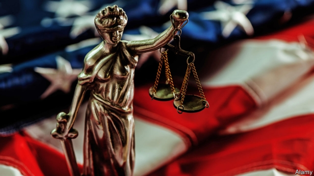

###### Vote and be hanged

# New research confirms old suspicions about judicial sentencing 

##### Alexis de Tocqueville was right, again 

 

> Apr 27th 2019 

“SOONER OR LATER,” warned Alexis de Tocqueville in 1835, judicial elections “will have dire results”. One day, he continued, “it will be perceived that by so diminishing the independence of the magistrates, not only has judicial power been attacked, but the democratic republic itself”. His warning was not heeded: most states elect judges to at least some courts. 

Today’s opponents of judicial elections cite two main fears. The first is that judges may rule more favourably to those who contributed to their campaigns. Cognisant of such concerns, in 2015 Chief Justice John Roberts joined the Supreme Court’s liberals to uphold a state ban on judges personally soliciting campaign donations. “Judges are not politicians,” wrote Mr Roberts, “even when they come to the bench by way of the ballot…A state may assure its people that judges will apply the law without fear or favour—and without having personally asked anyone for money.” 

The second worry is that judges will impose harsher sentences to curry favour with voters: “Hang ‘em high!” is a catchier campaign slogan than “Impartially apply the law to each case even when doing so produces unpopular results.” A new working paper by Christian Dippel of UCLA Anserson and Michael Poyker of Columbia Business School measures this. Several studies have shown that judges tend to impose more punitive sentences when facing re-election, but those studies have come from just three states (Kansas, Pennsylvania and Washington). The authors added evidence from eight more. In only one of the eight (North Carolina) did they find that judges become more punitive when they know they will be facing voters shortly. 

In four of the 11 states where there is solid evidence, then, judges tend to sentence defendants convicted of serious crimes more harshly shortly before they file for re-election than they do at the beginning of their terms. The authors focused on serious crimes such as murder, rape and assault “because these are more visible to voters”. People tend to prefer judges who protect society from killers to those who protect it from jaywalkers. 

The authors hypothesise that the more competitive state judicial elections are, the more likely judges are to impose harsher sentences. In states with uncompetitive judicial elections, by contrast, “judgeships appear to be viewed as positions that should be obtained by appointment, never mind the electoral rules,” and judges apply the law more consistently. 

Unfortunately judicial elections are only growing more competitive. In the 2015-16 election cycle, Pennsylvania set a national record for money spent in state supreme-court elections—$21.4m for three seats, most of which the candidates raised themselves. North Carolina saw more money spent ($5.4m for a single seat, most of it from outside groups) than any state other than Pennsylvania. Kansas set a state spending record ($2.1m for five seats) and Washington also saw $2.8m spent for three seats. Much of that money came from unknown sources; the Brennan Centre, a think-tank and advocacy group, could trace just 18% of the $27.8m of outside group spending on state supreme-court races in 2015-16. That cycle set a record for justices elected in $1m-or-more races (27). That is good news for political consultants and campaign measures, but not for justice. 

-- 

 单词注释:

1.judicial[dʒu:'diʃәl]:a. 法庭的, 公正的, 审判上的, 司法的 [法] 司法的, 审判上的, 法官的 

2.alexi[]:亚历克西（男子名） 

3.de[di:]:[化] 非对映体过量 [医] 铥(69号元素铥的别名,1916年Eder离得的假想元素) 

4.Tocqueville[]:托克维尔(人名） 

5.APR[]:[计] 替换通路再试器 

6.dire[daiә]:a. 可怕的, 悲惨的, 阴沉的, 极端的 

7.diminish[di'miniʃ]:v. (使)减少, (使)变小 

8.magistrate['mædʒistreit]:n. 长官, 法官, 推事 [法] 司法行政官, 治安法官, 地方法官 

9.cite[sait]:vt. 引用, 引证, 表彰 [建] 引证, 指引 

10.favourably[]:adv. 顺利地；有利地；好意地（等于favorably） 

11.cognisant['kɔ^nizәnt]:a. <主英>=cognizant 

12.john[dʒɔn]:n. 盥洗室, 厕所, 嫖客 

13.Robert['rɔbәt]:[法] 警察 

14.uphold[ʌp'hәuld]:vt. 支撑, 赞成, 鼓励, 举起, 坚持 [法] 确认, 赞成, 支持 

15.solicit[sә'lisit]:v. 请求, 乞求, 招揽, 征求 

16.donation[dәu'neiʃәn]:n. 捐赠物, 捐款, 捐赠 [经] 赠品, 捐款, 捐赠 

17.curry['kʌri. 'kә:ri]:n. 咖哩粉, 咖哩饭菜 vt. 用咖哩粉调味, 用马梳梳, 制革 

18.catchy['kætʃi]:a. 易记住的, 欺骗性的, 不规则发生的 

19.impartially[ˌɪmˌpɑ:ʃəlɪ]:adv. 公平地, 无私地; 秉公 

20.unpopular['ʌn'pɔpjulә]:a. 不得人心的, 不受欢迎的, 不流行的 

21.dippel[]:[网络] 迪佩尔 

22.ucla[]:abbr. 加州大学洛杉矶分校（University of California at Los Angeles） 

23.michael['maikl]:n. 迈克尔（男子名） 

24.Columbia[kә'lʌmbiә]:n. 哥伦比亚 

25.punitive['pju:nitiv]:a. 刑罚的, 惩罚性的 [法] 刑罚的, 惩罚性的, 结予惩处的 

26.kansa[]:n. （日语）监察；堪萨人（旧时居住在美国堪萨斯州一带的印第安人） 

27.Pennsylvania[.pensil'veinjә]:n. 宾夕法尼亚 

28.Washington['wɒʃiŋtn]:n. 华盛顿 

29.Carolina[.kærә'lainә]:n. 北(或南)卡罗来纳州 

30.voter['vәutә]:n. 选民, 投票人 [法] 选民, 选举人, 投票人 

31.defendant[di'fendәnt]:n. 被告 [经] 被告方 

32.convict[kәn'vikt]:n. 囚犯, 罪犯 vt. 宣告有罪, 使知罪 

33.harshly['hɑ:ʃli]:adv. 粗糙地, 粗暴地, 刺耳地 

34.rape[reip]:n. 抢夺, 掠夺, 强奸, 葡萄渣, 芸苔 vt. 掠夺, 抢夺, 强奸 

35.assault[ә'sɒ:t]:n. 攻击, 袭击 vt. 袭击, 攻击 vi. 发动攻击 

36.killer['kilә]:n. (非正式)杀人者, 屠杀者, 猛兽, 致死(疾病), 杀手, 止痛药, 限制器, 瞄准器 [计] 删除程序; 断路器 

37.jaywalker['dʒeɪwɔ:kə(r)]: 乱穿马路的人 

38.hypothesise[haɪ'pɒθɪsaɪz]:v. （英）假定；设定；假设（等于hypothesize） 

39.uncompetitive[ˌʌnkəmˈpetətɪv]:a. 无竞争力的 

40.judgeship['dʒʌdʒʃip]:n. 法官的地位 [法] 法官的职权, 任期或地位 

41.electoral[i'lektәrәl]:a. 选举人的, 选举的, (有关)选举的 [法] 选举的, 选举人的, 由选举人组成的 

42.consistently[]:adv. 坚固, 坚实, 一致, 始终如一, 连贯 [计] 相容地 

43.brennan['brenәn]:n. 布伦南（姓氏） 

44.advocacy['ædvәkәsi]:n. 拥护, 支持, 鼓吹, 辩护, 辩护术 [法] 辩护, 拥护, 提倡 

