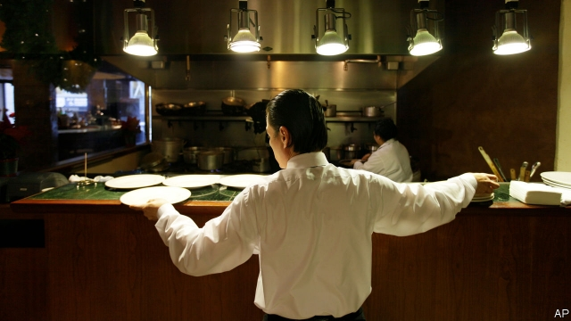

###### Floored

# The federal minimum wage is becoming irrelevant 

##### A patchwork approach to setting a floor on pay has its advantages 

 

> Apr 27th 2019 

IT IS NORMAL for America’s federal minimum wage to go through periods of declining influence. It is fixed in cash terms, meaning it bites hardest whenever Congress raises it, then declines in relevance as earnings grow. Between 1998 and 2006, for example, the federal minimum stayed constant at $5.15 per hour, while average wages grew by around 30%. What is unusual about the last decade is that another force is also causing the federal pay floor to be left behind: state and local governments. According to the University of California Berkeley’s Labour Centre, a research hub, 44 cities and counties apply their own minimum wages today, compared to just five before 2012. At the start of 2019, 20 states raised their pay floors. 

A new analysis from Ernie Tedeschi of Evercore ISI, a consultancy, quantifies just how much more assertive state and city governments have become. During the early 2000s, with the federal floor flat, they raised their minimum wages, but not by enough to keep up with the broader labour market. As a result the share of hours worked at minimum pay—either federal, state or local, and excluding tipped or salaried workers—fell, from 5% in 1998 to a little over 2%. But since 2009, despite wage growth and a flat federal minimum, the share of hours worked at some minimum wage has stayed constant, at around 5%. The explanation is growing intervention outside Washington. In 2010 state and local minimum wages were binding for around 40% of hours worked at some pay floor. In 2019 that share is fully 91%. 

Meanwhile, as rich cities have raised their minimum wages dramatically, their minimum-wage workers have, as a group, been climbing up the nation’s income distribution. The average pay of minimum-wage workers—a group which now varies a lot by place—has risen to 57% of the national median wage, Mr Tedeschi finds. That is up sharply from between 39% and 44% for the entire period between 1994 and 2015. 

There are advantages to the emerging patchwork of policies. The risks of raising the minimum wage are lower in rich places. Local governments might fine-tune their wage floors to economic conditions. By contrast the federal minimum wage is a blunt instrument. It cannot take into account geographical differences in productivity, economic conditions, or the bargaining power of workers. 

Nonetheless, some Democrats want to restore the prominence of the federal minimum wage, by boosting it to $15. Senator Bernie Sanders introduced a bill earlier this year that would do just that by 2024, but it has yet to gather enough support from Democrats to pass even in the House of Representatives (it would have no hope in the Republican-controlled Senate). A different proposal from Terri Sewell, a Democratic congresswoman, would allow the federal minimum wage to vary regionally with the cost of living. But it has met resistance from those on the left who do not want the lower wage floors for workers in Southern states and rural counties that regional adjustments would bring. 

Republican scepticism of government meddling makes it likely that the federal minimum wage will be left to wither for a few more years. For workers in places that are seeing minimum-wage increases, this may not matter much (so long as their employers do not skip town). The rest will be left to fend for themselves. If they are lucky, the hot labour-market will force their employers to fork out for higher wages anyway. They might then ask what purpose there is for a federal minimum wage that is so low as to be completely irrelevant. 

-- 

 单词注释:

1.irrelevant[i'relәvәnt]:a. 不恰当的, 无关系的, 不相干的 [法] 无关的, 不相干的, 离题的 

2.patchwork['pætʃwә:k]:n. 拼缝物, 拼凑物 

3.APR[]:[计] 替换通路再试器 

4.relevance['relivәns]:n. 中肯；关联；相关性 

5.earning['ә:niŋ]:n. 收入（earn的现在分词） 

6.California[.kæli'fɒ:njә]:n. 加利福尼亚 

7.hub[hʌb]:n. 毂, 木片, 中心 [计] 插座; 插孔; 集线器, 集中器, 连接器, 中继站 

8.Ernie['ә:ni:]:n. 摇奖机 

9.tedeschi[]:[网络] 泰得奇酒庄；特德斯基；特戴斯基 

10.evercore[]:[网络] 艾维克；艾菲科 

11.isi[]:abbr. 工业标准项目（Industry Standard Item）；钢铁学会（Iron and Steel Institute）；印度标准学会（Indian Standards Institution） 

12.consultancy[]:n. 商量, 协商, 磋商, 会诊, 与...商量, 咨询, 请教, 找(医生)看病, 查阅, 考虑 [经] 咨询业务, 咨询服务 

13.quantify['kwɒntifai]:vt. 定量, 用数量表示, 测量 

14.assertive[ә'sә:tiv]:a. 武断的, 过分自信的 [法] 断言的 

15.salaried['sælәrid]:a. 拿薪水的, 拿薪金的, 有薪金的, 有薪水的 [经] 有薪金的, 拿薪金的 

16.intervention[.intә'venʃәn]:n. 插入, 介入, 调停 [经] 干预 

17.Washington['wɒʃiŋtn]:n. 华盛顿 

18.fully['fuli]:adv. 十分地, 完全地, 充分地 

19.dramatically[drә'mætikli]:adv. 戏剧地, 引人注目地, 突然地 

20.median['mi:diәn]:a. 中央的, 中间的, 正中的 n. 正中动脉, 中位数, 中线 

21.blunt[blʌnt]:a. 钝的, 坦率的, 麻痹的 

22.cannot['kænɒt]:aux. 无法, 不能 

23.geographical[dʒiә'græfikl]:a. 地理学的, 地理的 

24.productivity[.prәudʌk'tiviti]:n. 生产力 [经] 生产率, 生产能力 

25.nonetheless[,nʌnðә'les]:conj. 然而, 尽管, 不过 adv. 不过, 仍然, 尽管如此, 然而 

26.democrat['demәkræt]:n. 民主人士, 民主主义者, 民主党党员 [经] 民主党 

27.prominence['prɒminәns]:n. 突起, 突出, 显著, 突出物, 凸出 [医] 隆凸, 凸 

28.senator['senәtә]:n. 参议员, (某些大学的)理事 [法] 参议员, 上议员 

29.bernie['bә:ni]:n. 伯尼（男子名）；[俚]可卡因（等于cocaine） 

30.sander['sændә]:[电] 散沙 

31.Terri[]:n. (Terri)人名；(英)特里, 特丽(女名)；(芬、意)泰里 

32.Sewell[]:休厄尔（人名） 苏埃尔（地名） 

33.congresswoman['kɒŋgreswumәn]:n. 国会女议员, 众议院女议员 

34.regionally['ri:dʒәnәli]:adv. 在地区范围内, 地区性地 

35.regional['ri:dʒәnәl]:a. 地方的, 地域性的 [医] 区的, 部位的 

36.scepticism['skeptisizm]:n. 怀疑论, 怀疑主义 [医] 多疑癖 

37.meddle['medl]:vi. 干涉, 干预, 擅自摸弄 [法] 干预, 插手, 弄乱 

38.wither['wiðә]:vt. 使凋谢, 使消亡, 使畏缩 vi. 枯萎, 衰退 

39.fend[fend]:vt. 击退, 保护, 供养 

