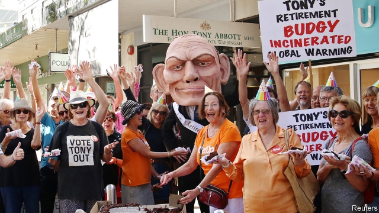
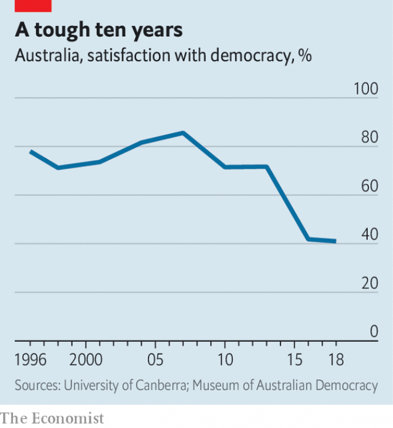

###### Up and at ’em

# An activist group harnesses Australians’ political disillusionment 

##### GetUp! is giving politicians who ignore climate change a run for their money 

 

> May 2nd 2019 

A GROUP OF protesters gathered outside Tony Abbott’s constituency office on Sydney’s north shore. They wore party hats and cut a cake. It was, the activists explained, an early retirement gathering for Australia’s former prime minister. He is in danger of losing his supposedly safe seat, partly because of the work of their advocacy group, GetUp!, which is campaigning to turf out several of the ruling Liberal Party’s most right-wing members in the general election on May 18th. “Our parties aren’t representing us,” laments one of its volunteers. “They’re representing themselves.” 

Such complaints are common in Australia, but its political system can shroud them. Compulsory voting forces even the disengaged to turn out on election day. Those who might not otherwise vote tend to back one of the two main parties, the Liberals and Labor. The voting system, which requires Australians to rank candidates in order of preference, also ends up funnelling votes to the big two. As a result, the pair continue to dominate politics—they won all but five of the 150 seats in the lower house at the last election, in 2016—even though the share of voters who pick them as their first choice is falling. 

A decade of political instability has left many voters feeling disillusioned. The prime minister has changed five times in that time (but only once because of an election). Policymaking has naturally suffered. “We’re going backwards on too many important issues,” says one of Mr Abbott’s constituents. Some of them lost patience with him in August, when the brigade of staunch conservatives he leads toppled the Liberals’ popular leader, Malcolm Turnbull. The prime minister’s crime had been to attempt to set legally binding targets to reduce greenhouse-gas emissions. 

 

Political parties struggle to appeal both to rural constituencies, which clamour for mining jobs, and urban ones, which fret about climate change. Voters also worry about costly housing, insecure jobs and—a relatively new affliction for Australia—stagnant wages. There are fears that big business and foreign governments have undue sway over politicians. According to one poll, faith in democracy has fallen by more than half over the past decade. Only 41% of voters say they are satisfied with the system (see chart). 

Yet many have channelled their disillusionment into activism. More than a million people have joined GetUp!, giving it almost eight times as many members as the two big parties combined. It deploys armies of orange-clad volunteers to man phones and knock on doors. Its donations have soared by more than a quarter over the past year, furnishing it with a war-chest of almost A$13m ($9m). It now has “more capacity than most political parties”, says John Hewson, a former Liberal leader who advised it in its early days. 

Henny Smith, GetUp!’s elections director, says it is “not interested in who gets elected” as long as the result is “sensible climate policy and a conscionable approach to refugees”. But those goals put it at odds with right-wing politicians such as Mr Abbott and Peter Dutton, the pugnacious home-affairs minister who spearheaded the coup against Mr Turnbull. GetUp! is “an extreme left-wing front”, asserts Eric Abetz, a conservative senator. Three investigations by the electoral commission have cleared it of any partisan associations. 

Guessing the extent of GetUp!’s influence is tricky, but Mr Abbott may soon get an inkling. Warringah is doggedly conservative, and he has held the seat for a quarter of a century. But an upset would not be unprecedented: when Mr Turnbull resigned last year, an independent, Kerryn Phelps, deprived the Liberals of his seat for the first time in over a century. The party’s own polling suggests that another independent, Zali Steggall, is on course to beat Mr Abbott with a huge swing of 12%. Mr Dutton holds his suburban seat in Brisbane by a far less comfortable margin, partly thanks to GetUp!’s work at the previous election. The group may need to bake more cakes. 

-- 

 单词注释:

1.activist['æktivist]:n. 激进主义分子 

2.disillusionment[,disi'lju:ʒәnmәnt]:n. 幻灭,觉醒 

3.protester[]:n. 抗议者, 持异议者, 拒付者 [经] 反对者 

4.tony['tәuni]:a. 高贵的, 时髦的 

5.constituency[kәn'stitjuәnsi]:n. 选民, 顾客, 读者 [法] 选区, 全体选民, 选区内的选民 

6.retirement[ri'taiәmәnt]:n. 退休, 隐居, 撤退 [经] 退休, 退股, (固定资产)报废 

7.supposedly[sә'pәuzidli]:adv. 想象上, 看上去像, 被认为是, 恐怕, 按照推测 

8.advocacy['ædvәkәsi]:n. 拥护, 支持, 鼓吹, 辩护, 辩护术 [法] 辩护, 拥护, 提倡 

9.turf[tә:f]:n. 草皮, 泥炭, 跑马场 vt. 覆草皮于 

10.lament[lә'ment]:n. 悲叹, 悔恨, 恸哭, 挽歌, 悼词 vt. 哀悼 vi. 悔恨, 悲叹 

11.shroud[ʃraud]:n. 尸衣, 寿衣, 覆盖物, (船的)横桅索 vt. 包以尸衣, 遮蔽, 隐藏, 覆盖 

12.disengage[.disin'geidʒ]:vt. 使脱离, 使松开, 使摆脱约束(或义务等) vi. 脱离, 解脱 

13.labor['leibә]:n. 劳动, 努力, 工作, 劳工, 分娩 vi. 劳动, 努力, 苦干 vt. 详细分析, 使厌烦 

14.funnel['fʌnl]:n. 漏斗, 漏斗状的东西, 烟囱 [化] 漏斗 

15.voter['vәutә]:n. 选民, 投票人 [法] 选民, 选举人, 投票人 

16.instability[.instә'biliti]:n. 不安定, 不稳定 [医] 不稳定性 

17.disillusion[.disi'lu:ʒәn]:n. 觉醒, 幻灭 vt. 使醒悟, 使幻想破灭 

18.policymaking['pɔlәsi,meikiŋ]:[法] 政策制定者, 决策人 

19.backwards['bækwәdz]:adv. 向后 

20.constituent[kәn'stitjuәnt]:n. 成分, 选民, 构成物 a. 构成的, 组织的, 选举的 

21.brigade[bri'geid]:n. 旅, 队 [法] 团体, 队, 组 

22.staunch[stɒ:ntʃ]:vt. 止住, 止血 a. 坚固的, 坚强的, 忠实的, 忠诚的, 不透水的 

23.topple['tɒpl]:vt. 推翻, 颠覆 vi. 倒塌, 摇摇欲坠 

24.malcolm[]:n. 马尔科姆（男子名） 

25.Turnbull[]:n. 特恩布尔（姓氏） 

26.legally['li:gәli]:adv. 法律上, 合法地 [法] 法律上, 合法地, 法定地 

27.emission[i'miʃәn]:n. 发射, 射出, 发行 [医] 发射, 遗精 

28.clamour['klæmә]:n. 喧闹 v. 大声地要求 

29.fret[fret]:n. 烦躁, 磨损, 焦急, 网状饰物 vi. 烦恼, 不满, 磨损 vt. 使烦恼, 腐蚀, 使磨损, 使起波纹 

30.insecure[.insi'kjuә]:a. 不安全的, 不牢靠的, 不坚固的, 不稳定的 

31.affliction[ә'flikʃәn]:n. 苦恼, 折磨, 苦恼的事由 

32.undue[.ʌn'dju:]:a. 不适当的, 过度的, 未到期的 [经] 未到(支付)期的 

33.activism['æktivizm]:n. 激进主义, 行动主义, 能动论 [法] 激进主义, 行动主义 

34.deploy[di'plɒi]:v. 展开, 配置 

35.donation[dәu'neiʃәn]:n. 捐赠物, 捐款, 捐赠 [经] 赠品, 捐款, 捐赠 

36.soar[sɒ:]:n. 高扬, 翱翔 vi. 往上飞舞, 高耸, 翱翔 

37.john[dʒɔn]:n. 盥洗室, 厕所, 嫖客 

38.Hewson[]:n. (Hewson)人名；(英)休森 

39.henny['heni]:a. (公鸡)羽毛似母鸡的 

40.smith[smiθ]:n. 铁匠, 金属品工匠 [机] 锻造工, 上手 

41.conscionable['kɔnʃnәbl]:a. 凭良心的, 正直的 

42.refugee[.refju'dʒi:]:n. 难民, 流亡者 [法] 避难者, 流亡者, 难民 

43.odds[ɒdz]:n. 可能性, 几率, 机会, 胜算, 不平等 

44.Abbott['æbət]:n. 阿尔伯特（人名）；雅培（公司名） 

45.peter['pi:tә]:vi. 逐渐消失, 逐渐减少 

46.Dutton[]:达顿（人名） 达顿（地名） 

47.pugnacious[pʌg'neiʃәs]:a. 好斗的 

48.spearhead['spiәhed]:n. 矛尖, 先锋队, 先头部队 vt. 做先锋, 带头 

49.coup['ku:]:n. 砰然的一击, 妙计, 出乎意料的行动, 政变 [医] 发作, 中, 击 

50.assert[ә'sә:t]:vt. 主张, 坚称, 断言 [法] 宣称, 断言, 维护 

51.eric['erik]:abbr. 科教资源信息中心（Educational Resources Information Center）；电子遥控与独立控制（Electronic Remote and Independent Control） 

52.senator['senәtә]:n. 参议员, (某些大学的)理事 [法] 参议员, 上议员 

53.electoral[i'lektәrәl]:a. 选举人的, 选举的, (有关)选举的 [法] 选举的, 选举人的, 由选举人组成的 

54.partisan['pɑ:tizn]:n. 党羽, 虔诚信徒, 同党, 游击队员 a. 党派的, 偏袒的, 效忠的, 献身的, 盲目推崇的 

55.tricky['triki]:a. 狡猾的, 机敏的 

56.inkling['iŋkliŋ]:n. 暗示, 微微觉得 

57.doggedly[]:adv. 顽强地；固执地 

58.phelps[felps]:n. 费尔普斯（男子名） 

59.deprive[di'praiv]:vt. 剥夺, 使丧失 [法] 剥夺, 剥夺, 夺去 

60.suburban[sә'bә:bәn]:a. 郊外的, 郊区的, (贬)偏狭的, 土气的, 见识不广的 n. 郊区居民 

61.brisbane['brizbәn]:n. 布里斯班（澳大利亚东部城市） 

62.les[lei]:abbr. 发射脱离系统（Launch Escape System） 

