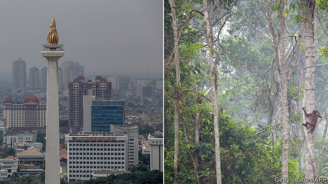
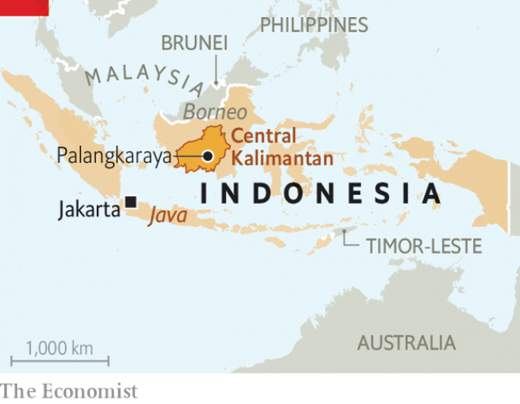

###### An extraordinary move

# Indonesia plans to replace one unsuitable capital with another 

##### Jakarta is crowded, polluted and sinking; Palangkaraya is just polluted and sinking 

 

> May 2nd 2019 

TO EXPERIENCE THE true Jakarta, sit in a taxi for an hour, listening to the motorbikes rev and the horns honk, only to realise that you are no closer to your destination than when you set off. Indonesia’s capital, home to 30m people, is in a constant state of gridlock. Meetings are routinely missed; businessfolk often call in from the back seat of a stationary vehicle. Some policemen have started a sideline selling motorcade escorts. Fumes from the sea of cars add to the smog. Public transport offers little respite: a new underground service, decades in the building, already feels jam-packed. 

The traffic is the result of decades of rapid urbanisation coupled with neglect of infrastructure. It is not the city’s only failing. There is no real centre, just a vast concrete sprawl where highways and flyovers corral skyscrapers. Parks are a rarity. So are pavements—and the few there are are crowded with makeshift restaurants, forcing pedestrians onto the heaving roads. 

Another big problem is water. Torrential rain falls for half the year, but rivers and drainage ditches are clogged with rubbish and swimming with untreated sewage. They overflow regularly, flooding much of the city. Only a third of residents have access to municipal water, so the rest drill wells to tap groundwater. As a result, Jakarta is sinking faster than any other city in the world, even as sea levels rise. Some neighbourhoods are dropping at a rate of 25cm a year. Researchers think that almost all the city’s coastal districts could be submerged in 30 years. 

 

Small wonder, then, that the president, Joko Widodo, who is known as Jokowi, wants to move the capital. On April 29th Bambang Brodjonegoro, the planning minister, announced that the government will leave the island of Java, where Jakarta sits, although it is still considering where to go. The intention, in addition to escaping (and reducing) congestion in Jakarta, is to shrink regional inequalities. Indonesia is an archipelago of 13,000 or so islands, but Java generates about 58% of GDP. 

The relocation could take ten years. It is likely to face stern resistance, not least from Indonesia’s tycoons, who do not want to see the value of their Jakarta penthouses fall. Civil servants will probably object too, because the most likely new site for the capital is something of a backwater. 

Palangkaraya is a city of 260,000 in the province of Central Kalimantan, part of the Indonesian portion of Borneo. Whereas Jakarta lacks greenery, Palangkaraya has it in abundance: the city is in the middle of the jungle. There is a titchy airport; the nearest seaport is a four-hour drive away, past an orangutan reserve. Much of the surrounding terrain is soft and swampy—not ideal for building skyscrapers. And when nearby peatlands burn, a toxic haze fills the air. Government officials may be sinking and choking in their new digs, too. 

-- 

 单词注释:

1.Indonesia[.indәu'ni:ʒә]:n. 印尼 

2.jakarta[dʒә'kɑ:tә]:n. 雅加达（印尼首都, 等于Djakarta） 

3.Palangkaraya[]:[地名] 帕朗卡拉亚 ( 印尼 ) 

4.rev[rev]:n. 一次回转 v. 加快转速 [计] 反转, 周, 转数 

5.honk[hɒŋk]:n. 雁鸣, 汽车的喇叭声 vi. 雁鸣叫, 按汽车喇叭 vt. 揿(喇叭) 

6.gridlock[ˈgrɪdlɒk]:n. 交通全面大堵塞; 僵局 v. （交通等）堵塞 

7.routinely[]:adv. 日常, 乏味, 常规, 例行 

8.businessfolk[]:[网络] 商务人士 

9.stationary['steiʃ(ә)nәri]:a. 不动的, 静止的, 不变的, 固定的, 停留的 [计] 定常, 定态, 固定的 

10.sideline['saidlain]:n. 副业, 旁线, 界线, 兼职, 旁观者看法 vt. 使退出比赛场地 

11.motorcade['mәutәkeid]:n. 汽车行列 

12.escort['eskɒ:t]:n. 护送者, 护卫者, 护航舰 vt. 护卫, 护送 

13.fume[fju:m]:n. 臭气, 烟, 激怒 vt. 熏 vi. 冒烟 

14.urbanisation[ˌɜ:bənaɪ'zeɪʃən]:n. 城市化（等于urbanization） 

15.infrastructure['infrәstrʌktʃә]:n. 基础结构, 基础设施 [经] 基础设施 

16.sprawl[sprɒ:l]:vi. 伸开手足躺, 爬行, 蔓生, 蔓延 vt. 懒散地伸开, 使蔓生, 使不规则地伸展 n. 伸开手足躺卧姿势 

17.flyover['flaiәjvә(r)]:n. 立交桥, 天桥, 立交马路 

18.corral[kɒ:'rɑ:l]:n. 畜栏 vt. 把...关进畜栏 

19.rarity['rєәrәti]:n. 稀罕, 罕有, 珍奇, 稀薄 

20.makeshift['meikʃift]:n. 权宜之计, 临时代用品 a. 权宜的, 临时代用的 

21.heave[hi:v]:n. 举, 抛, 起伏, 鼓起 vt. 用力举起, 使举起, 使鼓起 vi. 抛出, 起伏, 喘息, 凸起 

22.torrential[tɒ'renʃәl]:a. 奔流的, 急流的, 猛烈的 

23.drainage['dreinidʒ]:n. 排水 [医] 引流[法], 导液[法], 排水[设备] 

24.clog[klɒg]:n. 障碍, 脚坠 v. 障碍, 阻塞 

25.untreated['ʌn'tri:tid]:[化] 未经处理的 

26.sewage['sju:idʒ]:n. 脏水, 污水 [医] 污水, 污物 

27.overflow[.әuvә'flәu]:n. 溢值, 超值, 泛滥 v. (使)泛滥, (使)溢出, (使)充溢 [计] 上溢; 溢出 

28.municipal[mju:'nisipl]:a. 市政的, 自治区的, 内政的 [经] 市政的, 市的 

29.groundwater['graundwɒ:tә]:n. 地下水 

30.coastal['kәustәl]:a. 海岸的, 沿海的, 沿岸的 [法] 海岸的, 沿海的 

31.Joko[]:[网络] 佐戈；上甲；彩绘阿祥 

32.widodo[]:[网络] 阿斯 

33.Jokowi[]:[网络] 佐科威；省长佐科威；雅加达市长 

34.bambang[]:n. (Bambang)人名；(印尼、西)班邦 

35.Brodjonegoro[]:布罗佐内戈罗 

36.Java['dʒɑ:vә]:n. 爪哇, 爪哇咖啡 [计] Java 程序设计语言 

37.congestion[kәn'dʒestʃәn]:n. 拥挤, 充血 [计] 拥挤, 拥塞 

38.regional['ri:dʒәnәl]:a. 地方的, 地域性的 [医] 区的, 部位的 

39.inequality[.ini'kwɒliti]:n. 不平等, 不同, 不平坦, 不平均 n. 不平等, 不等式 [计] 不等式 

40.archipelago[.ɑ:ki'pelәgәu]:n. 群岛, 多岛屿的海 

41.relocation[.ri:lәu'keiʃәn]:n. 再布置, 变换布置 [经] 重新安置 

42.tycoon[tai'ku:n]:n. 企业界大亨, 将军 [经] 企业界巨头, 企业家 

43.penthouse['penthaus]:n. 屋顶房间, 顶层公寓, 电梯机器房, 耳房 

44.backwater['bæk.wɒ:tә]:n. 死水, 滞水, 停滞, 回水 

45.Kalimantan[,kɑ:li'mɑ:ntɑ:n]:n. 加里曼丹(旧为婆罗洲) 

46.Indonesian[.indәu'ni:ʒәn]:a. 印尼的 n. 印尼人, 印尼语群 

47.Borneo['bɒ:niәu]:n. 婆罗洲 

48.greenery['gri:nәri]:n. 绿叶, 绿树, 装饰用的绿树枝或叶 

49.titchy[ 'tɪtʃi]:a. 非常小的 

50.orangutan[.ɒ:ræŋ'u:tæn]:猩猩 [医] 猩猩 

51.terrain['terein]:n. 地带, 地区, 地形, 领域, 范围 

52.peatland['pi:tlænd]:n. [地]泥炭地 

53.toxic['tɒksik]:a. 有毒的, 中毒的 [医] 中毒的, 毒物的 

54.haze[heiz]:n. 薄雾, 阴霾, 疑惑 vt. 使变朦胧, 使变糊涂 vi. 变朦胧, 变糊涂 

