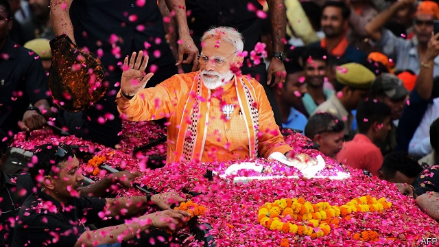
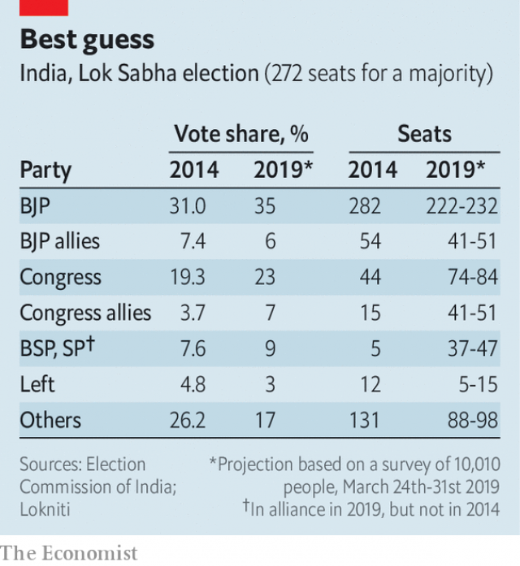

###### Missiles maketh the man

# Nationalist fervour is likely to secure a second term for Narendra Modi 

##### His polls improved after he launched a bombing raid on Pakistan 

 

> May 2nd 2019 

THE SCALE of an Indian general election can be hard to grasp. With close to 900m registered voters and 1m polling stations, it is as if every country in the European Union, plus America, Canada and Mexico, as well as Japan and South Korea, were all to vote together. Yet the process generally runs smoothly. The voting this time started on April 11th and is divided into seven phases, to reduce the burden on election personnel and police. The use of nearly 4m portable, battery-operated voting machines will make it possible to tally all the votes on a single day, May 23rd. 

The counting may run with symphonic precision, but the rest of the proceedings are pure cacophony. With 8,000 candidates from more than 2,000 parties vying for seats in the Lok Sabha, the lower house of parliament, this is less a national election than 543 separate battles. Rules on election spending are loose and often flouted. Estimates of the cost of this year’s contest are as high as $10bn. Since mid-March the Election Commission has seized some $500m of cash, gold, drugs and alcohol it suspects were intended for bribing voters. 

The daunting cost of entry gives candidates with high profiles or deep pockets an advantage. Small wonder that so many are former film and sports stars, gangsters, fat cats or dynasts. The expense of contesting also inflates hopes among poor voters: in one southern state, villagers recently besieged a party office, furious that a middleman who had “sold” their votes paid them only 500 rupees ($7) out of the 2,000 he had pocketed from the candidate for each vote. High costs may also serve to raise the heat: in the past few weeks candidates have variously accused each other of theft, treason, bigotry, support for terrorism and a host of other sins. 

 

Along with scale and intensity, this election packs suspense. India’s first-past-the-post system allows a seat to be won with well under half of the vote, provided other candidates do even less well. Five years ago the ruling Bharatiya Janata Party (BJP) converted a 31% vote share into a tidy 52% of seats, while its big rival, Congress, squeezed a paltry 8% of seats out of its 19% of votes (see chart). Wild swings are possible: at the last election, in the country’s most populous state, Uttar Pradesh, had the BJP’s two biggest rivals, the Bahujan Samaj Party (BSP) and the Samajwadi Party (SP) joined forces, they would have cut the BJP’s seat tally there by nearly half, stripping away its majority. Chastened, the pair, which represent two different slices of the lower castes, are now in alliance. 

Excepting astrologers, Indians understandably tend to be wary of political predictions. In the past three general elections, professional pollsters have fallen wide of the mark. Still, there is consensus about the broader outcomes of the contest. No one expects the stars to align so perfectly for Narendra Modi, the prime minister, as they did in 2014, when the BJP won 282 seats on its own. Everyone expects the rival Congress—the only other truly national party—to rise from its dismal 44 seats, but still to remain a distant second. Most expect regional parties, including the BSP and SP, to take about a third of the seats. 

Given the advantages he enjoys, Mr Modi is widely tipped to win. The prime minister himself is a talented and tireless campaigner, delivering relentlessly on-message blasts of boosterism mixed with searing swipes at his enemies. Another leg-up comes from having vastly more money. Some of this is unaccountable, but one measure is the value of donations via “electoral bonds”. Since this vehicle for anonymous political gifts was created by the BJP in the name of “transparency” last year, some 95% of all bonds have gone to the ruling party. 

Being in power also helps. As elections approached, Mr Modi’s opponents have found themselves targeted by tax raids or police probes. Midway through voting the home ministry has suddenly decided to respond to a public query, dating from 2015, questioning the citizenship of Rahul Gandhi, whose family has led the Congress party for five generations and India for much of the time since independence. Meanwhile, a government programme to compensate small farmers, introduced in February, miraculously placed cash in their accounts in time for the vote. To be fair, some other parties have been just as crass: West Bengal, run by the fiercely anti-BJP Trinamool Congress, has blocked leaders from the rival party from landing helicopters on “its” turf. 

Despite holding so many cards, Mr Modi had begun to look vulnerable earlier this year. Congress appeared to rise from the dead in December, toppling BJP governments in local elections in three states across central India. Fatigue with Mr Modi was growing, as well as anger among such important groups as farmers, small traders, minorities and the better-educated. The lapdog media grew noticeably less fawning. There was talk of opposition parties banding together under Mr Gandhi in an all-out bid to beat the BJP. 

But the winds then shifted again, this time in Mr Modi’s favour. On February 14th 20-year-old Adil Ahmad Dar ploughed his bomb-laden car into a convoy of paramilitary police in the disputed state of Jammu & Kashmir, killing 40 of them. The attack, claimed by a Pakistan-based terror group, spawned a surge of national emotion that crested two weeks later, when Mr Modi ordered the retaliatory bombing of an alleged terror base deep inside Pakistan. 

Mr Modi has mercilessly milked nationalist sentiment, threatening to rain missiles on the enemy in a “night of killing” and scorning his opponents as wobbly-kneed defeatists. Although many Indians, especially those far from the border with Pakistan, find local issues more pressing, the unrelenting bombast has flummoxed Mr Modi’s opponents. Instead of coalescing, they have drifted apart. If the BJP and its closest allies fail to win a majority, he will almost certainly be better placed than Mr Gandhi to court a clutch of regional parties to form a coalition. “If this election were about the fundamentals, Modi and the BJP would be in a pickle,” says Milan Vaishnav of Carnegie, a think-tank. “But given Modi’s popularity, the security dimension and the opposition’s foibles, my sense is the BJP has found a way to make lemonade out of lemons.” 

-- 

 单词注释:

1.nationalist['næʃәnәlist]:n. 国家主义者, 民族主义者 

2.fervour['fә:vә]:n. 炽热, 热诚, 热情, 热烈 

3.narendra[]:[网络] 纳伦德拉；纳兰德；纳然陀 

4.MODI['mәudai]:[计] 模块化光学数字接口 

5.Pakistan[.pɑ:ki'stɑ:n]:n. 巴基斯坦 

6.voter['vәutә]:n. 选民, 投票人 [法] 选民, 选举人, 投票人 

7.Korea[kә'riә]:n. 朝鲜, 韩国 

8.tally['tæli]:n. 符木, 记账, 得分, 比分, 计数器, 标签, 符合, 对应物 vt. 记录, 点数, 计算, 加标签于, 使符合 vi. 记帐, 符合, 吻合, 记分 [计] 计数 

9.symphonic[sim'fɒnik]:a. 交响乐的, 交响性的, 和声的 

10.proceeding[prәu'si:diŋ]:n. 进行, 程序, 行动, 诉讼程序, 事项 [化] 会议论文集 

11.cacophony[kæ'kɒfәni]:n. 不愉快的音调, 不协和音, 杂音 

12.vie[vai]:vi. 争, 竞争, 争胜 vt. 提出...来竞争, 以...作较量 

13.lok[]:abbr. 洛卡米尔·伊洛曼希斯（游戏魔兽世界中的武器, Lok'amir il Romathis） 

14.sabha[]:[网络] 塞卜哈；萨巴；沙漠城市萨巴 

15.les[lei]:abbr. 发射脱离系统（Launch Escape System） 

16.flout[flaut]:vt. 嘲笑, 愚弄 vi. 表示轻蔑 n. 嘲笑, 愚弄, 轻视 

17.bribe[braib]:n. 贿赂 vt. 贿赂, 收买 vi. 行贿 

18.daunt[dɒ:nt]:vt. 威吓, 难倒, 使气馁 

19.profile['prәufail]:n. 侧面, 轮廓, 传略 vt. 描绘...轮廓, 写...的传略 [计] 提问档; 剖面图法; 剖面法 

20.gangster['gæŋstә]:n. 流氓, 歹徒 [法] 暴徒, 恶棍, 打手 

21.dynast['dainæst]:n. (尤指世袭的)君主, 开国君主 

22.inflate[in'fleit]:vt. 使膨胀, 使得意, 使通货膨胀, 使充气 vi. 充气, 膨胀 

23.besiege[bi'si:dʒ]:vt. 围攻, 包围 

24.middleman['midlmæn]:n. 中间人 [法] 调解人, 中间人, 中人 

25.rupee[ru:'pi:]:n. 卢比(印、巴等国货币单位) 

26.variously['veәriәsli]:adv. 各种各样, 种种, 不同, 多方面, 多才多艺, 许多, 各个, 个别, 杂色, 彩色 

27.bigotry['bigәtri]:n. 盲从, 偏见, 偏执的行为(或态度) 

28.terrorism['terәrizm]:n. 恐怖主义, 恐怖统治, 恐怖状态 [法] 胁迫, 暴政, 恐怖政治 

29.suspense[sә'spens]:n. 悬疑, 焦虑, 悬念, 悬而不决 [经] 未定, 暂记 

30.Bharatiya[]:[网络] 巴拉蒂亚 

31.Janata['dʒʌnətɑ:]:n. （印度）人民团体；人民党（印度联合政党） 

32.bjp[]: [医][=Bence Jones protein]本周（氏）蛋白，凝溶蛋白 

33.paltry['pɒ:ltri]:a. 不足取的, 琐碎的, 可鄙的 

34.populous['pɒpjulәs]:a. 人口多的, 人口稠密的 

35.uttar[]:[网络] 北方；乌塔茹阿；太邦 

36.Pradesh[]:邦 

37.Samaj[]:[网络] 撒玛；同共 

38.BSP[]:[医] 四溴酞酚磺酸钠, 磺溴酞钠(试肝机能) 

39.samajwadi[]:[网络] 印度社会党；社会主义党 

40.SP[]:岸上宪兵, 基地宪兵 [计] 结构程序设计, 用户过程处理 

41.chasten['tʃeisәn]:vt. 惩罚；磨炼；抑制 

42.caste[kæst. kɑ:st]:n. 印度的种姓制度, (排他的)社会团体 

43.alliance[ә'laiәns]:n. 联盟, 联合 [法] 同盟, 联盟, 联姻 

44.astrologer[ә'strɒlәdʒә]:n. 占星家 

45.understandably[]:adv. 可懂, 可了解, 可理解 

46.wary['wєәri]:a. 谨慎的, 小心的, 机警的, 周到的, 唯恐的 

47.prediction[pri'dikʃәn]:n. 预言, 预报 [化] 预测 

48.pollster['pәulstә]:n. 民意调查人, 民意测验经办人 

49.align[ә'lain]:vi. 排列, 排成一行, 结盟 vt. 使结盟, 使成一行, 校正 

50.dismal['dizmәl]:a. 阴沉的, 凄凉的, 令人忧郁的 n. 低落的情绪, 沼泽 

51.regional['ri:dʒәnәl]:a. 地方的, 地域性的 [医] 区的, 部位的 

52.talented['tælәntid]:a. 天资高的, 有才能的 

53.tireless['taiәlis]:a. 不疲倦的, 不厌倦的, 不屈不挠的 

54.campaigner[kæm'peinә]:n. 从军者, 老兵, 竞选者 

55.relentlessly[]:adv. 不仁慈, 严酷, 无情, 坚韧, 不懈, 不屈不挠 

56.boosterism['bu:stərɪzəm]: 热心支持的表现 

57.searing['siәriŋ]:a. 灼热的 

58.swipe[swaip]:n. 强打, 用力挥击, 尖刻的话, 碰擦, 起重杆 vt. 强打, 用力挥击, 偷 

59.vastly['vɑ:stli]:adv. 广大地, 许多, 巨大 

60.unaccountable[.ʌnә'kauntәbl]:a. 无法解释的, 无责任的 [法] 难以申辩的, 不可解释的, 无关系的 

61.donation[dәu'neiʃәn]:n. 捐赠物, 捐款, 捐赠 [经] 赠品, 捐款, 捐赠 

62.electoral[i'lektәrәl]:a. 选举人的, 选举的, (有关)选举的 [法] 选举的, 选举人的, 由选举人组成的 

63.anonymous[ә'nɒnimәs]:a. 姓氏不详的, 无名的, 无特色的 [计] 无记录 

64.transparency[træns'pærәnsi]:n. 透明, 透明度, 透过性, 透明物, 清晰 [计] 透明性; 透明 

65.probe[prәub]:n. 探索, 调查, 探针, 探测器 v. 用探针探测, 调查, 探索 

66.midway['mid'wei]:n. 中途, 中间, 娱乐场 a. 中途的, 中间的 adv. 中途 

67.query['kwiәri]:n. 疑问, 疑问号, 质问, 查询 v. 询问, 质问 [计] 查询 

68.citizenship['sitizәnʃip]:n. 国籍, 市民权, 市民的身份 [法] 公民权, 公民资格, 公民身分 

69.rahul[]:n. 拉胡尔（人名） 

70.Gandhi['gændi:]:n. 甘地 

71.miraculously[]:adv. 超自然, 非凡, 不可思议, 令人惊叹, 象奇迹一样, 奇迹般, 能创造奇迹 

72.bengal[beŋ'^ɔ:l]:n. 孟加拉（位于亚洲） 

73.fiercely['fiәsli]:adv. 猛烈地, 厉害地 

74.Trinamool[]:[网络] 崔纳姆国大党；纳木国大党；崔纳姆地区 

75.turf[tә:f]:n. 草皮, 泥炭, 跑马场 vt. 覆草皮于 

76.vulnerable['vʌlnәrәbl]:a. 易受伤害的, 有弱点的, 易受影响的, 脆弱的, 成局的 [医] 易损的 

77.topple['tɒpl]:vt. 推翻, 颠覆 vi. 倒塌, 摇摇欲坠 

78.trader['treidә]:n. 商人, 商船 [经] 交易者, 商船 

79.lapdog['læpdɒg]:n. 供玩赏用的小狗 

80.noticeably[]:adv. 显而易见, 值得注意, 重要, 显著 

81.fawn[fɒ:n]:n. 小鹿 vi. 摇尾乞怜, 奉承 

82.opposition[.ɒpә'ziʃәn]:n. 反对, 敌对, 相反, 在野党 [医] 对生, 对向, 反抗, 反对症 

83.banding['bændiŋ]:[机] 模式带 

84.adil[]:n. (Adil)人名；(俄、吉尔)阿季尔；(德、阿尔巴)阿迪尔；(阿拉伯、土)阿迪勒 

85.ahmad[]:n. 阿哈默德（穆罕默德在《古兰经》中的名称） 

86.dar[]:abbr. 美国革命女儿会（Daughters of the American Revolution） 

87.convoy['kɒnvɒi. kәn'vɒi]:n. 护送, 护卫 vt. 护航, 护送 

88.paramilitary[.pærә'militәri]:a. 辅助军事的 

89.Jammu['dʒʌmu:]:查谟(城市, 位于亚洲查谟和克什米尔的西南) 

90.Kashmir['kæʃmiә]:n. 克什米尔 

91.spawn[spɒ:n]:n. (鱼)卵, 产物 vt. 产卵, 酿成, 大量生产 vi. 产卵, 大量生产 

92.surge[sә:dʒ]:n. 巨涌, 汹涌, 澎湃 vi. 汹涌, 澎湃, 颠簸, 猛冲, 突然放松 vt. 使汹涌奔腾, 急放 [计] 电压尖峰 

93.crest[krest]:n. 冠, 饰毛, 头盔的顶部 vi. 到达绝顶 vt. 加以顶饰 

94.retaliatory[ri'tæliәtәri]:a. 报复的 [经] 报复性的 

95.allege[ә'ledʒ]:vt. 宣称, 主张, 提出, 断言 [法] 断言, 指称, 指证 

96.mercilessly['mɜ:sɪləslɪ]:adv. 无情地, 残忍地 

97.nationalist['næʃәnәlist]:n. 国家主义者, 民族主义者 

98.sentiment['sentimәnt]:n. 感情, 感伤, 情操, 情绪, 感想, 意见 [医] 情感, 情操 

99.defeatist[di'fi:tist]:n. 失败主义者 

100.unrelenting[.ʌnri'lentiŋ]:a. 不怜悯的, 无情的, 冷酷的 

101.bombast['bɒmbæst]:n. 夸大的言辞 

102.flummox['flʌmәks]:vt. 使狼狈, 使失措, 使混乱, 挫败 n. 失败 

103.coalesce[.kәuә'les]:vi. 合并, 联合, 合生 [计] 结合 

104.ally['ælai. ә'lai]:n. 同盟者, 同盟国, 助手 vt. 使联盟, 使联合, 使有关系 vi. 结盟 

105.clutch[klʌtʃ]:n. 抓紧, 掌握, 离合器, 一窝小鸡 vt. 抓住, 踩汽车离合器踏板 vi. 抓 [计] 联轴器; 离合器 

106.coalition[.kәuә'liʃәn]:n. 结合体, 结合, 联合 [经] 联合, 联盟 

107.pickle['pikl]:n. 盐卤, 腌汁, 泡菜, 困境, 讨厌鬼 vt. 腌制, 酸洗, 葬送(机会等), 泡 

108.Milan[mi'læn]:n. 米兰 

109.Vaishnav[]:[网络] 瓦西奈 

110.carnegie[kɑ:'ne^i]:n. 卡内基（姓氏） 

111.popularity[.pɒpju'læriti]:n. 名声, 受大众欢迎, 流行 

112.foible['fɒibl]:n. 弱点, 缺点 

