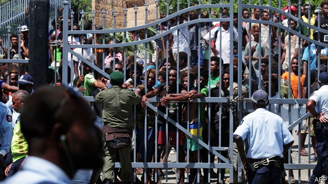

###### Solomons’ choice

# Political manoeuvring sparks riots in the Solomon Islands 

##### But the rioters’ underlying grievances are economic 

 

> May 2nd 2019 

POLITICS IN THE Solomon Islands has a nasty habit of repeating itself. On April 24th riots broke out in the capital Honiara after MPs met to pick a prime minister, as happened 13 years ago. Outside parliament, angry youths again denounced the outcome. When their protests went unheeded, they descended on Honiara’s Chinatown district and smashed up the Pacific Casino Hotel, just as they had in 2006. 

This time around, the Australian-trained police force was better prepared. Black-clad riot police equipped with helmets, shields and tear-gas barred access to Chinatown, and dispersed the crowds. Rioting continued on the nights of April 24th and 25th, but it was mainly confined to attacks on shops and businesses in and around the Burns Creek squatter settlement in eastern Honiara. The police chief, Matthew Varley, who is Australian, says rioters have been assembling petrol bombs and home-made guns in preparation for future battles. 

The troubles came in the wake of the Solomon Islands’ tenth general election since independence in 1978. It was the first election since the departure in 2017 of the Regional Assistance Mission to Solomon Islands (RAMSI), a peacekeeping force led by Australia and New Zealand. The election was mostly trouble-free, at least until Manasseh Sogavare was about to secure a fourth term as prime minister with the support of 34 of the 50 MPs. At that point 15 MPs who supported Matthew Wale for the top job walked out of parliament in protest. 

Mr Wale claims that Mr Sogavare is ineligible to stand as prime minister because the law requires a candidate for prime minister to be a member of a political party. Mr Sogavare contested the election as an independent, but assembled the Ownership, Unity and Responsibility (OUR) party quickly afterwards. Mr Wale obtained a court order to delay the prime ministerial vote, but the governor-general, who presides over the selection of the prime minister, disregarded it. He cited instead the constitution, which allows any MP, whether affiliated with a political party or not, to become prime minister. 

The underlying grievance is economic as well as political. RAMSI restored law and order, but did little to encourage development or to regulate the Asian logging companies that account for most of the country’s exports. A steady drift from the countryside has swollen the population of Honiara, where Chinese-owned businesses have come to dominate commerce. Many locals blame this on corruption in the granting of business licences and in the doling out of land. MPs, meanwhile, divert a disproportionate share of government spending to pork-barrel schemes in distant constituencies, leaving many young people in the city unemployed and angry. As one social-media post supporting the rioters put it: “Everyone is stealing from everyone.” MPs steal from the people, the argument went, Chinese businesses steal from their customers and the rioters were responding by stealing from government and businesses, creating a balance of sorts. 

To his credit, Mr Sogavare has tried to clamp down on corruption. Parliament approved an anti-corruption bill last year (after watering it down) and a police taskforce has arrested senior civil servants and a minister for misappropriating public funds. Mr Varley says ten other MPs are under investigation. But even if corruption can be reduced, it will take time for the unemployed youth of Burns Creek to feel the benefit. Mr Sogavare is considering recognising China instead of Taiwan, in search of funds for development. But the advent of crowds of Chinese to build infrastructure might also enrage Burns Creek. 

-- 

 单词注释:

1.manoeuvre[mә'nu:vә]:n. 调遣, 演习, 策略 vi. 调动, 演习, 用策略 vt. 调动, 操纵 

2.riot['raiәt]:n. 暴动, 喧闹, 放纵 vi. 发动, 暴动, 纵情, 放荡 vt. 浪费, 挥霍 

3.Solomon['sɒlәmәn]:n. 所罗门(古以色列国王), 聪明人, 贤人 [计] 所罗门阵列处理机 

4.underlie[.ʌndә'lai]:vt. 位于...之下, 成为...的基础 

5.grievance['gri:vәns]:n. 委屈, 冤情, 苦况 [经] 不满(对雇用条件的) 

6.politic['pɒlitik]:a. 精明的, 明智的, 策略的 

7.Honiara[,hәjni'ɑ:rә]:霍尼亚拉[西南太平洋岛国所罗门群岛首都] 

8.MP[]:国会议员, 下院议员 [计] 宏处理程序, 维护程序, 线性规划, 微程序, 多处理器 

9.denounce[di'nauns]:vt. 告发, 抨击, 谴责 [法] 谴责, 斥责, 告发 

10.unheeded[.ʌn'hi:did]:a. 未被注意的, 被忽视的 

11.Chinatown['tʃainәtajn]:n. 唐人街, 中国城 

12.casino[kә'si:nәu]:n. 卡西诺赌场, 卡西诺牌戏 

13.disperse[dis'pә:s]:vt. 分散, 传播, 散开 vi. 分散 a. 分散的 [计] 分散 

14.creek[kri:k]:n. 小溪, 小河, 小湾 

15.squatter['skwɒtә]:n. 蹲着的人, 擅自占用土地或房屋者 vi. 涉水而过 

16.Matthew['mæθju:]:n. 马太, 马太福音 

17.Varley['vɑ:li]:loop[电]华莱回路(一种用电桥比较电阻和测定故障位置的装置) 

18.rioter['raiәtә]:n. 暴民, 暴徒, 纵情享乐者 [法] 暴徒, 骚乱者, 暴动者 

19.regional['ri:dʒәnәl]:a. 地方的, 地域性的 [医] 区的, 部位的 

20.ramsi[]:[网络] 区域援索团(Regional Assistance Mission to Solomon Islands)；雷西；援所团 

21.zealand['zi:lәnd]:n. 西兰岛（丹麦最大的岛） 

22.Manasseh[mә'næsә]:玛拿西 

23.wale[weil]:n. 隆起的伤痕, 鞭痕, 凸条纹, 精华, 选择 vt. 在...上留下鞭痕, 织成棱纹, 挑选, 撑住 vi. 挑选 

24.ineligible[in'elidʒәbl]:a. 无被选任资格的, 不适任的, 无益的 n. 无被选任资格的人, 不合录用资格的人 

25.quickly['kwikli]:adv. 很快地 

26.afterwards['ɑ:ftәwәdz]:adv. 然后, 后来 

27.ministerial[.mini'stiәriәl]:a. 部长的, 内阁的, 执政的 [法] 部长的, 部的, 公使的 

28.preside[pri'zaid]:vi. 统辖, 当主人, 主持 [法] 主持, 负责, 指挥 

29.disregard[.disri'gɑ:d]:n. 忽视, 漠视 vt. 忽视, 不顾 

30.cite[sait]:vt. 引用, 引证, 表彰 [建] 引证, 指引 

31.MP[]:国会议员, 下院议员 [计] 宏处理程序, 维护程序, 线性规划, 微程序, 多处理器 

32.affiliate[ә'filieit]:vt. 使紧密联系, 使附属, 接纳, 收养 vi. 发生联系, 参加 

33.corruption[kә'rʌpʃәn]:n. 腐败, 堕落, 贪污 [计] 论误 

34.dole[dәul]:n. 救济品, 失业救济金 vt. 发放救济 

35.divert[dai'vә:t]:vt. 转移, 使欢娱 vi. 转移 

36.disproportionate[.disprә'pɒ:ʃәnit]:a. 不成比例的 

37.constituency[kәn'stitjuәnsi]:n. 选民, 顾客, 读者 [法] 选区, 全体选民, 选区内的选民 

38.unemployed[.ʌnim'plɒid]:a. 失业的, 未被利用的 [经] 没有被雇用的, 失业的, 没有被利用的 

39.clamp[klæmp]:n. 夹钳 vt. 夹紧, 强加 

40.taskforce[]:n. （为解决某总是而成立的）特别工作组 

41.misappropriate[.misә'prәuprieit]:vt. 侵占, 霸占, 盗用 [法] 侵占, 私吞, 贪污 

42.taiwan['tai'wɑ:n]:n. 台湾 

43.advent['ædvәnt]:n. 来到, 来临 

44.infrastructure['infrәstrʌktʃә]:n. 基础结构, 基础设施 [经] 基础设施 

45.enrage[in'reidʒ]:vt. 激怒, 使暴怒 

