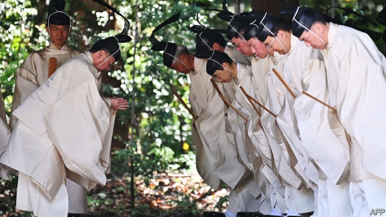

###### Through the looking glass

# The imperial succession highlights Shinto’s muddled status in Japan 

##### It is not an official state religion, but it’s hard to escape from it 

 

> May 2nd 2019 

ON THE MORNING of April 30th, then-emperor Akihito, decked out in a puffy brown robe, entered Kashikodokoro shrine, in the grounds of the imperial palace in Tokyo. He washed his hands, rinsed his mouth, bowed twice, clapped twice, bowed once more and then read a letter to the gods informing them of his retirement. On May 1st his son, Naruhito, was invested as emperor by receiving a jewel and a sword said to have belonged to Amaterasu, the sun goddess, from whom he is a direct descendant, according to Shinto mythology. 

Shinto is a form of animism, which dates back to prehistoric times. Ancient Japanese saw divine forces all around them, and celebrated as kami, or gods, everything from the sun to the wind. The emperor was traditionally the high priest—although after the second world war, he was stripped of his status as a living god. There are some 80,000 Shinto shrines, all over Japan, where priests and devotees can be seen clapping and bowing like Akihito. 

Some 70% of Japanese are reported to adhere to Shinto—a percentage that is declining only slowly. That may be because many see it as a cultural belief rather than a religion. People who do not consider themselves religious may still visit a shrine in search of luck or love, or to attend Shinto festivals that involve lots of food and drink. Indeed, many Buddhists and Christians visit Shinto shrines. 

It helps that Shinto has no scriptures or doctrine. “It is a way of thinking, of living; it is in Japanese people’s DNA,” says Tsunekiyo Tanaka, the head priest at Iwashimizu Hachimangu, a shrine near Kyoto, and head of Jinja Honcho, an umbrella organisation for the religion. It is indeed a part of everyday life. Many people perform a Shinto ground-breaking ceremony to appease the kami before beginning construction work. Sumo matches involve Shinto rituals that take up more time than the wrestling. Marie Kondo, a Japanese tidying guru, is said to be inspired by Shinto’s emphasis on process and ritual. She worked as a shrine “maiden” for five years. 

Those of a new-age disposition see shrines as “power-spots” brimming with healing, love and insight. Satoru Otowa of Ise Grand shrine, Shinto’s holiest place, where a mirror said to have belonged to Amaterasu is kept, says many young people come for “mental health and to feel at peace”. On a spring day groups of them can be seen exploring the vast grounds of the shrine, which is surrounded by trees and a river. Visitor numbers have steadily grown, to more than 8.5m people last year. 

Environmentalism has helped Shinto, says Susumu Shimazono of Sophia University: “A few years ago Shinto was seen as inferior to the great world religions, like Christianity, Buddhism and Islam, where the sacred dimension is beyond nature,” he says. “Now it is seen as something we should recover.” 

But the picture is not all rosy. The number of shrines is in slow but steady decline. Many are nestled in small rural communities that are populated mainly by old people, since the young tend to move to cities. The number of priests has dropped more drastically, from 88,192 in 1997 to 71,142 in 2017. As the shrinking and ageing of Japan’s population accelerates, these problems will get worse. 

Another tension is the still contentious question of Shinto’s official role. After the second world war the American occupiers insisted on the separation of shrine and state, since Shinto had been a central part of Japan’s war effort, in which the cult of the divine emperor served to legitimise militarism. The state stopped administering and funding shrines, leaving private organisations, most notably Jinja Honcho, to assume that role. 

But Shinto is still a big part of official events such as this week’s abdication and coronation. Indignant citizens have brought lawsuits claiming that the imperial rituals violate the separation of religion and state (similar complaints during the last change of emperor were dismissed by the courts). Even the new emperor’s brother, who is also the next in line to the throne, has questioned whether state funds should be used for an elaborate ceremony later this year at which the new emperor’s investiture will be celebrated. The emperor’s sister, meanwhile, is the head priest of the Ise shrine—a job that always goes to a member of the royal family. 

Some would like to restore the central role of Shinto in public life. A few priests talk fondly of reviving the idea of the emperor as a god. “It is unclear whether the Japanese view the emperor as a kami, a nice person or an ojisan [uncle],” gripes a priest who believes the first. 

Mark Mullins of the University of Auckland is sympathetic to those who argue against a pedantic separation of Shinto from state affairs. “Look at America and you see the Bible and prayers coming out at every inauguration,” he notes. But the association of the religion with right-wing nationalism is a cause for concern, he argues. 

That is largely thanks to Jinja Honcho, which lobbies for conservative causes, for the sake “of our nation and nationhood”, as Mr Tanaka puts it. That includes revising school textbooks to whitewash Japan’s conduct in the second world war, allowing the armed forces greater freedom of operation despite Japan’s official pacifism and resisting moves to amend a law that requires married couples to share a surname, a measure that in practice prevents married women from keeping their maiden names. (Past successes include defending the use of gengo, dates based on imperial reigns, in most official documents.) 

Some politicians like these ideas. Jinja Honcho has many supporters in the ruling Liberal Democratic Party. Their number has grown under the current prime minister, Shinzo Abe, who is an avowed nationalist and has prayed at the Yasukuni shrine, where war criminals are enshrined as kami. When he began his second stint in office in 2012, Mr Mullins notes, 204 members of the Diet were in Jinja Honcho’s parliamentary arm; now 294 are. 

The general public is not so keen. Mr Tanaka admits that many of the firms that fund the association dislike its involvement in politics. Surveys suggest that most Japanese do not support its pet causes. Many priests seem to be similarly sceptical, even at the Ise shrine. Mr Otowa does not overtly criticise Jinja Honcho, but he does talk about how women used to have a much bigger role in Shinto. At most shrines, says Koji Suga of Kokugakuin University in Tokyo, who is also a part-time priest, the staff are not ideological: “They sweep and wait for people to come.” 

-- 

 单词注释:

1.imperial[im'piәriәl]:a. 帝王的, 宗主国的, 至尊的, 壮丽的 n. 特等品 

2.muddle['mʌdl]:vt. 混合, 使微醉, 使咬字不清晰 vi. 胡乱对付 n. 困惑, 混浊状态 

3.statu[]:[网络] 状态查看；雕像；特级雪花白 

4.Akihito[,ɑ:ki'hi:təu; ɑ:'ki:ji:tɔ]:n. （日）天皇明仁 

5.puffy['pʌfi]:a. 胀大的, 肥胖的, 喘气的, 一阵阵吹的 [医] 虚肿的, 浮肿的 

6.shrine[ʃrain]:n. 圣地, 神龛, 庙 vt. 将...置于神龛内 

7.rinse[rins]:n. 清洗, 染发, 染发剂 vt. 以清水冲洗, 漱, 漂清 vi. 被漂净 

8.retirement[ri'taiәmәnt]:n. 退休, 隐居, 撤退 [经] 退休, 退股, (固定资产)报废 

9.naruhito[]:[网络] 皇太子德仁；德仁皇太子 

10.amaterasu['ɑ:mɑ:te'rɑ:su]:n. 天照大神；太阳女神（日本神话中高天原的统治者） 

11.goddess['gɒdis]:n. 女神, 美女, 受崇拜的女性 

12.descendant[di'sendәnt]:n. 后裔, 子孙 a. 传下的, 下降的 

13.shinto['ʃintәu]:n. 日本的神道教（1945年前为日本国教 ） 

14.mythology[mi'θɒlәdʒi]:n. 神话 

15.animism['ænimizәm]:n. 万物有灵论 [医] 灵气说, 泛灵论 

16.prehistoric['pri:his'tɔrik]:a. 历史以前的, 史前的 

17.divine[di'vain]:a. 神的, 神圣的, 非凡的 n. 神学家 

18.kami['kɑ:mi]:n. （日）神道教的神 

19.traditionally[]:adv. 传统上；传说上；习惯上 

20.devotee[.devә'ti:]:n. 爱好者, 献身者, 虔诚的宗教信徒 

21.cultural['kʌltʃәrәl]:a. 文化的, 教养的, 修养的 [医] 培养的 

22.scripture['skriptʃә]:n. 圣经, 圣经的一节, 圣经的一句, 铭文 

23.doctrine['dɒktrin]:n. 教条, 学说 [医] 学说 

24.DNA[]:脱氧核糖核酸 [计] 无效数据, 数字网络体系结构, 分布式网络体系结构 

25.tanaka[]:[医] 鹧鸪菜, 海人草 

26.Kyoto[ki'әutәu]:n. 京都 

27.jinja[]: [地名] [乌干达] 金贾 

28.honcho['hɒntʃәu]:n. 老板 

29.organisation[,ɔ: ^әnaizeiʃən; - ni'z-]:n. 组织, 团体, 体制, 编制 

30.appease[ә'pi:z]:vt. 抚慰, 缓解, 平息, 姑息 [法] 使和缓, 使满足, 姑息 

31.sumo['sju:mәu]:n. （日）相扑 

32.ritual['ritʃuәl]:n. 仪式, 典礼, 宗教仪式 a. 仪式的, 依仪式进行的 

33.marie['mɑ:ri(:), mә'ri:]:n. 玛丽（女子名） 

34.kondo['kɔndәu]:n. (乌干达的)窃贼,强盗 

35.guru['guru:]:n. 古鲁(印度教导师) [医] 柯拉子 

36.maiden['meidn]:n. 年轻未婚女子, 少女, 处女 a. 未婚的, 处女的, 初次的, 无经验的 

37.disposition[.dispә'ziʃәn]:n. 性情, 处置, 处理, 布置 [医] 素因, 性情 

38.healing['hi:liŋ]:a. 治愈的, 恢复健康的 [计] 修复, 恢复 

39.satoru[]:n. (Satoru)人名；(日)觉(姓) 

40.Otowa[]:[地名] 音羽 ( 日 ) 

41.ISE['i:sәi]:[化] 离子选择电极; 离子选择性电极 

42.environmentalism[in,vaiәrәn'mentlizm]:n. 环境保护论, 环境论 

43.susumu[]:n. (Susumu)人名；(日)进 (姓) 

44.sophia[sә'faiә]:n. 索菲娅（女子名） 

45.Christianity[.kristʃi'æniti]:n. 基督教, 基督教精神 

46.Islam['izlɑ:m]:n. 伊斯兰教 

47.rosy['rәuzi]:a. 蔷薇色的, 玫瑰红色的 

48.nestle['nesl]:vi. 舒适地坐定, 挨靠, 偎依 vt. 抱, 安置 

49.populate['pɔpjuleit]:vt. 使人口聚居在...中, 殖民于, 移民于, 居住于, 定居于 

50.drastically['dræstikәli]:adv. 激烈地, 彻底地 

51.contentious[kәn'tenʃәs]:a. 好争吵的, 爱争论的, 有异议的 [法] 诉讼的, 争执的, 引起争论的 

52.occupier['ɔkjjpaiә(r)]:n. 占用者, 居住者, 军事占领者 [法] 占用者, 居住者, 军事占领者 

53.cult[kʌlt]:n. 膜拜, 礼拜式, 祭仪, 一群信徒 [医] 迷信, 巫术 

54.legitimise[li'dʒitimaiz]:vt.<主英> = legitimize 

55.militarism['militәrizәm]:n. 军国主义, 尚武精神, 好战精神 

56.administer[әd'ministә]:vt. 管理, 料理, 执行 vi. 执行遗产管理人的职责, 给予帮助 

57.notably['nәjtbәli]:adv. 显著地, 著名地, 尤其, 特别 

58.abdication[.æbdi'keiʃәn]:n. 逊位, 弃权, 辞职 

59.coronation[.kɔ:rә'neiʃәn]:n. 加冕礼 

60.lawsuit['lɒ:sju:t]:n. 诉讼 [法] 诉讼, 诉讼案件 

61.investiture[in'vestitʃә]:n. 授职, 封爵 [法] 授受, 授职, 授权 

62.alway['ɔ:lwei]:adv. 永远；总是（等于always） 

63.fondly['fɒndli]:adv. 溺爱地, 怜爱地, 情柔地 

64.revive[ri'vaiv]:vt. 使苏醒, 使复兴, 使振奋, 回想起, 重播 vi. 苏醒, 复活, 复兴, 恢复精神 

65.unclear[.ʌn'kliә]:a. 不易了解的, 不清楚的, 含混的 

66.ojisan[]:[网络] 欧吉桑；大叔；老小孩文具系列 

67.gripe[graip]:n. 紧握, 柄, 把手, 控制 vt. 抓紧, 抱住, 使肠痛, 激怒 vi. 肠绞痛, 抱怨 

68.Mullin[]:n. (Mullin)人名；(英)马林 

69.Auckland[ɒ:klәnd]:n. 奥克兰(新西兰港口) 

70.pedantic[pi'dæntik]:a. 卖弄学问的, 学究式的, 假装学者的 

71.inauguration[i,nɔ:^ju'reiʃәn]:n. (美)总统就职, 开幕仪式, 就职典礼, 开始, 开辟, 开创, 为...举行开幕式 [法] 就职, 就职典礼, 创造 

72.nationalism['næʃәnәlizm]:n. 民族主义, 民族特性 

73.lobby['lɒbi]:n. 大厅, 休息室, 游说议员者 vi. 游说议员, 游说 vt. 游说 

74.nationhood['neiʃәnhud]:n. 国家地位 [法] 成为国家的事实或状态, 民族主义 

75.pacifism['pæsifizm]:n. 和平主义, 反战论, 不抵抗主义 [法] 和平主义, 非战主义, 不抵抗主义者 

76.amend[ә'mend]:vt. 修改, 改善, 改良 vi. 改过自新 

77.supporter[sә'pɒ:tә]:n. 支持者, 后盾, 迫随者, 护身织物 [法] 支持者, 赡养者, 抚养者 

78.shinzo[]:[网络] 晋三；爆裂战士战蓝宝；神像 

79.abe[eib]:n. 亚伯（男子名, 等于Abraham） 

80.avow[ә'vau]:vt. 坦率承认, 断言 [法] 公开宣称, 声明, 供认 

81.nationalist['næʃәnәlist]:n. 国家主义者, 民族主义者 

82.yasukuni[]:[网络] 靖国神社；靖国神社的名字；安藏 

83.enshrine[in'ʃrain]:vt. 入庙祀奉, 铭记 

84.stint[stint]:vt. 节省, 限制, 停止 vi. 节约 n. 吝惜, 节约, 限额 

85.parliamentary[.pɑ:lә'mentәri]:a. 国会的, 议会的, 议会制度的 

86.involvement[in'vɔlvmәnt]:n. 卷入, 牵连, 包含, 困窘 [经] 财政困难, 经济上的困窘 

87.politic['pɒlitik]:a. 精明的, 明智的, 策略的 

88.overtly['әuvә:tly. әu'vә:tly]:adv. 明显地；公开地, 公然地 

89.criticise['kritisaiz]:v. 批评, 吹毛求疵, 非难 

90.koji['kәudʒi]:n. 日本酒曲；清酒曲 

91.suga[]:n. 日本须贺（日本企业名） n. (Suga)人名；(匈)舒高 

