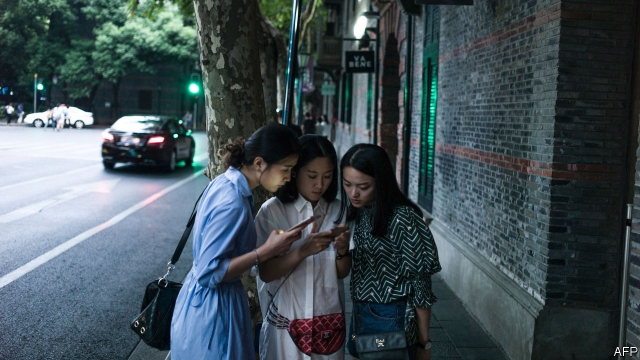

###### Cracks in the wall

# The compelling story of a Chinese millennial 

##### In “Under Red Skies”, Karoline Kan takes control of her generation’s narrative 

 

> May 2nd 2019 

Under Red Skies. By Karoline Kan. Hachette Books; 320 pages; $27. Hurst; £20. 

CHAOQUN’S BIRTH was a rebellion. Her mother hid her coveted but illegal second pregnancy from officials and neighbours in her village. At the time, under China’s one-child policy, women who already had children were sterilised or forced to have long-term contraceptives surgically inserted. But Chaoqun slipped through the system’s cracks, and was born in 1989, just a few months before the protests that culminated in a military assault on Tiananmen Square. She grew up to work for the New York Times. Under her pen name, Karoline Kan, she has written the gripping autobiography of a generation—and a superpower—caught between tradition and ambition. 

There are more Chinese millennials than there are people in America, but they rarely tell their own stories. Born during and after Deng Xiaoping’s push to replace a Marxist economy with market capitalism, they grew up amid relative abundance and burgeoning shopping malls. The backdrop of Ms Kan’s narrative is unprecedented economic growth, mass urbanisation and the cultural changes they engendered. It arcs from paddy fields to swanky Western parties in Beijing, taking in crowded rooms in the hutongs, narrow alleys in the older parts of northern Chinese cities. 

Like millions of others, Ms Kan’s mother wanted to move the family away from their village in search of a better life. Because of their rural hukou (household registration certificates that limit migrants’ access to services and work), it was hard to find a job in a city. But another crack appeared, when a relative asked the family to take over a private kindergarten. As a farmer’s daughter, Ms Kan had to prove herself worthy of a place in a city school. She was taught to behave, study for her gaokao, the college entrance exam, and not to think for herself. Yet when her teacher told the children to cry because of the death of “dear grandpa Deng Xiaoping”, she thought: how can I cry for a man I never knew? 

Later she spent two weeks undergoing junxun, basic military training that all university freshmen must complete. Ms Kan emerged even more sceptical of the system. She heard whispers and warnings about the bloodshed around Tiananmen, but it was never explained. When she discovered the truth, she cried sincerely. “China collapsed for me suddenly,” she writes. “I had no faith in what I had been brought up to believe.” 

As a student in Beijing, Ms Kan was exposed to foreign ideas. Thanks to an American lecturer’s encouragement, she became obsessed with learning English. In “Under Red Skies” she tells her story in straightforward English prose that still suggests her Chinese roots. For example, a romantic crush leads to a little deer roaming in her stomach, not butterflies. After graduation she found a job writing about Beijing for an English-language publication. Later she joined the Times as a researcher (the only journalistic role that Chinese citizens are allowed to perform for foreign media). 

Ms Kan carved her own path through a series of small rebellions. Her story shows that, for all the government’s efforts to suppress the sort of defiance that fuelled the Tiananmen protests, it cannot seal all the cracks through which China’s young people learn about the world. 

-- 

 单词注释:

1.millennial[mi'leniәl]:a. 一千年的, 千福年的 

2.karoline[]:n. (Karoline)人名；(德、罗、瑞典)卡罗利妮 

3.kan[]:n. 赣江 

4.narrative['nærәtiv]:n. 叙述, 故事 a. 叙述的, 叙事的, 故事体的 

5.hurst[hә:st]:n. 小丘, 小树林, 沙洲 

6.covet['kʌvit]:v. 妄想, 垂涎 

7.pregnancy['preɡnәnsi]:n. 怀孕；丰富, 多产；意义深长 

8.sterilise['sterɪlaɪz]:vt. 使无用; 使无菌; 使绝育; 使贫瘠化 

9.contraceptive[.kɒntrә'septiv]:a. 避孕的 n. 避孕剂, 避孕用具 

10.surgically[]:adv. 如外科手术般地 

11.culminate['kʌlmineit]:vi. 到绝顶, 达于极点, 达到高潮 vt. 使到绝顶, 使达到高潮 

12.assault[ә'sɒ:t]:n. 攻击, 袭击 vt. 袭击, 攻击 vi. 发动攻击 

13.york[jɔ:k]:n. 约克郡；约克王朝 

14.millennials[mɪ'leniəl]:adj. 一千年的；一千年至福的 [网络] 千禧世代；千禧之子；千禧一代 

15.capitalism['kæpitәlizәm]:n. 资本主义 [经] 资本主义 

16.amid[ә'mid]:prep. 在其间, 在其中 [经] 在...中 

17.abundance[ә'bʌndәns]:n. 丰富, 充足, 大量 [经] 丰富, 充裕 

18.burgeoning[]:[计] 急速增长的 

19.mall[mɔ:l]:n. 林荫路 

20.backdrop['bækdrɒp]:n. 背景幕, 背景 

21.unprecedented[.ʌn'presidentid]:a. 空前的 [经] 空前的, 无前例的 

22.urbanisation[ˌɜ:bənaɪ'zeɪʃən]:n. 城市化（等于urbanization） 

23.cultural['kʌltʃәrәl]:a. 文化的, 教养的, 修养的 [医] 培养的 

24.engender[in'dʒendә]:vt. 产生, 引起 vi. 发生, 形成 

25.arc[ɑ:k]:n. 弧, 弧形, 弓形, 弧光 [化] 弧 

26.paddy['pædi]:n. 稻, 谷, 爱尔兰人, 警察 [法] 警察 

27.swanky['swæŋki]:a. 爱出风头的, 炫耀的 

28.hutong['hʌtɒŋ]: 胡同 

29.hukou[hu:'ku:]: [医]虎口 

30.registration[.redʒi'streiʃәn]:n. 登记, 挂号, 注册 [计] 登记; 定位; 对齐; 记录 

31.gaokao[]:[网络] 高考·人生·选择；状元秘笈；录取查询 

32.freshman[]:n. 新手, 生手, 大学一年级学生, (美)中学一年级学生 

33.bloodshed['blʌdʃed]:n. 流血 

34.obsess[әb'ses]:vt. 迷住, 使困扰 

35.prose[prәuz]:n. 散文 v. 写散文 a. 散文的, 平凡的 

36.roam[rәum]:v. 漫游, 闲逛, 徜徉 n. 漫步, 漫游 

37.journalistic[,dʒ\\: nә'listik]:a. 新闻业的, 新闻工作者的, 报刊特有的, 新闻工作的 

38.sery[]:n. (Sery)人名；(俄)谢雷；(科特)塞里 

39.suppress[sә'pres]:vt. 镇压, 使止住, 禁止, 抑制, 查禁 [法] 镇压, 平定, 禁止出版 

40.defiance[di'faiәns]:n. 蔑视, 挑战 [法] 挑战, 藐视, 违抗 

41.cannot['kænɒt]:aux. 无法, 不能 

