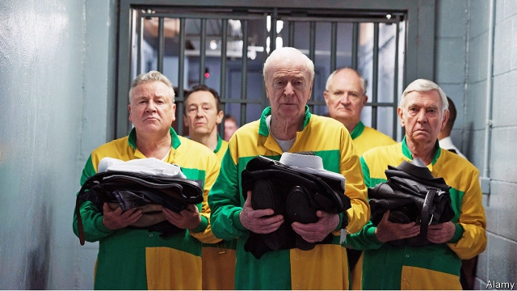

###### Rough diamonds

# The “bad grandpas” and the last great British heist 

##### How a gang of elderly crooks came out of retirement to carry out Britain’s biggest-ever burglary 

 

> May 2nd 2019 

The Last Job: The “Bad Grandpas” and the Hatton Garden Heist. By Dan Bilefsky. W.W. Norton; 304 pages; $26.95. 

THE TEN-TONNE, bomb-proof door of the Hatton Garden Safe Deposit Company has never been breached. But over the long Easter weekend of 2015, an ingenious gang found another way into the closely guarded vault beneath London’s jewellery quarter. After sneaking into the building, the robbers climbed down a lift-shaft, disabled an alarm system and drilled through 20inches (51cm) of reinforced concrete, before worming their way through the hole to ransack the safe. They made off with wheelie-bins full of gold, cash and gems worth more than $20m. 

The Hatton Garden burglary was “the last great British heist”, in the words of the prosecutor who eventually convicted the men behind it. It was also one of the oddest, as Dan Bilefsky, a correspondent for the New York Times, explains in his entertaining and detailed account of the caper. The fearsome crew behind the crime of the century turned out to be a gang of grandpas, led by a 76-year-old who travelled to the raid using his senior citizen’s bus pass. The “diamond wheezers”, as the Sun newspaper nicknamed them, overcame diabetes, heart disease and incontinence to carry out a spectacular last job. 

The story provides a rich slice of London’s East End underworld, with a cast including men with names such as “Little Legs” Larkins, Billy the Fish and Jimmy Two Baths. One of the other crooks depicted in the book has a pair of Rottweilers called Brinks and Mat (after the Brink’s-Mat robbery, another celebrated hold-up); another once kept a pet lion and has a door-bell that plays the theme from “Goldfinger”. Some aspects of the Hatton Garden story sound straight from the script of a Michael Caine film—and indeed, three years after the event, it became one (see picture). 

Scotland Yard initially made a hash of the case. The grandpas tripped an alarm as they broke in, but the police failed to respond. In the aftermath of the crime, tips pointed to an eastern European gang called the Pink Panthers. But soon the Flying Squad homed in on the grandpas, largely thanks to John “Kenny” Collins, described by fellow gang-members as a “wombat-thick old cunt”, who drove to the crime in his own distinctively painted Mercedes. Police tracked it on CCTV and were led to other members of the crew. By bugging their cars, they pieced the crime together (a task complicated by the elderly crooks’ habit of having the radio on very loud, and by their use of obscure Cockney slang). 

The grandpas were “1980s criminals who committed a crime in the 21st century”, as one of their defence lawyers put it. They used the same mobile phones after the robbery, forgot to throw away their public-transport smart-cards, and boasted about the crime in their bugged cars and in their favourite pub (which was Mr Bilefsky’s local too, as it happens), where the police were filming them and passing the footage to a lip-reader. 

Eventually the cops swooped, catching the men red-handed with Lidl bags full of loot. “It’s overwhelming I suppose, innit?” conceded one of the gang when police confronted him with the evidence. It was: the grandpas pleaded guilty and were sent to a high-security prison, some of them straining with their hearing aids to hear the judge’s sentence. 

-- 

 单词注释:

1.heist[haist]:n. 强夺, 拦劫, 抢劫 vt. 强夺, 拦劫, 抢劫 

2.crook[kruk]:n. 钩, 弯曲部分, 坏蛋 vt. 使弯曲, 诈骗 vi. 弯曲 

3.retirement[ri'taiәmәnt]:n. 退休, 隐居, 撤退 [经] 退休, 退股, (固定资产)报废 

4.burglary['bә:^lәri]:n. 夜盗行为, 盗窃, 盗窃行为 [法] 夜盗行为, 夜间入屋窃盗罪, 窃盗 

5.Hatton[]:n. (Hatton)人名；(英)哈顿；(法)阿东 

6.dan[dæn]:n. 段(柔道、围棋运动员的等级) [建] 小车, 空中吊运车, 杓 

7.norton['nɔ:tәn]:n. 诺顿（男子名）；诺顿公司（美国一软件公司） 

8.breach[bri:tʃ]:n. 裂口, 违背, 破坏, 违反, 突破, 破裂 vt. 攻破, 突破 vi. 跳出水面 

9.ingenious[in'dʒi:njәs]:a. 灵敏的, 精巧的, 聪明的 

10.vault[vɒ:lt]:n. 拱顶, 窖, 地下室, 撑竿跳, 穹窿 vt. 做成圆拱形, 撑竿跳过 vi. 成穹状弯曲, 跳跃 

11.jewellery['dʒu:әlri]:n. 宝石, 贵重饰物, 珠宝, 宝石饰物, 受珍视的人/物, 宝贝, 有价值的人/物 

12.sneak[sni:k]:vi. 鬼鬼祟祟做事 vt. 偷偷地做 n. 鬼鬼祟祟的人, 偷偷摸摸的行为, 帆布胶底运动鞋 a. 暗中进行的 

13.ransack['rænsæk]:vt. 到处搜索, 遍寻, 掠夺, 洗劫 [法] 洗劫, 抢劫, 掠夺 

14.gem[dʒem]:n. 珠宝, 宝石, 珍贵之物 vt. 饰以宝石 

15.prosecutor['prɒsikju:tә]:n. 实行者, 告发者, 公诉人 [法] 原告, 起诉人, 检举人 

16.convict[kәn'vikt]:n. 囚犯, 罪犯 vt. 宣告有罪, 使知罪 

17.oddest[]:奇怪的 古怪的（ odd的最高级 ） 

18.york[jɔ:k]:n. 约克郡；约克王朝 

19.caper['keipә]:n. 跳跃 vi. 雀跃, 蹦跳 

20.fearsome['fiәsәm]:a. 吓人的, 可怕的, 害怕的 

21.wheezers[hwi:z]:wheezer n. wheeze的变形 wheeze [hwi:z] vi. 喘，喘息： to wheeze upstairs 气喘吁吁地上楼 呼哧呼哧地响： The old organ wheezed. 这架旧风琴呼哧呼哧地响。 vt. 喘息地说： The old man coughed badly and wheezed out a few words. 那个老人咳嗽得厉害，气喘吁吁地说了几句话。 喘息地发出，呼哧呼哧地发出 ： The train wheezed wreaths of steam. 火车呼哧呼哧的喷出一团团蒸汽。 n. 喘息；喘息声 [俚语]俏皮话，老生常谈的笑话 [俚语]计谋，巧主意 变形： vi. wheezed . wheezing 

22.nickname['nikneim]:n. 绰号, 昵称 vt. 给...取绰号, 叫错名字 [计] 绰号 

23.diabetes[daiә'bi:ti:z]:n. 糖尿病, 多尿症 [医] 糖尿病; 多尿症 

24.incontinence[in'kɒntinәns]:n. 无节制, 荒淫, 失禁 [医] 失禁, 无节制 

25.spectacular[spek'tækjulә]:a. 公开展示的, 惊人的, 壮观的 n. 奇观, 惊人之举, 展览物 

26.underworld['ʌndәwә:ld]:n. 下层社会, 地狱, 下流社会 

27.larkins[]: [人名] 拉金斯 

28.billy['bili]:n. 警棍, 伙伴 

29.jimmy['dʒimi]:n. 铁撬 vt. 撬 

30.depict[di'pikt]:vt. 描述, 描写 

31.rottweiler['rɔtwailә]:n. （德国种）罗特韦尔犬 

32.brink[briŋk]:n. 边缘, 陡岸 

33.Goldfinger['ɡəuldfiŋə]:n. 金手指（电影名） 

34.script[skript]:n. 手迹, 手稿, 正本, 手写体 vt. 改编为演出本 [计] 手写体, 小型程序 

35.michael['maikl]:n. 迈克尔（男子名） 

36.caine[]:n. 该隐（《圣经·旧约》中亚当和夏娃的长子） 

37.initially[i'niʃәli]:adv. 最初, 开头 

38.hash[hæʃ]:n. 剁碎的食物, 杂乱无章的的一大堆, 杂烩, 复述 vt. 切碎, 搞糟 

39.aftermath['ɑ:ftәmæθ]:n. 结果, 后果 [法] 后果, 结果 

40.panther['pænθә]:n. 豹, 黑豹, 美洲豹 

41.squad[skwɒd]:n. 班, 小队, 小集团 vt. 编成班 

42.john[dʒɔn]:n. 盥洗室, 厕所, 嫖客 

43.kenny['keni]:n. 肯尼（姓氏） 

44.collins['kɒlinz]:n. 柯林斯酒 

45.cunt[kʌnt]:n. [俚]女性阴部；性交；淫妇 

46.distinctively[dɪ'stɪŋktɪvlɪ]:adv. 区别地, 特殊地 

47.mercedes['mә:sidi:z]:n. 梅塞德斯（人名）；梅赛德斯（公司名） 

48.CCTV[]:[计] 闭路电视 

49.bug[bʌg]:n. 错误, 虫, 病菌, 缺陷, 窃听器, 癖好, 防盗报警器, 双座小汽车, 要人 vt. 装防盗报警器, 装窃听器, 激怒 vi. 捉虫, 暴突 [计] 缺点, 错误 

50.Cockney['kɒkni]:n. 伦敦东区佬, 东伦敦话, 伦敦腔 a. 伦敦人的, 东伦敦话的 

51.slang[slæŋ]:n. 俚语 v. 辱骂, 用俚语说 

52.footage['futidʒ]:n. 英尺长度, 英板尺, (影片的)连续镜头 

53.cop[kɒp]:n. 警官 vt. 抓住 

54.swoop[swu:p]:n. 俯冲, 攫取 vt. 抓取 vi. 猛扑, 突然袭击 

55.Lidl[]:[网络] 利德尔；超市；连锁超市利德 

56.loot[lu:t]:n. 赃物, 洗劫, 抢夺 v. 洗劫, 抢夺 

57.overwhelm[.әuvә'hwelm]:vt. 淹没, 受打击, 制服, 压倒, 使不知所措 [法] 打翻, 倾覆, 覆盖 

58.concede[kәn'si:d]:vt. 承认, 退让 vi. 让步 

59.confront[kәn'frʌnt]:vt. 使面对, 对抗, 遭遇, 使对质, 比较 [法] 对证, 使对质, 比较 

60.plead[pli:d]:vi. 辩护, 恳求 vt. 为...辩护, 提出...借口, 托称, 恳求 

