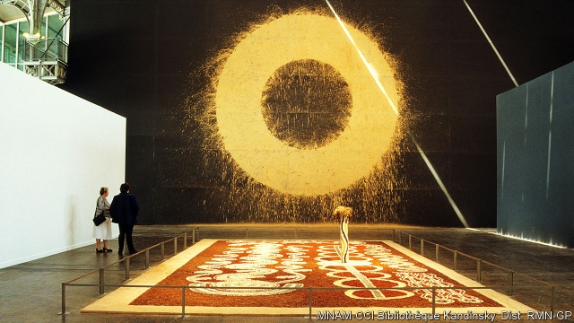
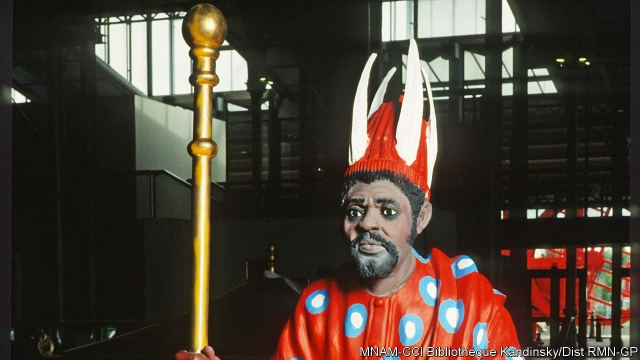

###### A brave new world

# Thirty years ago a show in Paris set out to redraw the art world 

##### A flop at the time, it left an influential—and contested—legacy 

 

> May 2nd 2019 

AT THE END of the Grande Halle de la Villette, a former abattoir built by Emperor Napoleon III in the north-east of Paris, lay “Yam Dreaming” (pictured above), a work by six men from Yuendumu, a community of Aboriginal artists in central Australia. A teeming rectangular floor installation, it was ten metres long and made from earth, ochre, paint and crushed herbs. On the wall behind it was “Red Earth Circle” by Richard Long, a British artist, which used mud scooped from the River Avon, near his birthplace. The circles and spirals on the floor and Mr Long’s shape clearly shared a connection; you could see it in how people stood and stared from one to the other. Perhaps the adjacent works pointed in the same direction; perhaps they were aspects of the same idea. 

Such questions delighted Jean-Hubert Martin, the curator who had brought the two pieces together. They were just the sort of responses he wanted to “Magiciens de la Terre” (“Magicians of the Earth”), a groundbreaking show he put on in Paris in 1989. The exhibition was in some ways a flop. In others it was a harbinger, or catalyst, of the way the art world would change with globalisation in the next three decades—changes evident at the Venice Biennale, contemporary art’s premier showcase, which begins on May 11th and where work by artists from 90 countries will be shown. As Frances Morris, now director of Tate Modern in London, wryly remarks: “It was the most famous exhibition nobody saw.” 

Born in Alsace in 1944, Mr Martin grew up at a time when the notion that great art meant Western art was a given—at least in the West. Then, aged 21, a history-of-art student and a hippy, he headed overland to India in a Citroen 2CV and found himself wondering why, despite centuries of exposure to, and appropriation from, other cultures, the art world still paid attention to only European and American work. 

That puzzlement came to a head in 1984. Having become director of Kunsthalle Bern in Switzerland, Mr Martin travelled to New York to see the latest show at the Museum of Modern Art (MoMA), which focused on the moment European and American artists saw art from sub-Saharan Africa for the first time. African masks, their makers unknown, sat beside proto-Cubist pieces by Picasso—not as creations in their own right but as illustrations meant to demonstrate how a “real” artist absorbed such influences. Mr Martin resolved to do better. 

Partly as a reaction to the MoMA show, he came up with the idea of “Magiciens de la Terre”. It would present the work of 100 living artists, half from the West and half from the rest of the world. They would meet on equal terms, and thus, he hoped, reveal a universal spirit of creativity. He pitched the idea to the directors of Documenta, a monumental contemporary-art exhibition that has been put on in the German city of Kassel every five years since 1955. They turned it down. It was the first in a long series of rejections from people he approached for money, a venue or both. 

When he finally got lucky it was partly through the misfortune of others. After he moved from Bern to Paris to be director of the Pompidou Centre, also known as the Beaubourg, the Biennale de Paris was suspended, making its venue at La Villette available. Canal Plus, a French broadcaster, joined as a sponsor. Mr Martin was thus able to stage the show across the two venues, part of it downtown at the Beaubourg, part of it out at La Villette. It opened 30 years ago this month. The timing was auspicious. The cold war and its proxy struggles were ending, while the bicentenary of the French revolution provided a context of equality and fraternity—and of a world turned upside down. 

The artists, many of whom had never exhibited outside their own country, were presented with no explanation of how they fitted into either group—Westerners or the rest—how famous they were, what prizes they had won or which art school, if any, they had attended. Besides telling visitors the artists’ names and countries of origin, the exhibition offered no comment, comparison or context: all that was left to the viewers. Film, collages and installations were mixed up with masks, earthworks and embroidery, as well as the more conventional art forms, sculpture and painting. Two lines of brightly coloured giant funerary statues (pictured right), by Sunday Jack Akpan from Nigeria, formed a guard of honour next to a wall of pink quartz cubes which Marina Abramovic, a Serbian performance artist, had placed at the height of her head, her heart, her sex. 

Some of Mr Martin’s peers were scathing, he recalls. Kasper König, founding director of Skulptur Projekte Münster and one of the great curators of his generation, brushed the show aside as “UNESCO art”—pro forma internationalism driven by insipid politics. Few institutions were moved to acquire any of the non-Western pieces. The professionals’ lack of interest was matched by the public’s. When the show closed on August 14th fewer than 300,000 people had seen it, piddling by the Pompidou’s normal standards. The catalogue was never translated from French. 

Now that catalogue is prized: a copy will cost you €420 ($470) on eBay. The show it commemorates is remembered as one that reshaped the art world—and which remains controversial a generation later. These days, the two words most often used to describe “Magiciens de la Terre” are “important” and “troubling”. 

Its influence can be observed wherever you see contemporary art from beyond America, Europe and Japan—which means, now, wherever you see contemporary art. Take the fact that contemporary-art biennales flicker on and off around the planet like fireflies on a summer night, fed by dealers and collectors in places where such people were not known before. Or consider that a Congolese sculptor first seen outside his homeland at “Magiciens”, the late Bodys Isek Kingelez, was recently the subject of a show at MoMA; or that works by Romuald Hazoumè, a sculptor from Benin who makes masks out of bits of rubbish, are shown at Gagosian, the trendiest set of commercial galleries in the world. 

You can also see the show’s influence, if you have access, in private collections—including some it inspired. Jean Pigozzi, heir to a French motor fortune, visited on the last afternoon before it closed. The next week he set about building a collection of African contemporary art, supporting artists with brushes, paints and cash for decades. “‘Magiciens’ was extremely important in my life,” he says. 

What then of the controversy? Start with the name. By calling his artists “Magiciens”, thus invoking a vague sense of voodoo or black magic, Mr Martin showed a taste for the exotic that post-colonial academia was trying hard to dispel. The name also suggested that the art was somehow conjured up, rather than the result of an intelligence at work. “The message was that it’s not real, what they do,” says Glenn Lowry, MoMA’s director. “It’s magic.” 

Some wondered how far Mr Martin’s apparent inclusiveness really went. Many of the Western artists were already unconstrained by borders, taking an interest in the global (as in Alighiero Boetti’s embroidered world maps) and the universal (as in the explorations of the subconscious given form in the sculpture of Louise Bourgeois). Yet he was not particularly interested in developing-country artists who explored the developed world and its ideas, says Lucy Steeds, an art historian who has written extensively about the show. Indeed, Mr Martin avoided non-Western artists who were actively engaging with modernism, seeing them as derivative, even contaminated, by the influence of Europeans. It was a bias which led him to ignore great artists from Japan, Latin America and north Africa. One who made the cut, Rasheed Araeen, a Pakistani long resident in Britain, has never let that involvement stop him criticising the project harshly. Simply displaying work by artists from all over the world, he says, was never going to undermine the Western-dominated status quo. 

 

Mr Martin’s desire that non-Western art should be “authentic” led him to traditional Aboriginal earth paintings, to the coloured face masks carved by Dossou Amidou from Benin and the multi-headed cast-iron sculptures made by Georges Liautaud, a 90-year-old Haitian. For advice, he turned not to art galleries or curators, but to French anthropologists who had worked in west Africa, Asia or the Caribbean. 

Yet the stripped-down format of his show often undercut the authenticity he claimed to prize. A work like “Yam Dreaming” is rooted in a spiritual dimension that is specific to the culture of the people who made it. Seen by people ignorant of that culture and in an alien environment, it is robbed of some of its essence. The same cannot be said of Mr Long’s “Red Earth Circle”, which was much more on its home turf. Centred on the wall at the end of a high-ceilinged hall, it could not help but recall, for a Western audience, the rose window of a cathedral. 

The minimal labelling compounded the problem. To add nothing to the name of an established Western artist such as Mr Long—who, having been nominated for the Turner prize in three previous years, was about to win it—was efficiently minimalist. Doing the same for unknowns seemed a denial for artists and viewers alike. 

In an unequal world art cannot meet on fully equal terms. Memory, history and association add to a piece’s power. So does scholarship: an appreciation of how this work, made here and now, relates to that work there and then. You cannot wish away those depths—but nor should the art world be divided into siloed provinces and ghettoes. Despite its flaws and the assumptions of its time, “Magiciens” helped sweep away many old barriers. 

And it posed an always relevant, always vexed question: Who decides what is great art? The bold way in which it presented its artworks together, yet in isolation, continues to be debated 30 years on. Ms Morris, the Tate director, summarises the challenge it embodied: “Once you deconstruct the canon, what do you put in its place?” 

Images: © mnam-cci Bibliothèque Kandinsky, Dist. rmn-gps 

  

-- 

 单词注释:

1.redraw[.ri:'drɒ:]:vt. 重画 vi. 刷新屏幕 [计] 刷新屏幕 

2.flop[flɒp]:n. 砰然落下, 拍击声, 失败 vi. 笨重地摔, 猛落 vt. 笨拙地抛下 adv. 噗通 

3.grande[^rɑ:nd]:a. 重大的, 显要的 

4.halle[]:n. 哈雷（德国城市） 

5.de[di:]:[化] 非对映体过量 [医] 铥(69号元素铥的别名,1916年Eder离得的假想元素) 

6.La[lɔ:, lɑ:]:[医] 镧(57号元素) 

7.Villette[]:n. 维莱特（小说名）；维莱特（法国北部地名） 

8.abattoir['æbәtwɑ:]:n. 屠场, 角斗场 [医] 屠宰场 

9.Napoleon[nә'pәuljәn]:n. 拿破仑 

10.iii[]:num. 罗马数字3 

11.yam[jæm]:n. 山药, 薯蓣 [医] 薯蓣属植物 

12.yuendumu[]: [地名] [澳大利亚] 延杜穆 

13.aboriginal[.æbә'ridʒәnәl]:a. 原始的, 土著的 n. 土著居民, 土生生物 

14.teem[ti:m]:vi. 充满, 充足, 倾注 vt. 倒出 

15.rectangular[rek'tæŋgjulә]:a. 成直角的 [化] 矩形的 

16.ochre['әukә]:n. 赭石, 赭色 vt. 涂赭色于 

17.richard['ritʃәd]:n. 理查德（男子名） 

18.scoop[sku:p]:n. 铲子, 勺子, 穴, 口, 独家新闻 vt. 汲取, 舀取, 挖空, 抢先报道 

19.avon['eivɔn]:n. 埃文河（英国西南部一河）；雅芳（化妆品品牌） 

20.spiral['spairәl]:n. 螺旋形之物, 螺线 a. 螺旋形的, 盘旋的 vi. 螺旋形下降, 螺旋形上升, 螺旋形行进 vt. 使螺旋形行进 

21.adjacent[ә'dʒeisәnt]:a. 毗连的, 邻近的, 连接的 [机] 相邻的, 邻位的, 交界的 

22.Martin['mɑ:tin]:n. 马丁, 圣马丁鸟 

23.curator[kjuә'reitә]:n. 管理者, 经理, 主管人, 掌管者, 馆长, 大学学监, 监护人, 保护人 [经] 临时监护人 

24.magiciens[]:[网络] 魔术师 

25.terre[]:abbr. Trans-Europe Railroad Express 横贯欧洲铁路特别快车 

26.magician[mә'dʒiʃәn]:n. 魔术家, 幻术家, 术士 

27.groundbreaking[ˈgraʊndbreɪkɪŋ]:a. 开创性的, 突破性的 

28.harbinger['hɑ:bindʒә]:n. 通告者, 预告者, 先驱, 预兆 vt. 预告, 充做...的前驱 

29.catalyst['kætәlist]:n. 触媒, 接触剂, 催化剂, 刺激因素, 促进因素 [计] 催化剂 

30.globalisation[,gləubəlai'zeiʃən]:n. 全球化, =globalization 

31.Venice['venis]:n. 威尼斯 

32.Biennale[,biːe'nɑːleɪ; -lɪ]:n. 两年发生一次的事物 n. (Biennale)人名；(法)比耶纳勒 

33.showcase['ʃәukeis]:n. 陈列橱 [经] 商品陈列所, 货物陈列架 

34.morris['mɒ:ris]:n. 莫里斯舞 

35.tate[teit]:n. 塔特（姓氏） 

36.wryly[raɪlɪ]:adv. （面部表情）做鬼脸地, 苦笑地, 嘲讽地 

37.Alsace[æl'sæs]:n. 阿尔萨斯(法国地名) 

38.hippy['hipi]:n. 嬉皮士 

39.overland['әuvәlænd]:a. 经由陆路的, 经过陆地的 adv. 经由陆路地 

40.citroen[]:n. （法国）雪铁龙牌汽车 

41.appropriation[әprәupri'eiʃәn]:n. 拨用, 挪用, 拨款 [经] 拨款, 挪用 

42.puzzlement['pʌzlmәnt]:n. 迷惑 

43.kunsthalle[]:[网络] 美术馆；艺术馆；汉堡美术馆 

44.Bern[bә:n]:n. 伯尔尼(瑞士首都) 

45.york[jɔ:k]:n. 约克郡；约克王朝 

46.MOMA[]:abbr. 亚甲基双2-甲氧基苯胺（methylene bis 2-methoxyaniline）；纽约现代艺术博物馆（The Museum of Modern Art） 

47.maker['meikә]:n. 制造者, 上帝 [经] 制造者, 出票人 

48.creation[kri:'eiʃәn]:n. 创造, 创作物, 发明 [化] 产生 

49.creativity[.kri:ei'tiviti]:n. 创造力, 创造性 

50.documenta[]:[网络] 卡塞尔文献展；卡塞尔文件展；卡塞尔文件大展 

51.monumental[.mɒnju'mentәl]:a. 纪念碑的, 做为纪念的, 不朽的 

52.Kassel['kæsәl, 'kɑ:s-]:卡塞尔[德意志联邦共和国东部城市] 

53.sery[]:n. (Sery)人名；(俄)谢雷；(科特)塞里 

54.rejection[ri'dʒekʃәn]:n. 拒绝, 抛弃, 驳回, 被抛弃的东西, 呕出物 [化] 报废; 拒收 

55.venue['venju:]:n. 犯罪地点, 审判地, 发生地点 

56.misfortune[mis'fɒ:tʃәn]:n. 不幸, 灾祸, 坏运气 [法] 不幸事故, 不幸, 灾祸 

57.Pompidou[]:n. (Pompidou)人名；(法)蓬皮杜 

58.beaubourg['bəubə:ɡ]:n. 波堡（意为“美丽之城”，乔治蓬皮杜全国艺术文化中心的昵称或诨名） 

59.La[lɔ:, lɑ:]:[医] 镧(57号元素) 

60.broadcaster['brɒ:dkæstә]:n. 播送者, 广播装置, 播种机 

61.timing['taimiŋ]:n. 时间选择, 时间测定, 定时, 调速 [计] 定时器时钟 

62.auspicious[ɒ:'spiʃәs]:a. 吉兆的, 幸运的 

63.proxy['prɒksi]:n. 代理, 代理人, 委托书 [经] 代理人, 代表权, 授权书 

64.bicentenary[baisen'ti:nәri]:a. 二百周年的 

65.context['kɒntekst]:n. 上下文, 背景, 来龙去脉 n. 上下文 [计] 上下文 

66.upside['ʌpsaid]:n. 上侧, 上段, 上部 [机] 上侧, 上部 

67.collage[kɒ'lɑ:ʒ]:n. 拼贴画 

68.earthwork['\\:θw\\:k]:n. 土木工事, 土方工程 

69.embroidery[im'brɒidәri]:n. 刺绣品, 粉饰, 刺绣 

70.brightly['braitli]:adv. 生辉地, 明亮地, 鲜明地 

71.funerary['fju:nәrәri]:a. 葬礼的, 埋葬的 

72.jack[dʒæk]:n. 插座, 千斤顶, 男人 vt. 抬起, 提醒, 扛举, 增加, 提高, 放弃 a. 雄的 [计] 插座 

73.akpan[]:[网络] 阿克潘 

74.Nigeria[nai'dʒiriә]:n. 尼日利亚 

75.quartz[kwɒ:ts]:n. 石英 [化] 石英 

76.marina[mә'rinә]:n. 码头 

77.abramovic[]:[网络] 阿布拉莫维奇；阿布；阿布洛莫维奇 

78.serbian['sә:bjәn]:a. 塞尔维亚人（语）的；塞尔维亚的 

79.peer[piә]:n. 同等的人, 匹敌, 贵族 vi. 凝视, 窥视, 费力地看, 隐现 vt. 与...同等, 封为贵族 

80.scathing['skeiðiŋ]:a. 伤害的, 损伤的, 严厉的 

81.Kasper[]:卡斯帕 

82.Münster[]:[地名] 明斯特 ( 奥、德、瑞士 ) 

83.UNESCO[ju:'neskәj]:联合国教育科学及文化组织, 联合国教科文组织 

84.forma[]:n. 福马（环境科技公司名） 

85.internationalism[.intә'næʃәnәlizm]:n. 国际主义, 国际性 [经] 国际主义 

86.insipid[in'sipid]:a. 乏味的, 清淡的, 难吃的 [医] 无味的 

87.politic['pɒlitik]:a. 精明的, 明智的, 策略的 

88.piddle['pidl]:vi. 鬼混, 浪费, 挑食, 撒尿 

89.ebay[]:电子港湾；易趣（知名网上购物网站） 

90.commemorate[kә'memәreit]:vt. 纪念 

91.reshape[ri:'ʃeip]:vt. 改造, 使成新的形状, 打开新局面 vt. 整形 vi. 整形 [计] 整形 

92.Biennale[,biːe'nɑːleɪ; -lɪ]:n. 两年发生一次的事物 n. (Biennale)人名；(法)比耶纳勒 

93.flicker['flikә]:n. 闪烁, 闪光, 颤动 vi. 闪动, 闪烁, 摇动, 扑动翅膀 vt. 使摇曳, 使闪烁 

94.firefly['faiәflai]:n. 萤火虫 

95.dealer['di:lә]:n. 经销商, 商人 [经] 交易员, 贩卖商 

96.collector[kә'lektә]:n. 收集家, 收取款项的人 [化] 集电极; 捕收剂 

97.Congolese[,kɔŋ^ә'li:z]:n. 刚果人, 刚果语 a. 刚果的, 刚果语的, 刚果人的 

98.sculptor['skʌlptә]:n. 雕刻家 

99.bodys['bɒdɪ]:n. 【动物学、解剖学】；(人、动物的)身体、躯体 b(人、动物的)躯干，主体(除头、肢、尾外) vt. 赋…以形体，赋…以物质形式；使具体化(通常与forth连用)：；体现，象征(通常与forth连用)： adj. 肉体(上)的；身体(方面)的 

100.isek[]:[=international society of electromyographic kinesiology]国际肌电描记运动学会 

101.romuald[]:[网络] 罗穆阿德；罗曼尔德；罗慕铎 

102.Benin[be'nin]:贝宁湾(几内亚湾一部分,靠西非的尼日利亚、贝宁和多哥等国) 

103.gagosian[]: [人名] 加戈西安 

104.trendy['trendi]:a. 随潮流的, 时髦的, 赶潮流的 

105.pigozzi[]:[网络] 猪油 

106.invoke[in'vәuk]:vt. 祈求, 恳求, 实行, 援引, 引起 [计] 调用; 请求 

107.voodoo['vu:du:]:n. 伏都教, 巫术, 巫术信仰 

108.exotic[ig'zɒtik]:a. 异国的, 外来的 n. 外来人, 外来物, 舶来品 

109.academia[.ækә'di:miә]:n. 学术界, 学术生涯 

110.dispel[dis'pel]:vt. 驱散, 驱逐 

111.conjure['kʌndʒә]:vt. 念咒文召唤, 变戏法, 想象 vi. 变戏法, 施魔法 

112.glenn[^len]:n. 格伦（男子名） 

113.lowry[]:n. 活动顶棚车 

114.inclusiveness[]:n. 包容性 

115.unconstrained[.ʌnkәn'streind]:a. 不受约束的, 不勉强的, 自在的 [法] 不拘束的, 不勉强的, 自由的 

116.alighiero[]:[网络] 阿利吉耶路；利吉耶罗；阿利吉耶罗 

117.embroider[im'brɒidә]:vt. 刺绣, 镶边, 装饰 vi. 绣花 

118.exploration[.eksplә'reiʃәn]:n. 探险, 踏勘, 探测 [医] 探察 

119.subconscious[.sʌb'kɒnʃәs]:n. 潜在意识, 下意识 a. 下意识的, 潜意识的 

120.louise[lu(:)'i:z]:n. 路易丝（女子名） 

121.bourgeois[buә'ʒwɑ:]:n. 中产阶级分子, 商人, 资产阶级 a. 中产阶级的, 平庸的 n. 九点活字 

122.lucy['lu:si]:n. 露西（女子名） 

123.steed[sti:d]:n. 战马 

124.historian[hi'stɒ:riәn]:n. 历史学家, 记事者 

125.extensively[]:adv. 广大, 广延, 外延, 大面积(耕种), 粗放, 广博, 广泛, 广阔 

126.actively['æktivli]:adv. 活跃地, 积极地 

127.modernism['mɒdәnizm]:n. 现代作风, 现代主义, 现代思想 

128.derivative[di'rivәtiv]:a. 引出的, 派生的 n. 引出之物, 派生物, 衍生字 

129.contaminate[kәn'tæmineit]:vt. 弄污, 弄脏, 污染, 毒害 [化] 污染 

130.bias['baiәs]:n. 偏见, 斜纹 a. 偏斜的 adv. 偏斜 vt. 使有偏见 [计] 偏流; 偏压; 偏磁; 偏离 

131.rasheed[]:[网络] 拉希德；拉什德；天尊 

132.araeen[]:[网络] 阿拉 

133.Pakistani[.pɑ:ki'stɑ:ni]:a. 巴基斯坦的 n. 巴基斯坦人 

134.involvement[in'vɔlvmәnt]:n. 卷入, 牵连, 包含, 困窘 [经] 财政困难, 经济上的困窘 

135.criticise['kritisaiz]:v. 批评, 吹毛求疵, 非难 

136.harshly['hɑ:ʃli]:adv. 粗糙地, 粗暴地, 刺耳地 

137.undermine[.ʌndә'main]:vt. 在...下面挖, 渐渐破坏, 暗地里破坏 [法] 暗中破坏, 以阴谋中伤伤害 

138.statu[]:[网络] 状态查看；雕像；特级雪花白 

139.quo[]:vt. [古]说 

140.dossou[]:n. (Dossou)人名；(贝宁、加蓬)多苏 

141.george[dʒɔ:dʒ]:n. 乔治（男子名）；自动操纵装置；英国最高勋爵勋章上的圣乔治诛龙图 

142.liautaud[]:[网络] 利奥托；伊利诺大学芝加哥校区 

143.Haitian['heitiәn]:a. 海地的 n. 海地人, 海地语 

144.anthropologist[.ænθrә'pɒlәdʒist]:n. 人类学家 

145.Caribbean[.kæri'bi:әn]:n. 加勒比海 a. 加勒比海的, 加勒比人的 

146.undercut['ʌndәkʌt]:n. 底切, 牛腰部下侧嫩肉, 下口, 下旋削球 vt. 廉价出售, 底切, 雕出, 下旋削球 vi. 切除底部 

147.authenticity[.ɒ:θen'tisiti]:n. 可靠性, 真实性 [经] 确实性, 真实性 

148.alien['eiljәn]:n. 外国人, 外侨 a. 外国的, 相异的 

149.essence['esns]:n. 实质, 本质, 香精 [化] 香精 

150.cannot['kænɒt]:aux. 无法, 不能 

151.turf[tә:f]:n. 草皮, 泥炭, 跑马场 vt. 覆草皮于 

152.minimal['miniml]:a. 最小的, 极微的, 最小限度的 [医] 最小的, 最低的 

153.nominate['nɒmineit]:vt. 提名, 任命, 命名 [法] 提名...为候选人, 指定, 推荐 

154.turner['tә:nә]:n. 车工, 体育协会会员 

155.efficiently[i'fiʃәntli]:adv. 生效, 能胜任, 有能力, 效率高, 有效 

156.minimalist['minimәlist]:n. 极简抽象派艺术家 

157.denial[di'naiәl]:n. 否认 [法] 否定, 否认, 拒绝接受 

158.unequal[.ʌn'i:kwәl]:a. 不相等的, 不规则的, 不能胜任的 [经] 不平均的, 不等的 

159.fully['fuli]:adv. 十分地, 完全地, 充分地 

160.siloed['saɪləʊ]:n. 筒仓；青贮窖；飞弹发射井 vt. 把…存入青贮窖；把…储存在筒仓内 n. (Silo)人名；(意、西、芬、瑞典)西洛 

161.flaw[flɒ:]:n. 缺点, 裂纹, 瑕疵, 一阵狂风 [化] 划痕; 裂缝; 裂纹 

162.alway['ɔ:lwei]:adv. 永远；总是（等于always） 

163.artwork['ɑ:twә:k]:n. 插图, 艺术作品 [计] 原图 

164.isolation[.aisә'leiʃәn]:n. 隔绝, 孤立, 隔离 [化] 分离; 生物分离 

165.summarise['sʌmәraiz]:vt. 概括, 总结, 摘要, 概述 

166.deconstruct[ˌdi:kənˈstrʌkt]:vt. 解构（文学作品等）; 拆析 

167.canon['kænәn]:n. 教会法规, 圣典, 准则, 标准, 教士 [医] 规范, [加农]炮 

168.Kandinsky[]:康定斯基（人名） 

169.dist[]:abbr. 距离（distance）；分配（distribution） 

