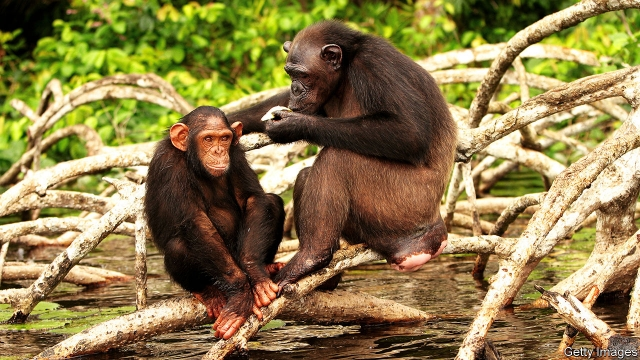

###### The kindness of strangers

# Two books explore the evolutionary origins of morality 

##### Shipwrecked sailors help explain its development. So do chimpanzees 

 

> May 2nd 2019 

The Goodness Paradox. By Richard Wrangham. Pantheon; 400 pages; $28.95. Profile Books; £25.  

Blueprint. By Nicholas Christakis. Little, Brown; 544 pages; $14.99.  

CHIMPANZEES AND bonobos are humanity’s closest great-ape cousins. They look almost the same as each other, share almost all their (and human) DNA and demonstrate familiar emotions and behaviour. But in an important way, they are opposites. Chimpanzees are routinely violent. Males beat up females to assert sexual dominance, fight each other and kill rivals, friends and even infants. Bonobos, by contrast, enjoy relatively peaceful lives. 

Where do humans lie on this spectrum of violence? Are they inherently good or bad, and how does that shape their societies? Two new books offer some answers. 

In “The Goodness Paradox”, Richard Wrangham, an anthropologist at Harvard, argues that, despite impressions to the contrary, people have evolved into largely docile animals, much like bonobos. But they have maintained the ability to commit acts of planned violence and cruelty, like chimpanzees. They are, at once, much more and much less violent than their primate cousins—the paradox of his title. 

Chimpanzees and bonobos have been distinct species for around 900,000 years. Mr Wrangham says part of the reason for their differences is that, on their side of the Congo river, chimpanzees have always had to share their habitats with gorillas; violence and hot-tempered aggression make sense when you have more limited food resources. Across the river, bonobos evolved with abundant fruit and foliage. Natural selection reduced their propensity for reactive aggression (the hot, impulsive type). 

These behavioural shifts mirror those of creatures domesticated from their wild cousins, such as dogs or farm animals. Bonobos, it seems, have domesticated themselves in response to their environment. By living in groups, says Mr Wrangham, humans have been domesticated, too. 

And domestication set the stage for thriving human societies. A greater capacity for tolerance and co-operation allowed the creation of large, stable settlements and civilisations. In any modern metropolis humans live peacefully in much closer quarters than any other species could without dangerous, possibly fatal consequences. As these societies developed, so did social structures, such as justice and religious ethics, which increasingly keep people from unnecessary aggression and move the moral needle towards good. Mr Wrangham contrasts the trajectory of Homo sapiens with the Neanderthals, a human species that became extinct around 35,000 years ago, after living in Europe for half a million years. It was their cognitive inability to work and learn together, he contends, that sealed their doom. 

These are controversial ideas, not all of them proven. Given that the fossil record can provide only fragments of clues about how ancient species might have lived, the confidence of Mr Wrangham’s claims is bold. Nonetheless, his skilful storytelling—which intertwines his hypotheses regarding primitive humans with rich details from decades of observations of chimpanzees in Tanzania—makes his book both stimulating and compelling. 

Successful human societies are the focus of “Blueprint” by Nicholas Christakis, a social scientist at Yale. What sorts of behaviour make societies work, and where do they originate? He begins with shipwrecks. 

In 1864 two ships, the Invercauld and the Grafton, were wrecked on opposite sides of Auckland Island, which lies almost 300 miles (480km) south of New Zealand. Survivors from both crews were on the island at the same time, but were unaware of each other’s presence. Over the year after their stranding, the 19 survivors of the Invercauld splintered into groups, often left the weakest to die and even resorted to cannibalism. Only three crew members lived long enough to be rescued. In contrast, all five survivors of the Grafton eventually made it off the island. Shipwrecks, writes Mr Christakis, are good natural experiments in society-building: “survivor camps”, he says, “provide fascinating data…about how and why social order might vary, and about what arrangements are the most conducive to peace and survival.” 

The crew of the Invercauld were led by a selfish captain who instilled an attitude that every man should look out for himself. The men of the Grafton, however, stuck and worked together on everything from repairing boats to sharing their resources equally, even organising a kind of adult-education programme to swap skills. This “social suite” of behaviour, as Mr Christakis puts it, helped them survive. 

He argues that this social suite is not just learned from others; it is underpinned by thousands of genes that have evolved to nudge biochemistry and behaviour in such a way that people tend towards a good society. True, there are still appalling wars and horrific murders, but that is not the sum of who humans are. Look at the progress visible all around you, Mr Christakis urges, despite all the well-known episodes of death and destruction. 

He ranges across sociology, anthropology, philosophy, genetics and economics, between jungles and laboratories and back again, at what sometimes feels like breakneck speed. But amid the whiplash, Mr Christakis’s deep optimism (and considerable evidence) about the arc of human society bending towards good is uplifting. Along the way he delves fascinatingly into human cultures and customs, exploring, for instance, why monogamy and marriage have become so common (though not universal), and what friendship really means, from an evolutionary perspective. 

Mr Wrangham is also an optimist, and even posits a counterintuitive role for certain types of pugnacity in keeping humans on the path towards good. Domesticated as it may be, the species maintains the capacity for a proactive, cold-blooded kind of aggression that may have been instrumental in making societies more socially cohesive. Groups of humans could have worked together to identify and root out the most savage people (usually males) in their midst. Executing the miscreants not only removed an undesirable type of aggressive gene from the pool; it also sent a signal that violence would be punished. 

That, in turn, could lead to the emergence of a moral code and demonstrate the benefits of more congenial or generous behaviour. Be good to your neighbours, in other words, lest they gang up and condemn you to death. 

-- 

 单词注释:

1.evolutionary[,i:vә'lu:ʃәnәri]:a. 展开的, 进化论的, 进化的, 发展的 [计] 进化的, 改良的, 发展的 

2.morality[mә'ræliti]:n. 道德, 教训, 品行 [法] 道德, 道义 

3.shipwreck['ʃiprek]:n. 遇难船, 海难 vt. 遇海难, 毁灭, 使失事 

4.chimpanzee[.tʃimpәn'zi:]:n. 黑猩猩 [医] 黑猩猩 

5.richard['ritʃәd]:n. 理查德（男子名） 

6.profile['prәufail]:n. 侧面, 轮廓, 传略 vt. 描绘...轮廓, 写...的传略 [计] 提问档; 剖面图法; 剖面法 

7.nicholas['nikәlәs]:n. 尼古拉斯（男子名） 

8.bonobos[bɒ'nəʊbəʊz]:n. 〔动〕倭黑猩猩 [网络] 诺布猿；班尼重回大自然；矮黑猩猩 

9.DNA[]:脱氧核糖核酸 [计] 无效数据, 数字网络体系结构, 分布式网络体系结构 

10.routinely[]:adv. 日常, 乏味, 常规, 例行 

11.assert[ә'sә:t]:vt. 主张, 坚称, 断言 [法] 宣称, 断言, 维护 

12.dominance['dɔminәns]:n. 优势, 显性, 统治, 控制, 支配 [计] 控制, 扰势 

13.bonobos[bɒ'nəʊbəʊz]:n. 〔动〕倭黑猩猩 [网络] 诺布猿；班尼重回大自然；矮黑猩猩 

14.spectrum['spektrәm]:n. 光谱, 范围, 系列 [化] 光谱 

15.inherently[in'hiәrәntli]:adv. 内在地, 生来地, 固有地 [计] 固有的 

16.paradox['pærәdɒks]:n. 似非而是的论点, 自相矛盾的话, 悖论, 怪人怪事 [化] 佯谬 

17.wrangham[]: [人名] 兰厄姆 

18.anthropologist[.ænθrә'pɒlәdʒist]:n. 人类学家 

19.Harvard['hɑ:vәd]:n. 哈佛大学 

20.docile['dәusail]:a. 容易教的, 温顺的 

21.cruelty['kru:әlti]:n. 残酷, 野蛮, 残酷行为 [法] 残酷, 残忍, 虐待 

22.les[lei]:abbr. 发射脱离系统（Launch Escape System） 

23.primate['praimit]:n. 大主教, 灵长目动物 [医] 灵长类 

24.paradox['pærәdɒks]:n. 似非而是的论点, 自相矛盾的话, 悖论, 怪人怪事 [化] 佯谬 

25.specie['spi:ʃi]:n. 硬币 [经] 硬币 

26.Congo['kɔŋ^әu]:n. 刚果, 刚果河, 工夫茶 [建] 刚果, 直接刚果红 

27.alway['ɔ:lwei]:adv. 永远；总是（等于always） 

28.habitat['hæbitæt]:n. 栖息地, 居留地, 自生地, 聚集处 [医] 习生地, 产地, 生境, 栖所 

29.gorilla[gә'rilә]:n. 大猩猩, 残暴的男人, 歹徒 

30.foliage['fәuliidʒ]:n. 树叶, 植物 

31.propensity[prә'pensәti]:n. 倾向, 爱好, 习性 

32.reactive[ri'æktiv]:a. 反动的, 反应的 [医] 反应的 

33.impulsive[im'pʌlsiv]:a. 冲动的, 受感情驱使的, 任性的 [医] 冲动的 

34.behavioural[bi'heivjәrәl]:a. 行为的 

35.domesticate[dәu'mestikeit]:vt. 养驯, 引进(外来词等), 教化 

36.domestication[dәumesti'keiʃәn]:n. 驯养, 教化 

37.creation[kri:'eiʃәn]:n. 创造, 创作物, 发明 [化] 产生 

38.civilisation[,sivilai'zeiʃən;-li'z-]:n. 文明, 文明世界, 文化, 开化, 教化 

39.metropolis[mi'trɒpәlis]:n. 大都市, 重要中心, 首府 [医] 产地, 生地 

40.peacefully[]:adv. 平静地 

41.ethic['eθik]:n. 道德规范, 伦理 

42.trajectory[trә'dʒektri]:n. 轨道, 弹道, 轨线 [化] 轨道 

43.HOMO['hәumәu]:[化] 最高占据轨道; 最高占据分子轨道; 最高已占分子轨道 [医] 人属 

44.sapien[]:n. 智慧 

45.Neanderthal[ni'ændәtɑ:l]:a. 穴居人的 

46.cognitive['kɒgnitiv]:a. 认知的, 认识的 

47.inability[.inә'biliti]:n. 无能, 无力 

48.contend[kәn'tend]:vi. 奋斗, 斗争, 竞争 vt. 为...斗争 

49.doom[du:m]:n. 厄运, 不幸, 法律, 宣告, 判决, 死亡 vt. 命中注定, 判决 

50.fossil['fɒsәl]:n. 化石, 古物 a. 化石的, 陈腐的, 守旧的 

51.nonetheless[,nʌnðә'les]:conj. 然而, 尽管, 不过 adv. 不过, 仍然, 尽管如此, 然而 

52.skilful['skilful]:a. 灵巧的, 熟练的, 制作精巧的 

53.intertwine[.intә'twain]:v. (使)纠缠, (使)缠绕 

54.hypothesis[hai'pɒθәsis]:n. 假设 [化] 假设 

55.blueprint['blu:'print]:n. 蓝图, 设计图, (周详的)计划 vt. 制成蓝图, 计划 

56.christakis[]:n. (Christakis)人名；(西)克里斯塔基斯 

57.Yale[jeil]:n. 耶鲁 

58.Grafton[]:n. 格拉夫顿（位于澳大利亚新南威尔士州北部） 

59.Auckland[ɒ:klәnd]:n. 奥克兰(新西兰港口) 

60.zealand['zi:lәnd]:n. 西兰岛（丹麦最大的岛） 

61.survivor[sә'vaivә]:n. 生还者, 幸存者 [法] 生还者, 生存者, 辛存者 

62.unaware[.ʌnә'wєә]:a. 未认识到的, 不知道的 [法] 不知道的, 不察觉的, 无意的 

63.strand[strænd]:n. (绳索的)股, 绳, 串, 海滨, 河岸 vi. 搁浅 vt. 使搁浅, 使落后, 使陷于困境, 弄断, 搓 

64.splinter['splintә]:n. 碎片, 尖片, 分裂出来的小派别, 微小的东西 v. 使分裂, (使)破裂 

65.cannibalism['kænibәlizm]:n. 嗜食同类, 食人, 嗜血成性 

66.fascinate['fæsineit]:vt. 令人入神, 使着迷 vi. 入迷 

67.conducive[kәn'dju:siv]:a. 有益于...的, 有助于...的, 助长的 

68.instil[in'stil]:vt. 滴注, 逐渐灌输, 不断灌输 [医] 滴注 

69.equally['i:kwәli]:adv. 相等地, 同样地, 平等地 

70.underpin[.ʌndә'pin]:vt. 从下面支承, 支撑, 支持 [经] 支撑 

71.nudge[nʌdʒ]:n. 用肘轻推, 推动, 讨厌家伙 

72.appalling[ә'pɒ:liŋ]:a. 骇人的, 令人震惊的 

73.horrific[hɒ'rifik]:a. 令人毛骨悚然的, 感到恐惧的 

74.sociology[.sәusi'ɒlәdʒi]:n. 社会学 [医] 社会学 

75.anthropology[.ænθrә'pɒlәdʒi]:n. 人类学 [医] 人类学 

76.breakneck['breiknek]:a. 要使颈骨折断似的, 非常危险的 

77.amid[ә'mid]:prep. 在其间, 在其中 [经] 在...中 

78.whiplash['hwiplæʃ]:n. 鞭子的顶端, 鞭绳 

79.optimism['ɒptimizm]:n. 乐观主义, 乐观, 乐天 [医] 乐观主义, 乐观 

80.arc[ɑ:k]:n. 弧, 弧形, 弓形, 弧光 [化] 弧 

81.uplift[ʌp'lift]:n. 抬起, 道德的向上, 精神的高涨 vt. 提高, 抬起 vi. 上升 

82.delve[delv]:v. 探究, 查考 n. 坑, 穴 

83.fascinatingly['fæsɪneɪtɪŋlɪ]:adv. 极有吸引力地; 迷人地 

84.monogamy[mɒ'nɒgәmi]:n. 一夫一妻制 [医] 单配 

85.optimist['ɔptimist]:n. 乐观者, 乐观主义者 

86.posit['pɒzit]:vt. 假设, 安置, 布置 

87.counterintuitive[,kajntәrin'tju:itiv]:a. 违反直觉的 

88.pugnacity[pʌg'næsiti]:n. 好斗 

89.proactive[,prәu'æktiv]:a. 〈心理〉前摄的 

90.instrumental[.instru'mentәl]:a. 仪器的, 器具的, 可作为手段的 [医] 器械的 

91.socially['sәuʃәli]:adv. 在社会上, 在社交上, 以社会生活方式 

92.cohesive[kәu'hi:siv]:a. 黏合在一起的 [医] 内聚的 

93.miscreant['miskriәnt]:a. 邪恶的, 邪道的, 异端的 n. 罪大恶极的人, 恶棍, 异端 

94.undesirable[.ʌndi'zaiәrәbl]:a. 不受欢迎的, 不合乎社会道德标准的 [法] 不受欢迎的人, 不良份子, 不法份子 

95.emergence[i'mә:dʒәns]:n. 出现, 浮现, 发生 

96.congenial[kәn'dʒi:njәl]:a. 协调的, 一致的, 适意的, 趣味相同的 

