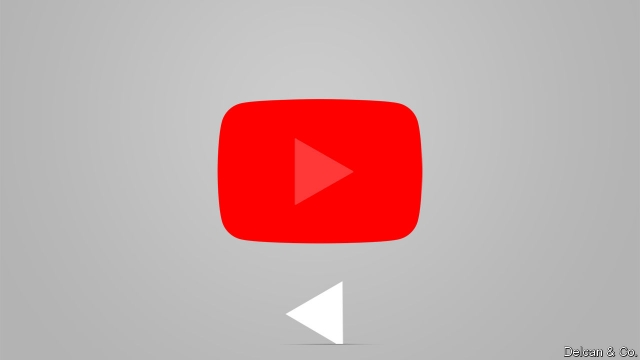
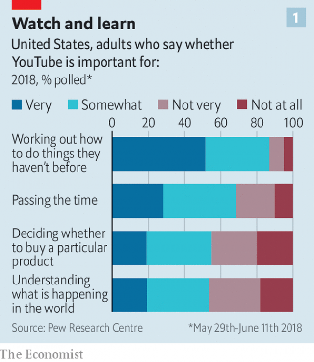
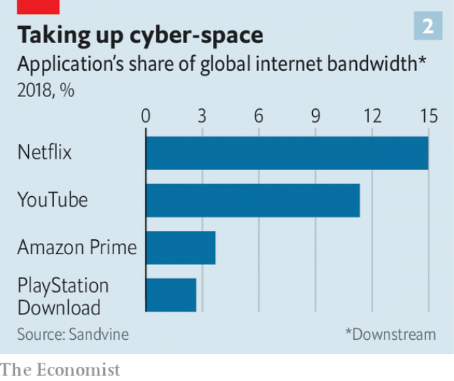
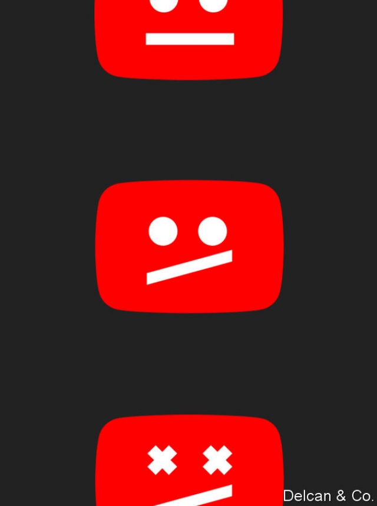

###### Now playing, everywhere

# The tricky task of policing YouTube 

##### How to clean up the world’s biggest video-sharing site 

 

> May 4th 2019 

SUSAN WOJCICKI, the CEO of YouTube, received the first message about the massacre in New Zealand at around 8pm. Assaults on two mosques in Christchurch had begun minutes earlier. The shooter had live-streamed the killings on Facebook and the footage from the social-media site was being shared on YouTube as the killer had clearly hoped. Ms Wojcicki checked in with her team. Executives and software engineers were looking for different versions of the video so that machine-learning programs could be trained to hunt for them. Thousands of human reviewers were scouring through videos that had been automatically tagged, sorting news reports and the like from the offending footage. The world’s largest video platform—owned by Google, the world’s most powerful search engine—was mobilised to cleanse itself of the horrific clip. 

It failed. Before she went to bed at 1am Ms Wojcicki was still able to find the video (she chose not to watch it). In the morning copies of the video continued to be accessible using generic keyword searches. New versions were being uploaded more quickly than they could be identified and taken down. Finally, at 6am, Ms Wojcicki decided to remove all videos flagged as suspect, without waiting for a human review—a first for YouTube. Hours later, the site also blocked users from filtering searches by new uploads, another first. “We don’t want to be the place where people are finding that,” says Ms Wojcicki. 

 

The company is not alone in its interest in policing what people upload to it. An increasing number of governments and regulators around the world think social-media firms must change their ways. Facebook takes most of the flak but YouTube’s problems are particularly tricky because videos are difficult to monitor at such scale—500 hours of new ones are uploaded every minute. Children and teens consume it in their masses. And its videos are increasingly viewed as an important source of news and information as well as entertainment (see chart 1). 

Ms Wojcicki is confident that she can sort out policing YouTube. “I actually think I can solve it or at least I think I can provide a blueprint about how to address these issues that no one else has figured out.” Thus far such confidence is difficult to credit. But how YouTube chooses to moderate its content, and how governments compel it to do so, will affect not only the world’s most popular video service. It will also help shape the acceptable contours of free speech online, and the lives of the people who produce, consume or are otherwise affected by digital content. 

 

From its inception in 2005, YouTube has delivered a new kind of entertainment to people almost everywhere: the rest of humanity (and their pets). User-generated videos, uploadable and viewable by all, made it possible for anyone to find an audience online. Since then YouTube has become the free television service for much of the world (like Facebook and Twitter, it is blocked in China). More than 2bn people now visit the site at least once a month. It accounts for 11% of the world’s bandwidth on the internet, second only to Netflix, with its much higher-resolution videos, according to Sandvine, a research firm (see chart 2). The volume of entertainment, education, information and dross on offer is hard to fathom. It would take 100,000 years to watch it all at a single sitting. 

Every day tens of millions of fans, many of them children, tune in to watch their favourite stars, who have built huge followings on YouTube. They dispense silliness, confessional tales and practical tips. Gamers in Europe narrate virtual conquests, women in India and Saudi Arabia give make-up tips in Hindi and Arabic, teens in America share their anxieties, an elderly quilter in Missouri teaches her craft. 

For YouTube and its most successful stars that has proved lucrative. The firm does not disclose its revenues, but MIDiA Research, a consultancy, estimates them at nearly $17bn in 2018, close to half of which went to content creators on the platform. The top channels for children rake in millions of dollars a year through advertising. The most famous YouTubers—personalities who have built huge followings of young fans—earn millions a year as well. 

YouTube’s stars hold sway over their fans. In a survey by the firm, 40% of young subscribers said that YouTubers understood them better than their friends or family, and 60% said YouTubers had changed their lives or worldview. 

But there is a dark side to hosting over a billion hours of user-generated content online, algorithmically sorted and recommended to billions of viewers. A series of scandals suggest that YouTube is having difficulty coping with the volume and diversity of the content it is hosting, recommending and monetising. In 2017 adverts were found running alongside violent videos made by Islamic State. That prompted big brands to remove advertising for a while. The same year young boys and girls were found in videos that appeared abusive or salacious and which were recommended millions of times before offending channels were shut down. 

Some of the site’s most famous stars have breached the boundaries of decency. Logan Paul, famous for his lowbrow antics, posted a video at the end of 2017 of a dead body he found in a “suicide forest” in Japan. In early 2017 PewDiePie, who had 53m subscribers (then the most of any channel), was reported to have made anti-Semitic references in his videos. PewDiePie, whose real name is Felix Kjellberg, apologised; YouTube dropped him from a lucrative advertiser programme, but he was allowed to remain on the site. Later in 2017 he used a racial slur about black people and apologised again. On April 28th he posted a video asking fans to stop spreading a “Subscribe to PewDiePie” meme, which was referenced by the shooter in Christchurch. He has now amassed 95m subscribers. 

Politicians at first paid only passing attention to much of this. After the presidential election in America in 2016 public ire was mostly directed at Facebook over fake news and breaches of privacy, as well as enabling hate groups. That allowed YouTube’s missteps to go by without serious repercussions for the firm. “Thank God for Facebook” became a popular expression in the company’s hallways. 

But since last year YouTube itself has come under fire for providing an outlet for hateful figures from the alt-right and for promoting all sorts of conspiracy nuts with its recommendations, including flat Earthers and anti-vaxxers. In February paedophiles were found swapping notes in the comments section of children’s videos, pointing out parts they liked. YouTube has now disabled comments on most videos that feature children. On May 1st YouTube (and Facebook) were also accused of allowing scenes of atrocities committed in Libya’s civil war to circulate unchecked. 

As a result, criticism of YouTube has intensified. Like Facebook and Twitter, it is accused of merely reacting when specific problems are exposed by the media or activists, but not before its algorithm has served up offending content millions of times. These scandals, say detractors like Guillaume Chaslot, a former Googler who worked on YouTube’s algorithm, are the bitter fruits of the site’s “manipulative design”. An algorithm and user interface engineered to maximise “watch time” keeps users on the site in part by serving them progressively more extreme videos on whatever subject they happen upon—a “rabbit hole” that can lead those curious about a global tragedy into conspiracy theories or rants by white nationalists. A senior executive said in 2017 that recommendations drive 70% of the site’s viewing. 

The site’s engagement-driven model in turn rewards those who provide more outrageous content. Users lap it up with gusto, training the algorithms to serve more of it, and so on. In April a story on Bloomberg, a news service, alleged that some executives discouraged taking into account such risks in the pursuit of a billion hours of user time a day—a goal set in 2012 which Ms Wojcicki embraced, after she became CEO in 2014, as a “north star” for the company and which it achieved in 2016. The site’s engineers have tweaked the algorithm, based in part on user surveys, to account for “satisfaction” in watch time. But the goal remains the same—to keep people on the site as long as possible and maximise profits. 

YouTube’s immense popularity makes the question of how best to moderate social-media platforms more urgent, and also more vexing. That is partly because of the view taken in Silicon Valley, inspired by America’s right to free speech guaranteed by the First Amendment, that platforms should be open to all users to express themselves freely and that acting as a censor is invidious. With that as a starting point platforms have nevertheless regulated themselves, recognising that they would otherwise face repercussions for not acting responsibly. They began by setting guidelines for what could not be posted or shared—targeted hate speech, pornography and the like—and punished violators by cutting off ads, not recommending them and, as a last resort, banning them. 

As governments and regulators around the world have started to question the platforms’ power and reach, and advertisers have pulled back, the firms have gradually tightened their guidelines. But by doing so they have plunged deeper into thorny debates about censorship. Last year YouTube banned certain kinds of gun-demonstration videos. In January the platform said it would no longer recommend videos that misinform users in harmful ways, like certain conspiracy theories and quack medical cures. It also banned videos of dangerous pranks, some of which have caused children to hurt themselves. On April 29th Sundar Pichai, boss of Google, declared, in an earnings announcement that disappointed investors, that “YouTube’s top priority is responsibility”. He said there would be more changes in the coming weeks. 

Governments meanwhile are taking direct action to curb content that they deem inappropriate. On April 21st, after bombings in Sri Lanka killed 250 people, its government took the draconian step of temporarily banning social-media sites, including YouTube, to stop what it called “false news reports”. After the Christchurch massacre, Australia passed a hastily written law requiring platforms to take down “abhorrent violence material” and to do so “expeditiously”. Even in America, where social media has been largely unregulated, members of Congress are drafting measures that would give significant powers of oversight to the Federal Trade Commission and restrict how online platforms supply content to children, an area where YouTube is especially vulnerable. 

Ms Wojcicki says she needs no persuading to take further action against unsavoury material. Yet YouTube does not plan to rethink the fundamental tenets that it should be open to free expression, that people around the world should have the right to upload and view content instantly (and live), and that recommendation algorithms are an appropriate way to identify and serve up content. What is needed, she says, is a thoughtful tightening of restrictions, guided by consultation with experts, that can be enforced consistently across YouTube’s vast array of content, backed by the power of artificial intelligence. 

YouTube’s record thus far does not inspire much confidence. Children’s programming, one of the most popular sorts of content, is a case in point. Parents routinely use their iPads or smartphones as baby-sitters, putting them in front of children and letting YouTube’s autoplay function recommend and play videos (see chart 3). Children are served up nursery rhymes and Disney, but sometimes also inappropriate content and infomercials. 

YouTube executives say that if parents let their children watch videos unsupervised, it should be on YouTube Kids, a separate platform created in 2015. But in reality most children watch the main site and are exposed to the same “manipulative design” as their 40-year-old uncles. Some children’s advocates are furious because they consider this an easy fix. They argue that the site’s algorithm knows when children are using it and could be programmed to switch off autoplay and tightly curate content. When pressed on the subject, executives insist that the site is not meant for children under 13 years old without adult supervision. 

YouTube has acted more decisively in other circumstances. Its crack down on terrorist-recruitment and -propaganda videos in early 2017 used machine learning and newly hired specialists. There was an obvious incentive to do it. In what became known as “Adpocalypse”, big firms fled after learning that some of their ads were running with these videos, essentially monetising terrorist groups. There have been a couple of sequels to Adpocalypse, both related to children’s content, and both first uncovered by outsiders. This adds to the impression that YouTube lacks a sense of urgency in identifying its problems, and responds most rapidly when advertisers are aggrieved. 

Ms Wojcicki disputes this, saying she began to recognise the increasing risks of abuse of the platform in 2016, as it became clear more people were using YouTube for news, information and commentary on current events. She says that was when she started to focus on “responsibility”. In 2017, as a result of Adpocalypse, she began expanding the firm’s staff and contractors focused on content issues; they now number more than 10,000, most of them content reviewers. Chris Libertelli, the global head of content policy, says that Ms Wojcicki and Neal Mohan, the chief product officer, have told him there are no “sacred cows” in deciding what content should be limited, demonetised or banned. Ms Wojcicki says that with wiser and tighter content policies, and the company��s technology and resources, she and YouTube can solve the problems with toxic content. 

This rhetoric will sound familiar to anyone who has heard Mark Zuckerberg, who built a reputation for cutting corners in the pursuit of global dominance, when he talks about the challenges confronting Facebook (see article). His apologies for Facebook’s breaches of trust, and his promises to do better, have rung hollow. Jack Dorsey, boss of Twitter, has also been excoriated for doing too little to control abusive trolls and hate speech. 

 

Ms Wojcicki, in contrast, strikes even some critics as the “good CEO” of the social-media giants, the one with a soul. She sounds utterly convincing when she talks about trying to make YouTube a force for good and seems more sincere than Mr Zuckerberg when it comes to minimising the harm her company causes. But even Mr Zuckerberg has conceded that Facebook needs more government regulation. 

While the need for regulation might be clear, the details of what should be regulated, and how, are messy and controversial. Few free-speech advocates, even in Silicon Valley, are zealous enough to want to permit beheading videos from Islamic State or the live-streaming of massacres. Yet most of the questions about content moderation that YouTube wrestles with are much less clear-cut. YouTube appears to be weighing whether to ban white nationalists, for example. If it does so, should the site also ban commentators who routinely engage in more subtle conspiracy theories meant to incite hatred? Should it ban popular personalities who invite banned figures to “debate” with them as guests? Ms Wojcicki is conscious of the slippery slope platforms are on, and fears being criticised for censorship and bias. 

Another important question will be how to go about enforcing restrictions. When you serve a billion hours of video a day the number of hard calls and “edge cases”, those that are hard to categorise, is enormous. The tech firms hope that AI will be up to the job. History is not reassuring. AI has been trained for straightforward tasks like spotting copyright violations. But even with low error rates the volume of mistakes at scale remains immense. An AI capable of reliably deciding what counts as harassment, let alone “fake news”, is a pipe dream. The big platforms already employ thousands of human moderators. They will have to hire thousands more. 

Given the complexities, wise governments will proceed deliberately. They should seek data from platforms to help researchers identify potential harms to users. Regulations should acknowledge that perfection is impossible and that mistakes are inevitable. Firms must invest more in identifying harmful content when it is uploaded so that it can be kept off the platform and—when that fails—hunt for it and remove it as quickly as possible. With the great power wielded by YouTube and other social-media platforms comes a duty to ensure it is used responsibly. 

-- 

 单词注释:

1.tricky['triki]:a. 狡猾的, 机敏的 

2.youtube[]:n. 视频网站（可以让用户免费上传、观赏、分享视频短片的热门视频共享网站） 

3.susan['su:zn]:n. 苏珊（女子名） 

4.wojcicki[]:[网络] 西奇 

5.massacre['mæsәkә]:n. 大屠杀 vt. 大屠杀, 残杀 

6.zealand['zi:lәnd]:n. 西兰岛（丹麦最大的岛） 

7.assault[ә'sɒ:t]:n. 攻击, 袭击 vt. 袭击, 攻击 vi. 发动攻击 

8.mosque[mɒsk]:n. 清真寺 

9.Christchurch['kraist-tʃә:tʃ]:n. 克赖斯特彻奇 

10.shooter['ʃu:tә]:n. 射手, 狩猎者, 手枪 

11.killing['kiliŋ]:n. 谋杀, 杀戮 a. 杀害的, 疲惫的, 迷人的 

12.facebook[]:n. 脸谱网 

13.footage['futidʒ]:n. 英尺长度, 英板尺, (影片的)连续镜头 

14.killer['kilә]:n. (非正式)杀人者, 屠杀者, 猛兽, 致死(疾病), 杀手, 止痛药, 限制器, 瞄准器 [计] 删除程序; 断路器 

15.wojcicki[]:[网络] 西奇 

16.scour['skauә]:vt. 擦亮, 洗涤, 清洗, 冲刷成, 急速穿过 vi. 擦, 洗, 冲刷, 腹泻, 急速穿行 n. 擦, 洗, 腹泻, 洗涤剂 

17.google[]:谷歌；搜索引擎技术；谷歌公司 

18.mobilise['mәjbilɑiz]:vi.vt. 动员, 松动, 使活动, 调动, 发动 

19.cleanse[klenz]:vt. 使清洁, 净化, 使纯净 [建] 纯化, 净化, 精炼 

20.horrific[hɒ'rifik]:a. 令人毛骨悚然的, 感到恐惧的 

21.clip[klip]:n. 修剪, 夹子, 回形针, 剪下来的东西 vt. 修剪, 痛打, 夹牢, 剪报 vi. 剪报 

22.generic[dʒi'nerik]:a. 属类的, 一般的 [计] 一般的 

23.keyword['ki:wәd]:[计] 关键字 

24.upload['ʌp,lәud]:[计] 上装, 加载, 储入 

25.quickly['kwikli]:adv. 很快地 

26.regulator['regjuleitә]:n. 调整者, 校准者, 校准器, 调整器, 标准钟 [化] 调节剂; 调节器 

27.flak[flæk]:n. 高射炮, 对空炮火, 广告, 宣传 

28.teen[ti:n]:n. 愤怒, 悲哀 

29.blueprint['blu:'print]:n. 蓝图, 设计图, (周详的)计划 vt. 制成蓝图, 计划 

30.contour['kɒntuә]:n. 轮廓 vt. 画轮廓 a. 显示轮廓的 [计] 轮廓 

31.online[]:[计] 联机 

32.inception[in'sepʃәn]:n. 起初, 获得学位 

33.humanity[hju:'mæniti]:n. 人性, 人类, 博爱 

34.uploadable[]:[网络] 可上传 

35.viewable['vju:әbl]:看得见的 

36.twitter['twitә]:n. 啁啾, 唧唧喳喳声 vi. 啭, 啁啾, 颤抖 vt. 嘁嘁喳喳地讲, 抖动 

37.bandwidth['bændwidθ]:n. 频带宽度, 通带宽度 [计] 带宽, 频宽 

38.netflix[]:n. 全球十大视频网站中唯一收费站点 

39.dross[drɒs]:n. 浮渣, 碎屑, 渣滓 [化] 浮渣 

40.fathom['fæðәm]:n. 英寻(长度单位,合6英尺) vt. 测量深度, 看穿, 彻底了解 vi. 测深 

41.tens[]:十位 

42.dispense[dis'pens]:vt. 分发, 分配 vi. 特许, 豁免 

43.silliness['silinis]:n. 愚蠢, 糊涂 

44.confessional[kәn'feʃәnl]:a. 自白的, 忏悔的 n. 告解室 

45.gamer['ɡeimә]:n. 玩家, 博弈者 

46.narrate[nә'reit]:v. 说故事, 说明, 叙述 

47.saudi['sajdi]:a. 沙乌地阿拉伯（人或语）的 

48.Arabia[ә'reibiә]:n. 阿拉伯半岛 

49.Hindi['hindi:]:a. 印地语的, 印度北部的 n. 印地语 

50.quilter['kwiltә]:n. 缝被子的人 

51.Missouri[mi'zuәri]:n. 密苏里州 

52.lucrative['lu:krәtiv]:a. 有利益的, 获利的, 合算的 

53.MIDiA[]:[网络] 移动联网装置创新联盟(Mobile Internet Device Innovation Alliance)；阴慕羽宵；媒体(Multimedia) 

54.consultancy[]:n. 商量, 协商, 磋商, 会诊, 与...商量, 咨询, 请教, 找(医生)看病, 查阅, 考虑 [经] 咨询业务, 咨询服务 

55.Creator[kri:'eitә(r)]:n. 上帝, 创造者, 创作者 

56.advertising['ædvәtaiziŋ]:n. 广告业, 广告 a. 广告的 [计] 发广告 

57.subscriber[sʌbs'kraibә]:n. 签署者, 捐献者, 订户 [经] 定户 

58.YouTubers[]:[网络] 素人翻唱歌手 

59.worldview['wɜ:ldvju:]:n. 看; 视力; 观点; 目的 

60.algorithmically[æl'ɡɒrɪθmɪklɪ]: [计] 在算法上 

61.sery[]:n. (Sery)人名；(俄)谢雷；(科特)塞里 

62.diversity[dai'vә:siti]:n. 差异, 多样性 [化] 多样性 

63.monetise['mʌnitaiz]:vt. 使货币化；把…定位法定货币（等于monetize） 

64.advert[әd'vә:t]:vi. 提出看法, 引起注意, 留意 n. 广告 

65.Islamic[iz'læmik]:a. 伊斯兰教的, 穆斯林的 

66.abusive[ә'bju:siv]:a. 恶言谩骂的, 被滥用的, 腐败的, 虐待的 

67.salacious[sә'leiʃәs]:a. 好色的, 猥亵的, 黄色的 [法] 淫秽的, 黄色的, 淫荡的 

68.breach[bri:tʃ]:n. 裂口, 违背, 破坏, 违反, 突破, 破裂 vt. 攻破, 突破 vi. 跳出水面 

69.decency['di:sәnsi]:n. 得体, 礼貌, 正派 [法] 正当, 正派, 合乎礼仪 

70.logan['lәu^әn]:n. 洛根（男子名） 

71.paul[pɔ:l]:n. 保罗（男子名） 

72.lowbrow['lәubrau]:a. 教养浅薄的 n. 教养浅薄的人 

73.antic['æntik]:n. 滑稽动作 a. 古怪的 

74.suicide['sjuisaid]:n. 自杀, 自杀者 v. 自杀 a. 自杀的 

75.felix['fi:liks]:n. 菲力克斯（男子名）；费力克斯制导炸弹 

76.kjellberg[]:[网络] 德国凯尔贝；德国的凯尔贝；乔柏 

77.apologise[ә'pɔlәdʒaiz]:vi. 道歉（等于apologize） 

78.advertiser['ædvәtaizә]:n. 做广告者, 广告客户 [经] 广告商, 广告者 

79.slur[slә:]:n. 连音符, 诽谤, 玷污, 印刷模糊 vt. 草率地看过, 忽略, 含糊地念 vi. 模糊不清 

80.meme[mi:m]:n. 大脑模仿病毒；文化基因；弥母 

81.amass[ә'mæs]:vt. 积聚, 堆积 

82.presidential[.prezi'denʃәl]:a. 总统制的, 总统的, 首长的, 统辖的 [法] 总统的, 议长的, 总经理的 

83.ire[aiә]:n. 忿怒 [电] 美国无线电工程师学会 

84.fake[feik]:n. 假货, 欺骗, 诡计 a. 假的 vt. 假造, 仿造 vi. 伪装 

85.privacy['praivәsi]:n. 隐私, 隐居, 秘密 [计] 个人保密权 

86.misstep[.mis'step]:n. 踏错, 错误, 失策 [法] 失足, 过失, 失策 

87.repercussion[.ri:pә'kʌʃәn]:n. 弹回, 反响, 反射 [医] 消退[法], 消肿[法], 浮动诊胎法 

88.hallway['hɔ:lwei]:n. 门厅；玄关；走廊 

89.conspiracy[kәn'spirәsi]:n. 同谋, 阴谋, 阴谋集团 [法] 阴谋, 通谋, 共谋 

90.earthers[]:[网络] 更远的 

91.paedophile[ˈpi:dəʊfaɪl]:n. 恋童癖者 

92.atrocity[ә'trɒsiti]:n. 残暴, 凶恶, 暴行 [法] 暴行, 残酷, 残忍 

93.unchecked[.ʌn'tʃekt]:a. 未加抑制的, 未经检查的 [计] 未选中的 

94.intensify[in'tensifai]:vt. 加强 vi. 强化 

95.activist['æktivist]:n. 激进主义分子 

96.algorithm['ælgәriðm]:n. 算法 [计] 算法 

97.detractor[di'træktә(r)]:n. 毁损者, 贬低者 

98.Guillaume[,^i:'jәum]:纪尧姆(①姓氏 ②Charles Edouard, 1861-1938, 生于瑞士的法国物理学家, 曾获1920年诺贝尔物理学奖) 

99.Googler[]:[网络] 谷歌人；谷歌乐；谷哥儿 

100.manipulative[mә'nipjulәtiv]:a. 处理的, 巧妙处理的, 操纵的 

101.interface['intәfeis]:n. 分界面, 接触面, 界面 [计] 接口, 界面 

102.maximise['mæksimaiz]:vt. 把...增加到最大限度, 把...扩大到最大限度, 充分重视, 找出...的最高值 

103.progressively[]:adv. 进步, 先进, 向前进, 不断前进, 累进, 渐进, 逐渐, 渐次, 主张进步, 进行性 

104.rant[rænt]:v. 咆哮, 痛骂 n. 咆哮, 大话 

105.nationalist['næʃәnәlist]:n. 国家主义者, 民族主义者 

106.outrageous[aut'reidʒәs]:a. 暴虐的, 极无礼的, 可恶的 

107.gusto['gʌstәu]:n. 爱好, 嗜好, 由衷的高兴 

108.bloomberg[]: [人名] 布隆伯格 

109.allege[ә'ledʒ]:vt. 宣称, 主张, 提出, 断言 [法] 断言, 指称, 指证 

110.ceo[]:abbr. 首席执行官；执行总裁（chief executive officer） 

111.tweak[twi:k]:n. 拧, 扭, 焦急 vt. 扭, 开足马力 

112.popularity[.pɒpju'læriti]:n. 名声, 受大众欢迎, 流行 

113.silicon['silikәn]:n. 硅 [化] 硅Si 

114.amendment[ә'mendmәnt]:n. 修订, 改善, 改良, 改正 [化] 调理剂; 修正 

115.censor['sensә]:n. 检查员 vt. 检查, 审查, 删改 

116.invidious[in'vidiәs]:a. 引起反感的, 惹人不快的, 不公平的, 诽谤的 

117.responsibly[]:adv. 认真负责地, 可信赖地, 可靠地 

118.guideline['gaidlain]:n. 指导路线, 方针, 指标 [经] 指导路线, 方针, 准则 

119.pornography[pɔ:'nɔ^rәfi]:n. 色情描写, 黄色书刊, 色情画, 色情照片, 色情文学 [法] 色情画, 色情文学, 黄色读物 

120.violator['vaiәleitә]:n. 违反者, 违背者, 妨碍者 [法] 侵犯者, 违犯者, 妨碍者 

121.tighten['taitn]:vt. 勒紧, 使变紧 vi. 变紧, 绷紧 

122.thorny['θɒ:ni]:a. 多刺的, 令人苦恼的 

123.censorship['sensәʃip]:n. 检查制度 [医] 督察, 监察 

124.misinform[.misin'fɒ:m]:vt. 提供错误消息 

125.quack[kwæk]:n. 鸭叫声, 冒牌医生, 冒充内行之人 a. 冒牌医生的 v. 嘎嘎叫, 当冒牌医生, 夸大广告 

126.prank[præŋk]:n. 开玩笑, 恶作剧, 戏谑 vt. 盛装, 装饰, 打扮 vi. 炫耀自己 

127.sundar[]:n. (Sundar)人名；(印、尼)孙达尔 

128.earning['ә:niŋ]:n. 收入（earn的现在分词） 

129.investor[in'vestә]:n. 投资者 [经] 投资者 

130.curb[kә:b]:n. 抑制, 勒马绳, 边石 vt. 抑制, 束缚, 勒住 

131.deem[di:m]:v. 认为, 相信 

132.inappropriate[.inә'prәupriәt]:a. 不适当的, 不相称的 

133.bombing['bɔmiŋ]:n. 轰炸, 投弹 

134.sri[sri]:n. 斯里兰卡（Sri Lanka）；（拉）神圣罗马帝国（Sacrum Romanum Imperium） 

135.lanka[]:n. 兰卡；楞伽 

136.draconian[drә'kәjniәn]:a. 严厉的, 残酷的 

137.temporarily['tempәrәrәli]:adv. 暂时, 一时, 临时 

138.hastily['heistili]:adv. 匆忙地, 急速地, 急躁地 

139.abhorrent[әb'hɒrәnt]:a. 令人憎恨的, 可恶的, 厌恶的, 相抵触的, 不一致的 

140.expeditiously[]:adv. 迅速(完成), 高效, 效率高, 敏捷, 急速(进行) 

141.unregulated[]:a. 未经调节的；未校准的 

142.oversight['әuvәsait]:n. 勘漏, 失察, 失败, 照料 [经] 监督权 

143.vulnerable['vʌlnәrәbl]:a. 易受伤害的, 有弱点的, 易受影响的, 脆弱的, 成局的 [医] 易损的 

144.unsavoury[,ʌn'seivәri]:a. 没有味道的, 没有香味的, 难吃的, 难闻的, 令人不快的, 不可接受的 

145.rethink[ri:'θiŋk]:v. 再想, 重想 

146.tenet['tenit]:n. 信条, 教义, 宗旨, 原则 

147.consultation[.kɒnsәl'teiʃәn]:n. 请教, 咨询, 磋商会 [医] 会诊 

148.consistently[]:adv. 坚固, 坚实, 一致, 始终如一, 连贯 [计] 相容地 

149.array[ә'rei]:n. 排列, 衣服, 大批, 军队 vt. 布署, 打扮, 排列 [计] 数组; 阵列 

150.routinely[]:adv. 日常, 乏味, 常规, 例行 

151.ipads[]:[网络] 平板电脑；改进的处理器和显示器系统；改进型定位与方位确定系统 

152.smartphones[]: 智能手机（smartphone的复数） 

153.autoplay[]:自动播放 

154.Disney['dizni]:n. 迪斯尼 

155.infomercial[ˌɪnfəʊˈmɜ:ʃl]:n. <美>专题广告片 

156.unsupervised[]:[计] 无监督的 

157.tightly['taitli]:adv. 紧紧地, 坚固地 

158.curate['kjurit]:n. 助理牧师 

159.supervision[.sju:pә'viʒәn]:n. 监督, 管理 [经] 监督, 管理 

160.decisively[]:adv. 果断地；决然地 

161.incentive[in'sentiv]:n. 动机 a. 激励的 

162.essentially[i'senʃәli]:adv. 本质上, 本来 

163.terrorist['terәrist]:n. 恐怖分子 [法] 恐怖份子, 恐怖主义 

164.sequel['si:kwәl]:n. 继续, 续集, 后果 [计] 结构的英语查询语言 

165.outsider[' aut'saidә]:n. 外人, 局外人, 非会员, 外行, 门外汉, 比赛中获胜可能性不大的选手 [经] 外船公司 

166.urgency['ә:dʒәnsi]:n. 紧急, 催促 [法] 紧急, 迫切, 紧急之事 

167.aggrieve[ә'gri:v]:vt. 使委屈, 使悲痛, 侵害 [法] 侵害, 使悲痛, 使委屈 

168.commentary['kɒmәntәri]:n. 注释, 评论, 说明 [法] 注释, 评注, 评论 

169.contractor['kɒntræktә]:n. 立契约的人, 承包商 [化] 承包者; 承包工厂 

170.chris[kris]:n. 克里斯（男子名）；克莉丝（女子名） 

171.neal[]:n. 尼尔（人名） 

172.Mohan[]:n. (Mohan)人名；(英、罗、尼、印)莫汉 

173.demonetised[]:失去通货资格 废止流通 

174.toxic['tɒksik]:a. 有毒的, 中毒的 [医] 中毒的, 毒物的 

175.rhetoric['retәrik]:n. 修辞, 修辞学, 雄辩(术) 

176.zuckerberg[]:扎克伯格 

177.dominance['dɔminәns]:n. 优势, 显性, 统治, 控制, 支配 [计] 控制, 扰势 

178.confront[kәn'frʌnt]:vt. 使面对, 对抗, 遭遇, 使对质, 比较 [法] 对证, 使对质, 比较 

179.jack[dʒæk]:n. 插座, 千斤顶, 男人 vt. 抬起, 提醒, 扛举, 增加, 提高, 放弃 a. 雄的 [计] 插座 

180.dorsey[]:n. 多尔西（姓） n. 多尔西（美国地名） 

181.excoriate[ek'skɒ:rieit]:vt. 剥皮, 擦破皮肤, 严厉的责难 

182.troll[trɒl]:vi. 滚动, 参加轮唱, 曳绳钓鱼 vt. 使转动, 轮唱, 高唱, 用曳绳钓(鱼) n. 转动, 轮唱, 钓绳 

183.utterly['ʌtәli]:adv. 完全地, 全然, 绝对 

184.minimise[]:vt. 使减到最少/最小, 使降到最低限度, 使缩到最小, 极度轻视 

185.concede[kәn'si:d]:vt. 承认, 退让 vi. 让步 

186.behead[bi'hed]:vt. 斩首, 砍头 

187.moderation[.mɒdә'reiʃәn]:n. 缓和, 适度, 温和 [化] 慢化 

188.les[lei]:abbr. 发射脱离系统（Launch Escape System） 

189.commentator['kɔmenteitә]:n. 评论员, 实况广播员, 注释者, 时事评论员 

190.subtle['sʌtl]:a. 敏锐的, 精细的, 狡猾的, 稀薄的, 灵巧的, 微妙的 [医] 锐敏的; 精细的 

191.incite[in'sait]:vt. 刺激, 激励, 引诱 [法] 鼓动, 煽动 

192.criticise['kritisaiz]:v. 批评, 吹毛求疵, 非难 

193.bias['baiәs]:n. 偏见, 斜纹 a. 偏斜的 adv. 偏斜 vt. 使有偏见 [计] 偏流; 偏压; 偏磁; 偏离 

194.categorise['kæti^әraiz]:vt. 分类, 归类 

195.tech[tek]:n. 技术学院或学校 

196.AI[ai]:[计] 附加信息, 人工智能 [化] 人工智能 

197.reassure[.ri:ә'ʃuә]:vt. 使...安心, 向...再保证 [法] 重新保证, 再保险, 使清除疑虑 

198.copyright['kɒpirait]:n. 版权, 著作权 [法] 著作权 

199.violation[.vaiә'leiʃәn]:n. 违反, 违背, 妨碍 [法] 违犯, 违背, 违反 

200.reliably[ri'laiәbli]:adv. 可靠地, 可信赖地 

201.harassment['hærәsmәnt]:n. 困扰, 烦扰, 烦恼 [法] 折磨, 骚扰, 侵扰 

202.moderator['mɒdәreitә]:n. 主席, 会议主持人, 仲裁人 [计] 筛选人 

203.complexity[kәm'pleksiti]:n. 复杂, 复杂性, 复杂的事物 

204.datum['deitәm]:n. 论据, 材料, 资料, 已知数 [医] 材料, 资料, 论据 

205.perfection[pә'fekʃәn]:n. 完美, 完成, 极端 [经] 完整性 

206.wield[wi:ld]:vt. 挥舞, 运用 

