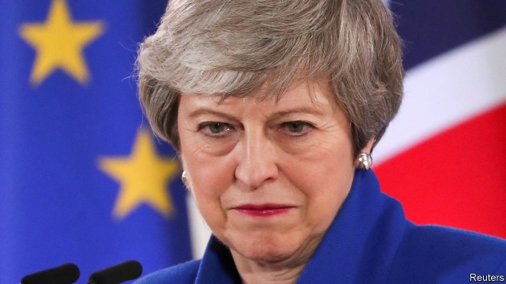

###### Politics in stasis

# Brexit’s paralysing effect on British politics 

##### Both government and opposition appear incapacitated by the negotiations 

 

> May 2nd 2019 

WESTMINSTER IS becalmed. No big bills are under debate or even planned. MPs seem to have little to do but plot. On April 30th the Commons even adjourned before teatime. It is almost as if no serious political issue faces the country. 

Except, of course, that one does. After the European Union’s latest deadline extension, Brexit is due on October 31st. Yet there is little sign of a compromise that would pass in Parliament, which has rejected the current deal three times. Negotiations between the government and the opposition were stepped up this week, with hints that Theresa May might even concede Labour’s demand for a permanent customs union. But Tory Brexiteers’ hostility to a plan that would crimp hopes of free-trade deals around the world is intense. There is a clear risk that any Labour votes won by adding a customs union to the deal would be offset by lost Tory ones. 

And there is little time left. Six months may sound a lot, but both the quantity and the complexity of legislation needed to implement Brexit are daunting. Political events like this week’s local elections or the European elections on May 23rd will divert Tories into ever more convoluted conspiracies to dump Mrs May as prime minister. No rival wants to replace her before a Brexit deal is done and dusted, but none wants her to continue into next year either. 

Mrs May herself is boxed in. The idea of jumping ahead by putting the Brexit withdrawal bill directly to MPs is too risky, because if it were voted down it could not be reintroduced in the current session. And although this session has already lasted an unusual two years, she cannot start a new one with a fresh Queen’s Speech because she is unable to get through any serious legislation. She would also find it difficult, and maybe impossible, to renew the confidence and supply deal with the Northern Irish Democratic Unionists that sustains her government in office. 

Revived talk of changing the Brexit deal, through alternative arrangements that supersede the much-disliked Irish backstop to avert a border in Ireland, is pointless, as Brussels (and Dublin) will never agree to it. A no-deal Brexit has been rejected by both MPs and the EU. The prime minister herself is now clear that such an outcome must be avoided, not least because she fears that the fallout in both Northern Ireland and Scotland could lead to the break-up of the United Kingdom. 

At first blush Jeremy Corbyn, Labour’s leader, seems in a better place than Mrs May. So far, his ambiguous position of rejecting her Brexit deal in favour of a better Labour one, while not clearly promising a second referendum, has served him well. This week he secured the backing of Labour’s National Executive Committee for a European election manifesto that refers only to the option of another vote if needed to stop a bad Tory Brexit or a no-deal one. 

Yet many Labour MPs and candidates want to go further by campaigning for a confirmatory referendum for any Brexit deal, with the choice of remaining in the EU on the ballot. And polling evidence suggests that, although Mr Corbyn’s approach may keep some pro-Brexit Labour voters on board, it risks losing many more anti-Brexit ones to parties like Change UK, the Greens or the Liberal Democrats that are openly calling for another referendum. 

What might break the logjam? An agreement between the Conservatives and Labour still looks a long shot. A new Tory leader may be even less ready to compromise. Some EU countries threaten to veto any extension of the deadline beyond October. Yet nobody wants no-deal. One official says the only way to get MPs to vote for a deal is if they believe the alternative is a no-deal Brexit. But such a threat will almost certainly never be true. 

-- 

 单词注释:

1.politic['pɒlitik]:a. 精明的, 明智的, 策略的 

2.stasis['steisis]:n. 停滞, 郁积 [医] 停滞, 郁滞 

3.paralyse['pærәlais]:vt. 使麻痹, 使瘫痪, 使无力, 使气馁, 终止 [医] 使麻痹, 使瘫痪 

4.opposition[.ɒpә'ziʃәn]:n. 反对, 敌对, 相反, 在野党 [医] 对生, 对向, 反抗, 反对症 

5.incapacitate[.inkә'pæsiteit]:vt. 使无能力, 使无行为能力 [法] 使无资格, 使无能力, 剥夺资格 

6.negotiation[ni.gәuʃi'eiʃәn]:n. 谈判, 磋商, 交涉 [经] 谈判, 协商 

7.Westminster['westminstә]:n. 威斯敏斯特 

8.becalm[bi'kɑ:m]:vt. 使安静, 因无风而使停航 

9.MP[]:国会议员, 下院议员 [计] 宏处理程序, 维护程序, 线性规划, 微程序, 多处理器 

10.adjourn[ә'dʒә:n]:vi. 休会, 换地方 vt. 使中止, 推迟 

11.teatime['ti:taim]:n. 下午茶时间 

12.Brexit[]:[网络] 英国退出欧盟 

13.theresa[ti'ri:zә]:n. 特丽萨（女子名） 

14.concede[kәn'si:d]:vt. 承认, 退让 vi. 让步 

15.Tory['tɒ:ri]:n. 托利党党员, 保守党员, 亲英分子 a. 保守分子的 

16.hostility[hɒs'tiliti]:n. 敌意, 敌对, 反对 

17.crimp[krimp]:n. 诱人当兵的人, 拳曲, 鬈发 vt. 诱...去当兵, 使拳曲, 使有褶 

18.offset['ɒ:fset]:n. 抵消, 把...并列, 旁系, 支管, 用胶印法印 vt. 弥补, 抵消, 胶印 vi. 装支管 n. 偏移量 [计] 偏移量 

19.complexity[kәm'pleksiti]:n. 复杂, 复杂性, 复杂的事物 

20.daunt[dɒ:nt]:vt. 威吓, 难倒, 使气馁 

21.divert[dai'vә:t]:vt. 转移, 使欢娱 vi. 转移 

22.Tory['tɒ:ri]:n. 托利党党员, 保守党员, 亲英分子 a. 保守分子的 

23.convolute['kɒnvәlu:t]:v. 回旋, 卷绕, 盘旋 a. 旋绕的 

24.conspiracy[kәn'spirәsi]:n. 同谋, 阴谋, 阴谋集团 [法] 阴谋, 通谋, 共谋 

25.Mr['mistә(r)]:先生 [计] 存储器回收程序, 多重请求 

26.withdrawal[wið'drɒ:l]:n. 提款, 撤退, 退回, 撤消, 退隐, 戒毒过程 [医] 戒除, 脱瘾 

27.risky['riski]:a. 危险的 

28.reintroduce[ri:intrә'dju:s]:vt. 再引进, 再介绍 

29.cannot['kænɒt]:aux. 无法, 不能 

30.unionist['ju:njәnist]:n. 工会会员, 工联主义者 [法] 工会会员, 工会主义者 

31.revive[ri'vaiv]:vt. 使苏醒, 使复兴, 使振奋, 回想起, 重播 vi. 苏醒, 复活, 复兴, 恢复精神 

32.supersede[.sju:pә'si:d]:vt. 代替, 取代, 接替 [法] 替代, 替换, 充任 

33.backstop['bækstɒp]:n. 挡球网, 接球手 [电] 背向停止 

34.avert[ә'vә:t]:vt. 转开, 避免, 防止 

35.pointless['pɒintlis]:a. 不尖的, 钝的, 不得要领的 

36.Brussel[]:n. 布鲁塞尔（比利时首都） 

37.Dublin['dʌblin]:n. 都柏林 

38.EU[]:[化] 富集铀; 浓缩铀 [医] 铕(63号元素) 

39.fallout['fɒ:laut]:n. 原子尘的降下, 辐射性微尘, 原子尘, 附带结果 [医] [放射尘]回降 

40.blush[blʌʃ]:vi. 脸红, 羞愧 vt. 弄成红色 n. 脸红 

41.jeremy['dʒerimi]:n. 杰里米（男子名） 

42.Corbyn[]:科尔宾（人名） 

43.referendum[.refә'rendәm]:n. （就重大政治或社会问题进行的）全民公决，全民投票 

44.manifesto[.mæni'festәu]:n. 宣言, 声明 

45.confirmatory[kәn'f\\:mәtәri]:起确定作用的, 坚信礼的, 证实的 [计] 证实 

46.ballot['bælәt]:n. 投票, 投票用纸, 抽签 vi. 投票, 抽签 vt. 投票选出, 拉选票 

47.voter['vәutә]:n. 选民, 投票人 [法] 选民, 选举人, 投票人 

48.UK[ju: 'kei]:n. 联合王国 

49.democrat['demәkræt]:n. 民主人士, 民主主义者, 民主党党员 [经] 民主党 

50.openly['әjpәnli]:adv. 公开地, 坦率地, 直率地, 公然地 

51.les[lei]:abbr. 发射脱离系统（Launch Escape System） 

52.veto['vi:tәu]:n. 否决权 vt. 否决, 禁止 

