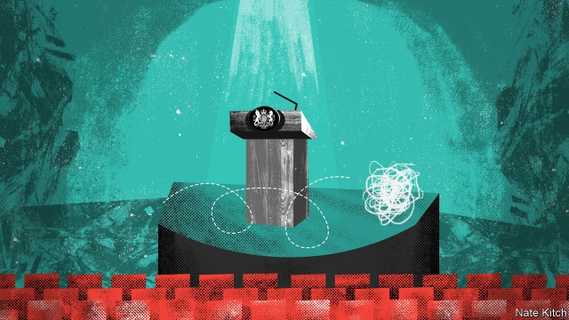

###### Bagehot

# Britain’s followership problem 

##### A lack of leadership is not the country’s only difficulty 

 

> May 2nd 2019 

BACK IN 1997 Warren Bennis, a management guru, invited this columnist, who then had the onerous job of reporting on California, to a soirée in his house on Santa Monica beach to discuss the evergreen topic of leadership. A junior guru presented a paper on how today’s leaders needed all sorts of touchy-feely qualities such as empathy. Yours truly annoyed everyone by arguing that Margaret Thatcher had been a pretty good leader without knowingly engaging in empathy. Then Peter Drucker, speaking in a heavy Viennese accent and dressed in a three-piece suit, threw his own hand-grenade. “I don’t know why people are so fixated on the subject of leadership,” he said, or words to that effect. “What we really need to think about is followership.” 

It is worth remembering Drucker’s words whenever people talk about Britain’s crisis of leadership. There is no doubt that Theresa May and Jeremy Corbyn are singularly unimpressive figures. But Parliament also contains a fair number of people with sparkling CVs, such as Rory Stewart, or remarkable life stories, such as Angela Rayner. Regardless of their abilities, political leaders have to perform before an increasingly hostile audience which routinely questions their motives and trashes their achievements. Followers are a tougher crowd than they used to be. 

Ipsos MORI’s annual survey of the trustworthiness of professions repeatedly shows that people don’t trust politicians. Last year they came second-to-bottom, just above advertising executives, with 19% of the public trusting them. A study of what words people associate with politicians discovered that the most common were sharply negative: contemptible, disgraceful, parasitical, sleazy, traitorous. The crisis in followership is spreading from the citizenry to the political class itself—and even into the government. The past couple of months have seen cabinet ministers voting against a three-line whip and a defence secretary sacked for leaking to the press from the National Security Council. 

Walter Bagehot argued that, in order to survive, a political regime needed to gain authority from the citizenry, and then use that authority to get the work of government done. Since Bagehot’s time, British politicians have employed three mechanisms to gain that authority. The first is deference, when voters support leaders they consider their social superiors. The second is class-loyalty, under which people vote for those who represent folk like themselves. The third is competence, when people vote for a candidate the same way they might hire a plumber—because they can fix a problem. Britain used to be remarkable for its ability to combine all three methods, for example putting trade unionists into the House of Lords for their services to class politics, or ennobling civil servants for their services to competent government. But today all three are in trouble. Deference has faded. Class consciousness is fuzzier than it used to be. And thanks to the Iraq war, the global financial crisis and the Brexit negotiations, voters no longer trust the established parties to provide competent government. 

This collapse of legitimacy has been hastened by a widening of the gap between leaders and followers. The gap is usually explained in terms of the insulation of the elite, as politics has been taken over by a class that glides from studying PPE at Oxford to a career at Westminster without holding what most people regard as a “real” job. But it can also be explained in terms of the erosion of a civic culture that once linked Westminster to local politics. In 1963 two American academics, Gabriel Almond and Sidney Verba, argued that Britain combined a high degree of faith in political institutions with a flourishing local civic life. Since then civic life has received a succession of blows: the contraction of the trade-union movement, the centralisation of decision-making in Whitehall, and the hollowing-out of regional economies. 

The loss of confidence in leaders has sent new forces surging through the body politic. One is know-it-all cynicism. A striking number of Britons are becoming like sports commentators who are ready with criticism but who couldn’t kick a ball if one landed at their feet. A second—and opposite—problem is sudden, inchoate enthusiasm, such as the green Extinction Rebellion that recently paralysed much of central London. But the most dangerous of all is the combination of anger, disappointment and bloody-mindedness that political scientists label “resentment”. The new Brexit Party is on course to top this month’s European election because of Nigel Farage’s mastery of the politics of resentment. 

It is hard to see how these forces can solve Walter Bagehot’s twin problems of gaining and using authority. Know-it-alls corrode authority. Enthusiasts ignore the trade-offs that are at the heart of all serious politics. And masters of resentment like Mr Farage discover betrayal in every compromise. Britain’s political parties are all suffering badly. Labour is under-performing because a band of enthusiasts have installed a second-rate purist in the top job. The Conservatives are languishing because a different band of enthusiasts have undermined a pragmatic prime minister. Change UK has failed to launch because a bunch of professional politicians cannot decide whom to make leader. And even the Brexit Party, riding high for now, has bet its future on one man and one issue. 

The only way to create a bond between leaders and followers in a post-deferential and post-industrial era is to restore officeholders’ reputation for competence. Mrs May tried to do this with her combination of respecting the referendum result (“Brexit means Brexit”) and tackling its causes (“burning injustices”). But she merely compounded the problem, beginning the Brexit talks without a plan, bungling an election and drawing red lines that she would inevitably smudge. Perhaps a more skilful prime minister will succeed where Mrs May has so singularly failed. But Drucker’s insight points to a darker possibility: that the politics of resentment will trump the politics of problem-solving for some time. 

-- 

 单词注释:

1.Bagehot[ˈbædʒət]:白芝浩；巴杰特（人名） 

2.followership['fɒləʊəʃɪp]: 追随品质 

3.warren['wɒrәn]:n. 养兔场, 拥挤的地区 

4.bennis[]:n. (Bennis)人名；(英)本尼斯 

5.guru['guru:]:n. 古鲁(印度教导师) [医] 柯拉子 

6.columnist['kɒlәmist]:n. 专栏作家 

7.onerous['ɒnәrәs]:a. 繁重的, 负有法律责任的 [法] 负有义务的, 艰巨的, 繁重的 

8.California[.kæli'fɒ:njә]:n. 加利福尼亚 

9.santa['sæntә]:n. 圣诞老人（等于Santa Claus） 

10.Monica['mɔnikә]:n. 莫尼卡（女子名） 

11.evergreen['evәgri:n]:n. 常绿树, 常绿植物 a. 常绿的 

12.empathy['empæθik]:n. 移情作用, 共鸣 [医] 移情, 神入 

13.margaret['mɑ:^әrit]:n. 玛格利特（女子名） 

14.thatcher[]:n. 盖屋顶者 

15.knowingly['nәjiŋli]:adv. 会意地, 心照不宣地, 故意地, 有意地, 老练地 [法] 心照不宣地, 故意地, 有意地 

16.peter['pi:tә]:vi. 逐渐消失, 逐渐减少 

17.Drucker[]:n. 德鲁克；杜拉克 

18.viennese[viә'ni:z]:a. 维也纳的；维也纳人的；维也纳式的 

19.fixate['fikseit]:vi. 使固定, 使不变, 注视 vt. 使固定, 注视 

20.theresa[ti'ri:zә]:n. 特丽萨（女子名） 

21.jeremy['dʒerimi]:n. 杰里米（男子名） 

22.Corbyn[]:科尔宾（人名） 

23.singularly['siŋgjulәli]:adv. 少见地, 不可思议地, 异常地 

24.unimpressive[.ʌnim'presiv]:a. 不惹人注意的, 给人印象不深的 

25.cv[]:abbr. 简历（Curriculum Vitae） 

26.Rory['rɔ:ri,'rәjri]:n. 罗里(m.) 

27.stewart['stjuәt]:n. 斯图尔特（男子名） 

28.angela['ændʒilә]:n. 安吉拉（女子名） 

29.rayner[]: [男子名] [英格兰人姓氏] 雷纳来源于诺曼底人名+日耳曼语，含义是“忠告+军队”(counsel+army) 

30.routinely[]:adv. 日常, 乏味, 常规, 例行 

31.trash[træʃ]:n. 垃圾, 废物 vt. 丢弃 

32.follower['fɒlәuә]:n. 从者, 属下, 追补者 [电] 随动机 

33.ipso[]:abbr. incremental phase shift oscillator 增量移相振荡器; Internet protocol security option 因特网协议安全选件; iodized poppy-seed oil 碘化罂粟子油 

34.trustworthiness['trʌst.wә:ðinis]:n. 可信赖, 确实性 

35.advertising['ædvәtaiziŋ]:n. 广告业, 广告 a. 广告的 [计] 发广告 

36.contemptible[kәn'temptibl]:a. 卑鄙的, 可轻蔑的, 不足挂齿的 

37.disgraceful[dis'greisful]:a. 可耻的, 不名誉的 

38.parasitical[,pærә'sitikәl]:a. 寄生的, 由寄生虫引起的 

39.sleazy['sleizi]:a. 质地薄的, 没有内容的, 低级庸俗的 

40.traitorous['treitәrәs]:a. 叛逆的, 不忠的, 背信弃义的 [法] 叛逆的, 背叛的, 不忠的 

41.citizenry['sitizәnri]:n. 市民 [法] 市民 

42.Walter['wɔ:ltә(r)]:n. 沃尔特（男子名） 

43.regime[rei'ʒi:m]:n. 政权, 当权期间, 政体, 社会制度, 体制, 情态 [医] 制度, 生活制度 

44.mechanism['mekәnizm]:n. 机械, 机构, 结构, 机理, 技巧 [化] 机理; 历程; 机构 

45.deference['defәrәns]:n. 顺从, 尊重 

46.voter['vәutә]:n. 选民, 投票人 [法] 选民, 选举人, 投票人 

47.unionist['ju:njәnist]:n. 工会会员, 工联主义者 [法] 工会会员, 工会主义者 

48.politic['pɒlitik]:a. 精明的, 明智的, 策略的 

49.ennoble[i'nәubl]:vt. 授予爵位, 使高贵 

50.deference['defәrәns]:n. 顺从, 尊重 

51.fuzzy['fʌzi]:a. 有微毛的, 模糊的 [电] 微毛 

52.Iraq[i'rɑ:k]:n. 伊拉克 

53.Brexit[]:[网络] 英国退出欧盟 

54.negotiation[ni.gәuʃi'eiʃәn]:n. 谈判, 磋商, 交涉 [经] 谈判, 协商 

55.legitimacy[li'dʒitimәsi]:n. 合法, 正统, 正当 [法] 合法性, 正统性, 婚生 

56.insulation[.insju'leiʃәn. 'insә-]:n. 绝缘；隔离, 孤立 

57.elite[ei'li:t]:n. 精华, 精锐, 中坚分子 

58.ppe[]:abbr. personal protective equipment 个人保护装置; philosophy;  politics;  and economics 哲学 

59.Oxford['ɒksfәd]:n. 牛津, 牛津大学 

60.Westminster['westminstә]:n. 威斯敏斯特 

61.erosion[i'rәuʒәn]:n. 腐蚀, 冲蚀, 侵蚀 [化] 磨耗; 侵蚀 

62.civic['sivik]:a. 市的, 市民的, 公民的 [法] 公民的, 市民的, 公民资格的 

63.Gabriel['geibriәl]:n. 加百利(<<经经>>中七大天使之一) 

64.almond['ɑ:mәnd]:n. 杏仁 [化] 杏仁 

65.sidney[]:n. 西德尼（男子名）；茜德尼（女子名） 

66.verba[]:[法] 词, 言词, 言语 

67.contraction[kәn'trækʃәn]:n. 收缩, 缩写式, 害病 [医] 收缩; 挛缩; 牙弓内缩 

68.centralisation[,sentrәlɑi'zeiʃәn;-li'z-]:n. <主英>=centralization 

69.Whitehall['waithɔ:l]:n. 白厅, 英国政府 

70.regional['ri:dʒәnәl]:a. 地方的, 地域性的 [医] 区的, 部位的 

71.surge[sә:dʒ]:n. 巨涌, 汹涌, 澎湃 vi. 汹涌, 澎湃, 颠簸, 猛冲, 突然放松 vt. 使汹涌奔腾, 急放 [计] 电压尖峰 

72.cynicism['sinisizm]:n. 犬儒主义 

73.Briton['britәn]:n. 大不列颠人, 英国人 

74.commentator['kɔmenteitә]:n. 评论员, 实况广播员, 注释者, 时事评论员 

75.inchoate[in'kәueit]:a. 刚开始的, 不成熟的, 未发达的 [经] 不完整 

76.extinction[ik'stiŋkʃәn]:n. 消失, 消灭, 废止 [化] 消光; 熄灭 

77.paralyse['pærәlais]:vt. 使麻痹, 使瘫痪, 使无力, 使气馁, 终止 [医] 使麻痹, 使瘫痪 

78.resentment[ri'zentmәnt]:n. 怨恨, 愤恨 

79.nigel['naidʒәl]:n. 奈杰尔（男子名） 

80.mastery['mɑ:stәri]:n. 征服, 统治权, 优势, 精通, 掌握 [法] 统治权, 控制权, 征服 

81.corrode[kә'rәud]:vt. 使腐蚀, 侵蚀, 破坏 vi. 被侵蚀, 起腐蚀作用 

82.enthusiast[in'θju:ziæst]:n. 热心家, 狂热者, 爱好者 

83.farage[]:[网络] 人B淋巴瘤细胞系；法拉格 

84.betrayal[bi'treiәl]:n. 背叛, 辜负 [法] 背叛, 通敌, 背信 

85.purist['pjuәrist]:n. 纯粹主义者 

86.languish['læŋgwiʃ]:vi. 憔悴, 凋萎, 苦思 

87.undermine[.ʌndә'main]:vt. 在...下面挖, 渐渐破坏, 暗地里破坏 [法] 暗中破坏, 以阴谋中伤伤害 

88.pragmatic[præ^'mætik]:a. 忙碌的, 爱管闲事的, 自负的, 固执己见的, 实际的, 务实的, 国事的, 国务的 [法] 闲断的, 固执己见的, 实用主义的 

89.UK[ju: 'kei]:n. 联合王国 

90.cannot['kænɒt]:aux. 无法, 不能 

91.Mr['mistә(r)]:先生 [计] 存储器回收程序, 多重请求 

92.referendum[.refә'rendәm]:n. （就重大政治或社会问题进行的）全民公决，全民投票 

93.tackle['tækl]:n. 工具, 复滑车, 滑车, 装备, 扭倒 vt. 固定, 处理, 抓住 vi. 扭倒 

94.injustice[in'dʒʌstis]:n. 不公平, 非正义的行为 [法] 不公正, 不公平, 权利侵害 

95.bungle['bʌŋgl]:v. 拙劣地工作, 粗制滥造, 把...搞糟 n. 粗劣, 失误, 笨拙 

96.inevitably[in'evitәbli]:adv. 不可避免地 

97.smudge[smʌdʒ]:n. 污点, 脏污, 熏烟 vt. 弄脏, 使模糊, 用浓烟熏 vi. 被弄脏 

98.skilful['skilful]:a. 灵巧的, 熟练的, 制作精巧的 

