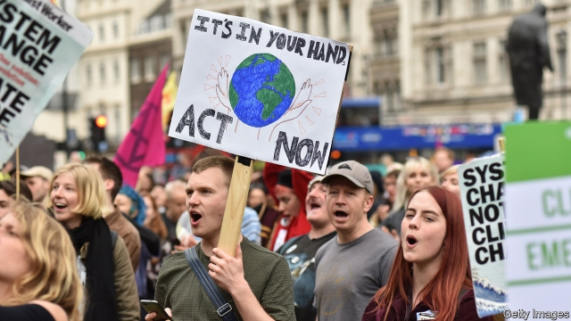

###### Carbon neutral by 2050?

# Britain’s net-zero carbon target is one of the world’s most ambitious 

##### “If we don’t [meet the target] it’s because we have chosen not to,” says the government’s adviser 

 

> May 2nd 2019 

THE SCALE of what is needed to stave off the worst impacts of climate change is often compared to a war effort. On May 2nd an official advisory panel drew up Britain’s battleplan. The Committee on Climate Change (CCC) said the country should aim to eliminate net emissions of greenhouse gases by 2050. This would mark the end of Britain’s contribution to global warming, notwithstanding “exported” emissions resulting from products made abroad. The government is considering the report; Michael Gove, the environment secretary, has indicated that he is open to a stricter target. 

Members of Extinction Rebellion, a group that has staged protests around London in recent weeks, will be dismayed; they have called for emissions to end by 2025. But science and common sense alike suggest that is virtually impossible. In fact, the CCC’s target is one of the most ambitious in the world. 

First, it does not include international “credits”, whereby a country eliminates most but not all emissions and offsets the rest, for instance by subsidising green power in poor countries. Norway and Sweden already have net-zero targets, for 2030 and 2045 respectively, but both allow for offsets. This is convenient nationally, but incompatible with global decarbonisation. 

Second, the CCC recommended that Britain should stop emissions of all greenhouse gases, not just carbon dioxide. The Intergovernmental Panel on Climate Change, a UN body, has found that to have a higher than 50% chance of avoiding more than 1.5°C of global warming, worldwide emissions of CO2 alone must come down to zero by mid-century, and all emissions must cease by 2070. 

Third, the target includes Britain’s share of international aviation and shipping, which are frequently left out of such accounting. Aviation, in particular, may make up only around 2% of emissions worldwide, but it is a growing industry with few affordable low-carbon alternatives. France is the only other country to have proposed a net-zero target that includes aviation and shipping. (The French target, like the British one, has yet to be written into law.) 

The CCC insists that its target is achievable using existing technologies. That does not mean it will be easy. Under Britain’s Climate Change Act of 2008, emissions are supposed to fall 80% below their 1990 levels by 2050, leaving room for some industries to under-achieve. Net-zero allows no such wriggle room. The CCC calls for a massive boost in electricity supply to phase out fossil-fuel use, particularly in transport and domestic heating. All cars would need to be electric well before 2040, the date the government has pencilled in. Gas boilers would have to be replaced with electric heating or heat pumps (which draw warmth from the air or the ground and pump it into buildings). The public would need to eat 20% less beef, lamb and dairy products. The list goes on. 

In all, says the CCC, these and other measures could cut emissions by 95% by 2050, with the remainder soaked up by a vast tree-planting programme and a new industry to capture CO2 and store it underground or beneath the North Sea. 

These are big asks. Heat pumps, hydrogen and carbon-capture—existing technologies that need investment and trials in order to be scaled up—have received little attention. “It is not credible to set this target unless there is a very significant change in the policies to deliver it,” says Chris Stark, the CCC’s chief executive. 

Working in the target’s favour is the falling cost of technology. In 2008 the CCC estimated that lowering emissions by 80% by 2050 would cost 1-2% of GDP annually by then. Unforeseen drops in the cost of renewable energy and batteries, among other things, mean the committee now says net-zero can be achieved for the same price. “This is not about what we hope or we think ought to happen, it’s about what can happen,” said Lord Debden, the CCC’s chairman, at the report’s launch. “We can do it, and therefore if we don’t it’s because we have chosen not to.” 

-- 

 单词注释:

1.ambitious[æm'biʃәs]:a. 有野心的, 抱负不凡的, 雄心勃勃的 

2.adviser[әd'vaizә]:n. 顾问, 劝告者, 指导教师 [法] 顾问, 劝告者 

3.stave[steiv]:n. 狭板, 梯级, 棍棒, 诗句 vt. 击穿, 弄破, 敲打, 赶走 vi. 穿孔, 破碎 

4.advisory[әd'vaizәri]:a. 顾问的, 咨询的, 劝告的 [法] 劝告的, 忠告的, 咨询的 

5.battleplan[ˊbætlplæn]:n. 战斗机 

6.CCC[]:[计] 中央通信控制台, 通信控制中心 [化] 矮壮素 

7.emission[i'miʃәn]:n. 发射, 射出, 发行 [医] 发射, 遗精 

8.notwithstanding[.nɒtwiθ'stændiŋ]:adv. 虽然, 尽管 prep. 尽管 conj. 虽然 

9.michael['maikl]:n. 迈克尔（男子名） 

10.gove[]: [人名] 戈夫; [地名] [澳大利亚、美国] 戈夫 

11.extinction[ik'stiŋkʃәn]:n. 消失, 消灭, 废止 [化] 消光; 熄灭 

12.dismay[dis'mei]:n. 沮丧 vt. 使惊愕, 使气馁 

13.whereby[(h)weә'bai]:adv. 靠什么, 如何, 为何, 靠那个, 因此, 由此 [法] 因此, 由是 

14.offset['ɒ:fset]:n. 抵消, 把...并列, 旁系, 支管, 用胶印法印 vt. 弥补, 抵消, 胶印 vi. 装支管 n. 偏移量 [计] 偏移量 

15.subsidise[]:vt. 给...补助金, 津贴, 资助 

16.Norway['nɒ:wei]:n. 挪威 

17.Sweden['swi:dn]:n. 瑞典 

18.nationally['næʃәnәli]:adv. 作为整个民族, 举国一致地, 全国性地 

19.incompatible[.inkәm'pætәbl]:a. 不相容的, 不能并存的, 矛盾的 [化] 不协调 

20.decarbonisation[]:n. 脱碳 [网络] 碳化目标；碳化；低碳化 

21.intergovernmental[,intә^ʌvәn'mentәl]:a. 政府间的 

22.UN[ʌn]:pron. 家伙, 东西 [经] 联合国 

23.affordable[]:[计] 普及型 

24.achievable[ә'tʃi:vәbl]:a. 做得成的, 可完成的, 可有成就的 

25.wriggle['rigl]:n. 蠕动, 蜿蜒 vi. 蠕动, 蜿蜒前进, 摆脱 vt. 使扭动, 扭动着爬 

26.boiler['bɒilә]:n. 煮器, 汽锅, 锅炉 [化] 锅炉 

27.les[lei]:abbr. 发射脱离系统（Launch Escape System） 

28.remainder[ri'meindә]:n. 剩余物, 其他人, 残余, 余数 v. 削价出售(图书) a. 剩余的, 出售削价剩书的 [计] 余数 

29.credible['kredәbl]:a. 可信的, 可靠的 [法] 可信的, 可靠的 

30.chris[kris]:n. 克里斯（男子名）；克莉丝（女子名） 

31.stark[stɑ:k]:a. 僵硬的, 完全的, 刻板的, 明显的, 荒凉的, 结实的 adv. 突出地, 简直, 全然 

32.annually['ænjuәli]:adv. 一年一次, 每年 [经] 年度的, 每年的 

33.unforeseen[.ʌnfɒ:'si:n]:a. 未预料的 

34.renewable[ri'nju(:)әbl]:a. 可更新的, 可恢复的, 可继续的, 可换新的, 可重复的, 可重说的 [计] 可更新, 可再生的 

35.Debden[]:德布登 

