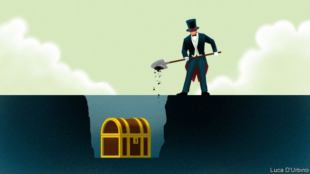

###### The pips squeak again

# Britain’s super-rich are Corbyn-proofing their finances 

##### Efforts to protect wealth should Labour take power are being stepped up 

 

> May 2nd 2019 

JEREMY CORBYN may have it in for tax havens, but they are not all cursing the Labour leader. Well-heeled types worried about the prospect of a Corbyn-led government have been buying property on Guernsey with a view to moving to the island, attracted by its flat 20% income-tax rate and lack of capital-gains or inheritance taxes. Demand for homes there is buoyant, and Jo Stoddart of Locate Guernsey, an investment-promotion agency, says queasiness over Mr Corbyn is one of the main reasons. 

The opposition leader makes no secret of his disdain for the rich. The real divide in Britain, he said recently, is not over Brexit but “between the many, who do the work, create the wealth and pay their taxes, and the few, who set the rules, reap the rewards and dodge their taxes.” The super-rich, he has warned, are “on borrowed time”. 

Small wonder, then, that plutocrats are seeking advisers’ counsel—and increasingly taking action—to keep their incomes, mansions and pensions out of Labour’s clutches. “How to Corbyn-proof your wealth”, an event held in London in February by an investors’ club, sold out. 

Bookmakers offer odds as short as 3/1 on Mr Corbyn becoming the next prime minister. If that happened, says the chief executive of a FTSE 100 company, the rich would “take all the money offshore, wait for the economy to crash, and come back and get richer.” Private-client advisers have warned of Britain’s multi-millionaires moving up to £1trn ($1.3trn) out of the country. But the “mass affluent”, those with liquid assets in the hundreds of thousands, also have cause to fret. 

Such fears have fluctuated in line with recent political turmoil. Wealth advisers agree that clients worry more about Mr Corbyn than Brexit—though the two are linked, as some fear a disorderly Brexit precisely because it could usher in a Labour government. Iain Tait of London & Capital, who advises dozens of rich families, says anxiety about Labour has reached its highest point yet in the past couple of months. When clients of Saunderson House, a wealth manager, were asked in October about the biggest threat to their finances, the most likely answer, mentioned by 42%, was a change of government. The number would almost certainly be higher now. 

The worries fall into three categories. The first concerns existing tax and pension arrangements. Labour is likely to target pension tax relief for high earners. On income tax, it has promised to reintroduce the 50% rate on earnings over £123,000 (rather than £150,000) and add a 45% rate that kicks in at £80,000. It is likely to reverse the Tories’ cuts to capital-gains tax. And it is expected to tighten the inheritance-tax regime, possibly by reducing or removing allowances for those giving to discretionary trusts or handing property or gifts to relatives. To cap it all, Labour promises to levy VAT on private-school fees. 

The second area is brand new taxes. Labour hopes to raise almost £5bn a year from a new financial-transactions levy. This would cream 0.2% off every transaction executed by financial firms. Some hedge funds are reportedly considering moving overseas in response. The bigger worry is the possibility of a wealth tax on assets, perhaps focused on high-value homes, to help fund social care. In 2012 John McDonnell, who has since become shadow chancellor, backed a proposal for a one-off, 20% wealth tax to help reduce government debt. 

The third category—and the biggest bogeyman—is the spectre of capital controls, measures to restrict the flow of capital in and out of the country, in the event of severe economic turbulence. Labour has repeatedly denied it would consider such a measure, last seen in Britain in the late 1970s. Even Mr Corbyn’s critics see it as a long shot. Nevertheless, contingency plans are being put in place. A year ago, says Mr Tait, it would have seemed “ludicrous” to be mulling measures to protect against capital controls. Yet clients raised the issue in “around half” the meetings he attended in the run-up to Easter. As an insurance policy, some have arranged for custody of their investment accounts (used to buy and sell securities) to be moved to the Channel Islands or Switzerland. Changing the jurisdiction in which accounts are booked is all about “asset access”, not tax, says Mr Tait. 

With a property-based wealth tax in mind, some rich folk are accelerating the transfer of homes to children. “They might have done this anyway when the kids were in their 20s. Now they’re doing it in their teens,” says one adviser, who has “dozens” of clients who have opted to speed up handovers. Some are also using up tax-free pension allowances, or vesting tax-free cash, earlier than required, for fear of such benefits evaporating under Labour. 

A smaller number are considering moving offshore. Rather than emigrating now, most of these Jeremiahs are considering buying foreign residence permits to hold alongside their British passports, in order to be well placed to hop abroad if things turn nasty. Advisers say they are looking not only at obvious places like Monaco and the Channel Islands but also at EU countries that have become friendlier to rich foreigners, such as Portugal (where a “golden visa” can be bought for €500,000, or $561,000) and Italy (where income from abroad can be taxed at a flat €100,000). 

Among those tempted to up sticks are resident “non-doms”: foreigners who live in Britain but declare their domicile as elsewhere to avoid tax on their non-British income. The Tories took away some of their privileges in 2016, but the non-doms are still handled fairly generously for up to 15 years. The threat of a Corbyn government, though, is leading some who were wavering to go elsewhere. Another wealth adviser has Swedish and French clients who are returning home. “Sweden and France, those well-known tax havens!” he guffaws. 

Were Britain’s 90,000 or so non-doms to leave, many Corbynistas might say good riddance. Some Labour strategists believe the public would welcome a falling-out with the super-rich. Mr Corbyn has long accused them of dodging tax and contributing little to the economy. But non-doms paid a not-so-paltry £9.4bn in tax—equivalent to a third of the transport budget—in the year to April 2016. 

Mr McDonnell’s team dismisses the bleating from Belgravia as alarmist. Fears over a wealth tax are as misplaced as those concerning capital controls, aides say. Yes, income tax will rise, but to nowhere near the rates of the 1970s. Mr McDonnell may have an avowedly Marxist past, but he has been on a charm offensive in the City, assuring moneymen he has nothing up the sleeves of his branch-manager suit. 

Moreover, when it comes to squeezing the rich there is less to separate the two main parties than the Tories admit. As well as turning the screws on non-doms, the Conservatives have cut high-earners’ tax-free pension allowances and are mulling an inheritance-tax grab. The chancellor, Philip Hammond, has warned that taxes must rise to fund an ageing population. 

Still, tone matters, and there is a difference between measured tax increases and what looks to some like anti-capitalist bloodlust. Mr Corbyn has said he is “coming for” the rich. Some of Labour’s plans suggest a taste for confiscation. The party wants to nationalise several industries, including water, for which it is considering basing compensation for investors on “book” value—currently a third of the industry’s market value—or even less. A plan to snatch 10% of shares in big British firms and give them to workers and the state has nauseated many business leaders. “The rich are prepared for higher taxes,” says Bobby Vedral of Macro Eagle, an advisory business, “but not for expropriation.” 

Mr Vedral caused a ruckus in 2017 when he predicted a Britain led by Mr Corbyn would be like “Cuba without the sun”. That is unfair—but ever more of the monied seem unwilling to take any chances. 

-- 

 单词注释:

1.pip[pip]:n. 禽鸟舌喉炎, 痂, 小毛病, 沮丧, 单根茎, 单瓣花, 果仁, 牌点, 忧郁, 报时信号 vt. 投票反对, 从水果中去籽, 击败, 啄破, 使烦恼, 水果去籽 vi. 烦恼, 身体不适, 唧唧喳喳地叫, 死, 破壳而出 

2.squeak[skwi:k]:n. 吱吱声, 侥幸 vi. 吱吱叫, 告密, 侥幸成功 vt. 以短促尖声发出 

3.jeremy['dʒerimi]:n. 杰里米（男子名） 

4.haven['heivn]:n. 港, 避难所, 安息所 vt. 安置...于港中, 庇护, 入港 

5.Guernsey['^ә:nzi]:n. （原产英吉利海峡格恩西岛的）格恩西奶牛 

6.inheritance[in'heritәns]:n. 遗传, 遗产 [医] 遗传 

7.buoyant['bɒiәnt]:a. 有浮力的, 心情愉快的 [经] 降而复升的, 保持高价的, 遂之而升的 

8.jo[dʒәu]:abbr. 乔（女子名, 等于Joseph, Josephine） 

9.Stoddart[]:斯托达特（人名） 

10.queasiness['kwi:zinis]:n. 恶心 

11.Corbyn[]:科尔宾（人名） 

12.opposition[.ɒpә'ziʃәn]:n. 反对, 敌对, 相反, 在野党 [医] 对生, 对向, 反抗, 反对症 

13.disdain[dis'dein]:n. 蔑视 vt. 蔑视, 鄙弃 

14.Brexit[]:[网络] 英国退出欧盟 

15.dodge[dɒdʒ]:v. 避开, 躲避 n. 诡计, 躲藏 

16.plutocrat['plu:tәkræt]:n. 富豪, 财阀 

17.mansion['mænʃәn]:n. 大厦, 宅邸 

18.clutch[klʌtʃ]:n. 抓紧, 掌握, 离合器, 一窝小鸡 vt. 抓住, 踩汽车离合器踏板 vi. 抓 [计] 联轴器; 离合器 

19.bookmaker['bukmeikә]:n. 著作家, 编辑者, 赌注登记经营人 [法] 以赌为业者, 赌本, 编书谋利者 

20.odds[ɒdz]:n. 可能性, 几率, 机会, 胜算, 不平等 

21.adviser[әd'vaizә]:n. 顾问, 劝告者, 指导教师 [法] 顾问, 劝告者 

22.asset['æset]:n. 资产, 有益的东西 

23.fret[fret]:n. 烦躁, 磨损, 焦急, 网状饰物 vi. 烦恼, 不满, 磨损 vt. 使烦恼, 腐蚀, 使磨损, 使起波纹 

24.fluctuate['flʌktʃueit]:vi. 变动, 起伏, 动摇 vt. 使波动, 使动摇 

25.turmoil['tә:mɒil]:n. 骚动, 混乱 

26.client['klaiәnt]:n. 客户, 顾客, 委托人 [计] 客户, 客户机, 客户机程序 

27.disorderly[dis'ɒ:dәli]:a. 无秩序的, 乱的, 骚乱的 [法] 妨害治安的, 骚乱的, 无法无天的 

28.precisely[pri'saisli]:adv. 精确地, 明确地, 刻板地, 拘泥地, 正好, 恰恰, 对, 正是如此, 确实如此, 不错 

29.usher['ʌʃә]:n. 引座员, 招待员 vt. 引导, 招待 vi. 作招待员 

30.iain[]: [男子名] [苏格兰人姓氏] 伊恩 John的盖尔语变体 

31.Tait[]:[计] 泰特 

32.saunderson[]: [人名] [英格兰人、苏格兰人姓氏] 桑德森取自父名, 来源于Saunder,含义是“桑德之子”(son of Saunder) 

33.earner['ә:nә]:n. 赚钱的人 

34.reintroduce[ri:intrә'dju:s]:vt. 再引进, 再介绍 

35.earning['ә:niŋ]:n. 收入（earn的现在分词） 

36.tighten['taitn]:vt. 勒紧, 使变紧 vi. 变紧, 绷紧 

37.regime[rei'ʒi:m]:n. 政权, 当权期间, 政体, 社会制度, 体制, 情态 [医] 制度, 生活制度 

38.discretionary[dis'kreʃәnәri]:[计] 选择的 

39.levy['levi]:n. 税款, 所征的人数, 征收 vi. 征税, 课税 vt. 征收, 强求, 召集 

40.transaction[træn'sækʃәn]:n. 交易, 办理, 学报, 和解协议 [计] 事务处理 

41.reportedly[ri'pɒ:tidli]:adv. 根据传说, 根据传闻, 据报道 

42.oversea['әuvә'si:]:adv. 海外, 向国外, 向海外, 国外 a. 外国的, 在国外的, 在海外的, 舶来的 

43.john[dʒɔn]:n. 盥洗室, 厕所, 嫖客 

44.McDonnell[]:麦克唐奈（人名） 

45.chancellor['tʃɑ:nsәlә]:n. 大臣, 总理, 首相, 大使馆/领事馆的一等秘书, 司法官, 大学校长 

46.spectre['spektә]:n. 幽灵, 妖怪, 凶兆 

47.turbulence['tә:bjulәns]:n. 混乱, 动荡, 骚乱, 紊流 [化] 湍流; 紊流 

48.contingency[kәn'tindʒәnsi]:n. 偶然性, 可能性, 意外事故 [经] 意外事故, 意外开支, 偶然事故 

49.ludicrous['lu:dikrәs]:a. 可笑的, 滑稽的, 荒唐的 

50.mull[mʌl]:n. 软薄布, 混乱 vt. 研磨, 细想 vi. 深思熟虑 

51.custody['kʌstәdi]:n. 监护, 拘留, 监禁 [经] 保管, 照顾, 保护 

52.jurisdiction[.dʒuәris'dikʃәn]:n. 司法权, 审判权, 管辖权 [经] 法律管辖权, 审判权 

53.teen[ti:n]:n. 愤怒, 悲哀 

54.opt[ɒpt]:vi. 选择 

55.handover['hændәuvә]:[计] 转移, 转换 

56.emigrate['emigreit]:v. (使)移居, (使)移民 

57.Jeremiah[.dʒeri'maiә]:n. 耶利米(<<圣经>>故事人物), <<耶利米书>> 

58.hop[hɒp]:n. 单脚跳, 跳跃, 舞会, 飞行 vi. 单脚跳, 跳跃 vt. 跃过, 跳上, 加蛇麻子于, 服麻醉药 [计] 跳跃式传输 

59.Monaco['mɒnәkәu]:n. 摩纳哥 

60.Portugal['pɒ:tʃugl]:n. 葡萄牙 

61.domicile['dɒmisail]:n. 住所, 住宅 v. (使)定居 

62.Tory['tɒ:ri]:n. 托利党党员, 保守党员, 亲英分子 a. 保守分子的 

63.generously[]:adv. 宽大地；慷慨地；丰盛地 

64.waver['weivә]:n. 动摇, 踌躇, 挥动者 vi. 摇摆, 颤抖, 摆动, 摇曳, 犹豫 

65.Swedish['swi:diʃ]:n. 瑞典人, 瑞典语 a. 瑞典的, 瑞典人的, 瑞典语的 

66.Sweden['swi:dn]:n. 瑞典 

67.guffaw[gʌ'fɒ:]:v. 哄笑, 狂笑 n. 哄笑, 狂笑 

68.riddance['ridns]:n. 摆脱, 除去, 驱逐 

69.strategist['strætidʒist]:n. 战略家 

70.bleat[bli:t]:n. 羊的叫声 vi. 咩咩叫 vt. 以颤抖的声音说 

71.Belgravia[bel'greiviә]:n. 贝尔格莱维亚区(伦敦上流住宅区) 

72.alarmist[ә'lɑ:mist]:n. 轻事重报者, 杞人忧天者 

73.misplace[mis'pleis]:vt. 放错地方 

74.aide[eid]:n. 助手, 副官 [计] 数据输入的可说明性 

75.avowedly[ә'vaudli]:adv. 公然地 

76.charm[tʃɑ:m]:n. 吸引力, 魔力, 符咒 vt. 迷住, 使陶醉, 行魔法 vi. 用符咒, 有魅力 

77.offensive[ә'fensiv]:a. 令人不快的, 侮辱的, 攻击性的 [法] 攻击的, 进攻的, 冒犯的 

78.moneyman['mʌnimæn]:n. 金融家, 投资者 

79.les[lei]:abbr. 发射脱离系统（Launch Escape System） 

80.grab[græb]:n. 抓握, 掠夺, 强占, 东方沿岸帆船 vi. 抓取, 抢去 vt. 攫取, 捕获, 霸占 

81.philip['filip]:n. 菲利普（男子名） 

82.hammond['hæmәnd]:n. 哈蒙德（美国城市） 

83.bloodlust['blʌdlʌst]:n. 杀戮欲 

84.confiscation[kɒnfis'keiʃәn]:n. 没收, 充公 [法] 没收, 查抄, 徵用 

85.nationalise['næʃәnәlaiz]:vt. 把...收归国有, 使具有某国国籍, 使国有化 

86.compensation[.kɒmpen'seiʃәn]:n. 补偿, 赔偿金, 工资 [医] 代偿(机能), 补偿 

87.investor[in'vestә]:n. 投资者 [经] 投资者 

88.nauseate['nɒ:sieit]:vi. 作呕, 产生恶感, 厌恶 vt. 使厌恶, 使恶心 

89.bobby['bɒbi]:n. 警察 

90.vedral[]:[网络] 费德拉 

91.macro['mækrәu]:pref. 宏 a. 巨大的, 大量的 [计] 宏 

92.advisory[әd'vaizәri]:a. 顾问的, 咨询的, 劝告的 [法] 劝告的, 忠告的, 咨询的 

93.expropriation[eks.prәupri'eiʃәn]:n. 征用, 收用, 征收 [经] 征用, 没收, 征购 

94.ruckus['rʌkәs]:n. 喧闹, 骚动 

95.Cuba['kju:bә]:n. 古巴 

96.monied['mʌnid]:a. 有钱的(作定语用) 

