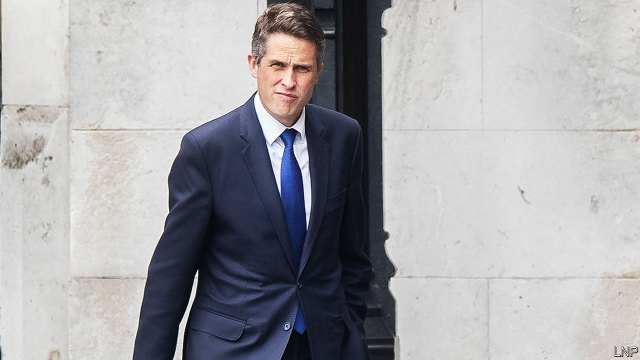

###### Leak, plugged

# Gavin Williamson is sacked as defence secretary for leaking Britain’s Huawei plans 

##### A cabinet mole-hunt took less than a week to identify Gavin Williamson as the culprit 

 

> May 2nd 2019 

LEAKS IN WESTMINSTER are common. Leaks from meetings of the National Security Council (NSC), which include cabinet ministers, generals and an array of spooks, are not. When details of Theresa May’s decision to allow Huawei, a Chinese telecoms group, to build next-generation infrastructure in Britain appeared in the Daily Telegraph on April 24th, an inquiry was duly launched. It took barely a week to find its man. The supposed mole? Gavin Williamson, the defence secretary. 

Despite swearing his innocence (“on my children’s lives”), Mr Williamson was sacked by Mrs May on May 1st. Her letter to him was brutal. There was “compelling” evidence that he had leaked details of the meeting. No other “credible” story existed. Mr Williamson has been replaced by Penny Mordaunt, previously secretary for international development, who also attended the fateful meeting but managed to keep her mouth shut. She in turn is replaced by the ambitious Rory Stewart. 

Mrs May has now lost ten cabinet members in less than three years in office. Mr Williamson was liked by defence chiefs for winning more money for his department, but became a tabloid figure of fun after squeaking that Russia should “go away and shut up”. As a former chief whip he gave the prime minister valuable insight into the unhappy mood of the party. Yet when the inquiry fingered him, Mrs May wasted no time. She has not revealed the evidence against him and calls the matter “closed”. But opposition parties are calling for a criminal investigation; Mr Williamson himself says the police would clear him. 

The subject matter of the leak was sensitive. America has for months been lobbying its allies to freeze Huawei out of their 5G telecoms networks, arguing that China could use the firm’s gear for spying or sabotage. It has had only mixed success. Australia banned Huawei outright. New Zealand turned down a request from a local firm to use Huawei’s gear. But Germany has pushed back, as has the European Union. Britain’s decision to give Huawei a limited role makes it the most prominent refusenik. Its signals-intelligence agency, GCHQ, works hand-in-glove with its American counterpart, the National Security Agency. 

America has said it may cut back intelligence-sharing with countries that ignore its warnings. That is probably bluster: if nothing else, Britain’s geographical location makes it too useful to simply abandon (many transatlantic internet cables come ashore in Britain). Instead, the Americans may hope that by keeping up the pressure they may persuade a future government to reverse the decision. The NSC was split on whether to allow Huawei in. Mrs May ignored its more hawkish members and gave the green light. But she is unlikely to be prime minister for much longer. 

Several likely candidates for her job, including Ms Mordaunt, Jeremy Hunt, the foreign secretary, and Sajid Javid, the home secretary, were among those who voted no—as did Mr Williamson. Unlike the rest of this small cast, Mr Williamson now has little chance of having another say. 

-- 

 单词注释:

1.gavin[]:n. 加文（男子名） 

2.williamson['wiljәmsn]:n. 威廉姆森（姓氏名） 

3.huawei[]: 华为 

4.les[lei]:abbr. 发射脱离系统（Launch Escape System） 

5.culprit['kʌlprit]:n. 犯人, 罪犯, 刑事被告 [法] 犯罪者, 犯人, 罪犯 

6.Westminster['westminstә]:n. 威斯敏斯特 

7.array[ә'rei]:n. 排列, 衣服, 大批, 军队 vt. 布署, 打扮, 排列 [计] 数组; 阵列 

8.spook[spu:k]:n. 幽灵, 鬼 vt. 惊吓, 鬼怪般地出没 vi. 惊吓而逃窜, 受惊 

9.theresa[ti'ri:zә]:n. 特丽萨（女子名） 

10.telecom['telәkɔm]:telecommunication 电信 

11.infrastructure['infrәstrʌktʃә]:n. 基础结构, 基础设施 [经] 基础设施 

12.duly['dju:li]:adv. 恰当地, 充分地, 适当地, 及时地 

13.innocence['inәsәns]:n. 无罪, 无知, 天真无邪 [法] 无罪, 无罪的人, 清白无辜者 

14.Mr['mistә(r)]:先生 [计] 存储器回收程序, 多重请求 

15.brutal['bru:tәl]:a. 残忍的, 野蛮的, 不讲理的 

16.credible['kredәbl]:a. 可信的, 可靠的 [法] 可信的, 可靠的 

17.mordaunt[]:[网络] 敏特声；喇吧；莫当特 

18.fateful['feitful]:a. 宿命的, 重大的, 决定性的 

19.ambitious[æm'biʃәs]:a. 有野心的, 抱负不凡的, 雄心勃勃的 

20.Rory['rɔ:ri,'rәjri]:n. 罗里(m.) 

21.stewart['stjuәt]:n. 斯图尔特（男子名） 

22.tabloid['tæblɒid]:n. 小报, 小型画报, 药片, 文摘 a. 轰动性的, 扼要的, 缩略的, 小报式的 

23.squeak[skwi:k]:n. 吱吱声, 侥幸 vi. 吱吱叫, 告密, 侥幸成功 vt. 以短促尖声发出 

24.opposition[.ɒpә'ziʃәn]:n. 反对, 敌对, 相反, 在野党 [医] 对生, 对向, 反抗, 反对症 

25.lobby['lɒbi]:n. 大厅, 休息室, 游说议员者 vi. 游说议员, 游说 vt. 游说 

26.ally['ælai. ә'lai]:n. 同盟者, 同盟国, 助手 vt. 使联盟, 使联合, 使有关系 vi. 结盟 

27.sabotage['sæbәtɑ:ʒ]:n. 怠工, 破坏活动, 破坏 vi. 从事破坏活动 vt. 妨害, 破坏 

28.outright['autrait]:a. 率直的, 完全的, 总共的, 直率的 adv. 完全地, 率直地, 立刻地, 一直向前 

29.zealand['zi:lәnd]:n. 西兰岛（丹麦最大的岛） 

30.refusenik[rɪˈfju:znɪk]:n. 被拒绝移民者 

31.counterpart['kauntәpɑ:t]:n. 副本, 复本, 配对物, 相应物 [经] 副本, 正副二份中之一 

32.geographical[dʒiә'græfikl]:a. 地理学的, 地理的 

33.transatlantic[.trænsәt'læntik]:a. 横渡大西洋的, 大西洋彼岸的, 美国的 

34.ashore[ә'ʃɒ:]:adv. 向岸, 在岸上 

35.hawkish['hɒ:kiʃ]:a. 像鹰的, 鹰派的, 强硬派的 

36.jeremy['dʒerimi]:n. 杰里米（男子名） 

37.sajid[]:n. (Sajid)人名；(印尼)赛义德 

38.javid[]:[网络] 加威；贾维德 

