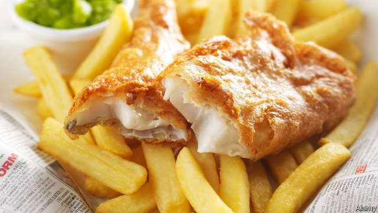

###### Peas please me

# How globalisation created British cuisine… 

##### …and ruined its reputation 

 

> May 2nd 2019 

THE ONLY food-based Instagram picture tagged “Hilton’s Café, Barnsley market” shows a bright, colourful salad: golden corn, pink prawns and juicy cucumber topped with a dollop of coleslaw. But look around the dining hall of the market, where Hilton’s shares space with Kay’s and Paul’s, and the tablescape shows a preponderance of browns: chips, strong milky tea and pies served with mushy peas, “as visually off-putting as the town centre itself”, admits Pete Brown, a food-and-drink writer and son of Barnsley in his new book, “Pie Fidelity: In Defence of British Food”. 

“People talk about how good British food is in relation to how terrible it used to be,” says Mr Brown as he washes down his pie with a pint of Barnsley Bitter at the Old No 7 pub down the street. “My contention is that it didn’t use to be terrible at all.” 

The claim carries a taste of parochialism. But Mr Brown’s argument is built around globalism. His defence is not that a full English bests a croissant (though it obviously does), but that the virtue of Britain’s cuisine lies in the country’s historical openness to the world. The country has long been what David Edgerton, a historian, calls “the hub of an extraordinary gastro-cosmopolitanism”. 

Seen this way, the dismal reputation of British food is less a failure of cuisine than the result of the fact that industrialisation happened earlier and quicker in Britain than in its neighbours. One effect was that Britain prized energy over food, producing 100 times as much coal as wheat in the first half of the 20th century. Moreover, the movement of people from the land to cities created a food culture that prioritised convenience and low cost over quality. In 2017 Britons spent only 8.2% of their income on food, the lowest in the EU (the Italians spent 14.2%). Euromonitor, a research firm, puts Britain in second place out of 54 countries for the amount of calories consumed from packaged foods. 

The British have also historically been less precious about local produce. Mr Brown writes that the French village of Roquefort was granted a monopoly on ripening cheese in nearby caves in 1411. The British, by contrast, had no interest in protecting cheddar: in 1856 the son of a Somerset farmer came up with a winning recipe and gave it away. It is a similar story with drink. Even as the French were busy defending the geographical boundaries of champagne, the British makers of Bass Ale prioritised protecting their trademark—the first granted in the country—while competing on quality. Britain has a third as many protected foods as France and a quarter as many as Italy. 

The openness worked both ways. Fish and chips was a marriage of potatoes, which arrived from Latin America in the 16th century, and fried fish, introduced by Jewish migrants in the early 19th century. Antonio Carluccio, a restaurateur, once declared that spaghetti bolognese, a British favourite, did not exist in Italy. The British version of Indian curry is an indigenous invention, created by Bangladeshi migrant chefs to cater to local tastes. 

Even when a dish is recognisably British, its ingredients may not be. In the early 20th century the full English breakfast typically included Danish bacon, Dutch eggs and bread made from Canadian or Argentine wheat, writes Mr Edgerton in “The Rise and Fall of the British Nation”. Like American cuisine, which gave the world takeaway pizza, hard-shell tacos and chop suey, British cuisine is an amalgam of foreign influences, at once national and international. The salad at Hilton’s Café in Barnsley market may be more Instagrammable than the pie—but it is no less British. 

-- 

 单词注释:

1.globalisation[,gləubəlai'zeiʃən]:n. 全球化, =globalization 

2.ruine['ru:ɪn]: [医]路因碱 

3.Instagram[]:一款图片分享应用 

4.Barnsley['bɑ:nzli]:巴恩斯利[英国英格兰中北部城市](南约克郡首府) 

5.colourful['kʌlәful]:a. 颜色丰富的, 鲜艳的, 艳丽的, 多色的, 丰富多彩的, 吸引人的, 引人入胜的 [计] 有色的 

6.prawn[prɒ:n]:n. 明虾, 对虾 vi. 捕虾 

7.dollop['dɒlәp]:n. 块, 团 

8.coleslaw['kәulslɒ:]:n. 酸卷心菜丝(凉拌生菜) 

9.dining['dainiŋ]:n. 正餐, 宴会 

10.tablescape[]:na. 桌面景观 

11.preponderance[pri'pɒndәrәns]:n. 优势, 多数 [医] 优势 

12.chip[tʃip]:n. 屑片, 薄片, 碎片 vt. 削, 切, 削成碎片, 使摔倒, 凿 vi. 削下屑片 [计] 孔屑; 组件; 晶片; 芯片 

13.milky['milki]:a. 乳状的, 乳白色的, 柔和的 

14.mushy['mʌʃi]:a. 浓粥状的, 含糊不清, 感伤的 

15.visually['vizjjәli]:adv. 看, 视力, 视觉, 可见, 凭视力, 看到, 看得见, 光学, 形象化, 栩栩如生 

16.Pete[pi:t]:n. 皮特（等于Peter, 男子名） 

17.contention[kәn'teinʃәn]:n. 争论, 争辩, 所持的论点 [计] 争用 

18.parochialism[pә'rәjkiәlizәm]:n. 教区制度, 地方观念, 眼界狭小 

19.globalism['^lәubәlizm]:n. 全球主义,全球政策 

20.best[best]:a. 最好的 adv. 最好地 n. 最好的人 

21.croissant[krwә:'sɑ:nt]:n. 羊角面包 

22.openness['әupәnnis]:n. 公开；宽阔；率真 

23.david['deivid]:n. 大卫；戴维（男子名） 

24.edgerton[]: [人名] [英格兰人姓氏] 埃杰顿 Egerton的变体; [地名] [加拿大、美国] 埃杰顿 

25.historian[hi'stɒ:riәn]:n. 历史学家, 记事者 

26.hub[hʌb]:n. 毂, 木片, 中心 [计] 插座; 插孔; 集线器, 集中器, 连接器, 中继站 

27.dismal['dizmәl]:a. 阴沉的, 凄凉的, 令人忧郁的 n. 低落的情绪, 沼泽 

28.les[lei]:abbr. 发射脱离系统（Launch Escape System） 

29.industrialisation[ɪndʌstrɪəlaɪzeɪ'ʃən]:n. 工业化 

30.prioritise[praɪ'ɒrəˌtaɪz]:vt. 给予…优先权; 按优先顺序处理; 出轻重缓急 vi. 把事情按优先顺序排好（等于prioritize） 

31.Briton['britәn]:n. 大不列颠人, 英国人 

32.EU[]:[化] 富集铀; 浓缩铀 [医] 铕(63号元素) 

33.Euromonitor['juərəu'mɔnitə]:n. (英国)欧洲商情市场调研公司 

34.calory['kælәri]:[医] 卡[路里](热量单位) 

35.historically[his'tɔrikәli]:adv. 历史上地；从历史观点上说 

36.roquefort[rɔk'fɔ:r; 'rəukfət]:n. 洛克福羊乳干酪 

37.monopoly[mә'nɒpәli]:n. 垄断, 专卖权, 独占事业 [经] 垄断, 专利品, 垄断(权)独占 

38.somerset['sʌmәsit. -set]:n. 有衬垫的马鞍（独腿者乘坐的） 

39.geographical[dʒiә'græfikl]:a. 地理学的, 地理的 

40.champagne[ʃæm'pein]:n. 香槟酒, 香槟酒色 [化] 香槟酒 

41.maker['meikә]:n. 制造者, 上帝 [经] 制造者, 出票人 

42.bass[bæs]:n. 低沉的声音, 男低音, 椴树 a. 低音的 

43.ale[eil]:n. 麦芽酒 [医] 麦芽酒 

44.migrant['maigrәnt]:n. 候鸟, 移居者 [法] 移居者 

45.antonio[æn'tәuniәu]:n. 安东尼奥（男名） 

46.carluccio[]:[网络] 卡卢乔 

47.restaurateur[restәrә'tә(r)]:n. 餐馆老板 

48.spaghetti[spә'geti]:n. 意大利面条 

49.bolognese[,bәjlә'ni:z]:a. (意大利北部城市)波伦亚的,波伦亚人的,波伦亚画派的  n. 波伦亚人,波伦亚方言 

50.curry['kʌri. 'kә:ri]:n. 咖哩粉, 咖哩饭菜 vt. 用咖哩粉调味, 用马梳梳, 制革 

51.indigenous[in'didʒinәs]:a. 本土的, 国产的, 固有的 [医] 原产的, 本土的 

52.Bangladeshi[-ʃi]:n. 孟加拉国人 a. 孟加拉国(人)的 

53.recognisably[]:[网络] 可以肯定的 

54.typically['tipikәli]:adv. 代表性地；作为特色地 

55.Danish['deiniʃ]:n. 丹麦文 a. 丹麦的, 丹麦人的, 丹麦文的 

56.Dutch[dʌtʃ]:n. 荷兰人, 荷兰语 a. 荷兰的 

57.argentine['ɑ:dʒәntain]:n. 银, 银白色金属, 银白色鱼鳞, 阿根廷人 a. 银的, 银色的, 阿根廷的 

58.takeaway[]:a. 外吃的, 外卖的 n. 外卖食品的餐馆, 外卖食品的商店 

59.pizza['pi:tsә]:n. 比萨饼 

60.taco['tɑ:kәu]:n. 墨西哥煎玉米卷；[美俚]墨西哥人 

61.suey[]:[网络] 何雅静；粟儿；炒杂拌 

62.amalgam[ә'mælgәm]:n. 汞合金, 汞齐 [化] 汞齐; 汞合金 

