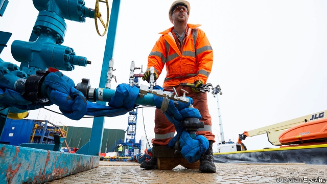

###### Bad vibrations

# The resignation of Britain’s shale-gas tsar is a big fracking setback 

##### After a decade of controversy, the fracking industry is on its last legs 

 

> May 2nd 2019 

MUCH OF THE time and money spent trying to ignite a shale-gas boom in Britain over the past decade or so has gone not on drilling boreholes for hydraulic fracturing (“fracking”) but on lobbying for permission. Fracking’s backers have had politicians to woo, regulators to persuade and a wary public to reassure. It seemed to be working. In October, after years of vigorous promotion, a firm called Cuadrilla started fracking at two wells on a site near Blackpool. 

But frackers appear to have been outclassed on the public-relations front. On April 26th the government’s shale-gas tsar, Natascha Engel, said she was resigning, after just six months in the job. The government pays more attention to anti-fracking campaigning by environmental groups such as Greenpeace than to businesses ready to invest, she complained. 

The antis cite earthquakes, water pollution and global warming as reasons to fight fracking (shale gas emits far less than coal but is a fossil fuel). Well-organised protesters have dug in at Cuadrilla’s Preston New Road site. The final straw for Ms Engel appears to have been the attention lavished on Greta Thunberg, a teenage Swedish protester against climate change who told Parliament last month that British support for shale gas was “beyond absurd”. 

Fracking experts retort that the real absurdity is the regulatory straitjacket that Britain has imposed in response to public fears incited by NGOs. Upon Cuadrilla’s first frack, at another site near Blackpool in 2011, earth tremors of magnitude 2.3 and 1.5 were set off and operations had to stop. The firm’s main backer, AJ Lucas, an Australian mining-services firm, had been too gung-ho, says an industry insider (both firms deny this). In 2014 David Cameron, then prime minister, promised to go “all out” for shale, to replicate America’s booming industry and improve energy security. But rules later obliged firms to suspend fracking whenever tremors reached magnitude 0.5. In many places, including America, magnitude of up to 4 is allowed. 

Cuadrilla is now finding it cannot frack effectively within the limit. Once its injection of high-pressured water has created the right fracture network through which gas can escape upwards, says Quentin Fisher, a fracking expert at Leeds University, the resulting tremors hit the threshold before engineers can get enough sand in to keep the flow-paths open. So far Cuadrilla has made no return from shale gas, after investing around £200m ($260m). 

Nor has the firm been the best standard-bearer for fracking. The tremors in 2011 handed ammunition to Greenpeace and other opponents. As for its objection to the 0.5-magnitude limit, defenders of the rule note that the company accepted the framework and made no complaint until this year, when it ran into difficulties. 

Without an upward revision of the seismicity ceiling, says Ms Engel, time is running out for fracking in Britain. She wants the government to ask regulators to review the 0.5-magnitude limit, or to indicate that it will do so, by the end of the year. 

That might be politically unfeasible, even if the government were not distracted by Brexit. Nor would it make that much difference to the industry’s future, argues Lord Browne, a former boss of BP and, until 2015, Cuadrilla’s chairman. The real roadblock to fracking, he notes, is not so much seismicity but that people believe it disturbs the countryside, with lorries carrying sand and water on small roads. Achieving sizeable supply would require thousands of wells, and infrastructure to serve them. Resurgent greens, risk-averse politicians and homeowners in the shires seem an insurmountable fracking obstacle. 

-- 

 单词注释:

1.tsar[zɑ:]:n. 沙皇 

2.fracking[]:n. 水力压裂 

3.setback['setbæk]:n. 挫折, 退步, 逆流 

4.controversy['kɒntrәvә:si]:n. 论争, 辩论, 论战, 争论 [法] 论战, 争论, 争吵 

5.ignite[ig'nait]:vt. 点燃, 使灼热, 使兴奋 

6.borehole['bɔ:hәul]:n. 地上凿洞 

7.hydraulic[hai'drɒ:lik]:a. 与水有关的, 水力的, 水压的 [电] 水力的 

8.fracture['fræktʃә]:n. 破碎, 骨折 v. (使)破碎, (使)破裂 

9.lobby['lɒbi]:n. 大厅, 休息室, 游说议员者 vi. 游说议员, 游说 vt. 游说 

10.backer['bækә]:n. 援助者, 支持者 [经] 背书人, 支持人 

11.regulator['regjuleitә]:n. 调整者, 校准者, 校准器, 调整器, 标准钟 [化] 调节剂; 调节器 

12.wary['wєәri]:a. 谨慎的, 小心的, 机警的, 周到的, 唯恐的 

13.reassure[.ri:ә'ʃuә]:vt. 使...安心, 向...再保证 [法] 重新保证, 再保险, 使清除疑虑 

14.promotion[prәu'mәuʃәn]:n. 晋级, 创建, 增进 [经] 推广, 推销, 促进 

15.cuadrilla[ kwɑː'drɪljə]:n. 一群, 一组, 一帮; (斗牛场上斗牛士的)一伙帮手; 一群随从 

16.blackpool[]:n. 黑潭（英国城市名） 

17.frackers[]:[网络] 疯狂的 

18.outclass[.aut'klɑ:s]:vt. 比...更高级, 远高于, 远胜于, 轻易击败 

19.natascha[]:娜塔莎（人名） 

20.engel[]:n. 恩格尔（恩格尔   	德国的统计学家）；英杰尔（日本品牌） 

21.environmental[in.vaiәrәn'mentәl]:a. 周围的, 环境的 [经] 环境的, 环保的 

22.greenpeace['gri:npi:s]:n. 绿色和平组织（保护动物不遭捕猎等） 

23.antis[]:n. 反对者；反对派；反对论者（anti的复数形式） 

24.cite[sait]:vt. 引用, 引证, 表彰 [建] 引证, 指引 

25.shale[ʃeil]:n. 页岩 

26.les[lei]:abbr. 发射脱离系统（Launch Escape System） 

27.fossil['fɒsәl]:n. 化石, 古物 a. 化石的, 陈腐的, 守旧的 

28.protester[]:n. 抗议者, 持异议者, 拒付者 [经] 反对者 

29.preston['prestәn]:n. 普勒斯顿（男子名；英国港市名字） 

30.lavish['læviʃ]:a. 大方的, 丰富的, 浪费的 vt. 浪费, 滥用, 慷慨给予 

31.greta['^retә]:n. 格里塔（女子名, Margaret的昵称, 等于Gretta） 

32.thunberg[]: [人名] 桑伯格 

33.teenage['ti:nidʒ]:a. 十三岁到十九岁的 

34.Swedish['swi:diʃ]:n. 瑞典人, 瑞典语 a. 瑞典的, 瑞典人的, 瑞典语的 

35.fracking[]:n. 水力压裂 

36.retort[ri'tɒ:t]:n. 反驳, 顶嘴, 蒸馏器, 曲颈甑 vi. 反驳, 回嘴, 反击 vt. 反击, 反驳, 蒸馏 

37.absurdity[әb'sә:diti]:n. 荒谬, 悖理, 荒谬的言行 

38.regulatory['regjulәtәri]:a. 受控制的, 统制的, 调整的 [经] 规则的 

39.straitjacket['streitdʒækit]:n. 紧身衣 

40.ngos[]:abbr. non-government organization 非政府组织，非政府机构 

41.frack[]:[网络] 弗拉克；断裂；化妆镜 

42.tremor['tremә]:n. 震动, 颤动 [医] 震颤 

43.magnitude['mægnitju:d]:n. 巨大, 重大, 重要, 大小, 数量, 星等(指星的亮度) [计] 大小; 值 

44.aj[]:n. 合金结（抗干扰） 

45.lucas['lu:kәs]:n. 卢卡斯（男子名, 等于Luke） 

46.insider['in'saidә]:n. 内部的人, 权威人士, 知道内情的人 [经] 熟悉内情者 

47.david['deivid]:n. 大卫；戴维（男子名） 

48.cameron['kæmәrәn]:n. 卡梅伦/隆（男子名） 

49.replicate['replikeit]:vt. 折叠, 折转, 复制 n. 复现试验, 复制品, 高八度音 a. 复现的, 复制的, 折转的, 弯回的 

50.cannot['kænɒt]:aux. 无法, 不能 

51.effectively[i'fektivli]:adv. 有效地, 有力地, 实际上 

52.Quentin['kwentin]:n. 昆廷（男子名） 

53.fisher['fiʃә]:n. 渔夫, 食鱼动物, 渔船 

54.LEED[]:[化] 低能电子衍射 

55.threshold['θreʃәuld]:n. 门槛, 入口, 开端, 阈 [计] 阈; 阈值 

56.ammunition[.æmju'niʃәn]:n. 军火, 弹药 [机] 弹药 

57.defender[di'fendә]:n. 防卫者, 防护者, 辩护者 [法] 辩护人, 保护人 

58.seismicity[saɪz'mɪsɪtɪ]:n. 地震活动; 受震强度 

59.politically[]:adv. 政治上 

60.unfeasible['ʌn'fi:zәbl]:a. 不能实行的, 难实施的, 不切实际的 

61.distract[dis'trækt]:vt. 转移, 分心, 使发狂 

62.Brexit[]:[网络] 英国退出欧盟 

63.browne[braun]:n. 布朗（姓氏）；布朗恩（英国国防大臣） 

64.bp[]:[化] 碱基对 

65.roadblock['rәudblɒk]:n. 障碍, 障碍物 

66.sizeable['saizәbl]:a. 相当大的, 可观的 

67.infrastructure['infrәstrʌktʃә]:n. 基础结构, 基础设施 [经] 基础设施 

68.resurgent[ri'sә:dʒәnt]:a. 复生的, 复活的 n. 复活者 

69.homeowner['hәum.әunә]:n. 私房屋主；自己拥有住房者 

70.shire['ʃaiә]:n. 郡 

71.insurmountable[.insә'mauntәbl]:a. 难以克服的, 不能超越的 

