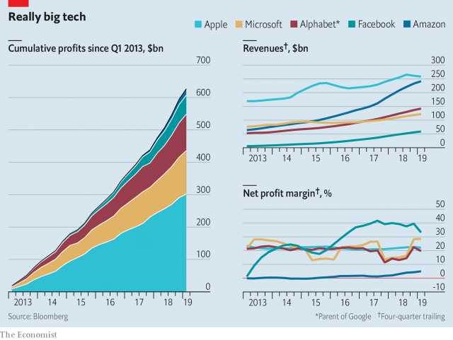

###### Really big tech

# American technology firms’ mixed results 

 

> May 2nd 2019 

THE BIG AMERICAN tech firms continue to flirt with market valuations of $1trn, but their first-quarter earnings show that the outlook is mixed. Facebook shrugged off regulatory crackdowns but its margins dipped. Sales of Apple’s iPhones fell again, highlighting the need for new revenue sources. Alphabet, Google’s parent, shed 7.5% of its value after it reported slowing ad sales. Amazon’s (comparatively puny) profits doubled but sales growth slowed. Microsoft showed it is no tech has-been; it briefly joined the $1trn club. 

-- 

 单词注释:

1.tech[tek]:n. 技术学院或学校 

2.flirt[flә:t]:n. 卖弄风骚的人, 急动, 急扔 vt. 忽然弹出, 轻快摆动, 挥动 vi. 调情, 玩弄, 摆动, 轻率地对待 

3.valuation[.vælju'eiʃәn]:n. 评价, 估价, 价值判断 [经] 估价, 计价, 评价 

4.earning['ә:niŋ]:n. 收入（earn的现在分词） 

5.facebook[]:n. 脸谱网 

6.regulatory['regjulәtәri]:a. 受控制的, 统制的, 调整的 [经] 规则的 

7.crackdown['krækdaun]:n. 制裁, 镇压, 痛击 

8.iphone[]:n. 苹果手机 

9.puny['pju:ni]:a. 微小的, 弱小的, 微不足道的 

10.Microsoft[]:n. (美国)微软公司 [电] 微软公司 

11.briefly['brifli]:adv. 简短地, 扼要地, 简明地, 简单地 

